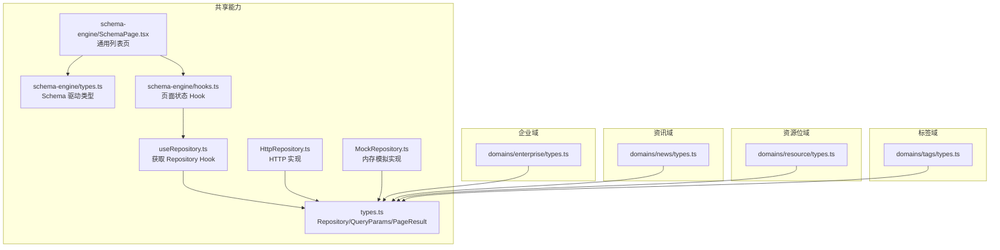
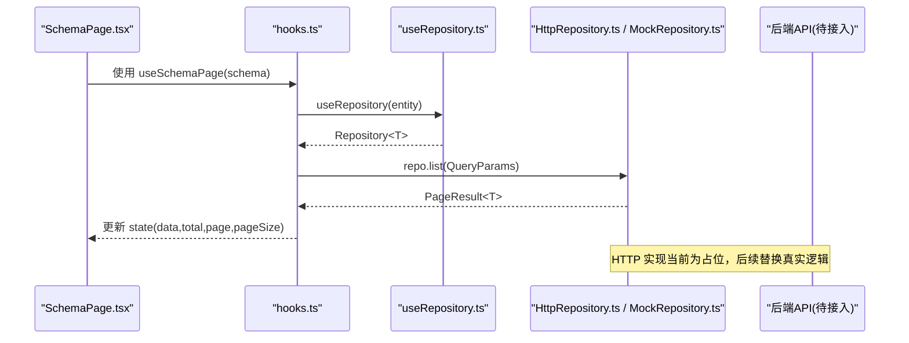
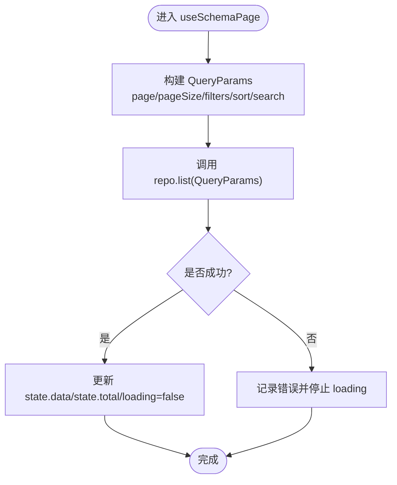
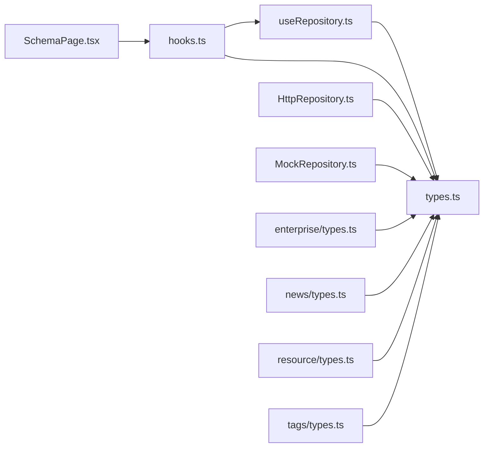

# 数据类型定义

<cite>
**本文引用的文件**
- [src/shared/data/types.ts](file://hj-admin/src/shared/data/types.ts)
- [src/shared/data/HttpRepository.ts](file://hj-admin/src/shared/data/HttpRepository.ts)
- [src/shared/data/MockRepository.ts](file://hj-admin/src/shared/data/MockRepository.ts)
- [src/shared/data/useRepository.ts](file://hj-admin/src/shared/data/useRepository.ts)
- [src/shared/schema-engine/types.ts](file://hj-admin/src/shared/schema-engine/types.ts)
- [src/shared/schema-engine/hooks.ts](file://hj-admin/src/shared/schema-engine/hooks.ts)
- [src/shared/schema-engine/SchemaPage.tsx](file://hj-admin/src/shared/schema-engine/SchemaPage.tsx)
- [src/domains/enterprise/types.ts](file://hj-admin/src/domains/enterprise/types.ts)
- [src/domains/news/types.ts](file://hj-admin/src/domains/news/types.ts)
- [src/domains/resource/types.ts](file://hj-admin/src/domains/resource/types.ts)
- [src/domains/tags/types.ts](file://hj-admin/src/domains/tags/types.ts)
</cite>

## 目录
1. [简介](#简介)
2. [项目结构](#项目结构)
3. [核心组件](#核心组件)
4. [架构总览](#架构总览)
5. [详细组件分析](#详细组件分析)
6. [依赖分析](#依赖分析)
7. [性能考虑](#性能考虑)
8. [故障排查指南](#故障排查指南)
9. [结论](#结论)
10. [附录](#附录)

## 简介
本技术文档聚焦于数据层与页面配置层的 TypeScript 类型体系，围绕以下目标展开：
- Repository 接口的泛型约束与方法签名说明
- 分页查询的参数类型与返回类型定义
- 错误处理的数据结构（含错误码、消息、异常信息）现状与建议
- 数据验证规则的类型定义与自定义验证器支持现状与建议
- 配置选项的类型定义（API、缓存、重试）现状与建议
- 类型扩展与自定义类型的最佳实践
- 类型安全的开发技巧与 IDE 智能提示优化

## 项目结构
本项目采用“领域 + 共享能力”的模块化组织方式：
- shared/data：数据访问抽象与实现（Repository 接口、HTTP/Mock 实现、Hook）
- shared/schema-engine：基于 Schema 驱动的通用列表页渲染与状态管理
- domains/*：各业务域的类型定义与资源绑定



图表来源
- [src/shared/data/types.ts:1-36](file://hj-admin/src/shared/data/types.ts#L1-L36)
- [src/shared/data/HttpRepository.ts:1-70](file://hj-admin/src/shared/data/HttpRepository.ts#L1-L70)
- [src/shared/data/MockRepository.ts:1-101](file://hj-admin/src/shared/data/MockRepository.ts#L1-L101)
- [src/shared/data/useRepository.ts:1-24](file://hj-admin/src/shared/data/useRepository.ts#L1-L24)
- [src/shared/schema-engine/types.ts:1-216](file://hj-admin/src/shared/schema-engine/types.ts#L1-L216)
- [src/shared/schema-engine/hooks.ts:1-106](file://hj-admin/src/shared/schema-engine/hooks.ts#L1-L106)
- [src/shared/schema-engine/SchemaPage.tsx:1-226](file://hj-admin/src/shared/schema-engine/SchemaPage.tsx#L1-L226)
- [src/domains/enterprise/types.ts:1-50](file://hj-admin/src/domains/enterprise/types.ts#L1-L50)
- [src/domains/news/types.ts:1-50](file://hj-admin/src/domains/news/types.ts#L1-L50)
- [src/domains/resource/types.ts:1-31](file://hj-admin/src/domains/resource/types.ts#L1-L31)
- [src/domains/tags/types.ts:1-10](file://hj-admin/src/domains/tags/types.ts#L1-L10)

章节来源
- [src/shared/data/types.ts:1-36](file://hj-admin/src/shared/data/types.ts#L1-L36)
- [src/shared/schema-engine/types.ts:1-216](file://hj-admin/src/shared/schema-engine/types.ts#L1-L216)

## 核心组件
本节对关键类型进行系统性梳理。

- 数据访问契约
  - Repository<T>：统一的数据访问接口，提供 list/get/create/update/delete 方法，所有方法均返回 Promise，便于在 UI 中统一处理异步与 loading 态。
  - QueryParams：分页与筛选的统一入参，包含 page/pageSize/filters/sort/search。
  - PageResult<T>：分页结果，包含 list/total/page/pageSize。

- 数据源模式与域配置
  - DataSourceMode：'mock' | 'http'，用于切换数据源策略。
  - DomainDataSourceConfig：以 domainName 为键映射到数据源模式的配置对象。

- Schema 驱动引擎类型
  - FilterField/ColumnDef/RowAction/BatchAction/ToolbarAction/ModalDef/TabDef/FormSchema/PageSchema 等，构成“写配置即页面”的核心类型基石。
  - RouteDef/DomainManifest：路由与域清单类型，支撑菜单与路由注册。
  - PageActionContext：页面操作上下文，注入刷新、导航、弹窗控制能力。

- 领域实体类型
  - 企业域：Enterprise、EntTagItem 及若干枚举类型。
  - 资讯域：NewsItem、NewsTagItem、DataSource 等。
  - 资源位域：Banner、IconItem、Promotion。
  - 标签域：TagItem。

章节来源
- [src/shared/data/types.ts:1-36](file://hj-admin/src/shared/data/types.ts#L1-L36)
- [src/shared/schema-engine/types.ts:1-216](file://hj-admin/src/shared/schema-engine/types.ts#L1-L216)
- [src/domains/enterprise/types.ts:1-50](file://hj-admin/src/domains/enterprise/types.ts#L1-L50)
- [src/domains/news/types.ts:1-50](file://hj-admin/src/domains/news/types.ts#L1-L50)
- [src/domains/resource/types.ts:1-31](file://hj-admin/src/domains/resource/types.ts#L1-L31)
- [src/domains/tags/types.ts:1-10](file://hj-admin/src/domains/tags/types.ts#L1-L10)

## 架构总览
下图展示从页面配置到数据请求的端到端类型流：



图表来源
- [src/shared/schema-engine/SchemaPage.tsx:1-226](file://hj-admin/src/shared/schema-engine/SchemaPage.tsx#L1-L226)
- [src/shared/schema-engine/hooks.ts:1-106](file://hj-admin/src/shared/schema-engine/hooks.ts#L1-L106)
- [src/shared/data/useRepository.ts:1-24](file://hj-admin/src/shared/data/useRepository.ts#L1-L24)
- [src/shared/data/HttpRepository.ts:1-70](file://hj-admin/src/shared/data/HttpRepository.ts#L1-L70)
- [src/shared/data/MockRepository.ts:1-101](file://hj-admin/src/shared/data/MockRepository.ts#L1-L101)

## 详细组件分析

### Repository 接口与实现
- 接口设计要点
  - 泛型约束：Repository<T> 中的 T 由具体域实体类型提供，如 Enterprise、NewsItem 等，确保 list/get/create/update/delete 的输入输出强类型。
  - 方法签名：
    - list(params: QueryParams): Promise<PageResult<T>>
    - get(id: string): Promise<T>
    - create(data: Partial<T>): Promise<T>
    - update(id: string, data: Partial<T>): Promise<T>
    - delete(id: string): Promise<void>
- 实现差异
  - HttpRepository：将 QueryParams 序列化为 URLSearchParams，构造 RESTful 路径；未找到时抛出 Error。
  - MockRepository：内存过滤/排序/分页，并模拟网络延迟，get/update 找不到记录时抛出 Error。

```mermaid
classDiagram
class Repository~T~ {
+list(params : QueryParams) Promise~PageResult~T~~
+get(id : string) Promise~T~
+create(data : Partial~T~) Promise~T~
+update(id : string, data : Partial~T~) Promise~T~
+delete(id : string) Promise~void~
}
class HttpRepository~T extends Record~string, unknown~~ {
-baseUrl : string
-domain : string
+constructor(baseUrl, domain)
-endpoint : string
-request(url, options?) Promise~T~
+list(params?) Promise~PageResult~T~~
+get(id) Promise~T~
+create(data) Promise~T~
+update(id, data) Promise~T~
+delete(id) Promise~void~
}
class MockRepository~T extends Record~string, unknown~~ {
-data : T[]
-delayMs : number
+constructor(initialData, delayMs)
-simulateDelay() Promise~void~
+list(params?) Promise~PageResult~T~~
+get(id) Promise~T~
+create(data) Promise~T~
+update(id, data) Promise~T~
+delete(id) Promise~void~
+getAll() T[]
}
Repository <|.. HttpRepository
Repository <|.. MockRepository
```

图表来源
- [src/shared/data/types.ts:20-27](file://hj-admin/src/shared/data/types.ts#L20-L27)
- [src/shared/data/HttpRepository.ts:7-69](file://hj-admin/src/shared/data/HttpRepository.ts#L7-L69)
- [src/shared/data/MockRepository.ts:7-100](file://hj-admin/src/shared/data/MockRepository.ts#L7-L100)

章节来源
- [src/shared/data/types.ts:1-36](file://hj-admin/src/shared/data/types.ts#L1-L36)
- [src/shared/data/HttpRepository.ts:1-70](file://hj-admin/src/shared/data/HttpRepository.ts#L1-L70)
- [src/shared/data/MockRepository.ts:1-101](file://hj-admin/src/shared/data/MockRepository.ts#L1-L101)

### 分页查询参数与返回类型
- 查询参数 QueryParams
  - page?: number
  - pageSize?: number
  - filters?: Record<string, unknown>
  - sort?: { field: string; order: 'ascend' | 'descend' }
  - search?: string
- 返回类型 PageResult<T>
  - list: T[]
  - total: number
  - page: number
  - pageSize: number
- 使用链路
  - SchemaPage 通过 hooks.ts 的 useSchemaPage 组装 QueryParams 并调用 repo.list，再将 PageResult 映射回本地 state。



图表来源
- [src/shared/schema-engine/hooks.ts:20-57](file://hj-admin/src/shared/schema-engine/hooks.ts#L20-L57)
- [src/shared/data/types.ts:4-18](file://hj-admin/src/shared/data/types.ts#L4-L18)

章节来源
- [src/shared/data/types.ts:1-36](file://hj-admin/src/shared/data/types.ts#L1-L36)
- [src/shared/schema-engine/hooks.ts:1-106](file://hj-admin/src/shared/schema-engine/hooks.ts#L1-L106)

### 错误处理的数据结构
- 现状
  - 当前代码未定义统一的错误数据结构（如错误码、错误消息、异常信息的结构化类型）。
  - 错误传播方式：
    - HttpRepository：当 HTTP 响应非 ok 时抛出 Error。
    - MockRepository：在 get/update 找不到记录时抛出 Error。
    - useSchemaPage：捕获异常后仅打印日志，不改变 UI 的错误提示状态。
- 建议
  - 引入统一错误类型，例如：
    - code: string | number
    - message: string
    - details?: unknown
  - 在 Repository 层将原始异常包装为统一错误类型，并在 useSchemaPage 中根据错误类型设置全局或局部错误提示。
  - 针对 HTTP 场景，可结合 status、statusText、response body 填充 details。

章节来源
- [src/shared/data/HttpRepository.ts:20-27](file://hj-admin/src/shared/data/HttpRepository.ts#L20-L27)
- [src/shared/data/MockRepository.ts:69-89](file://hj-admin/src/shared/data/MockRepository.ts#L69-L89)
- [src/shared/schema-engine/hooks.ts:48-51](file://hj-admin/src/shared/schema-engine/hooks.ts#L48-L51)

### 数据验证规则的类型定义与自定义验证器
- 现状
  - 当前仓库未提供表单验证规则的类型定义与自定义验证器机制。
  - Schema 驱动类型中包含 FormSchema/FormFieldDef，可用于未来集成校验库（如 zod/yup）或内置校验器。
- 建议
  - 在 FormFieldDef 上增加 validation 字段，支持：
    - required?: boolean
    - pattern?: RegExp
    - min/max?: number
    - customValidator?: (value: unknown, ctx: ValidationCtx) => ValidationError | null
  - 定义 ValidationError 类型（code/message/details），与错误处理统一。
  - 在 SchemaPage 渲染表单时，按 schema 动态执行校验并展示错误。

章节来源
- [src/shared/schema-engine/types.ts:106-129](file://hj-admin/src/shared/schema-engine/types.ts#L106-L129)

### 配置选项的类型定义（API、缓存、重试）
- 现状
  - 当前仓库未定义 API 配置、缓存配置、重试配置的专用类型。
  - 现有配置相关类型集中在数据源模式与域配置：
    - DataSourceMode：'mock' | 'http'
    - DomainDataSourceConfig：以 domainName 为键映射到数据源模式
- 建议
  - 新增 API 配置类型，包含 baseUrl、headers、超时时间、基础路径等。
  - 新增缓存配置类型，包含 TTL、存储位置（内存/浏览器）、失效策略等。
  - 新增重试配置类型，包含最大重试次数、退避策略、重试条件等。
  - 将这些配置与 DomainDataSourceConfig 组合，形成完整的域级数据源策略。

章节来源
- [src/shared/data/types.ts:29-36](file://hj-admin/src/shared/data/types.ts#L29-L36)

### 类型扩展与自定义类型的最佳实践
- 领域实体扩展
  - 在各域的 types.ts 中集中定义实体与枚举，保持单一事实来源。
  - 使用联合类型表达有限取值（如 NewsStatus、ResourceStatus）。
- 列渲染与交互扩展
  - ColumnDef.render 支持字符串引用渲染器或自定义函数，便于复用与扩展。
  - RowAction/ModalDef 支持条件显示与回调，配合 PageActionContext 实现刷新与导航。
- 页面 Schema 扩展
  - PageSchema 作为页面描述的唯一入口，所有 UI 行为均可通过配置声明式表达。
  - 通过 TabDef 与 quickFilters 增强列表页的分组与快捷筛选能力。

章节来源
- [src/shared/schema-engine/types.ts:26-174](file://hj-admin/src/shared/schema-engine/types.ts#L26-L174)
- [src/domains/enterprise/types.ts:1-50](file://hj-admin/src/domains/enterprise/types.ts#L1-L50)
- [src/domains/news/types.ts:1-50](file://hj-admin/src/domains/news/types.ts#L1-L50)
- [src/domains/resource/types.ts:1-31](file://hj-admin/src/domains/resource/types.ts#L1-L31)
- [src/domains/tags/types.ts:1-10](file://hj-admin/src/domains/tags/types.ts#L1-L10)

### 类型安全的开发技巧与 IDE 智能提示优化
- 使用 useRepository 时显式传入实体类型，避免隐式 any：
  - 示例：useRepository<Enterprise>('enterprise')
- 在 Schema 中使用具体的实体类型作为 PageSchema 的泛型参数，使列与行操作获得完整类型推导。
- 利用 Partial<T> 表示部分更新的输入，减少冗余字段。
- 在 filters 中使用 Record<string, unknown> 时，建议在业务层维护一份 filters 字段的白名单类型，避免运行时拼写错误。
- 在自定义 render 函数中，明确 value/record/index 的类型，提升 IDE 提示质量。

章节来源
- [src/shared/data/useRepository.ts:8-23](file://hj-admin/src/shared/data/useRepository.ts#L8-L23)
- [src/shared/schema-engine/types.ts:27-41](file://hj-admin/src/shared/schema-engine/types.ts#L27-L41)

## 依赖分析
- 模块耦合关系
  - SchemaPage 依赖 hooks.ts 的状态管理与 useRepository 的数据获取。
  - hooks.ts 依赖 useRepository 与 types.ts 的分页类型。
  - HttpRepository/MockRepository 依赖 types.ts 的 Repository 接口与分页类型。
  - 各域 types.ts 独立存在，通过 Repository<T> 与数据层解耦。
- 外部依赖
  - React、Ant Design、React Router 等 UI 与路由库。
  - fetch API（HttpRepository）。



图表来源
- [src/shared/schema-engine/SchemaPage.tsx:1-226](file://hj-admin/src/shared/schema-engine/SchemaPage.tsx#L1-L226)
- [src/shared/schema-engine/hooks.ts:1-106](file://hj-admin/src/shared/schema-engine/hooks.ts#L1-L106)
- [src/shared/data/useRepository.ts:1-24](file://hj-admin/src/shared/data/useRepository.ts#L1-L24)
- [src/shared/data/types.ts:1-36](file://hj-admin/src/shared/data/types.ts#L1-L36)
- [src/shared/data/HttpRepository.ts:1-70](file://hj-admin/src/shared/data/HttpRepository.ts#L1-L70)
- [src/shared/data/MockRepository.ts:1-101](file://hj-admin/src/shared/data/MockRepository.ts#L1-L101)
- [src/domains/enterprise/types.ts:1-50](file://hj-admin/src/domains/enterprise/types.ts#L1-L50)
- [src/domains/news/types.ts:1-50](file://hj-admin/src/domains/news/types.ts#L1-L50)
- [src/domains/resource/types.ts:1-31](file://hj-admin/src/domains/resource/types.ts#L1-L31)
- [src/domains/tags/types.ts:1-10](file://hj-admin/src/domains/tags/types.ts#L1-L10)

章节来源
- [src/shared/schema-engine/types.ts:1-216](file://hj-admin/src/shared/schema-engine/types.ts#L1-L216)
- [src/shared/data/types.ts:1-36](file://hj-admin/src/shared/data/types.ts#L1-L36)

## 性能考虑
- 分页与筛选
  - 合理设置 pageSize，避免一次性加载过多数据。
  - 在 filters 变更时重置到第一页，减少大数据集遍历成本。
- 排序
  - 前端排序适用于中小数据集；大数据集建议交由后端排序。
- 网络请求
  - 合并重复请求、去抖搜索词、节流分页切换，降低请求频率。
- 渲染优化
  - 使用 rowKey 稳定标识，避免不必要的重渲染。
  - 按需渲染列内容，复杂渲染器应做 memo 化。

[本节为通用指导，无需源码引用]

## 故障排查指南
- 常见问题
  - Repository 未注册：useRepository 会打印警告并返回空操作的 fallback，导致页面无数据。
  - 数据源模式错误：确认 DomainDataSourceConfig 中 domainName 与 entity 一致。
  - 字段名不一致：filters/columns.field 与实体类型字段名需保持一致，否则筛选/排序无效。
- 定位步骤
  - 检查 useRepository 的 entity 是否与注册名一致。
  - 检查 Schema 的 pagination.pageSize 与后端返回的 PageResult 字段是否匹配。
  - 查看控制台错误日志，区分 HTTP 错误与业务错误。

章节来源
- [src/shared/data/useRepository.ts:11-21](file://hj-admin/src/shared/data/useRepository.ts#L11-L21)
- [src/shared/schema-engine/hooks.ts:48-51](file://hj-admin/src/shared/schema-engine/hooks.ts#L48-L51)

## 结论
本项目已建立起以 Repository 为核心的数据访问抽象与以 Schema 驱动的页面配置体系。类型层面实现了较强的泛型约束与良好的可扩展性。下一步建议完善错误处理、数据验证与配置类型，进一步提升系统的健壮性与可维护性。

[本节为总结，无需源码引用]

## 附录
- 快速参考
  - 分页参数：page/pageSize/filters/sort/search
  - 分页结果：list/total/page/pageSize
  - 页面配置：PageSchema（filters/columns/pagination/rowActions/modals/tabs）
  - 领域实体：各域 types.ts 中集中定义

章节来源
- [src/shared/data/types.ts:1-36](file://hj-admin/src/shared/data/types.ts#L1-L36)
- [src/shared/schema-engine/types.ts:131-174](file://hj-admin/src/shared/schema-engine/types.ts#L131-L174)
- [src/domains/enterprise/types.ts:1-50](file://hj-admin/src/domains/enterprise/types.ts#L1-L50)
- [src/domains/news/types.ts:1-50](file://hj-admin/src/domains/news/types.ts#L1-L50)
- [src/domains/resource/types.ts:1-31](file://hj-admin/src/domains/resource/types.ts#L1-L31)
- [src/domains/tags/types.ts:1-10](file://hj-admin/src/domains/tags/types.ts#L1-L10)