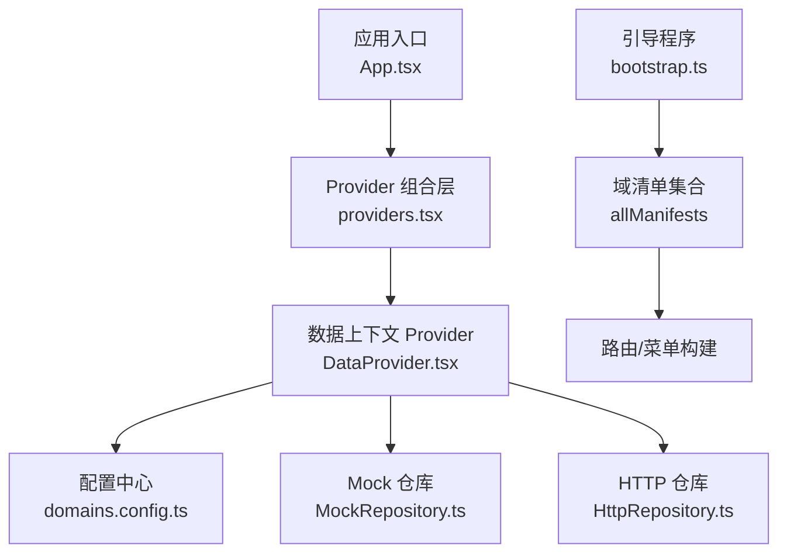
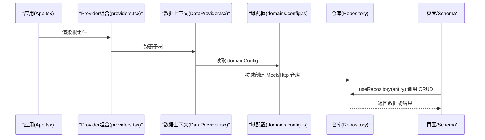
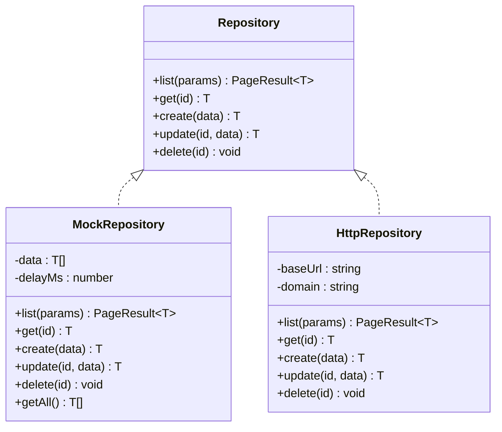
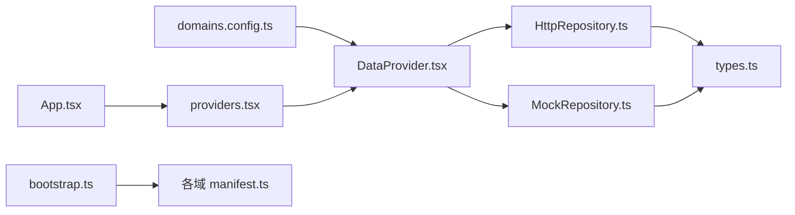

# 领域配置管理

<cite>
**本文引用的文件**   
- [domains.config.ts](file://hj-admin/src/config/domains.config.ts)
- [types.ts](file://hj-admin/src/shared/data/types.ts)
- [DataProvider.tsx](file://hj-admin/src/shared/data/DataProvider.tsx)
- [HttpRepository.ts](file://hj-admin/src/shared/data/HttpRepository.ts)
- [MockRepository.ts](file://hj-admin/src/shared/data/MockRepository.ts)
- [useRepository.ts](file://hj-admin/src/shared/data/useRepository.ts)
- [bootstrap.ts](file://hj-admin/src/app/bootstrap.ts)
- [App.tsx](file://hj-admin/src/app/App.tsx)
- [providers.tsx](file://hj-admin/src/app/providers.tsx)
- [manifest.ts（资讯域）](file://hj-admin/src/domains/news/manifest.ts)
- [repository.ts（资讯域）](file://hj-admin/src/domains/news/repository.ts)
- [manifest.ts（企业域）](file://hj-admin/src/domains/enterprise/manifest.ts)
- [manifest.ts（资源位域）](file://hj-admin/src/domains/resource/manifest.ts)
- [package.json](file://hj-admin/package.json)
</cite>

## 目录
1. [简介](#简介)
2. [项目结构](#项目结构)
3. [核心组件](#核心组件)
4. [架构总览](#架构总览)
5. [详细组件分析](#详细组件分析)
6. [依赖关系分析](#依赖关系分析)
7. [性能考量](#性能考量)
8. [故障排查指南](#故障排查指南)
9. [结论](#结论)
10. [附录](#附录)

## 简介
本技术文档聚焦于“领域配置管理”，围绕 domains.config.ts 的配置结构与域模式设置，系统阐述如何为新业务域添加配置、选择数据源模式（mock/http）、配置 API 基础路径、热重载与运行时更新策略、多环境切换方案、配置校验与默认值处理、版本管理与迁移指南，以及最佳实践与常见问题解决方案。目标是帮助开发者以最小改动完成域的扩展与数据源切换，同时保证可维护性与稳定性。

## 项目结构
本项目采用“域驱动 + 配置驱动”的架构：
- 每个业务域位于 src/domains/<domain>/ 下，包含 manifest.ts（域清单）、schema.ts（页面 Schema）、repository.ts（注册 Mock 数据）、pages/（自定义页面）等。
- 全局配置集中在 src/config/domains.config.ts，声明各域的数据源模式（mock/http）。
- 数据访问层在 src/shared/data/ 中实现 Repository 抽象与两种具体实现（Mock/HTTP），并通过 DataProvider 按域注入。
- 应用启动时通过 bootstrap.ts 自动发现所有域的 manifest.ts，生成路由与菜单。

图表来源
- [App.tsx:1-21](file://hj-admin/src/app/App.tsx#L1-L21)
- [providers.tsx:1-14](file://hj-admin/src/app/providers.tsx#L1-L14)
- [DataProvider.tsx:1-44](file://hj-admin/src/shared/data/DataProvider.tsx#L1-L44)
- [domains.config.ts:1-18](file://hj-admin/src/config/domains.config.ts#L1-L18)
- [MockRepository.ts:1-101](file://hj-admin/src/shared/data/MockRepository.ts#L1-L101)
- [HttpRepository.ts:1-70](file://hj-admin/src/shared/data/HttpRepository.ts#L1-L70)
- [bootstrap.ts:1-104](file://hj-admin/src/app/bootstrap.ts#L1-L104)

章节来源
- [App.tsx:1-21](file://hj-admin/src/app/App.tsx#L1-L21)
- [providers.tsx:1-14](file://hj-admin/src/app/providers.tsx#L1-L14)
- [bootstrap.ts:1-104](file://hj-admin/src/app/bootstrap.ts#L1-L104)

## 核心组件
- 域配置中心（domains.config.ts）
  - 定义 DomainDataSourceConfig，键为域名，值为数据源模式（'mock' | 'http'）。
  - 当前所有域均使用 mock，后端就绪后逐个切换为 http。
- 数据上下文（DataProvider.tsx）
  - 读取 domainConfig，按域创建对应 Repository 实例并注入到 React Context。
  - 提供 registerMockData 供各域在 bootstrap 阶段注册内存数据。
- 仓库抽象与实现（types.ts, MockRepository.ts, HttpRepository.ts）
  - Repository 接口统一 list/get/create/update/delete 契约。
  - MockRepository 模拟网络延迟、内存过滤/分页/排序。
  - HttpRepository 基于 fetch 发起 REST 请求，拼接查询参数。
- 使用方 Hook（useRepository.ts）
  - 从 Context 获取指定 entity 的 Repository；未找到时返回空操作 fallback，避免崩溃。
- 引导与自动发现（bootstrap.ts）
  - 利用 Vite import.meta.glob 扫描所有 domains/*/manifest.ts，提取路由与菜单。

章节来源
- [domains.config.ts:1-18](file://hj-admin/src/config/domains.config.ts#L1-L18)
- [DataProvider.tsx:1-44](file://hj-admin/src/shared/data/DataProvider.tsx#L1-L44)
- [types.ts:1-36](file://hj-admin/src/shared/data/types.ts#L1-L36)
- [MockRepository.ts:1-101](file://hj-admin/src/shared/data/MockRepository.ts#L1-L101)
- [HttpRepository.ts:1-70](file://hj-admin/src/shared/data/HttpRepository.ts#L1-L70)
- [useRepository.ts:1-24](file://hj-admin/src/shared/data/useRepository.ts#L1-L24)
- [bootstrap.ts:1-104](file://hj-admin/src/app/bootstrap.ts#L1-L104)

## 架构总览
下图展示从应用启动到数据访问的关键流程：应用挂载 Provider → DataProvider 读取配置 → 按域创建 Repository → 页面通过 useRepository 获取仓库进行数据交互。

图表来源
- [App.tsx:1-21](file://hj-admin/src/app/App.tsx#L1-L21)
- [providers.tsx:1-14](file://hj-admin/src/app/providers.tsx#L1-L14)
- [DataProvider.tsx:1-44](file://hj-admin/src/shared/data/DataProvider.tsx#L1-L44)
- [domains.config.ts:1-18](file://hj-admin/src/config/domains.config.ts#L1-L18)
- [useRepository.ts:1-24](file://hj-admin/src/shared/data/useRepository.ts#L1-L24)

## 详细组件分析

### 域配置中心（domains.config.ts）
- 配置结构
  - 键：域名（如 news、dataSources、enterprise、banner、icon、promotion、newsTags、enterpriseTags、dashboard）。
  - 值：数据源模式（'mock' | 'http'）。
- 作用
  - 作为单一事实源，控制各域的数据访问实现。
  - 配合 DataProvider 在初始化时决定使用 MockRepository 还是 HttpRepository。
- 新增域步骤
  1) 在 domains.config.ts 中添加新域键，并设置初始模式（建议先用 'mock'）。
  2) 在 src/domains/<newDomain>/ 下创建 manifest.ts、schema.ts、repository.ts 等。
  3) 在 repository.ts 中调用 registerMockData 注册内存数据（若使用 mock）。
  4) 在 manifest.ts 中声明路由与 Schema，引导程序会自动发现。
  5) 切换到 http 时，仅需将对应域的值改为 'http'，无需改动页面代码。

章节来源
- [domains.config.ts:1-18](file://hj-admin/src/config/domains.config.ts#L1-L18)
- [manifest.ts（资讯域）:1-42](file://hj-admin/src/domains/news/manifest.ts#L1-L42)
- [repository.ts（资讯域）:1-11](file://hj-admin/src/domains/news/repository.ts#L1-L11)

### 数据上下文与仓库注入（DataProvider.tsx）
- 职责
  - 读取 domainConfig，遍历所有域，按模式创建对应的 Repository 实例。
  - 将仓库映射表注入到 React Context，供 useRepository 消费。
- 关键细节
  - API_BASE 硬编码为 '/api/v1'，用于 HttpRepository 的基础路径。
  - 支持 registerMockData(domainName, data[]) 在 bootstrap 阶段注册内存数据。
- 运行时行为
  - 首次渲染时根据配置创建仓库；后续如需动态切换，需结合状态更新机制（见“热重载与运行时更新”）。

章节来源
- [DataProvider.tsx:1-44](file://hj-admin/src/shared/data/DataProvider.tsx#L1-L44)

### 仓库抽象与实现（types.ts, MockRepository.ts, HttpRepository.ts）
- 抽象接口（Repository）
  - list(params): Promise<PageResult<T>>
  - get(id): Promise<T>
  - create(data): Promise<T>
  - update(id, data): Promise<T>
  - delete(id): Promise<void>
- MockRepository
  - 内存数据、模拟延迟、关键词搜索、筛选、排序、分页。
  - getAll() 暴露全量数据，便于统计计数等场景。
- HttpRepository
  - 构造时接收 baseUrl 与 domain，拼接 endpoint。
  - list 方法将 QueryParams 转为 URLSearchParams，支持 page/pageSize/search/sort/filters。
  - 其他方法对应 POST/PUT/DELETE 请求。

图表来源
- [types.ts:1-36](file://hj-admin/src/shared/data/types.ts#L1-L36)
- [MockRepository.ts:1-101](file://hj-admin/src/shared/data/MockRepository.ts#L1-L101)
- [HttpRepository.ts:1-70](file://hj-admin/src/shared/data/HttpRepository.ts#L1-L70)

章节来源
- [types.ts:1-36](file://hj-admin/src/shared/data/types.ts#L1-L36)
- [MockRepository.ts:1-101](file://hj-admin/src/shared/data/MockRepository.ts#L1-L101)
- [HttpRepository.ts:1-70](file://hj-admin/src/shared/data/HttpRepository.ts#L1-L70)

### 引导与自动发现（bootstrap.ts）
- 功能
  - 使用 import.meta.glob 扫描所有 domains/*/manifest.ts，提取并排序 allManifests。
  - 提供 getAllRoutes() 与 buildMenuTree() 自动生成路由与菜单。
- 影响
  - 新增域只需在 domains 目录下放置 manifest.ts，无需手动注册。

章节来源
- [bootstrap.ts:1-104](file://hj-admin/src/app/bootstrap.ts#L1-L104)

### 使用方 Hook（useRepository.ts）
- 行为
  - 从 DataContext 获取指定 entity 的 Repository。
  - 若未找到，打印警告并返回空操作的 fallback，避免运行时崩溃。
- 建议
  - 确保 entities 名称与 domainConfig 中的键一致。

章节来源
- [useRepository.ts:1-24](file://hj-admin/src/shared/data/useRepository.ts#L1-L24)

### 示例域清单（manifest.ts）
- 资讯域（news）
  - 声明 name、label、menuGroup、order、routes 等。
  - 引入 './repository' 触发 mock 数据注册。
- 企业域（enterprise）
  - 类似结构，声明多个路由与属性。
- 资源位域（resource）
  - 在 manifest 同级注册 banner/icon/promotion 的 mock 数据。

章节来源
- [manifest.ts（资讯域）:1-42](file://hj-admin/src/domains/news/manifest.ts#L1-L42)
- [manifest.ts（企业域）:1-20](file://hj-admin/src/domains/enterprise/manifest.ts#L1-L20)
- [manifest.ts（资源位域）:1-22](file://hj-admin/src/domains/resource/manifest.ts#L1-L22)

## 依赖关系分析
- 配置依赖
  - DataProvider 依赖 domains.config.ts 的 DomainDataSourceConfig。
  - HttpRepository 依赖 types.ts 的 Repository、QueryParams、PageResult。
  - MockRepository 依赖 types.ts 的相同类型。
- 运行期依赖
  - App.tsx 通过 providers.tsx 组合 DataProvider。
  - bootstrap.ts 自动发现域清单，生成路由与菜单。

图表来源
- [domains.config.ts:1-18](file://hj-admin/src/config/domains.config.ts#L1-L18)
- [DataProvider.tsx:1-44](file://hj-admin/src/shared/data/DataProvider.tsx#L1-L44)
- [MockRepository.ts:1-101](file://hj-admin/src/shared/data/MockRepository.ts#L1-L101)
- [HttpRepository.ts:1-70](file://hj-admin/src/shared/data/HttpRepository.ts#L1-L70)
- [types.ts:1-36](file://hj-admin/src/shared/data/types.ts#L1-L36)
- [App.tsx:1-21](file://hj-admin/src/app/App.tsx#L1-L21)
- [providers.tsx:1-14](file://hj-admin/src/app/providers.tsx#L1-L14)
- [bootstrap.ts:1-104](file://hj-admin/src/app/bootstrap.ts#L1-L104)

章节来源
- [domains.config.ts:1-18](file://hj-admin/src/config/domains.config.ts#L1-L18)
- [DataProvider.tsx:1-44](file://hj-admin/src/shared/data/DataProvider.tsx#L1-L44)
- [types.ts:1-36](file://hj-admin/src/shared/data/types.ts#L1-L36)
- [bootstrap.ts:1-104](file://hj-admin/src/app/bootstrap.ts#L1-L104)

## 性能考量
- MockRepository
  - 内存过滤/排序/分页适合小数据集；大数据集建议在后端分页与索引优化。
  - 默认延迟约 300ms，可用于体验真实加载态；生产环境应关闭或降低延迟。
- HttpRepository
  - 列表页已支持分页、排序、筛选参数拼接；注意服务端分页与缓存策略。
  - 频繁请求时可考虑请求去抖、合并请求、响应缓存等优化。
- 构建与打包
  - 使用 Vite 开发服务器，HMR 可提升开发效率。
  - 生产构建通过 tsc -b && vite build，确保类型检查与产物优化。

章节来源
- [MockRepository.ts:1-101](file://hj-admin/src/shared/data/MockRepository.ts#L1-L101)
- [HttpRepository.ts:1-70](file://hj-admin/src/shared/data/HttpRepository.ts#L1-L70)
- [package.json:1-35](file://hj-admin/package.json#L1-L35)

## 故障排查指南
- 现象：useRepository 报 “Repository not found for entity”
  - 原因：未在 domainConfig 中注册该 entity，或未正确命名。
  - 解决：在 domains.config.ts 中添加对应键，并确保 entity 名称一致。
- 现象：切换为 http 后页面空白或报错
  - 原因：后端 API 未就绪或跨域问题。
  - 解决：确认 API_BASE 与后端路径一致，检查 CORS 与鉴权头。
- 现象：Mock 数据不生效
  - 原因：未在 repository.ts 中调用 registerMockData 或数据为空。
  - 解决：检查各域 repository.ts 是否正确注册，确认 mock 数据存在。
- 现象：菜单/路由未出现
  - 原因：manifest.ts 未导出或未遵循约定路径。
  - 解决：确保 manifest.ts 在 domains/<domain>/ 下且导出正确的 DomainManifest。

章节来源
- [useRepository.ts:1-24](file://hj-admin/src/shared/data/useRepository.ts#L1-L24)
- [DataProvider.tsx:1-44](file://hj-admin/src/shared/data/DataProvider.tsx#L1-L44)
- [bootstrap.ts:1-104](file://hj-admin/src/app/bootstrap.ts#L1-L104)

## 结论
通过 domains.config.ts 的集中式配置与 DataProvider 的注入机制，项目实现了“配置即开关”的域数据源切换能力。新增域仅需声明 manifest 与注册数据，即可被自动发现与渲染。配合统一的 Repository 抽象，前端可在 mock 与 http 之间无缝切换，极大提升了开发与联调效率。建议在后续迭代中完善配置校验、环境变量与版本迁移策略，进一步提升系统的健壮性与可维护性。

## 附录

### 如何为新业务域添加配置（步骤清单）
- 在 domains.config.ts 中新增域键，初始设置为 'mock'。
- 在 src/domains/<newDomain>/ 创建以下文件：
  - manifest.ts：声明 name、label、menuGroup、order、routes 等。
  - schema.ts：定义页面 Schema（filters/columns/pagination/actions 等）。
  - repository.ts：调用 registerMockData 注册内存数据（可选）。
  - pages/：自定义页面组件（如有）。
- 启动开发服务器，验证路由与菜单是否自动生成。
- 后端就绪后，将 domains.config.ts 中对应域的值改为 'http'，无需修改页面代码。

章节来源
- [domains.config.ts:1-18](file://hj-admin/src/config/domains.config.ts#L1-L18)
- [manifest.ts（资讯域）:1-42](file://hj-admin/src/domains/news/manifest.ts#L1-L42)
- [repository.ts（资讯域）:1-11](file://hj-admin/src/domains/news/repository.ts#L1-L11)

### 数据源模式选择与 API 基础路径配置
- 模式选择
  - 'mock'：使用 MockRepository，内存数据、模拟延迟、本地过滤/分页/排序。
  - 'http'：使用 HttpRepository，基于 fetch 发起 REST 请求。
- API 基础路径
  - 当前在 DataProvider 中硬编码为 '/api/v1'。
  - 建议后续抽取为环境变量或配置文件，以便多环境切换。

章节来源
- [DataProvider.tsx:1-44](file://hj-admin/src/shared/data/DataProvider.tsx#L1-L44)
- [HttpRepository.ts:1-70](file://hj-admin/src/shared/data/HttpRepository.ts#L1-L70)

### 配置的热重载机制与运行时配置更新
- 开发环境
  - Vite 的 HMR 会在保存 domains.config.ts 后自动刷新模块，DataProvider 会重新计算仓库映射，从而实现热重载。
- 运行时更新
  - 当前 DataProvider 在首次渲染时一次性创建仓库映射。
  - 若需在运行时动态切换某域的模式，可将 domainConfig 提升到状态（如 useState），并在用户操作时更新，从而触发重新渲染与仓库重建。

章节来源
- [DataProvider.tsx:1-44](file://hj-admin/src/shared/data/DataProvider.tsx#L1-L44)
- [package.json:1-35](file://hj-admin/package.json#L1-L35)

### 多环境配置的切换策略（开发、测试、生产）
- 推荐方案
  - 使用环境变量（如 VITE_API_BASE）替代硬编码的 API_BASE。
  - 在不同环境的 .env 文件中定义变量，构建时注入。
  - 在 DataProvider 中读取环境变量，动态设置 HttpRepository 的 baseUrl。
- 注意事项
  - 确保构建脚本与环境变量加载顺序正确。
  - 敏感信息不要提交到版本库。

章节来源
- [DataProvider.tsx:1-44](file://hj-admin/src/shared/data/DataProvider.tsx#L1-L44)
- [package.json:1-35](file://hj-admin/package.json#L1-L35)

### 配置验证与默认值处理
- 现状
  - 当前未对 domainConfig 做显式校验；useRepository 在未找到实体时会返回空操作 fallback 并打印警告。
- 建议
  - 在 DataProvider 初始化时对 domainConfig 进行白名单校验，仅允许已知域。
  - 为未知域提供默认模式（如 'mock'），避免运行时错误。
  - 增加日志记录，便于定位配置不一致问题。

章节来源
- [useRepository.ts:1-24](file://hj-admin/src/shared/data/useRepository.ts#L1-L24)
- [DataProvider.tsx:1-44](file://hj-admin/src/shared/data/DataProvider.tsx#L1-L44)

### 配置文件版本管理与迁移指南
- 版本化建议
  - 为 domains.config.ts 建立变更日志，记录新增/删除域、模式切换、API_BASE 调整等。
  - 在重大变更前进行分支发布与回滚预案。
- 迁移步骤
  - 新增域：先在 'mock' 模式下验证，稳定后再切换为 'http'。
  - 切换模式：仅在 domains.config.ts 中修改对应域的值，无需改动页面代码。
  - 清理废弃域：从 domains.config.ts 移除键，并清理对应域文件与引用。

章节来源
- [domains.config.ts:1-18](file://hj-admin/src/config/domains.config.ts#L1-L18)

### 最佳实践
- 保持 entity 名称与 domainConfig 键一致，避免 useRepository 找不到仓库。
- 优先使用 'mock' 进行前端独立开发，待后端就绪再逐步切换为 'http'。
- 在 manifest.ts 中合理组织路由与菜单分组，提升导航清晰度。
- 对大数据量列表启用服务端分页与索引，减少前端压力。
- 对敏感配置使用环境变量管理，避免泄露。

[本节为通用指导，不直接分析具体文件]

### 常见问题解决方案
- 问：为什么我的域没有出现在菜单中？
  - 答：检查 manifest.ts 是否正确导出，且 routes 中未设置 hideInMenu。
- 问：切换为 http 后请求失败？
  - 答：确认 API_BASE 与后端路径一致，检查跨域与鉴权头。
- 问：如何快速定位某个域使用的数据源？
  - 答：查看 domains.config.ts 中对应域的值，或在控制台观察 useRepository 的警告信息。

章节来源
- [bootstrap.ts:1-104](file://hj-admin/src/app/bootstrap.ts#L1-L104)
- [useRepository.ts:1-24](file://hj-admin/src/shared/data/useRepository.ts#L1-L24)
- [DataProvider.tsx:1-44](file://hj-admin/src/shared/data/DataProvider.tsx#L1-L44)