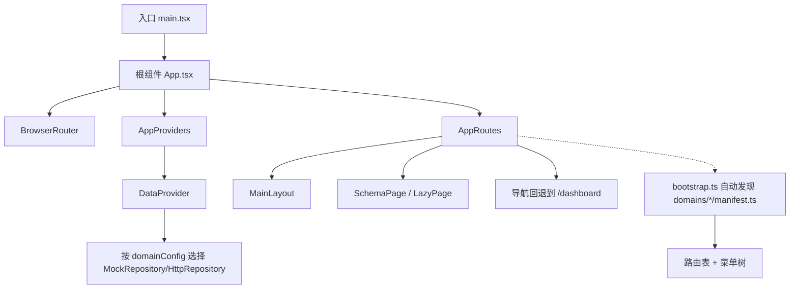
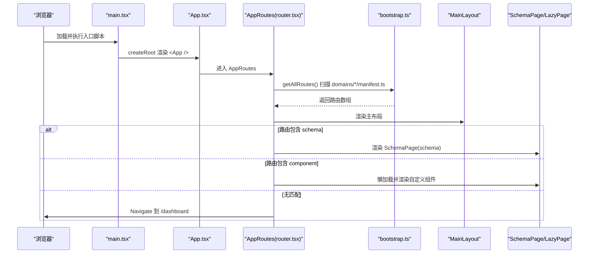
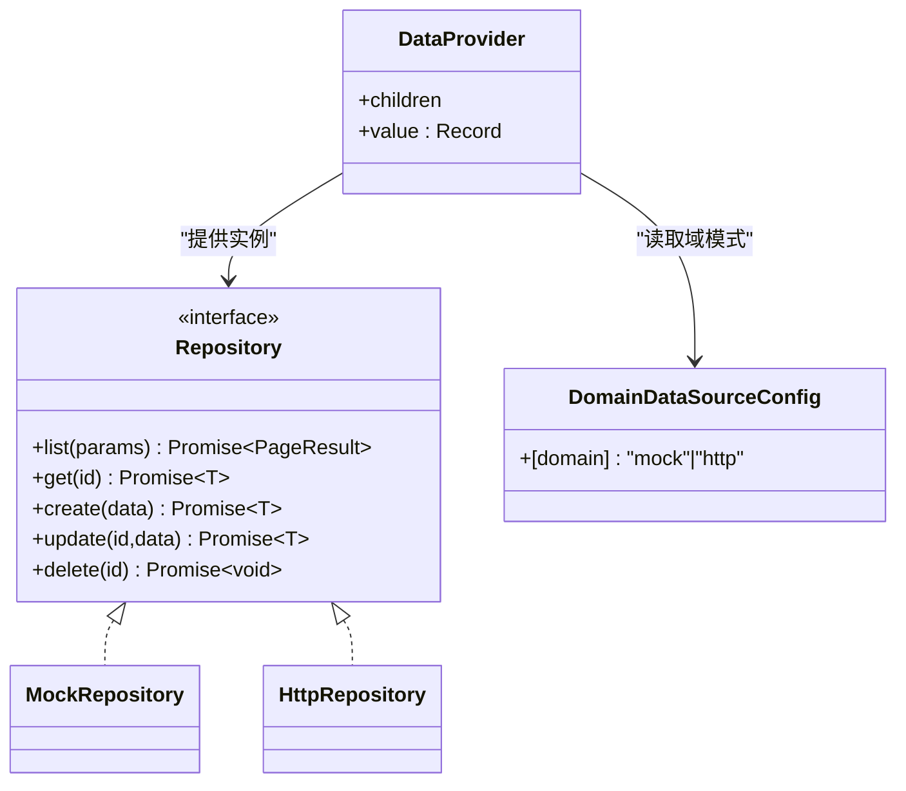
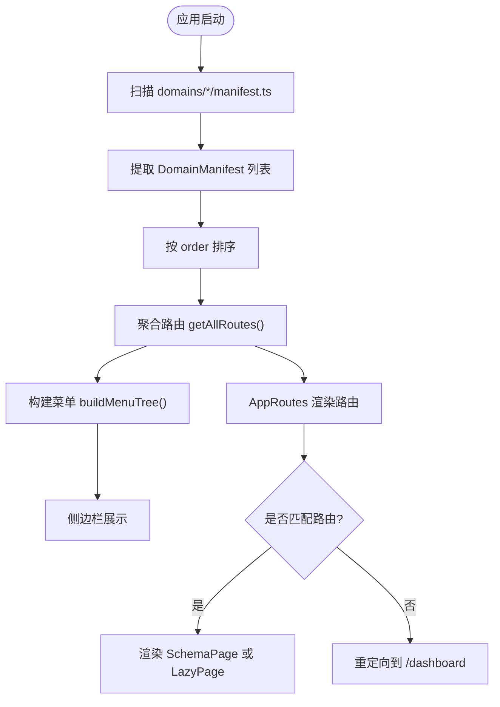
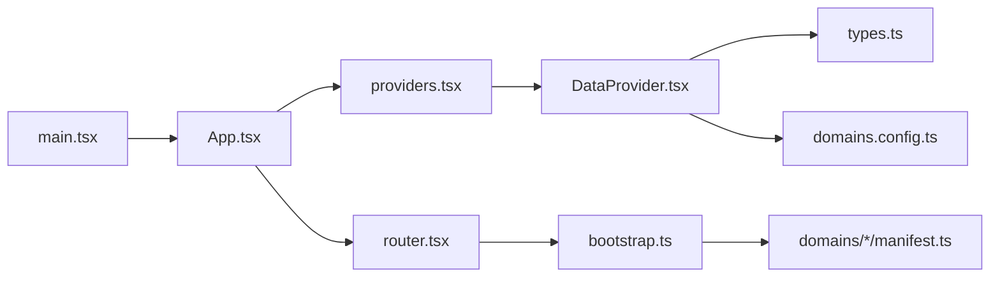

# 应用生命周期管理

<cite>
**本文引用的文件**
- [main.tsx](file://hj-admin/src/main.tsx)
- [App.tsx](file://hj-admin/src/app/App.tsx)
- [providers.tsx](file://hj-admin/src/app/providers.tsx)
- [router.tsx](file://hj-admin/src/app/router.tsx)
- [bootstrap.ts](file://hj-admin/src/app/bootstrap.ts)
- [DataProvider.tsx](file://hj-admin/src/shared/data/DataProvider.tsx)
- [types.ts](file://hj-admin/src/shared/data/types.ts)
- [domains.config.ts](file://hj-admin/src/config/domains.config.ts)
- [manifest.ts（资讯域）](file://hj-admin/src/domains/news/manifest.ts)
- [manifest.ts（企业域）](file://hj-admin/src/domains/enterprise/manifest.ts)
</cite>

## 目录
1. [简介](#简介)
2. [项目结构](#项目结构)
3. [核心组件](#核心组件)
4. [架构总览](#架构总览)
5. [详细组件分析](#详细组件分析)
6. [依赖关系分析](#依赖关系分析)
7. [性能考虑](#性能考虑)
8. [故障排查指南](#故障排查指南)
9. [结论](#结论)

## 简介
本文件面向氢界大数据平台的前端应用，聚焦“应用生命周期管理”，从入口到根组件、Provider 链构建、配置加载、错误边界与异常处理策略、启动时序图以及性能优化进行系统化说明。目标是帮助读者快速理解应用启动流程、上下文设置顺序、动态路由与数据源切换机制，并在需要时定位问题与优化性能。

## 项目结构
应用采用 React + Vite + react-router-dom 的轻量架构，结合“域清单”实现自动发现与自动路由生成。关键路径如下：
- 入口渲染：src/main.tsx
- 根组件编排：src/app/App.tsx
- Provider 组合层：src/app/providers.tsx
- 路由与懒加载：src/app/router.tsx
- 域清单自动发现与菜单构建：src/app/bootstrap.ts
- 数据上下文与仓库模式：src/shared/data/DataProvider.tsx, types.ts
- 域数据源模式配置：src/config/domains.config.ts
- 各域清单示例：src/domains/*/manifest.ts

图表来源
- [main.tsx:1-11](file://hj-admin/src/main.tsx#L1-L11)
- [App.tsx:1-21](file://hj-admin/src/app/App.tsx#L1-L21)
- [providers.tsx:1-14](file://hj-admin/src/app/providers.tsx#L1-L14)
- [router.tsx:1-58](file://hj-admin/src/app/router.tsx#L1-L58)
- [bootstrap.ts:1-104](file://hj-admin/src/app/bootstrap.ts#L1-L104)
- [DataProvider.tsx:1-44](file://hj-admin/src/shared/data/DataProvider.tsx#L1-L44)
- [domains.config.ts:1-18](file://hj-admin/src/config/domains.config.ts#L1-L18)

章节来源
- [main.tsx:1-11](file://hj-admin/src/main.tsx#L1-L11)
- [App.tsx:1-21](file://hj-admin/src/app/App.tsx#L1-L21)
- [providers.tsx:1-14](file://hj-admin/src/app/providers.tsx#L1-L14)
- [router.tsx:1-58](file://hj-admin/src/app/router.tsx#L1-L58)
- [bootstrap.ts:1-104](file://hj-admin/src/app/bootstrap.ts#L1-L104)
- [DataProvider.tsx:1-44](file://hj-admin/src/shared/data/DataProvider.tsx#L1-L44)
- [domains.config.ts:1-18](file://hj-admin/src/config/domains.config.ts#L1-L18)

## 核心组件
- 入口渲染器：负责挂载根节点并包裹 StrictMode。
- 根组件：仅做编排，挂载 BrowserRouter、Provider 链与路由。
- Provider 组合层：集中注入全局上下文（当前为数据上下文）。
- 路由系统：基于 bootstrap 自动发现的域清单生成路由，支持 Schema 页面与懒加载自定义组件。
- 数据上下文：根据域配置在 mock 与 http 之间切换数据访问实现。

章节来源
- [main.tsx:1-11](file://hj-admin/src/main.tsx#L1-L11)
- [App.tsx:1-21](file://hj-admin/src/app/App.tsx#L1-L21)
- [providers.tsx:1-14](file://hj-admin/src/app/providers.tsx#L1-L14)
- [router.tsx:1-58](file://hj-admin/src/app/router.tsx#L1-L58)
- [DataProvider.tsx:1-44](file://hj-admin/src/shared/data/DataProvider.tsx#L1-L44)

## 架构总览
应用启动的关键阶段：
1. 浏览器加载 index.html，执行 main.tsx。
2. createRoot 渲染 <StrictMode><App /></StrictMode>。
3. App 组件创建 BrowserRouter，并嵌套 AppProviders 与 AppRoutes。
4. AppProviders 提供 DataProvider，按域配置注入 Repository 实例。
5. AppRoutes 调用 bootstrap 的 getAllRoutes 收集所有域清单的路由，生成 Routes。
6. 匹配路由后，若声明了 schema，则使用 SchemaPage 渲染；否则通过 LazyPage 懒加载自定义组件。
7. 未命中任何路由时，重定向至 /dashboard。

图表来源
- [main.tsx:1-11](file://hj-admin/src/main.tsx#L1-L11)
- [App.tsx:1-21](file://hj-admin/src/app/App.tsx#L1-L21)
- [router.tsx:1-58](file://hj-admin/src/app/router.tsx#L1-L58)
- [bootstrap.ts:1-104](file://hj-admin/src/app/bootstrap.ts#L1-L104)

## 详细组件分析

### 入口与根组件初始化
- 入口 main.tsx 使用 createRoot 挂载根节点，并用 StrictMode 包裹 App 组件，便于开发期捕获潜在问题。
- 根组件 App.tsx 仅负责编排：
  - 外层 BrowserRouter 提供路由上下文。
  - 中间 AppProviders 提供全局上下文（当前为数据上下文）。
  - 内层 AppRoutes 负责路由注册与渲染。

章节来源
- [main.tsx:1-11](file://hj-admin/src/main.tsx#L1-L11)
- [App.tsx:1-21](file://hj-admin/src/app/App.tsx#L1-L21)

### Provider 链构建与管理
- providers.tsx 作为 Provider 组合层，当前仅包裹 DataProvider。
- DataProvider 依据 config/domains.config.ts 中每个域的 mode，选择 MockRepository 或 HttpRepository，并以键值对形式注入到 React Context。
- 后续页面通过 useRepository 获取对应域的 Repository 实例，屏蔽底层数据源差异。

图表来源
- [providers.tsx:1-14](file://hj-admin/src/app/providers.tsx#L1-L14)
- [DataProvider.tsx:1-44](file://hj-admin/src/shared/data/DataProvider.tsx#L1-L44)
- [types.ts:1-36](file://hj-admin/src/shared/data/types.ts#L1-L36)
- [domains.config.ts:1-18](file://hj-admin/src/config/domains.config.ts#L1-L18)

章节来源
- [providers.tsx:1-14](file://hj-admin/src/app/providers.tsx#L1-L14)
- [DataProvider.tsx:1-44](file://hj-admin/src/shared/data/DataProvider.tsx#L1-L44)
- [types.ts:1-36](file://hj-admin/src/shared/data/types.ts#L1-L36)
- [domains.config.ts:1-18](file://hj-admin/src/config/domains.config.ts#L1-L18)

### 应用配置加载机制
- 域清单自动发现：bootstrap.ts 使用 import.meta.glob 在构建时扫描所有 domains/*/manifest.ts，提取默认导出的 DomainManifest，并按 order 排序。
- 路由聚合：getAllRoutes 将各域 routes 扁平化，供 router.tsx 使用。
- 菜单构建：buildMenuTree 将启用的路由项与硬编码的禁用项合并，形成带分组的菜单树。
- 数据源模式：domains.config.ts 以键值对形式声明每个域的数据源模式（mock/http），Data 层据此选择具体实现。

图表来源
- [bootstrap.ts:1-104](file://hj-admin/src/app/bootstrap.ts#L1-L104)
- [router.tsx:1-58](file://hj-admin/src/app/router.tsx#L1-L58)

章节来源
- [bootstrap.ts:1-104](file://hj-admin/src/app/bootstrap.ts#L1-L104)
- [router.tsx:1-58](file://hj-admin/src/app/router.tsx#L1-L58)
- [domains.config.ts:1-18](file://hj-admin/src/config/domains.config.ts#L1-L18)

### 路由与懒加载策略
- 固定路由：/dashboard 始终存在，并通过 lazy 懒加载 Dashboard 组件。
- 动态路由：从 bootstrap 聚合的 routes 中遍历生成 Route。
  - 若 route.schema 存在，使用 SchemaPage 渲染。
  - 若 route.component 存在，使用 LazyPage 包裹 Suspense 进行懒加载。
- 兜底路由：未匹配时 Navigate 到 /dashboard。

章节来源
- [router.tsx:1-58](file://hj-admin/src/app/router.tsx#L1-L58)

### 域清单示例与扩展方式
- 资讯域 manifest.ts 展示了如何声明 name、label、icon、menuGroup、order、routes，并在导入时触发 repository 的 mock 数据注册。
- 企业域 manifest.ts 同理，体现多路由与编辑页隐藏于菜单的配置方式。

章节来源
- [manifest.ts（资讯域）:1-42](file://hj-admin/src/domains/news/manifest.ts#L1-L42)
- [manifest.ts（企业域）:1-20](file://hj-admin/src/domains/enterprise/manifest.ts#L1-L20)

### 错误边界与异常处理策略
- 当前代码未显式定义 React Error Boundary 组件。
- 建议：
  - 在 AppProviders 中引入 ErrorBoundary，包裹路由区域，捕获渲染期异常并降级显示友好提示。
  - 在数据请求层（MockRepository/HttpRepository）统一封装 try/catch，并将错误信息上抛或记录日志。
  - 针对网络异常、鉴权失败等场景，提供可复用的错误提示与重试机制。

章节来源
- [providers.tsx:1-14](file://hj-admin/src/app/providers.tsx#L1-L14)
- [DataProvider.tsx:1-44](file://hj-admin/src/shared/data/DataProvider.tsx#L1-L44)

## 依赖关系分析
- 入口与根组件：main.tsx -> App.tsx -> AppProviders -> DataProvider。
- 路由与自动发现：AppRoutes -> bootstrap.getAllRoutes -> import.meta.glob 扫描 domains/*/manifest.ts。
- 数据访问：DataProvider -> domainConfig -> MockRepository/HttpRepository。
- 类型契约：shared/data/types.ts 定义 Repository 接口与分页结果类型，保证数据层一致性。

图表来源
- [main.tsx:1-11](file://hj-admin/src/main.tsx#L1-L11)
- [App.tsx:1-21](file://hj-admin/src/app/App.tsx#L1-L21)
- [providers.tsx:1-14](file://hj-admin/src/app/providers.tsx#L1-L14)
- [router.tsx:1-58](file://hj-admin/src/app/router.tsx#L1-L58)
- [bootstrap.ts:1-104](file://hj-admin/src/app/bootstrap.ts#L1-L104)
- [DataProvider.tsx:1-44](file://hj-admin/src/shared/data/DataProvider.tsx#L1-L44)
- [types.ts:1-36](file://hj-admin/src/shared/data/types.ts#L1-L36)
- [domains.config.ts:1-18](file://hj-admin/src/config/domains.config.ts#L1-L18)

章节来源
- [main.tsx:1-11](file://hj-admin/src/main.tsx#L1-L11)
- [App.tsx:1-21](file://hj-admin/src/app/App.tsx#L1-L21)
- [providers.tsx:1-14](file://hj-admin/src/app/providers.tsx#L1-L14)
- [router.tsx:1-58](file://hj-admin/src/app/router.tsx#L1-L58)
- [bootstrap.ts:1-104](file://hj-admin/src/app/bootstrap.ts#L1-L104)
- [DataProvider.tsx:1-44](file://hj-admin/src/shared/data/DataProvider.tsx#L1-L44)
- [types.ts:1-36](file://hj-admin/src/shared/data/types.ts#L1-L36)
- [domains.config.ts:1-18](file://hj-admin/src/config/domains.config.ts#L1-L18)

## 性能考虑
- 路由级懒加载：Dashboard 与自定义页面均通过 lazy 与 Suspense 实现按需加载，减少首屏体积。
- 构建期自动发现：import.meta.glob 在构建时扫描域清单，避免运行期 IO 开销。
- 数据层抽象：通过 Repository 接口屏蔽实现细节，便于后续接入缓存、重试、节流等策略。
- 建议优化：
  - 对大型页面进一步拆分模块，按需加载子组件。
  - 对频繁访问的数据增加本地缓存或内存缓存层。
  - 对图片、图标等资源启用压缩与 CDN。
  - 在开发环境保留 StrictMode，生产环境评估是否需要开启更多优化插件。

章节来源
- [router.tsx:1-58](file://hj-admin/src/app/router.tsx#L1-L58)
- [bootstrap.ts:1-104](file://hj-admin/src/app/bootstrap.ts#L1-L104)
- [DataProvider.tsx:1-44](file://hj-admin/src/shared/data/DataProvider.tsx#L1-L44)

## 故障排查指南
- 路由不生效：
  - 检查对应域的 manifest.ts 是否正确导出且被 import.meta.glob 扫描到。
  - 确认 path、hideInMenu、component/schema 字段配置正确。
- 菜单缺失或顺序异常：
  - 核对 manifest.ts 中的 menuGroup、order 字段。
  - 检查 buildMenuTree 的分组顺序与禁用项映射。
- 数据源切换无效：
  - 确认 domains.config.ts 中对应域的 mode 已更新为 'http' 或 'mock'。
  - 确保 DataProvider 能读取到最新配置。
- 页面空白或报错：
  - 建议在 AppProviders 中引入 ErrorBoundary，捕获渲染异常并输出友好提示。
  - 在数据层统一捕获网络错误并上报日志。

章节来源
- [bootstrap.ts:1-104](file://hj-admin/src/app/bootstrap.ts#L1-L104)
- [router.tsx:1-58](file://hj-admin/src/app/router.tsx#L1-L58)
- [DataProvider.tsx:1-44](file://hj-admin/src/shared/data/DataProvider.tsx#L1-L44)
- [domains.config.ts:1-18](file://hj-admin/src/config/domains.config.ts#L1-L18)

## 结论
本应用通过“域清单 + 自动发现 + 懒加载 + 数据层抽象”的组合，实现了高可扩展、低耦合的应用生命周期管理。入口与根组件职责清晰，Provider 链集中管理全局上下文，路由与菜单自动生成，数据源可按域灵活切换。建议在现有基础上补充错误边界与统一的异常处理策略，并持续优化懒加载与缓存策略，以提升稳定性与性能。