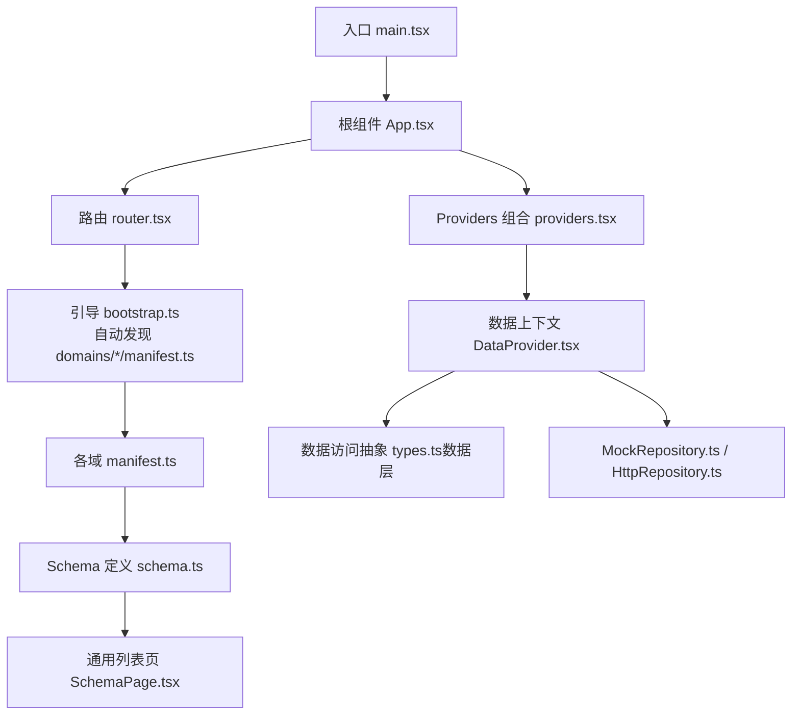
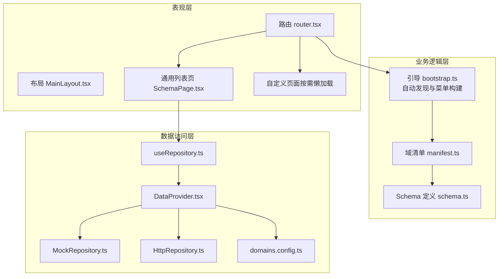
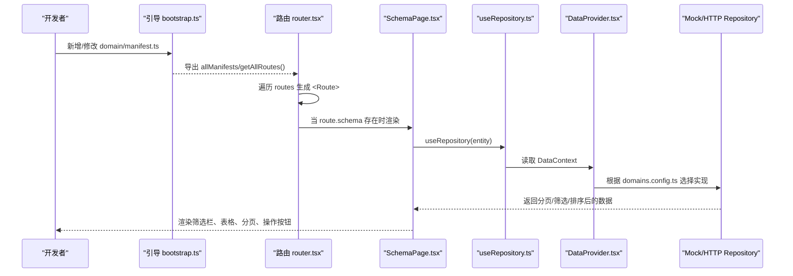
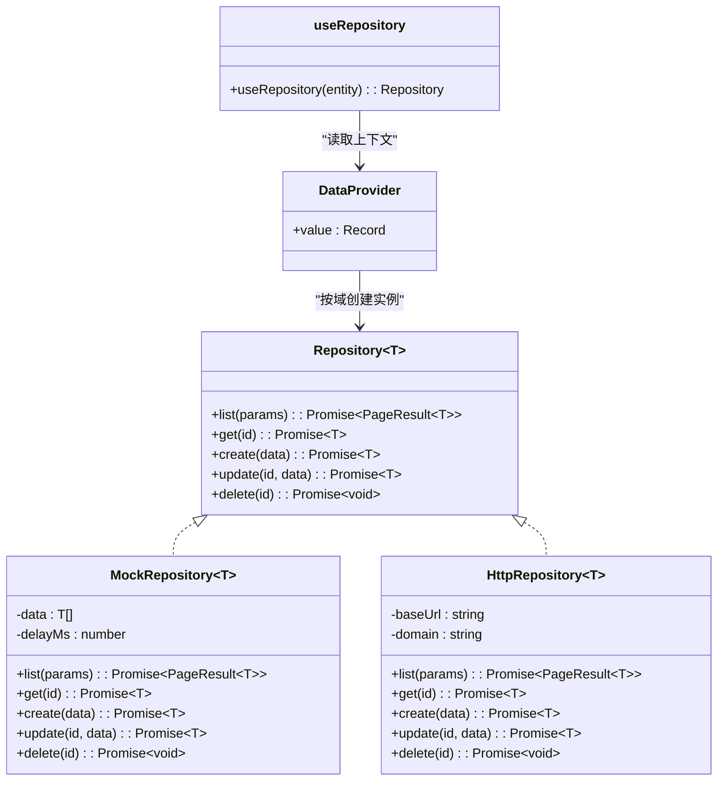
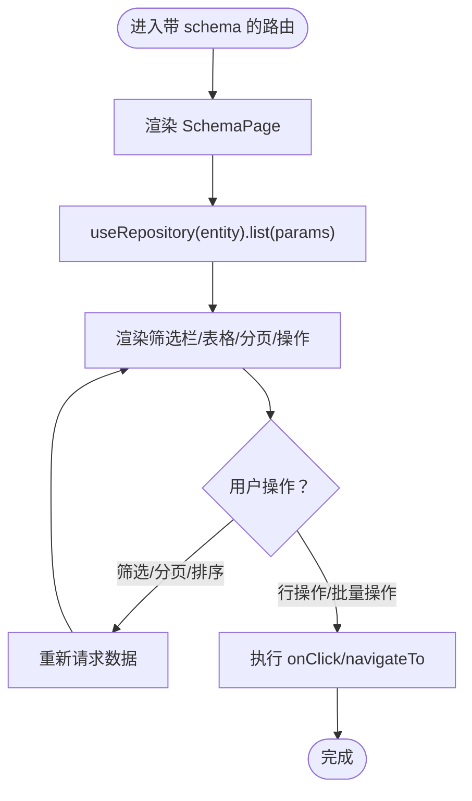
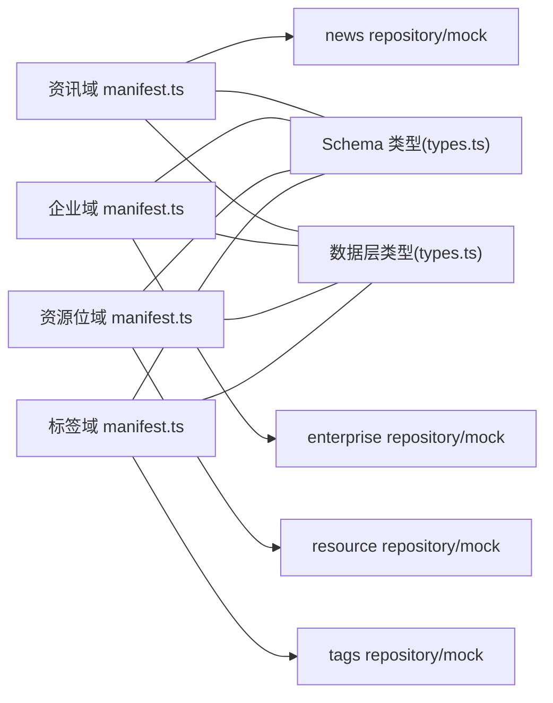
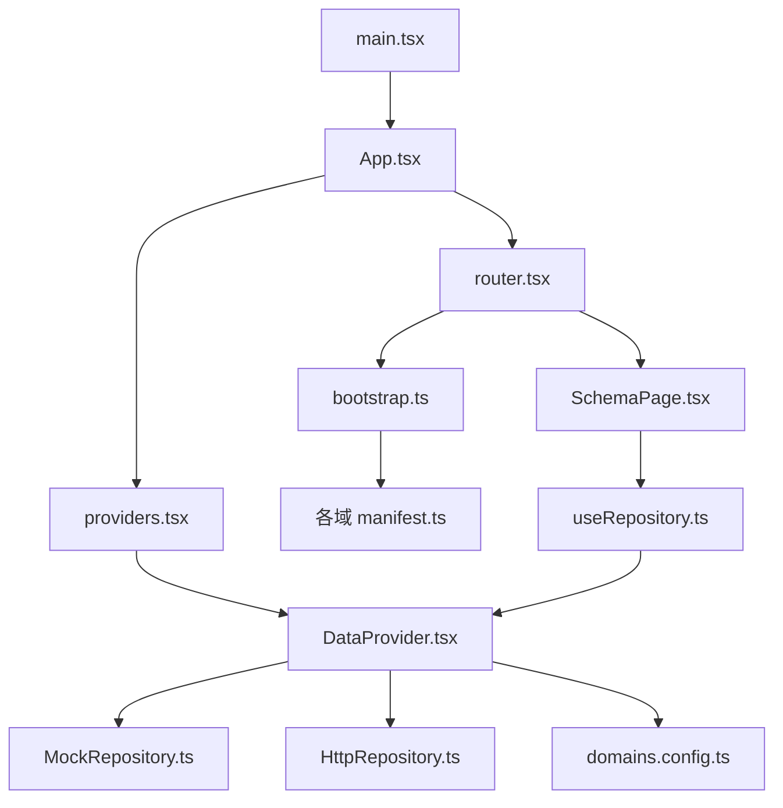

# 整体架构概览

<cite>
**本文引用的文件**   
- [main.tsx](file://hj-admin/src/main.tsx)
- [App.tsx](file://hj-admin/src/app/App.tsx)
- [providers.tsx](file://hj-admin/src/app/providers.tsx)
- [router.tsx](file://hj-admin/src/app/router.tsx)
- [bootstrap.ts](file://hj-admin/src/app/bootstrap.ts)
- [domains.config.ts](file://hj-admin/src/config/domains.config.ts)
- [types.ts（Schema 引擎）](file://hj-admin/src/shared/schema-engine/types.ts)
- [SchemaPage.tsx](file://hj-admin/src/shared/schema-engine/SchemaPage.tsx)
- [types.ts（数据层）](file://hj-admin/src/shared/data/types.ts)
- [DataProvider.tsx](file://hj-admin/src/shared/data/DataProvider.tsx)
- [HttpRepository.ts](file://hj-admin/src/shared/data/HttpRepository.ts)
- [MockRepository.ts](file://hj-admin/src/shared/data/MockRepository.ts)
- [useRepository.ts](file://hj-admin/src/shared/data/useRepository.ts)
- [manifest.ts（资讯域）](file://hj-admin/src/domains/news/manifest.ts)
- [schema.ts（企业域）](file://hj-admin/src/domains/enterprise/schema.ts)
- [manifest.ts（企业域）](file://hj-admin/src/domains/enterprise/manifest.ts)
- [manifest.ts（资源位域）](file://hj-admin/src/domains/resource/manifest.ts)
- [manifest.ts（标签域）](file://hj-admin/src/domains/tags/manifest.ts)
</cite>

## 目录
1. [引言](#引言)
2. [项目结构](#项目结构)
3. [核心组件](#核心组件)
4. [架构总览](#架构总览)
5. [详细组件分析](#详细组件分析)
6. [依赖关系分析](#依赖关系分析)
7. [性能与可扩展性](#性能与可扩展性)
8. [故障排查指南](#故障排查指南)
9. [结论](#结论)
10. [附录：技术栈选型说明](#附录技术栈选型说明)

## 引言
本文件为“氢界大数据平台”运营管理后台的整体架构概览，面向初学者与一线工程师，系统阐述分层架构、Schema 驱动、领域驱动设计（DDD）的应用方式，以及从声明式配置自动生成 CRUD 页面的机制。文档同时提供架构图与关键流程时序图，帮助读者快速建立全局认知并指导后续扩展与维护。

## 项目结构
前端采用 React + TypeScript + Ant Design 技术栈，基于 Vite 构建。应用以“域（Domain）”为单位组织业务代码，每个域包含清单（manifest）、页面 Schema、可选的自定义页面、数据仓库（repository）与类型定义等。运行时通过自动发现所有域的清单，动态生成路由与菜单；页面渲染由 Schema 驱动的通用列表页完成，极大降低重复开发成本。

图表来源
- [main.tsx:1-11](file://hj-admin/src/main.tsx#L1-L11)
- [App.tsx:1-21](file://hj-admin/src/app/App.tsx#L1-L21)
- [providers.tsx:1-14](file://hj-admin/src/app/providers.tsx#L1-L14)
- [router.tsx:1-58](file://hj-admin/src/app/router.tsx#L1-L58)
- [bootstrap.ts:1-104](file://hj-admin/src/app/bootstrap.ts#L1-L104)
- [DataProvider.tsx:1-44](file://hj-admin/src/shared/data/DataProvider.tsx#L1-L44)
- [types.ts（数据层）:1-36](file://hj-admin/src/shared/data/types.ts#L1-L36)
- [MockRepository.ts:1-101](file://hj-admin/src/shared/data/MockRepository.ts#L1-L101)
- [HttpRepository.ts:1-70](file://hj-admin/src/shared/data/HttpRepository.ts#L1-L70)
- [SchemaPage.tsx:1-226](file://hj-admin/src/shared/schema-engine/SchemaPage.tsx#L1-L226)

章节来源
- [main.tsx:1-11](file://hj-admin/src/main.tsx#L1-L11)
- [App.tsx:1-21](file://hj-admin/src/app/App.tsx#L1-L21)
- [providers.tsx:1-14](file://hj-admin/src/app/providers.tsx#L1-L14)
- [router.tsx:1-58](file://hj-admin/src/app/router.tsx#L1-L58)
- [bootstrap.ts:1-104](file://hj-admin/src/app/bootstrap.ts#L1-L104)

## 核心组件
- 应用编排层
  - 入口与根组件负责挂载 Provider 链与路由，不包含业务逻辑。
  - Providers 组合层集中注入全局上下文（如数据上下文）。
- 路由与菜单
  - 通过引导模块在构建期扫描所有域的清单，汇总路由与菜单树。
  - 路由根据是否携带 Schema 决定使用通用列表页或懒加载自定义组件。
- 数据访问层
  - 统一 Repository 接口，支持 Mock 与 HTTP 两种实现。
  - 按域注册数据源模式，切换时无需改动页面与 Schema。
- Schema 引擎
  - 以 PageSchema 为核心，声明筛选、表格列、分页、行操作、批量操作、弹窗、Tab 分组等。
  - 通用列表页根据 Schema 自动渲染完整 CRUD 界面。

章节来源
- [App.tsx:1-21](file://hj-admin/src/app/App.tsx#L1-L21)
- [providers.tsx:1-14](file://hj-admin/src/app/providers.tsx#L1-L14)
- [router.tsx:1-58](file://hj-admin/src/app/router.tsx#L1-L58)
- [bootstrap.ts:1-104](file://hj-admin/src/app/bootstrap.ts#L1-L104)
- [types.ts（Schema 引擎）:1-216](file://hj-admin/src/shared/schema-engine/types.ts#L1-L216)
- [SchemaPage.tsx:1-226](file://hj-admin/src/shared/schema-engine/SchemaPage.tsx#L1-L226)
- [types.ts（数据层）:1-36](file://hj-admin/src/shared/data/types.ts#L1-L36)
- [DataProvider.tsx:1-44](file://hj-admin/src/shared/data/DataProvider.tsx#L1-L44)
- [MockRepository.ts:1-101](file://hj-admin/src/shared/data/MockRepository.ts#L1-L101)
- [HttpRepository.ts:1-70](file://hj-admin/src/shared/data/HttpRepository.ts#L1-L70)

## 架构总览
下图展示表现层、业务逻辑层、数据访问层的职责划分与交互关系。

图表来源
- [router.tsx:1-58](file://hj-admin/src/app/router.tsx#L1-L58)
- [bootstrap.ts:1-104](file://hj-admin/src/app/bootstrap.ts#L1-L104)
- [manifest.ts（资讯域）:1-42](file://hj-admin/src/domains/news/manifest.ts#L1-L42)
- [manifest.ts（企业域）:1-20](file://hj-admin/src/domains/enterprise/manifest.ts#L1-L20)
- [manifest.ts（资源位域）:1-22](file://hj-admin/src/domains/resource/manifest.ts#L1-L22)
- [manifest.ts（标签域）:1-21](file://hj-admin/src/domains/tags/manifest.ts#L1-L21)
- [schema.ts（企业域）:1-64](file://hj-admin/src/domains/enterprise/schema.ts#L1-L64)
- [SchemaPage.tsx:1-226](file://hj-admin/src/shared/schema-engine/SchemaPage.tsx#L1-L226)
- [DataProvider.tsx:1-44](file://hj-admin/src/shared/data/DataProvider.tsx#L1-L44)
- [useRepository.ts:1-24](file://hj-admin/src/shared/data/useRepository.ts#L1-L24)
- [MockRepository.ts:1-101](file://hj-admin/src/shared/data/MockRepository.ts#L1-L101)
- [HttpRepository.ts:1-70](file://hj-admin/src/shared/data/HttpRepository.ts#L1-L70)
- [domains.config.ts:1-18](file://hj-admin/src/config/domains.config.ts#L1-L18)

## 详细组件分析

### 表现层：路由与页面渲染
- 路由自动发现
  - 引导模块在构建期扫描所有域的清单，提取路由并按 order 排序。
  - 路由表包含路径、标题、是否隐藏于菜单、是否携带 Schema 或自定义组件。
- 页面渲染策略
  - 若路由携带 schema，则使用通用列表页渲染；否则懒加载自定义组件。
  - Dashboard 作为固定页面始终存在。
- 菜单构建
  - 根据清单中的 menuGroup 分组，合并启用的菜单项与预置的禁用项，形成最终菜单树。

图表来源
- [bootstrap.ts:1-104](file://hj-admin/src/app/bootstrap.ts#L1-L104)
- [router.tsx:1-58](file://hj-admin/src/app/router.tsx#L1-L58)
- [SchemaPage.tsx:1-226](file://hj-admin/src/shared/schema-engine/SchemaPage.tsx#L1-L226)
- [useRepository.ts:1-24](file://hj-admin/src/shared/data/useRepository.ts#L1-L24)
- [DataProvider.tsx:1-44](file://hj-admin/src/shared/data/DataProvider.tsx#L1-L44)
- [MockRepository.ts:1-101](file://hj-admin/src/shared/data/MockRepository.ts#L1-L101)
- [HttpRepository.ts:1-70](file://hj-admin/src/shared/data/HttpRepository.ts#L1-L70)

章节来源
- [router.tsx:1-58](file://hj-admin/src/app/router.tsx#L1-L58)
- [bootstrap.ts:1-104](file://hj-admin/src/app/bootstrap.ts#L1-L104)
- [SchemaPage.tsx:1-226](file://hj-admin/src/shared/schema-engine/SchemaPage.tsx#L1-L226)

### 数据访问层：Repository 抽象与实现
- 统一契约
  - 定义 list/get/create/update/delete 等标准方法，输入输出遵循 QueryParams/PageResult。
- 实现策略
  - MockRepository：内存过滤、分页、排序，模拟网络延迟，便于本地联调。
  - HttpRepository：将查询参数映射为 URL 查询串，调用 RESTful API。
- 域级数据源切换
  - 通过 domains.config.ts 指定每个域的数据源模式，DataProvder 据此创建对应 Repository 实例。

图表来源
- [types.ts（数据层）:1-36](file://hj-admin/src/shared/data/types.ts#L1-L36)
- [MockRepository.ts:1-101](file://hj-admin/src/shared/data/MockRepository.ts#L1-L101)
- [HttpRepository.ts:1-70](file://hj-admin/src/shared/data/HttpRepository.ts#L1-L70)
- [DataProvider.tsx:1-44](file://hj-admin/src/shared/data/DataProvider.tsx#L1-L44)
- [useRepository.ts:1-24](file://hj-admin/src/shared/data/useRepository.ts#L1-L24)

章节来源
- [types.ts（数据层）:1-36](file://hj-admin/src/shared/data/types.ts#L1-L36)
- [MockRepository.ts:1-101](file://hj-admin/src/shared/data/MockRepository.ts#L1-L101)
- [HttpRepository.ts:1-70](file://hj-admin/src/shared/data/HttpRepository.ts#L1-L70)
- [DataProvider.tsx:1-44](file://hj-admin/src/shared/data/DataProvider.tsx#L1-L44)
- [useRepository.ts:1-24](file://hj-admin/src/shared/data/useRepository.ts#L1-L24)
- [domains.config.ts:1-18](file://hj-admin/src/config/domains.config.ts#L1-L18)

### Schema 驱动与声明式 CRUD
- 核心理念
  - 用 PageSchema 描述页面：标题、描述、实体名、筛选、列、分页、行/批量/工具栏操作、弹窗、Tab 分组等。
  - 通用列表页根据 Schema 自动渲染完整 CRUD 界面，减少样板代码。
- 典型流程
  - 路由匹配到带 schema 的路径 → 渲染 SchemaPage → 通过 useRepository 获取数据 → 渲染筛选栏、表格、分页与操作。

图表来源
- [router.tsx:1-58](file://hj-admin/src/app/router.tsx#L1-L58)
- [SchemaPage.tsx:1-226](file://hj-admin/src/shared/schema-engine/SchemaPage.tsx#L1-L226)
- [useRepository.ts:1-24](file://hj-admin/src/shared/data/useRepository.ts#L1-L24)
- [types.ts（Schema 引擎）:1-216](file://hj-admin/src/shared/schema-engine/types.ts#L1-L216)

章节来源
- [types.ts（Schema 引擎）:1-216](file://hj-admin/src/shared/schema-engine/types.ts#L1-L216)
- [SchemaPage.tsx:1-226](file://hj-admin/src/shared/schema-engine/SchemaPage.tsx#L1-L226)

### 领域驱动设计（DDD）与边界
- 领域划分
  - 资讯域：资讯池、已发布资讯、数据源管理、编辑页。
  - 企业域：待处理池、已确认企业、编辑页。
  - 资源位域：Banner、Icon、推广活动管理。
  - 标签域：资讯标签、企业标签。
- 边界与交互
  - 每个域独立维护 manifest、schema、mock/repository、类型定义等，避免跨域耦合。
  - 通过统一的 Repository 契约与 Schema 引擎解耦 UI 与数据。
  - 路由与菜单由清单聚合生成，新增域无需改动框架代码。

图表来源
- [manifest.ts（资讯域）:1-42](file://hj-admin/src/domains/news/manifest.ts#L1-L42)
- [manifest.ts（企业域）:1-20](file://hj-admin/src/domains/enterprise/manifest.ts#L1-L20)
- [manifest.ts（资源位域）:1-22](file://hj-admin/src/domains/resource/manifest.ts#L1-L22)
- [manifest.ts（标签域）:1-21](file://hj-admin/src/domains/tags/manifest.ts#L1-L21)
- [types.ts（Schema 引擎）:1-216](file://hj-admin/src/shared/schema-engine/types.ts#L1-L216)
- [types.ts（数据层）:1-36](file://hj-admin/src/shared/data/types.ts#L1-L36)

章节来源
- [manifest.ts（资讯域）:1-42](file://hj-admin/src/domains/news/manifest.ts#L1-L42)
- [manifest.ts（企业域）:1-20](file://hj-admin/src/domains/enterprise/manifest.ts#L1-L20)
- [manifest.ts（资源位域）:1-22](file://hj-admin/src/domains/resource/manifest.ts#L1-L22)
- [manifest.ts（标签域）:1-21](file://hj-admin/src/domains/tags/manifest.ts#L1-L21)

## 依赖关系分析
- 启动链路
  - main.tsx 创建根节点并渲染 App.tsx。
  - App.tsx 包裹 Providers 与路由。
  - Providers 注入 DataProvider。
  - router.tsx 使用 bootstrap.ts 导出的路由集合。
- 运行期依赖
  - SchemaPage 依赖 useRepository 获取数据。
  - DataProvider 根据 domains.config.ts 选择 Mock/HTTP 实现。
  - 各域 manifest 仅依赖共享类型与自身 schema。

图表来源
- [main.tsx:1-11](file://hj-admin/src/main.tsx#L1-L11)
- [App.tsx:1-21](file://hj-admin/src/app/App.tsx#L1-L21)
- [providers.tsx:1-14](file://hj-admin/src/app/providers.tsx#L1-L14)
- [router.tsx:1-58](file://hj-admin/src/app/router.tsx#L1-L58)
- [bootstrap.ts:1-104](file://hj-admin/src/app/bootstrap.ts#L1-L104)
- [DataProvider.tsx:1-44](file://hj-admin/src/shared/data/DataProvider.tsx#L1-L44)
- [useRepository.ts:1-24](file://hj-admin/src/shared/data/useRepository.ts#L1-L24)
- [MockRepository.ts:1-101](file://hj-admin/src/shared/data/MockRepository.ts#L1-L101)
- [HttpRepository.ts:1-70](file://hj-admin/src/shared/data/HttpRepository.ts#L1-L70)
- [domains.config.ts:1-18](file://hj-admin/src/config/domains.config.ts#L1-L18)

章节来源
- [main.tsx:1-11](file://hj-admin/src/main.tsx#L1-L11)
- [App.tsx:1-21](file://hj-admin/src/app/App.tsx#L1-L21)
- [providers.tsx:1-14](file://hj-admin/src/app/providers.tsx#L1-L14)
- [router.tsx:1-58](file://hj-admin/src/app/router.tsx#L1-L58)
- [bootstrap.ts:1-104](file://hj-admin/src/app/bootstrap.ts#L1-L104)
- [DataProvider.tsx:1-44](file://hj-admin/src/shared/data/DataProvider.tsx#L1-L44)
- [useRepository.ts:1-24](file://hj-admin/src/shared/data/useRepository.ts#L1-L24)
- [MockRepository.ts:1-101](file://hj-admin/src/shared/data/MockRepository.ts#L1-L101)
- [HttpRepository.ts:1-70](file://hj-admin/src/shared/data/HttpRepository.ts#L1-L70)
- [domains.config.ts:1-18](file://hj-admin/src/config/domains.config.ts#L1-L18)

## 性能与可扩展性
- 构建期自动发现
  - 利用构建期扫描清单，避免运行期反射开销，提升启动性能。
- 懒加载与 Suspense
  - 非 Schema 页面采用懒加载，减少首屏体积。
- 数据层优化建议
  - 后端就绪后，可在 HttpRepository 增加缓存、重试与错误降级策略。
  - 对大列表场景可引入虚拟滚动与增量更新。
- 可扩展性
  - 新增域只需添加 manifest 与 schema，即可自动生成路由与菜单。
  - 通过 renderers 注册表扩展列渲染器，满足复杂展示需求。

[本节为通用指导，不直接分析具体文件]

## 故障排查指南
- 未找到 Repository
  - 现象：控制台警告 entity 对应的 Repository 未注册。
  - 排查：检查 domains.config.ts 中是否包含该域的配置。
- 路由未生效
  - 现象：新增域后菜单或路由未出现。
  - 排查：确认 manifest.ts 是否正确导出且被引导模块扫描到；检查 path 与 label 配置。
- 页面空白或报错
  - 现象：Schema 页面无法渲染或表格无数据。
  - 排查：核对 PageSchema 的 entity 字段与 DataProvider 注册的 key 一致；确认 filters/columns/pagination 配置完整。
- 数据源切换问题
  - 现象：切换到 http 后请求失败。
  - 排查：确认后端 API 路径与 HttpRepository 的 endpoint 规则一致；检查 CORS 与鉴权头。

章节来源
- [useRepository.ts:1-24](file://hj-admin/src/shared/data/useRepository.ts#L1-L24)
- [bootstrap.ts:1-104](file://hj-admin/src/app/bootstrap.ts#L1-L104)
- [router.tsx:1-58](file://hj-admin/src/app/router.tsx#L1-L58)
- [DataProvider.tsx:1-44](file://hj-admin/src/shared/data/DataProvider.tsx#L1-L44)
- [HttpRepository.ts:1-70](file://hj-admin/src/shared/data/HttpRepository.ts#L1-L70)

## 结论
本项目以“域 + Schema 驱动”为核心，结合自动发现与声明式配置，实现了高内聚、低耦合的前端架构。通过统一的 Repository 抽象与 Provider 注入，屏蔽了数据源差异；通过 Schema 引擎，将常见 CRUD 页面降维成配置，显著提升研发效率与一致性。随着后端 API 逐步接入，仅需调整数据源配置即可完成平滑迁移。

[本节为总结性内容，不直接分析具体文件]

## 附录：技术栈选型说明
- React 19
  - 理由：生态成熟、函数式与 Hooks 范式契合声明式 UI；配合 Suspense 与懒加载提升体验。
- TypeScript
  - 理由：强类型约束保障大型工程的可维护性与重构安全；Schema 与数据层类型贯穿全链路。
- Ant Design
  - 理由：企业级组件库丰富，开箱即用，与 Schema 驱动的表格、表单、弹窗等能力高度契合。
- Vite
  - 理由：构建速度快，原生支持 import.meta.glob，利于构建期自动发现与按需打包。

[本节为通用说明，不直接分析具体文件]