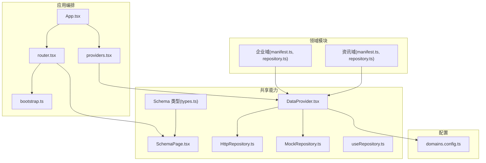
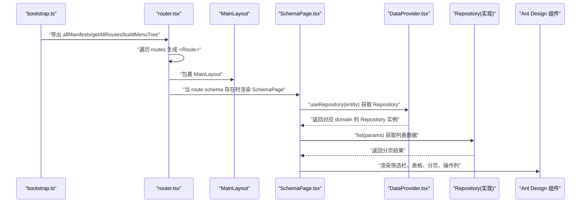
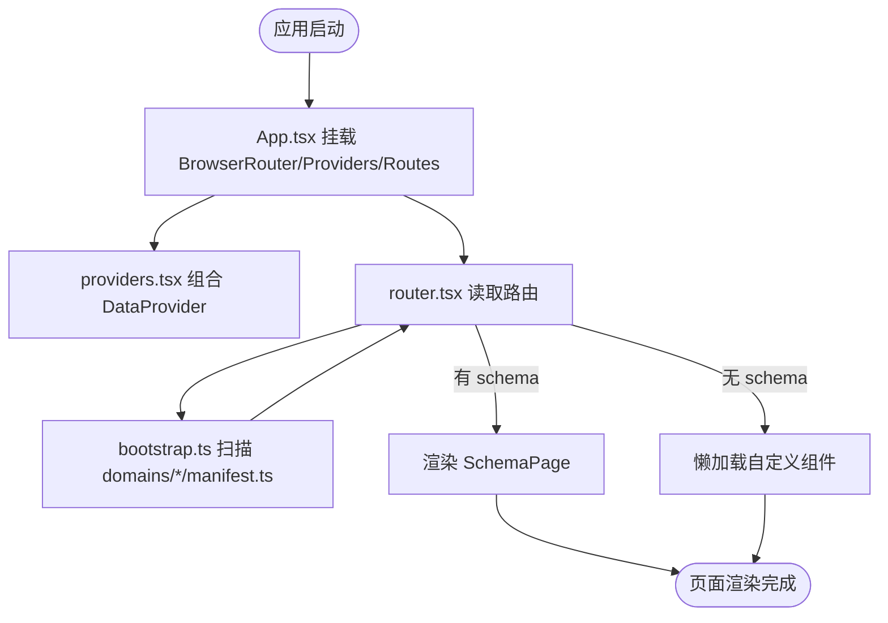
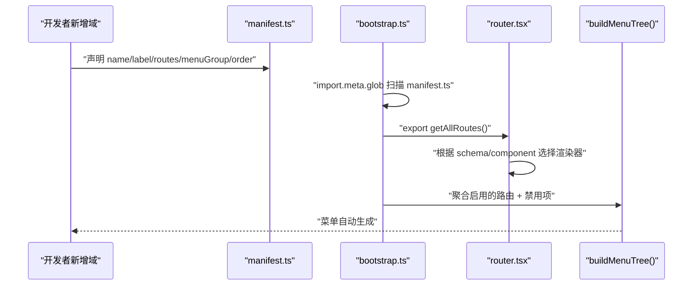
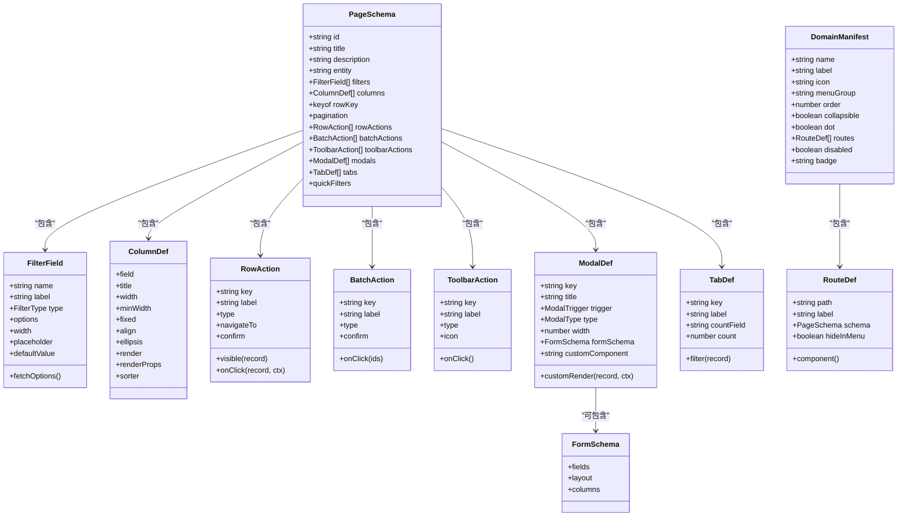
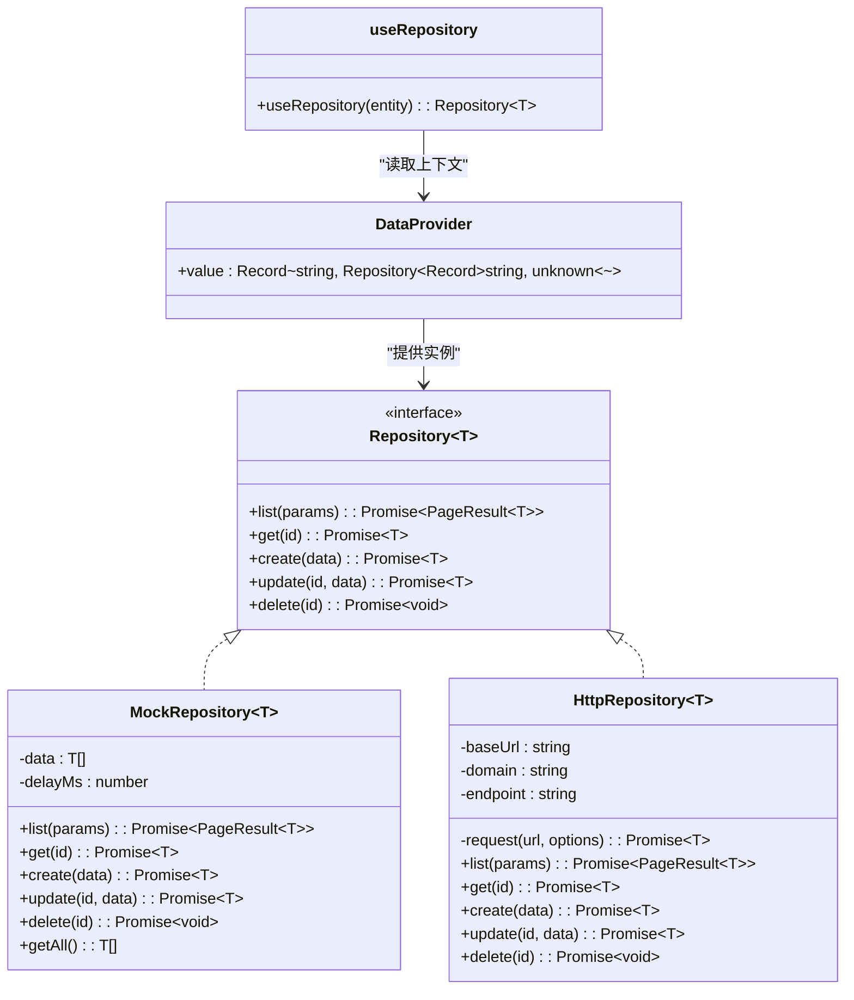
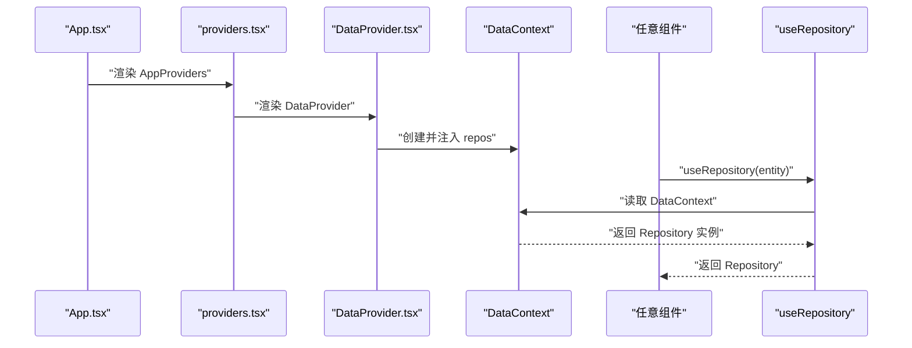
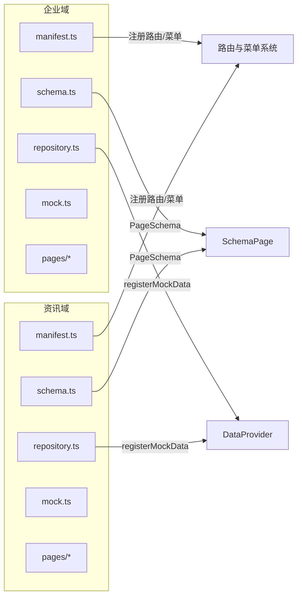
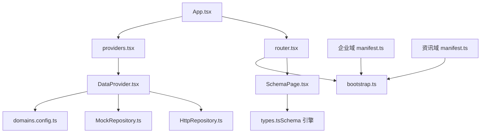

# 架构设计

<cite>
**本文引用的文件**   
- [App.tsx](file://hj-admin/src/app/App.tsx)
- [bootstrap.ts](file://hj-admin/src/app/bootstrap.ts)
- [providers.tsx](file://hj-admin/src/app/providers.tsx)
- [router.tsx](file://hj-admin/src/app/router.tsx)
- [types.ts（Schema 引擎）](file://hj-admin/src/shared/schema-engine/types.ts)
- [SchemaPage.tsx](file://hj-admin/src/shared/schema-engine/SchemaPage.tsx)
- [DataProvider.tsx](file://hj-admin/src/shared/data/DataProvider.tsx)
- [HttpRepository.ts](file://hj-admin/src/shared/data/HttpRepository.ts)
- [MockRepository.ts](file://hj-admin/src/shared/data/MockRepository.ts)
- [useRepository.ts](file://hj-admin/src/shared/data/useRepository.ts)
- [domains.config.ts](file://hj-admin/src/config/domains.config.ts)
- [manifest.ts（企业域）](file://hj-admin/src/domains/enterprise/manifest.ts)
- [repository.ts（企业域）](file://hj-admin/src/domains/enterprise/repository.ts)
- [manifest.ts（资讯域）](file://hj-admin/src/domains/news/manifest.ts)
- [repository.ts（资讯域）](file://hj-admin/src/domains/news/repository.ts)
</cite>

## 目录
1. [引言](#引言)
2. [项目结构](#项目结构)
3. [核心组件](#核心组件)
4. [架构总览](#架构总览)
5. [详细组件分析](#详细组件分析)
6. [依赖关系分析](#依赖关系分析)
7. [性能考量](#性能考量)
8. [故障排查指南](#故障排查指南)
9. [结论](#结论)
10. [附录](#附录)

## 引言
本文件面向“氢界大数据平台”的运营管理后台，系统性阐述其架构设计与实现要点。文档围绕以下目标展开：
- Schema 驱动架构与领域驱动设计（DDD）理念在工程中的落地方式
- Repository 模式对数据访问的统一抽象
- 应用启动流程：从 App.tsx 到 bootstrap.ts 再到 providers.tsx 的初始化链路
- 路由系统：自动发现、自动路由生成与懒加载策略
- Provider 模式：全局状态管理与上下文传递
- 架构图与数据流图：展示关键交互路径
- 技术决策与权衡：解释为何如此设计，以及后续演进建议

## 项目结构
整体采用“按领域划分 + 共享能力下沉”的组织方式：
- app：应用编排层（入口、引导、Provider 组合、路由）
- shared：跨领域共享能力（Schema 引擎、数据访问抽象与实现、通用 Hook）
- domains：按业务领域划分的模块（每个领域包含清单 manifest、Schema、页面、仓库绑定等）
- config：配置中心（如域的数据源模式）
- layouts：布局组件（主布局、侧边栏、顶栏）
- pages：少量非 Schema 驱动的独立页面

图表来源
- [App.tsx:1-21](file://hj-admin/src/app/App.tsx#L1-L21)
- [bootstrap.ts:1-104](file://hj-admin/src/app/bootstrap.ts#L1-L104)
- [providers.tsx:1-14](file://hj-admin/src/app/providers.tsx#L1-L14)
- [router.tsx:1-58](file://hj-admin/src/app/router.tsx#L1-L58)
- [types.ts（Schema 引擎）:1-216](file://hj-admin/src/shared/schema-engine/types.ts#L1-L216)
- [SchemaPage.tsx:1-226](file://hj-admin/src/shared/schema-engine/SchemaPage.tsx#L1-L226)
- [DataProvider.tsx:1-44](file://hj-admin/src/shared/data/DataProvider.tsx#L1-L44)
- [HttpRepository.ts:1-70](file://hj-admin/src/shared/data/HttpRepository.ts#L1-L70)
- [MockRepository.ts:1-101](file://hj-admin/src/shared/data/MockRepository.ts#L1-L101)
- [useRepository.ts:1-24](file://hj-admin/src/shared/data/useRepository.ts#L1-L24)
- [domains.config.ts:1-18](file://hj-admin/src/config/domains.config.ts#L1-L18)
- [manifest.ts（企业域）:1-20](file://hj-admin/src/domains/enterprise/manifest.ts#L1-L20)
- [repository.ts（企业域）:1-6](file://hj-admin/src/domains/enterprise/repository.ts#L1-L6)
- [manifest.ts（资讯域）:1-42](file://hj-admin/src/domains/news/manifest.ts#L1-L42)
- [repository.ts（资讯域）:1-11](file://hj-admin/src/domains/news/repository.ts#L1-L11)

章节来源
- [App.tsx:1-21](file://hj-admin/src/app/App.tsx#L1-L21)
- [bootstrap.ts:1-104](file://hj-admin/src/app/bootstrap.ts#L1-L104)
- [providers.tsx:1-14](file://hj-admin/src/app/providers.tsx#L1-L14)
- [router.tsx:1-58](file://hj-admin/src/app/router.tsx#L1-L58)

## 核心组件
- 应用编排层
  - App.tsx：根组件，仅负责挂载 BrowserRouter、Provider 链与路由，不包含业务逻辑
  - providers.tsx：统一组合所有全局 Provider（当前为 DataProvider），简化上层引用
  - router.tsx：基于 bootstrap 发现的域清单自动生成路由；支持 Schema 渲染与自定义组件懒加载
  - bootstrap.ts：构建时扫描所有域的 manifest.ts，汇总路由并生成菜单树
- 共享能力层
  - Schema 类型定义：定义筛选、列、行操作、批量操作、工具栏、弹窗、Tab、表单、完整页面 Schema、域清单、路由定义等
  - SchemaPage：根据 PageSchema 自动渲染筛选栏、Tab、表格、分页、操作列等
  - DataProvider：按域注册 Repository 实例，提供 useRepository Hook 供任意组件获取
  - HttpRepository / MockRepository：统一实现 Repository 接口，分别对接后端 API 与内存模拟
  - useRepository：从上下文获取指定 entity 的 Repository 实例
- 领域模块
  - 每个领域通过 manifest.ts 声明路由、菜单分组、排序、是否隐藏等
  - 通过 repository.ts 将 mock 数据注册到 DataProvider（开发期）
  - schema.ts 定义该领域的 PageSchema，驱动 SchemaPage 渲染

章节来源
- [types.ts（Schema 引擎）:1-216](file://hj-admin/src/shared/schema-engine/types.ts#L1-L216)
- [SchemaPage.tsx:1-226](file://hj-admin/src/shared/schema-engine/SchemaPage.tsx#L1-L226)
- [DataProvider.tsx:1-44](file://hj-admin/src/shared/data/DataProvider.tsx#L1-L44)
- [HttpRepository.ts:1-70](file://hj-admin/src/shared/data/HttpRepository.ts#L1-L70)
- [MockRepository.ts:1-101](file://hj-admin/src/shared/data/MockRepository.ts#L1-L101)
- [useRepository.ts:1-24](file://hj-admin/src/shared/data/useRepository.ts#L1-L24)
- [manifest.ts（企业域）:1-20](file://hj-admin/src/domains/enterprise/manifest.ts#L1-L20)
- [repository.ts（企业域）:1-6](file://hj-admin/src/domains/enterprise/repository.ts#L1-L6)
- [manifest.ts（资讯域）:1-42](file://hj-admin/src/domains/news/manifest.ts#L1-L42)
- [repository.ts（资讯域）:1-11](file://hj-admin/src/domains/news/repository.ts#L1-L11)

## 架构总览
下图展示了从应用启动到页面渲染的关键路径，包括自动发现、Provider 注入、路由生成与 Schema 渲染。

图表来源
- [bootstrap.ts:1-104](file://hj-admin/src/app/bootstrap.ts#L1-L104)
- [router.tsx:1-58](file://hj-admin/src/app/router.tsx#L1-L58)
- [SchemaPage.tsx:1-226](file://hj-admin/src/shared/schema-engine/SchemaPage.tsx#L1-L226)
- [DataProvider.tsx:1-44](file://hj-admin/src/shared/data/DataProvider.tsx#L1-L44)
- [HttpRepository.ts:1-70](file://hj-admin/src/shared/data/HttpRepository.ts#L1-L70)
- [MockRepository.ts:1-101](file://hj-admin/src/shared/data/MockRepository.ts#L1-L101)

## 详细组件分析

### 应用启动与初始化流程
- App.tsx 作为根组件，仅做编排：挂载 BrowserRouter、AppProviders、AppRoutes
- providers.tsx 组合全局 Provider（当前为 DataProvider），集中管理上下文
- bootstrap.ts 使用 Vite 的 import.meta.glob 在构建时扫描所有 domains/*/manifest.ts，提取 DomainManifest 并按 order 排序，同时提供 getAllRoutes 与 buildMenuTree 两个工具函数
- router.tsx 调用 getAllRoutes 生成路由表；若 route.schema 存在则渲染 SchemaPage，否则懒加载自定义组件

图表来源
- [App.tsx:1-21](file://hj-admin/src/app/App.tsx#L1-L21)
- [providers.tsx:1-14](file://hj-admin/src/app/providers.tsx#L1-L14)
- [bootstrap.ts:1-104](file://hj-admin/src/app/bootstrap.ts#L1-L104)
- [router.tsx:1-58](file://hj-admin/src/app/router.tsx#L1-L58)

章节来源
- [App.tsx:1-21](file://hj-admin/src/app/App.tsx#L1-L21)
- [providers.tsx:1-14](file://hj-admin/src/app/providers.tsx#L1-L14)
- [bootstrap.ts:1-104](file://hj-admin/src/app/bootstrap.ts#L1-L104)
- [router.tsx:1-58](file://hj-admin/src/app/router.tsx#L1-L58)

### 路由系统与自动发现机制
- 自动发现：bootstrap.ts 通过 import.meta.glob 扫描所有域的 manifest.ts，合并为 allManifests，并按 order 排序
- 路由生成：router.tsx 调用 getAllRoutes 遍历 routes，动态创建 Route；若存在 schema，则渲染 SchemaPage，否则懒加载 component
- 菜单生成：buildMenuTree 根据 manifest 的 menuGroup 分组，结合硬编码的禁用项，输出最终菜单树
- 懒加载策略：对自定义组件使用 React.lazy + Suspense，提升首屏性能

图表来源
- [bootstrap.ts:1-104](file://hj-admin/src/app/bootstrap.ts#L1-L104)
- [router.tsx:1-58](file://hj-admin/src/app/router.tsx#L1-L58)
- [manifest.ts（企业域）:1-20](file://hj-admin/src/domains/enterprise/manifest.ts#L1-L20)
- [manifest.ts（资讯域）:1-42](file://hj-admin/src/domains/news/manifest.ts#L1-L42)

章节来源
- [bootstrap.ts:1-104](file://hj-admin/src/app/bootstrap.ts#L1-L104)
- [router.tsx:1-58](file://hj-admin/src/app/router.tsx#L1-L58)
- [manifest.ts（企业域）:1-20](file://hj-admin/src/domains/enterprise/manifest.ts#L1-L20)
- [manifest.ts（资讯域）:1-42](file://hj-admin/src/domains/news/manifest.ts#L1-L42)

### Schema 驱动架构与页面渲染
- 类型基石：types.ts 定义了完整的 Schema 体系，包括筛选、列、行操作、批量操作、工具栏、弹窗、Tab、表单、完整页面 Schema、域清单、路由定义、操作上下文等
- 渲染器：SchemaPage 根据 PageSchema 自动渲染筛选栏、Tab、表格、分页、操作列等，并通过 renderWithRegistry 支持字符串渲染器或自定义函数
- 数据联动：通过 useSchemaPage Hook 维护筛选、分页、Tab、选中行等状态，并与 Repository 交互

图表来源
- [types.ts（Schema 引擎）:1-216](file://hj-admin/src/shared/schema-engine/types.ts#L1-L216)

章节来源
- [types.ts（Schema 引擎）:1-216](file://hj-admin/src/shared/schema-engine/types.ts#L1-L216)
- [SchemaPage.tsx:1-226](file://hj-admin/src/shared/schema-engine/SchemaPage.tsx#L1-L226)

### 数据访问层（Repository 模式）
- 统一契约：Repository<T> 定义 list/get/create/update/delete 五个方法，QueryParams/PageResult 定义查询参数与分页结果
- 实现分离：
  - MockRepository：内存过滤/分页/排序，模拟网络延迟，返回 Promise，便于前端开发与联调
  - HttpRepository：基于 fetch 封装，构造 URLSearchParams，映射 sort/filter/search 等参数，统一错误处理
- 上下文注入：DataProvider 根据 domains.config.ts 中各域的 mode 决定使用 MockRepository 还是 HttpRepository，并通过 Context 暴露给 useRepository
- 使用方式：SchemaPage 通过 useRepository(entity) 获取对应域的数据访问实例，再调用 list 等方法

图表来源
- [types.ts（数据层抽象）:1-36](file://hj-admin/src/shared/data/types.ts#L1-L36)
- [MockRepository.ts:1-101](file://hj-admin/src/shared/data/MockRepository.ts#L1-L101)
- [HttpRepository.ts:1-70](file://hj-admin/src/shared/data/HttpRepository.ts#L1-L70)
- [DataProvider.tsx:1-44](file://hj-admin/src/shared/data/DataProvider.tsx#L1-L44)
- [useRepository.ts:1-24](file://hj-admin/src/shared/data/useRepository.ts#L1-L24)

章节来源
- [types.ts（数据层抽象）:1-36](file://hj-admin/src/shared/data/types.ts#L1-L36)
- [MockRepository.ts:1-101](file://hj-admin/src/shared/data/MockRepository.ts#L1-L101)
- [HttpRepository.ts:1-70](file://hj-admin/src/shared/data/HttpRepository.ts#L1-L70)
- [DataProvider.tsx:1-44](file://hj-admin/src/shared/data/DataProvider.tsx#L1-L44)
- [useRepository.ts:1-24](file://hj-admin/src/shared/data/useRepository.ts#L1-L24)

### Provider 模式与全局状态管理
- 单一入口：providers.tsx 组合 DataProvider，App.tsx 只需引用一个 AppProviders
- 上下文分发：DataProvider 根据 domains.config.ts 为每个域创建对应的 Repository 实例，并通过 Context.Provider 暴露
- 便捷获取：useRepository Hook 允许任意组件通过 entity 名称获取对应 Repository，未找到时返回空操作的 fallback，避免运行时崩溃

图表来源
- [App.tsx:1-21](file://hj-admin/src/app/App.tsx#L1-L21)
- [providers.tsx:1-14](file://hj-admin/src/app/providers.tsx#L1-L14)
- [DataProvider.tsx:1-44](file://hj-admin/src/shared/data/DataProvider.tsx#L1-L44)
- [useRepository.ts:1-24](file://hj-admin/src/shared/data/useRepository.ts#L1-L24)

章节来源
- [providers.tsx:1-14](file://hj-admin/src/app/providers.tsx#L1-L14)
- [DataProvider.tsx:1-44](file://hj-admin/src/shared/data/DataProvider.tsx#L1-L44)
- [useRepository.ts:1-24](file://hj-admin/src/shared/data/useRepository.ts#L1-L24)

### 领域驱动设计与模块化组织
- 领域边界：每个领域（如 enterprise、news）拥有独立的 manifest.ts、schema.ts、pages、repository.ts、mock.ts、types.ts 等
- 清单即契约：manifest.ts 作为“身份证”，声明路由、菜单分组、排序、图标、是否隐藏等，是自动发现与菜单生成的依据
- 数据绑定：repository.ts 在导入时触发 registerMockData，将领域数据注册到 DataProvider，使 SchemaPage 可直接通过 entity 名称访问
- 扩展性：新增领域仅需添加 manifest.ts 与相关资源，无需修改路由或菜单代码

图表来源
- [manifest.ts（企业域）:1-20](file://hj-admin/src/domains/enterprise/manifest.ts#L1-L20)
- [repository.ts（企业域）:1-6](file://hj-admin/src/domains/enterprise/repository.ts#L1-L6)
- [manifest.ts（资讯域）:1-42](file://hj-admin/src/domains/news/manifest.ts#L1-L42)
- [repository.ts（资讯域）:1-11](file://hj-admin/src/domains/news/repository.ts#L1-L11)
- [bootstrap.ts:1-104](file://hj-admin/src/app/bootstrap.ts#L1-L104)
- [DataProvider.tsx:1-44](file://hj-admin/src/shared/data/DataProvider.tsx#L1-L44)
- [SchemaPage.tsx:1-226](file://hj-admin/src/shared/schema-engine/SchemaPage.tsx#L1-L226)

章节来源
- [manifest.ts（企业域）:1-20](file://hj-admin/src/domains/enterprise/manifest.ts#L1-L20)
- [repository.ts（企业域）:1-6](file://hj-admin/src/domains/enterprise/repository.ts#L1-L6)
- [manifest.ts（资讯域）:1-42](file://hj-admin/src/domains/news/manifest.ts#L1-L42)
- [repository.ts（资讯域）:1-11](file://hj-admin/src/domains/news/repository.ts#L1-L11)

## 依赖关系分析
- 低耦合高内聚：app 层仅依赖 shared 与 domains 的公开接口；shared 不感知具体领域细节
- 自动发现降低耦合：bootstrap.ts 通过 glob 扫描 manifest.ts，减少手动注册带来的耦合
- 数据访问解耦：SchemaPage 仅依赖 Repository 接口，不关心具体实现（Mock/HTTP）
- 配置驱动：domains.config.ts 控制各域数据源模式，切换时无需改动页面与 Schema

图表来源
- [App.tsx:1-21](file://hj-admin/src/app/App.tsx#L1-L21)
- [providers.tsx:1-14](file://hj-admin/src/app/providers.tsx#L1-L14)
- [router.tsx:1-58](file://hj-admin/src/app/router.tsx#L1-L58)
- [bootstrap.ts:1-104](file://hj-admin/src/app/bootstrap.ts#L1-L104)
- [SchemaPage.tsx:1-226](file://hj-admin/src/shared/schema-engine/SchemaPage.tsx#L1-L226)
- [DataProvider.tsx:1-44](file://hj-admin/src/shared/data/DataProvider.tsx#L1-L44)
- [domains.config.ts:1-18](file://hj-admin/src/config/domains.config.ts#L1-L18)
- [MockRepository.ts:1-101](file://hj-admin/src/shared/data/MockRepository.ts#L1-L101)
- [HttpRepository.ts:1-70](file://hj-admin/src/shared/data/HttpRepository.ts#L1-L70)
- [manifest.ts（企业域）:1-20](file://hj-admin/src/domains/enterprise/manifest.ts#L1-L20)
- [manifest.ts（资讯域）:1-42](file://hj-admin/src/domains/news/manifest.ts#L1-L42)

章节来源
- [bootstrap.ts:1-104](file://hj-admin/src/app/bootstrap.ts#L1-L104)
- [router.tsx:1-58](file://hj-admin/src/app/router.tsx#L1-L58)
- [DataProvider.tsx:1-44](file://hj-admin/src/shared/data/DataProvider.tsx#L1-L44)
- [domains.config.ts:1-18](file://hj-admin/src/config/domains.config.ts#L1-L18)

## 性能考量
- 懒加载：对非 Schema 的自定义组件使用 React.lazy + Suspense，按需加载，减小首屏体积
- 构建时扫描：bootstrap.ts 使用 import.meta.glob 在构建阶段收集 manifest，避免运行时代码开销
- 内存模拟：MockRepository 提供稳定的异步行为与延迟，便于测试与体验一致
- 渲染优化：SchemaPage 内部使用 useMemo 缓存列定义与计算结果，减少重渲染
- 建议：
  - 对大型页面进一步拆分子组件，配合 React.memo 与 useCallback 优化
  - 对表格大数据量考虑虚拟滚动
  - 对复杂筛选条件引入服务端分页与过滤，减轻前端压力

[本节为通用指导，不涉及具体文件分析]

## 故障排查指南
- 路由未生效
  - 检查对应域的 manifest.ts 是否正确导出且被 bootstrap.ts 扫描到
  - 确认 path、label、menuGroup、order 等字段是否符合约定
- 页面显示“页面未配置”
  - 若 route 未提供 schema 也未提供 component，会显示占位提示
  - 确保 route 至少提供 schema 或 component 之一
- 数据为空或报错
  - 检查 domains.config.ts 中对应域的 mode 是否与期望一致
  - 若使用 mock，确认 repository.ts 已正确调用 registerMockData
  - 若使用 http，检查后端 API 地址与响应格式是否符合 HttpRepository 预期
- 菜单缺失或顺序异常
  - 检查 manifest.ts 的 menuGroup 与 order 设置
  - 确认 buildMenuTree 的分组顺序与禁用项配置

章节来源
- [router.tsx:1-58](file://hj-admin/src/app/router.tsx#L1-L58)
- [bootstrap.ts:1-104](file://hj-admin/src/app/bootstrap.ts#L1-L104)
- [DataProvider.tsx:1-44](file://hj-admin/src/shared/data/DataProvider.tsx#L1-L44)
- [HttpRepository.ts:1-70](file://hj-admin/src/shared/data/HttpRepository.ts#L1-L70)
- [MockRepository.ts:1-101](file://hj-admin/src/shared/data/MockRepository.ts#L1-L101)
- [domains.config.ts:1-18](file://hj-admin/src/config/domains.config.ts#L1-L18)

## 结论
本架构以 Schema 驱动为核心，结合领域驱动与 Repository 模式，实现了“写配置即可生成页面”的高效开发范式。通过自动发现与懒加载，系统在可扩展性与性能之间取得良好平衡。Provider 模式与上下文传递使得全局状态管理简洁清晰。未来可在服务端分页、复杂筛选、权限控制等方面持续演进，进一步提升系统的健壮性与可维护性。

[本节为总结，不涉及具体文件分析]

## 附录
- 术语说明
  - 域（Domain）：按业务边界划分的模块集合，包含清单、Schema、页面、仓库绑定等
  - Schema：描述页面结构与行为的配置对象
  - Repository：数据访问抽象，屏蔽底层实现差异
  - Provider：React 上下文提供者，用于全局状态与依赖注入
- 最佳实践
  - 新增领域时优先完善 manifest.ts 与 schema.ts，保持路由与菜单自动生成
  - 尽量使用 Schema 驱动页面，减少重复样板代码
  - 在 domains.config.ts 中集中管理数据源模式，便于环境切换

[本节为补充信息，不涉及具体文件分析]