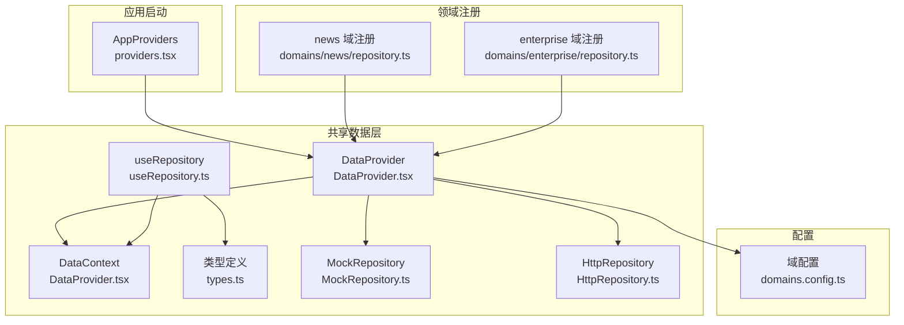
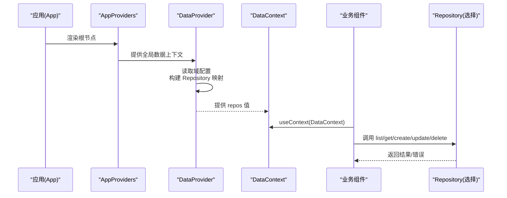
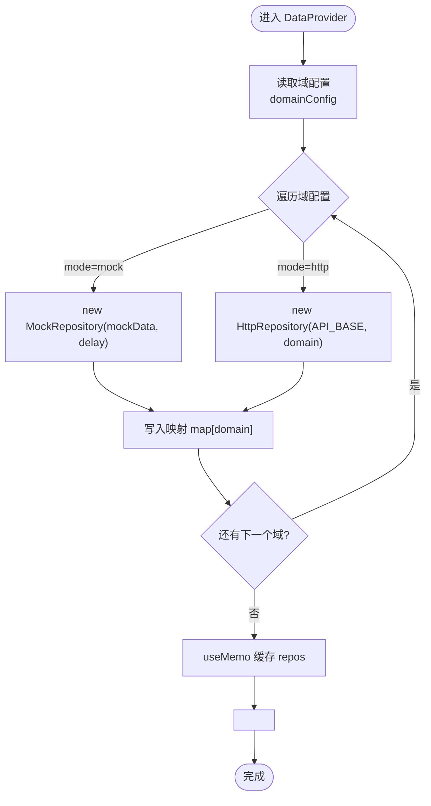
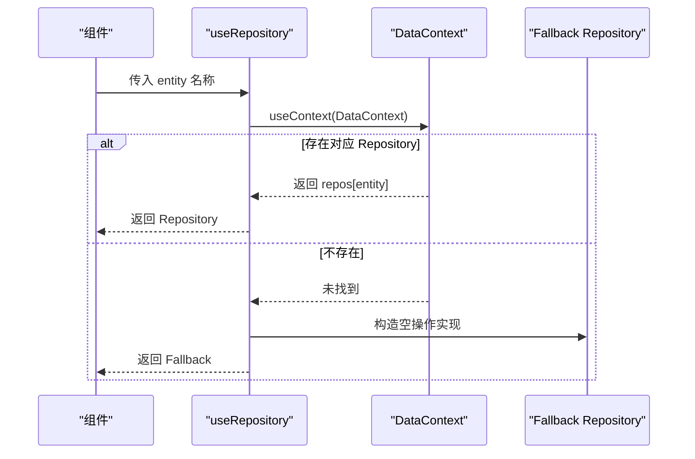
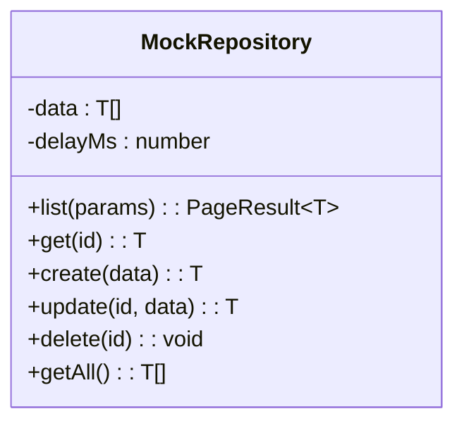
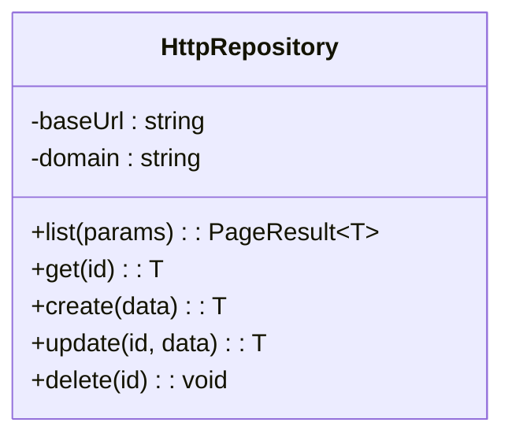
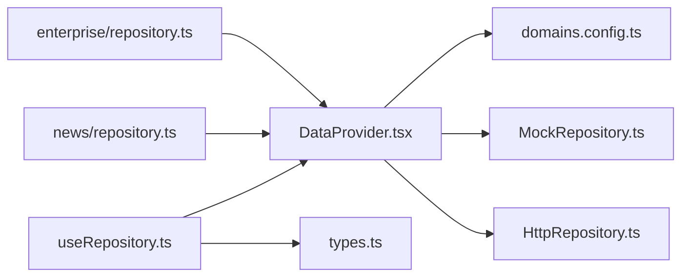

# 全局状态管理

<cite>
**本文引用的文件**   
- [DataProvider.tsx](file://hj-admin/src/shared/data/DataProvider.tsx)
- [HttpRepository.ts](file://hj-admin/src/shared/data/HttpRepository.ts)
- [MockRepository.ts](file://hj-admin/src/shared/data/MockRepository.ts)
- [types.ts](file://hj-admin/src/shared/data/types.ts)
- [useRepository.ts](file://hj-admin/src/shared/data/useRepository.ts)
- [providers.tsx](file://hj-admin/src/app/providers.tsx)
- [domains.config.ts](file://hj-admin/src/config/domains.config.ts)
- [repository.ts（资讯域）](file://hj-admin/src/domains/news/repository.ts)
- [repository.ts（企业域）](file://hj-admin/src/domains/enterprise/repository.ts)
</cite>

## 目录
1. [简介](#简介)
2. [项目结构](#项目结构)
3. [核心组件](#核心组件)
4. [架构总览](#架构总览)
5. [详细组件分析](#详细组件分析)
6. [依赖关系分析](#依赖关系分析)
7. [性能与优化](#性能与优化)
8. [最佳实践](#最佳实践)
9. [故障排查指南](#故障排查指南)
10. [结论](#结论)

## 简介
本文件面向氢界大数据平台的前端全局状态与数据访问层，聚焦基于 React Context 的 DataProvider 实现原理、Repository 实例注册与生命周期、DataContext 的作用域与 Provider 模式应用、useMemo 的性能优化策略，以及 MockRepository 与 HttpRepository 的选择机制与环境切换。文档同时给出全局状态的最佳实践（初始化、错误处理、性能监控），并提供具体使用场景与代码片段路径，帮助开发者快速上手并稳定扩展。

## 项目结构
全局状态与数据访问相关的关键位置如下：
- 共享数据层：shared/data 下包含上下文、仓库实现、类型定义与 Hook
- 配置层：config/domains.config.ts 集中声明各域的数据源模式
- 应用启动层：app/providers.tsx 组合全局 Provider
- 领域层：domains/*/repository.ts 负责将领域 mock 数据注册到全局

图表来源
- [providers.tsx:1-14](file://hj-admin/src/app/providers.tsx#L1-L14)
- [DataProvider.tsx:1-44](file://hj-admin/src/shared/data/DataProvider.tsx#L1-L44)
- [domains.config.ts:1-18](file://hj-admin/src/config/domains.config.ts#L1-L18)
- [repository.ts（资讯域）:1-11](file://hj-admin/src/domains/news/repository.ts#L1-L11)
- [repository.ts（企业域）:1-6](file://hj-admin/src/domains/enterprise/repository.ts#L1-L6)

章节来源
- [providers.tsx:1-14](file://hj-admin/src/app/providers.tsx#L1-L14)
- [DataProvider.tsx:1-44](file://hj-admin/src/shared/data/DataProvider.tsx#L1-L44)
- [domains.config.ts:1-18](file://hj-admin/src/config/domains.config.ts#L1-L18)
- [repository.ts（资讯域）:1-11](file://hj-admin/src/domains/news/repository.ts#L1-L11)
- [repository.ts（企业域）:1-6](file://hj-admin/src/domains/enterprise/repository.ts#L1-L6)

## 核心组件
- DataProvider：创建并维护一个按 domain 映射的 Repository 实例集合，通过 React Context 向下提供；内部使用 useMemo 缓存对象引用，避免不必要的重渲染。
- DataContext：React Context 对象，承载 Repository 映射表。
- useRepository：Hook，从 Context 中获取指定 entity 的 Repository 实例；若未找到则返回空操作 fallback，避免运行时崩溃。
- MockRepository：内存中的 Repository 实现，支持分页、排序、筛选、关键词搜索，并模拟网络延迟，便于开发体验与真实 API 一致。
- HttpRepository：HTTP 版本的 Repository 实现，封装 fetch 请求，统一构造查询参数与 RESTful 接口调用。
- types：定义 QueryParams、PageResult、Repository 接口、DataSourceMode 与 DomainDataSourceConfig 等核心类型。
- domains.config.ts：集中声明每个域的数据源模式（mock/http），作为切换开关。
- 领域 repository.ts：在 bootstrap 阶段调用 registerMockData 将领域 mock 数据注入到全局注册表。

章节来源
- [DataProvider.tsx:1-44](file://hj-admin/src/shared/data/DataProvider.tsx#L1-L44)
- [useRepository.ts:1-24](file://hj-admin/src/shared/data/useRepository.ts#L1-L24)
- [MockRepository.ts:1-101](file://hj-admin/src/shared/data/MockRepository.ts#L1-L101)
- [HttpRepository.ts:1-70](file://hj-admin/src/shared/data/HttpRepository.ts#L1-L70)
- [types.ts:1-36](file://hj-admin/src/shared/data/types.ts#L1-L36)
- [domains.config.ts:1-18](file://hj-admin/src/config/domains.config.ts#L1-L18)
- [repository.ts（资讯域）:1-11](file://hj-admin/src/domains/news/repository.ts#L1-L11)
- [repository.ts（企业域）:1-6](file://hj-admin/src/domains/enterprise/repository.ts#L1-L6)

## 架构总览
下图展示了全局状态与数据访问的整体流程：应用启动时由 AppProviders 包裹 DataProvider；DataProvider 读取域配置，为每个域选择 MockRepository 或 HttpRepository，并通过 Context 暴露；业务组件通过 useRepository 获取对应域的 Repository 进行数据读写。

图表来源
- [providers.tsx:1-14](file://hj-admin/src/app/providers.tsx#L1-L14)
- [DataProvider.tsx:1-44](file://hj-admin/src/shared/data/DataProvider.tsx#L1-L44)
- [useRepository.ts:1-24](file://hj-admin/src/shared/data/useRepository.ts#L1-L24)
- [domains.config.ts:1-18](file://hj-admin/src/config/domains.config.ts#L1-L18)

## 详细组件分析

### DataProvider 与 DataContext
- 作用域与 Provider 模式
  - DataProvider 在应用顶层提供 Repository 映射表，所有子树均可通过 useContext 消费。
  - 通过 createContext 创建 DataContext，并在 DataProvider 中以 Provider value 形式注入。
- Repository 实例的注册与生命周期
  - 在 DataProvider 的 useMemo 中遍历域配置，按 mode 选择 MockRepository 或 HttpRepository，生成以 domain 为键的映射。
  - 该映射在组件生命周期内保持不变，避免重复创建实例导致的性能损耗。
- 性能优化
  - 使用 useMemo 缓存 repos 对象引用，减少因父级更新引发的子组件不必要重渲染。
- 环境切换与配置管理
  - 通过读取 domains.config.ts 中的 domainConfig，决定每个域使用 mock 还是 http。
  - 新增域只需在配置中添加条目，无需改动业务逻辑。

图表来源
- [DataProvider.tsx:1-44](file://hj-admin/src/shared/data/DataProvider.tsx#L1-L44)
- [domains.config.ts:1-18](file://hj-admin/src/config/domains.config.ts#L1-L18)

章节来源
- [DataProvider.tsx:1-44](file://hj-admin/src/shared/data/DataProvider.tsx#L1-L44)
- [domains.config.ts:1-18](file://hj-admin/src/config/domains.config.ts#L1-L18)

### useRepository Hook
- 功能
  - 从 DataContext 中取出指定 entity 的 Repository 实例。
  - 若未找到，返回空操作的 fallback Repository，避免运行时崩溃，并发出警告提示。
- 使用方式
  - 在任意组件中调用 useRepository('news') 即可获取 news 域的 Repository。
- 注意事项
  - 确保 entity 名称与 domain 配置一致，否则将触发 fallback。

图表来源
- [useRepository.ts:1-24](file://hj-admin/src/shared/data/useRepository.ts#L1-L24)
- [DataProvider.tsx:1-44](file://hj-admin/src/shared/data/DataProvider.tsx#L1-L44)

章节来源
- [useRepository.ts:1-24](file://hj-admin/src/shared/data/useRepository.ts#L1-L24)

### MockRepository
- 能力
  - 内存过滤、分页、排序、关键词搜索，模拟网络延迟，返回 Promise，使前端体验与真实 API 一致。
  - 提供 getAll 方法用于 Schema 页面的 Tab 计数等场景。
- 复杂度
  - list 的时间复杂度主要取决于数据量 N 与过滤条件数量 M，近似 O(N·M)。
- 适用场景
  - 开发联调、演示、无后端时的完整功能验证。

图表来源
- [MockRepository.ts:1-101](file://hj-admin/src/shared/data/MockRepository.ts#L1-L101)

章节来源
- [MockRepository.ts:1-101](file://hj-admin/src/shared/data/MockRepository.ts#L1-L101)

### HttpRepository
- 能力
  - 封装 fetch 请求，统一 Content-Type 与错误处理。
  - 将 QueryParams 转换为 URLSearchParams，支持分页、排序、筛选与关键词搜索。
  - 提供标准 CRUD 方法：list、get、create、update、delete。
- 错误处理
  - 当 response.ok 为 false 时抛出错误，便于上层捕获与展示。
- 适用场景
  - 生产环境对接后端 API。

图表来源
- [HttpRepository.ts:1-70](file://hj-admin/src/shared/data/HttpRepository.ts#L1-L70)

章节来源
- [HttpRepository.ts:1-70](file://hj-admin/src/shared/data/HttpRepository.ts#L1-L70)

### 类型定义
- QueryParams：分页、筛选、排序、关键词搜索的统一参数结构。
- PageResult：分页结果的标准结构。
- Repository：数据访问层的统一契约，约束 list/get/create/update/delete 的签名。
- DataSourceMode / DomainDataSourceConfig：域数据源模式与配置的类型定义。

章节来源
- [types.ts:1-36](file://hj-admin/src/shared/data/types.ts#L1-L36)

### 领域数据注册
- 目的
  - 在应用启动阶段，将各领域的 mock 数据注册到全局注册表，供 DataProvider 构建 MockRepository 时使用。
- 方式
  - 在各域的 repository.ts 中调用 registerMockData(domainName, data)，将数据注入。
- 示例
  - 资讯域与企业域分别注册了各自的数据集。

章节来源
- [repository.ts（资讯域）:1-11](file://hj-admin/src/domains/news/repository.ts#L1-L11)
- [repository.ts（企业域）:1-6](file://hj-admin/src/domains/enterprise/repository.ts#L1-L6)
- [DataProvider.tsx:1-44](file://hj-admin/src/shared/data/DataProvider.tsx#L1-L44)

## 依赖关系分析
- 耦合与内聚
  - DataProvider 与 domains.config.ts 低耦合，仅依赖配置项；对 MockRepository 与 HttpRepository 的依赖通过模式选择解耦。
  - useRepository 仅依赖 DataContext 与类型定义，职责单一。
- 外部依赖
  - HttpRepository 依赖浏览器原生 fetch API。
- 潜在循环依赖
  - 当前结构未发现循环依赖；领域注册仅在启动阶段执行，不影响运行期依赖。

图表来源
- [DataProvider.tsx:1-44](file://hj-admin/src/shared/data/DataProvider.tsx#L1-L44)
- [useRepository.ts:1-24](file://hj-admin/src/shared/data/useRepository.ts#L1-L24)
- [domains.config.ts:1-18](file://hj-admin/src/config/domains.config.ts#L1-L18)
- [repository.ts（资讯域）:1-11](file://hj-admin/src/domains/news/repository.ts#L1-L11)
- [repository.ts（企业域）:1-6](file://hj-admin/src/domains/enterprise/repository.ts#L1-L6)

章节来源
- [DataProvider.tsx:1-44](file://hj-admin/src/shared/data/DataProvider.tsx#L1-L44)
- [useRepository.ts:1-24](file://hj-admin/src/shared/data/useRepository.ts#L1-L24)
- [domains.config.ts:1-18](file://hj-admin/src/config/domains.config.ts#L1-L18)
- [repository.ts（资讯域）:1-11](file://hj-admin/src/domains/news/repository.ts#L1-L11)
- [repository.ts（企业域）:1-6](file://hj-admin/src/domains/enterprise/repository.ts#L1-L6)

## 性能与优化
- useMemo 缓存
  - DataProvider 使用 useMemo 构建 repos 映射，避免每次渲染重新创建 Repository 实例，显著降低子组件重渲染成本。
- 最小化 Context 值变化
  - 保持 repos 引用稳定，有利于细粒度订阅与选择性更新。
- 列表性能
  - MockRepository 的 list 在大数据量下可能产生较高 CPU 开销，建议：
    - 合理设置 pageSize，避免一次性加载过多数据。
    - 对复杂筛选与排序，考虑在后端实现或在内存中进行索引优化。
- 网络请求
  - HttpRepository 可结合请求去抖、重试、缓存策略进一步提升用户体验。

章节来源
- [DataProvider.tsx:1-44](file://hj-admin/src/shared/data/DataProvider.tsx#L1-L44)
- [MockRepository.ts:1-101](file://hj-admin/src/shared/data/MockRepository.ts#L1-L101)
- [HttpRepository.ts:1-70](file://hj-admin/src/shared/data/HttpRepository.ts#L1-L70)

## 最佳实践
- 状态初始化
  - 在应用启动阶段由各域的 repository.ts 调用 registerMockData 注入初始数据，保证 DataProvider 构建时可用。
- 错误处理
  - HttpRepository 在响应异常时抛出错误，建议在业务层捕获并展示友好提示。
  - useRepository 在未找到实体时返回空操作实现并发出警告，需检查 domain 配置是否遗漏。
- 性能监控
  - 可在 HttpRepository.request 中埋点记录耗时与失败率，辅助定位慢接口。
  - 对 MockRepository.list 增加统计信息（如过滤前后条数），便于评估筛选效果。
- 环境切换
  - 仅需修改 domains.config.ts 中对应域的 mode，即可在 mock 与 http 之间无缝切换，无需改动业务代码。
- 使用场景示例
  - 在页面中通过 useRepository('news') 获取新闻域仓库，调用 list({ page, pageSize, filters, sort, search }) 获取分页数据。
  - 在表单提交后调用 create/update/delete 完成数据变更，并结合 UI 刷新策略（如局部 refetch）提升交互体验。

章节来源
- [useRepository.ts:1-24](file://hj-admin/src/shared/data/useRepository.ts#L1-L24)
- [HttpRepository.ts:1-70](file://hj-admin/src/shared/data/HttpRepository.ts#L1-L70)
- [domains.config.ts:1-18](file://hj-admin/src/config/domains.config.ts#L1-L18)
- [repository.ts（资讯域）:1-11](file://hj-admin/src/domains/news/repository.ts#L1-L11)
- [repository.ts（企业域）:1-6](file://hj-admin/src/domains/enterprise/repository.ts#L1-L6)

## 故障排查指南
- 现象：useRepository 返回空操作实现
  - 原因：未在 domains.config.ts 中注册对应域，或未在领域 repository.ts 中注册 mock 数据。
  - 处理：检查 domain 名称拼写与注册顺序，确认 registerMockData 已调用。
- 现象：MockRepository.get 抛出“未找到”错误
  - 原因：传入的 id 不在内存数据中。
  - 处理：核对数据模型与 id 生成规则，确保 get 调用使用正确的标识符。
- 现象：HttpRepository 请求失败
  - 原因：后端不可用或返回非 2xx 状态码。
  - 处理：检查网络连通性、API 路径与参数格式，必要时添加重试与降级策略。
- 现象：列表筛选/排序不符合预期
  - 原因：QueryParams 字段名或值类型不匹配。
  - 处理：对照 types.ts 的定义，确保 filters、sort.field、sort.order 等字段正确传递。

章节来源
- [useRepository.ts:1-24](file://hj-admin/src/shared/data/useRepository.ts#L1-L24)
- [MockRepository.ts:1-101](file://hj-admin/src/shared/data/MockRepository.ts#L1-L101)
- [HttpRepository.ts:1-70](file://hj-admin/src/shared/data/HttpRepository.ts#L1-L70)
- [types.ts:1-36](file://hj-admin/src/shared/data/types.ts#L1-L36)

## 结论
本方案通过 React Context 与 Provider 模式实现了跨域的全局状态与数据访问抽象，借助统一的 Repository 接口屏蔽底层差异，并以配置驱动的方式灵活切换 mock 与 http 数据源。配合 useMemo 的引用稳定性与领域注册机制，系统在可扩展性与可维护性方面具备良好基础。建议在生产环境中逐步替换为 HttpRepository，并完善错误处理与性能监控，以获得更稳健的用户体验。