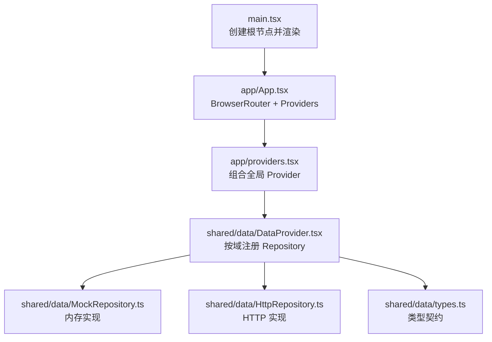
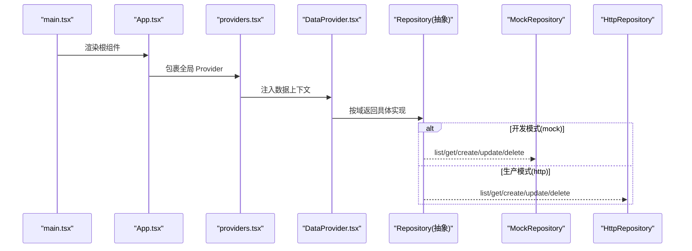
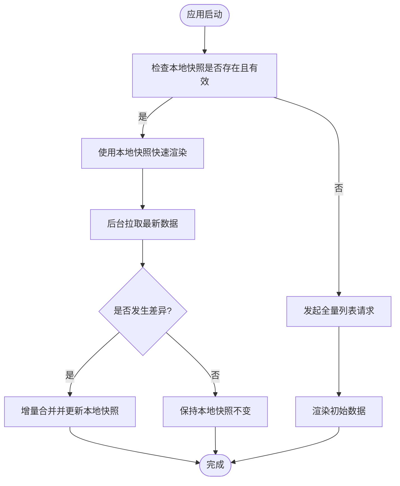
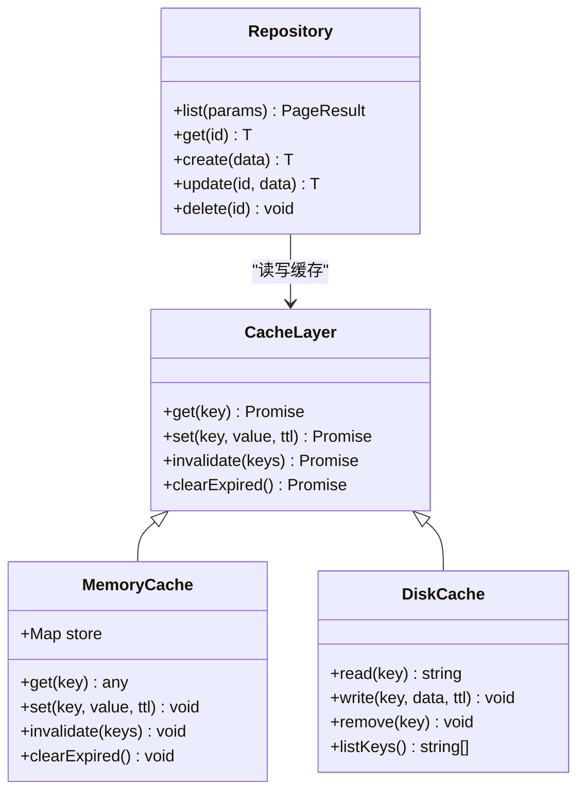
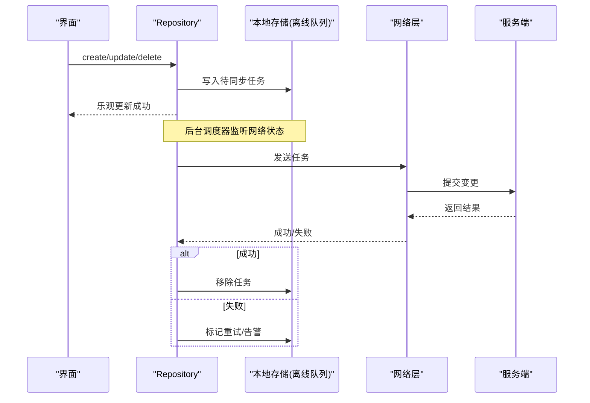
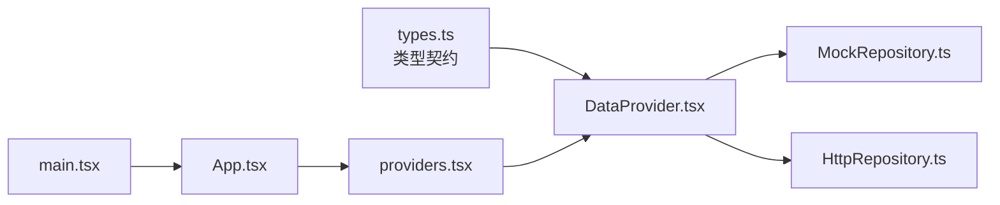

# 状态持久化

<cite>
**本文引用的文件**   
- [main.tsx](file://hj-admin/src/main.tsx)
- [App.tsx](file://hj-admin/src/app/App.tsx)
- [providers.tsx](file://hj-admin/src/app/providers.tsx)
- [DataProvider.tsx](file://hj-admin/src/shared/data/DataProvider.tsx)
- [HttpRepository.ts](file://hj-admin/src/shared/data/HttpRepository.ts)
- [MockRepository.ts](file://hj-admin/src/shared/data/MockRepository.ts)
- [types.ts](file://hj-admin/src/shared/data/types.ts)
</cite>

## 目录
1. [简介](#简介)
2. [项目结构](#项目结构)
3. [核心组件](#核心组件)
4. [架构总览](#架构总览)
5. [详细组件分析](#详细组件分析)
6. [依赖关系分析](#依赖关系分析)
7. [性能考虑](#性能考虑)
8. [故障排查指南](#故障排查指南)
9. [结论](#结论)
10. [附录](#附录)

## 简介
本文件面向“氢界大数据平台”的前端应用，聚焦“状态持久化”的设计与实现。当前代码库已提供数据访问抽象层（Repository）与两种实现：内存 Mock 与 HTTP 网络请求；同时通过 Provider 注入数据上下文。基于现有实现，本文给出本地存储策略、状态恢复机制、缓存策略、离线同步方案、版本迁移与性能优化的系统化文档，并明确哪些能力已在代码中落地、哪些为建议性扩展。

## 项目结构
前端采用 React + Vite 工程，入口渲染根组件，Provider 链统一注入数据上下文，各域通过 Repository 接口获取数据。关键路径如下：
- 应用启动：main.tsx -> App.tsx -> providers.tsx -> DataProvider
- 数据访问：DataProvider 根据域配置选择 MockRepository 或 HttpRepository
- 类型契约：types.ts 定义 QueryParams、PageResult、Repository 等

图示来源
- [main.tsx:1-11](file://hj-admin/src/main.tsx#L1-L11)
- [App.tsx:1-21](file://hj-admin/src/app/App.tsx#L1-L21)
- [providers.tsx:1-13](file://hj-admin/src/app/providers.tsx#L1-L13)
- [DataProvider.tsx:1-44](file://hj-admin/src/shared/data/DataProvider.tsx#L1-L44)
- [MockRepository.ts:1-101](file://hj-admin/src/shared/data/MockRepository.ts#L1-L101)
- [HttpRepository.ts:1-70](file://hj-admin/src/shared/data/HttpRepository.ts#L1-L70)
- [types.ts:1-36](file://hj-admin/src/shared/data/types.ts#L1-L36)

章节来源
- [main.tsx:1-11](file://hj-admin/src/main.tsx#L1-L11)
- [App.tsx:1-21](file://hj-admin/src/app/App.tsx#L1-L21)
- [providers.tsx:1-13](file://hj-admin/src/app/providers.tsx#L1-L13)
- [DataProvider.tsx:1-44](file://hj-admin/src/shared/data/DataProvider.tsx#L1-L44)
- [MockRepository.ts:1-101](file://hj-admin/src/shared/data/MockRepository.ts#L1-L101)
- [HttpRepository.ts:1-70](file://hj-admin/src/shared/data/HttpRepository.ts#L1-L70)
- [types.ts:1-36](file://hj-admin/src/shared/data/types.ts#L1-L36)

## 核心组件
- 数据上下文提供者（DataProvider）
  - 职责：按域装配 Repository 实例，暴露给子树使用。
  - 关键点：根据域配置决定使用 Mock 还是 HTTP 实现；API_BASE 固定为 /api/v1。
- 内存仓库（MockRepository）
  - 职责：在内存中维护数据，支持过滤、排序、分页、CRUD，模拟延迟。
  - 特点：无持久化，刷新即丢失；适合开发调试。
- HTTP 仓库（HttpRepository）
  - 职责：将 list/get/create/update/delete 映射到 RESTful API。
  - 特点：当前为占位实现，未包含本地缓存与离线队列。
- 类型契约（types.ts）
  - 职责：定义查询参数、分页结果、Repository 接口、域模式配置等。

章节来源
- [DataProvider.tsx:1-44](file://hj-admin/src/shared/data/DataProvider.tsx#L1-L44)
- [MockRepository.ts:1-101](file://hj-admin/src/shared/data/MockRepository.ts#L1-L101)
- [HttpRepository.ts:1-70](file://hj-admin/src/shared/data/HttpRepository.ts#L1-L70)
- [types.ts:1-36](file://hj-admin/src/shared/data/types.ts#L1-L36)

## 架构总览
下图展示从应用启动到数据访问的调用链，以及未来可接入的本地存储与缓存层位置。

图示来源
- [main.tsx:1-11](file://hj-admin/src/main.tsx#L1-L11)
- [App.tsx:1-21](file://hj-admin/src/app/App.tsx#L1-L21)
- [providers.tsx:1-13](file://hj-admin/src/app/providers.tsx#L1-L13)
- [DataProvider.tsx:1-44](file://hj-admin/src/shared/data/DataProvider.tsx#L1-L44)
- [MockRepository.ts:1-101](file://hj-admin/src/shared/data/MockRepository.ts#L1-L101)
- [HttpRepository.ts:1-70](file://hj-admin/src/shared/data/HttpRepository.ts#L1-L70)

## 详细组件分析

### 本地存储策略（localStorage/sessionStorage）
现状
- 当前代码未直接使用 localStorage 或 sessionStorage。
- 所有数据变更仅发生在内存（MockRepository）或通过网络（HttpRepository）。

建议实践
- 使用场景
  - localStorage：跨会话的用户偏好、主题、语言、上次筛选条件、分页游标等轻量设置。
  - sessionStorage：单次会话内的临时状态（如表单草稿、列表筛选器），关闭标签页自动清理。
- 序列化方法
  - 对象转字符串：JSON.stringify；读取时 JSON.parse 并做容错处理（try/catch）。
  - 大对象分片：超过单键限制时按前缀拆分，或使用 IndexedDB（后续可扩展）。
- 命名规范
  - 以“模块_实体_字段”形式组织键名，避免冲突。
  - 增加版本号后缀，便于迁移。
- 安全与隐私
  - 不存储敏感信息（密码、令牌等）。
  - 对可能包含用户输入的数据进行清洗与校验。

章节来源
- [MockRepository.ts:1-101](file://hj-admin/src/shared/data/MockRepository.ts#L1-L101)
- [HttpRepository.ts:1-70](file://hj-admin/src/shared/data/HttpRepository.ts#L1-L70)

### 状态恢复机制（启动重建与增量更新）
现状
- 应用启动流程不包含任何本地状态加载逻辑。
- 首次进入页面会触发一次 list 请求（Mock 或 HTTP）。

建议流程
- 启动阶段
  - 优先从 localStorage 读取“快照”（含数据与元信息：版本号、时间戳、签名）。
  - 若存在有效快照，先渲染内存态，再后台拉取最新数据做增量合并。
  - 若无效或缺失，直接走网络加载。
- 增量更新
  - 对比服务端返回的 total/list 与本地快照，计算新增/删除/修改。
  - 使用 id 作为主键进行 diff，避免全量替换导致闪烁。
- 一致性保障
  - 引入版本号与时间戳，必要时加入简单签名，防止脏读。
  - 失败回退：网络异常时使用本地快照保证可用。

[本节为概念性流程图，无需图示来源]

### 缓存策略（内存缓存、磁盘缓存、失效机制）
现状
- 内存缓存：MockRepository 在内存中维护数组，具备基本的增删改查。
- 磁盘缓存：未实现。
- 失效机制：未实现。

建议设计
- 分层缓存
  - L1 内存缓存：进程内 Map/Set，按域+查询条件作为键，TTL 短（秒级）。
  - L2 磁盘缓存：localStorage 或 IndexedDB，TTL 较长（分钟~小时级）。
  - L3 网络源：后端 API。
- 失效策略
  - TTL 过期：按 key 记录时间戳，命中前判断是否过期。
  - 写后失效：create/update/delete 后主动失效相关 key。
  - 版本驱动：当服务端返回更高版本时，强制刷新缓存。
- 并发控制
  - 相同请求去抖/合并，避免重复拉取。
  - 失败重试与退避。

[本节为概念类图，用于指导扩展，无需图示来源]

### 状态同步方案（离线管理与网络冲突解决）
现状
- 未实现离线队列与冲突解决。
- HttpRepository 为纯网络实现。

建议方案
- 离线优先
  - 写操作（create/update/delete）优先落盘（IndexedDB 或 localStorage），生成待同步任务。
  - 在线时批量提交，失败重试，最终一致。
- 冲突解决
  - 服务端主导：以服务端时间戳/版本号为准，客户端覆盖本地。
  - 客户端主导：最后写入胜出（Last-Write-Wins），适用于非强一致场景。
  - 合并策略：针对复杂对象，按字段级合并。
- 用户体验
  - 乐观更新：立即反映 UI，失败时回滚并提示。
  - 进度反馈：显示“正在同步”、“部分失败”等状态。

[本节为概念时序图，用于指导扩展，无需图示来源]

### 状态迁移与版本管理最佳实践
- 版本化
  - 为每个持久化键附加版本号，升级时执行迁移脚本。
  - 迁移脚本幂等，支持回滚。
- 兼容策略
  - 旧版本键保留一段时间，逐步废弃。
  - 读取时做降级处理，缺失字段赋予默认值。
- 校验与修复
  - 读取后进行 schema 校验，发现损坏数据尝试修复或丢弃。
- 审计与日志
  - 记录迁移事件、错误与耗时，便于定位问题。

[本节为通用实践说明，无需图示来源]

### 性能优化技巧
- 减少不必要的重渲染
  - 使用稳定引用与 memo，避免父组件频繁更新导致子组件重绘。
- 分页与懒加载
  - 列表按需加载，滚动触底加载更多。
- 请求合并与去抖
  - 高频搜索/筛选使用防抖；相同请求合并。
- 缓存命中率
  - 合理设置 TTL，避免过短导致抖动，过长导致陈旧。
- 序列化开销
  - 大对象分块存储，避免阻塞主线程。

[本节为通用优化建议，无需图示来源]

## 依赖关系分析
- 组件耦合
  - DataProvider 依赖 domainConfig 与两类 Repository 实现。
  - 业务组件通过 useRepository 获取对应域的 Repository，解耦数据源细节。
- 外部依赖
  - 路由：react-router-dom（BrowserRouter）。
  - DOM 渲染：react-dom/client。
- 潜在风险
  - 当前 HttpRepository 未包含错误处理与重试，上线前应完善。
  - 未实现本地缓存与离线队列，需补充以提升可用性。

图示来源
- [types.ts:1-36](file://hj-admin/src/shared/data/types.ts#L1-L36)
- [DataProvider.tsx:1-44](file://hj-admin/src/shared/data/DataProvider.tsx#L1-L44)
- [MockRepository.ts:1-101](file://hj-admin/src/shared/data/MockRepository.ts#L1-L101)
- [HttpRepository.ts:1-70](file://hj-admin/src/shared/data/HttpRepository.ts#L1-L70)
- [providers.tsx:1-13](file://hj-admin/src/app/providers.tsx#L1-L13)
- [App.tsx:1-21](file://hj-admin/src/app/App.tsx#L1-L21)
- [main.tsx:1-11](file://hj-admin/src/main.tsx#L1-L11)

章节来源
- [DataProvider.tsx:1-44](file://hj-admin/src/shared/data/DataProvider.tsx#L1-L44)
- [MockRepository.ts:1-101](file://hj-admin/src/shared/data/MockRepository.ts#L1-L101)
- [HttpRepository.ts:1-70](file://hj-admin/src/shared/data/HttpRepository.ts#L1-L70)
- [types.ts:1-36](file://hj-admin/src/shared/data/types.ts#L1-L36)
- [providers.tsx:1-13](file://hj-admin/src/app/providers.tsx#L1-L13)
- [App.tsx:1-21](file://hj-admin/src/app/App.tsx#L1-L21)
- [main.tsx:1-11](file://hj-admin/src/main.tsx#L1-L11)

## 性能考虑
- 首屏体验
  - 结合本地快照快速渲染，后台增量更新，降低白屏时间。
- 内存占用
  - 控制缓存大小，定期清理过期项；大对象分片存储。
- 网络压力
  - 请求合并、去抖、分页加载，避免一次性拉取过多数据。
- 序列化成本
  - 仅在必要时序列化；对热点数据使用结构化存储（IndexedDB）。

[本节为通用性能建议，无需图示来源]

## 故障排查指南
- 常见问题
  - 本地存储不可用：检查浏览器环境、存储空间配额、隐私模式限制。
  - 数据不一致：核对版本号与时间戳，确认增量合并逻辑是否正确。
  - 网络失败：查看错误码与重试次数，确认服务端接口稳定性。
- 诊断手段
  - 在 DataProvider 或 Repository 层添加日志，记录关键步骤与耗时。
  - 对本地快照进行完整性校验，发现损坏及时回退。
- 恢复策略
  - 提供“重置本地状态”入口，清空缓存后重新拉取。
  - 对关键操作提供撤销/回滚能力。

章节来源
- [HttpRepository.ts:1-70](file://hj-admin/src/shared/data/HttpRepository.ts#L1-L70)
- [MockRepository.ts:1-101](file://hj-admin/src/shared/data/MockRepository.ts#L1-L101)
- [DataProvider.tsx:1-44](file://hj-admin/src/shared/data/DataProvider.tsx#L1-L44)

## 结论
当前代码已建立清晰的数据访问抽象与 Provider 注入机制，具备良好的扩展基础。为实现完整的状态持久化，建议在以下方面推进：
- 引入本地存储（localStorage/sessionStorage/IndexedDB）与缓存层（内存+磁盘）。
- 完善启动时的状态恢复与增量合并流程。
- 构建离线队列与冲突解决策略，提升弱网与离线体验。
- 建立版本迁移与校验机制，确保长期演进中的数据一致性。
- 持续优化性能与可观测性，保障大规模数据下的流畅体验。

[本节为总结性内容，无需图示来源]

## 附录
- 术语
  - 快照：某一时刻的完整数据与元信息集合。
  - 增量：相对于快照的差异集合。
  - 乐观更新：先更新 UI，再异步提交，失败则回滚。
- 参考实现位置
  - 数据上下文与装配：[DataProvider.tsx:1-44](file://hj-admin/src/shared/data/DataProvider.tsx#L1-L44)
  - 内存实现：[MockRepository.ts:1-101](file://hj-admin/src/shared/data/MockRepository.ts#L1-L101)
  - HTTP 实现：[HttpRepository.ts:1-70](file://hj-admin/src/shared/data/HttpRepository.ts#L1-L70)
  - 类型契约：[types.ts:1-36](file://hj-admin/src/shared/data/types.ts#L1-L36)