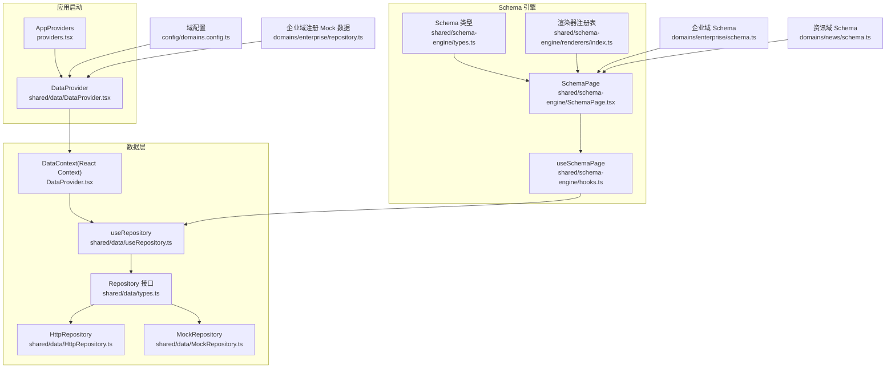
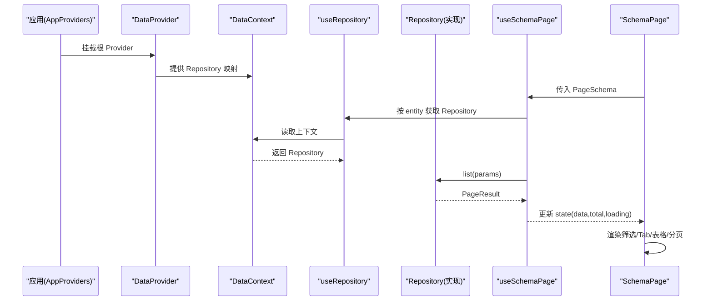
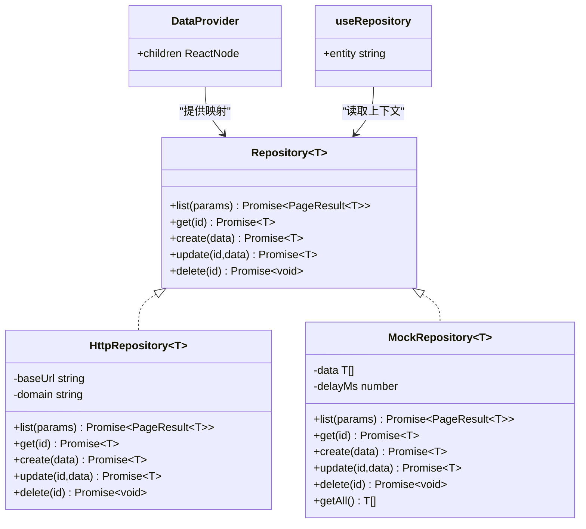
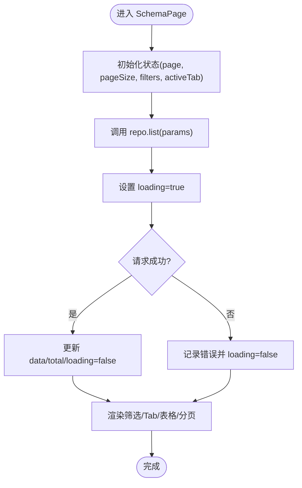
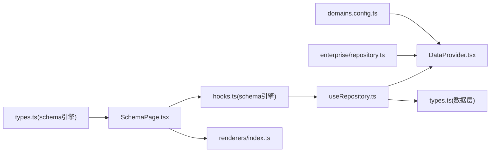

# 状态管理模式

<cite>
**本文引用的文件**
- [DataProvider.tsx](file://hj-admin/src/shared/data/DataProvider.tsx)
- [useRepository.ts](file://hj-admin/src/shared/data/useRepository.ts)
- [HttpRepository.ts](file://hj-admin/src/shared/data/HttpRepository.ts)
- [MockRepository.ts](file://hj-admin/src/shared/data/MockRepository.ts)
- [types.ts（数据层）](file://hj-admin/src/shared/data/types.ts)
- [SchemaPage.tsx](file://hj-admin/src/shared/schema-engine/SchemaPage.tsx)
- [hooks.ts（schema引擎）](file://hj-admin/src/shared/schema-engine/hooks.ts)
- [types.ts（schema引擎）](file://hj-admin/src/shared/schema-engine/types.ts)
- [renderers/index.ts](file://hj-admin/src/shared/schema-engine/renderers/index.ts)
- [domains.config.ts](file://hj-admin/src/config/domains.config.ts)
- [providers.tsx](file://hj-admin/src/app/providers.tsx)
- [repository.ts（企业域）](file://hj-admin/src/domains/enterprise/repository.ts)
- [schema.ts（企业域）](file://hj-admin/src/domains/enterprise/schema.ts)
- [schema.ts（资讯域）](file://hj-admin/src/domains/news/schema.ts)
</cite>

## 目录
1. [简介](#简介)
2. [项目结构](#项目结构)
3. [核心组件](#核心组件)
4. [架构总览](#架构总览)
5. [详细组件分析](#详细组件分析)
6. [依赖关系分析](#依赖关系分析)
7. [性能考虑](#性能考虑)
8. [故障排查指南](#故障排查指南)
9. [结论](#结论)
10. [附录](#附录)

## 简介
本文件面向氢界大数据平台的前端状态管理，系统性阐述基于 React Context 的数据提供与访问模式、Schema 驱动的页面状态管理、以及 Repository 抽象的数据获取与同步机制。文档覆盖以下主题：
- DataProvider 的作用与实现原理
- useRepository Hook 的设计模式与使用方式
- Schema 驱动的状态管理：如何通过配置自动管理页面状态
- 全局状态与局部状态的划分原则与管理策略
- 异步更新模式：请求封装、错误处理与重试扩展点
- 状态持久化与恢复策略建议
- 性能优化技巧与最佳实践

## 项目结构
状态管理相关代码集中在 shared 与 schema-engine 两个层次：
- shared/data：数据访问抽象与实现（Repository 接口、HTTP/Mock 实现、Context 提供器、Hook）
- shared/schema-engine：Schema 驱动页面渲染与状态管理（类型定义、Hook、通用页面组件、渲染器注册表）
- config/domains.config.ts：按域切换数据源模式（mock/http）
- app/providers.tsx：组合全局 Provider
- domains/*：各业务域的 Schema 与 Mock 数据注册

图表来源
- [providers.tsx:1-14](file://hj-admin/src/app/providers.tsx#L1-L14)
- [DataProvider.tsx:1-44](file://hj-admin/src/shared/data/DataProvider.tsx#L1-L44)
- [useRepository.ts:1-24](file://hj-admin/src/shared/data/useRepository.ts#L1-L24)
- [types.ts（数据层）:1-36](file://hj-admin/src/shared/data/types.ts#L1-L36)
- [HttpRepository.ts:1-70](file://hj-admin/src/shared/data/HttpRepository.ts#L1-L70)
- [MockRepository.ts:1-101](file://hj-admin/src/shared/data/MockRepository.ts#L1-L101)
- [hooks.ts（schema引擎）:1-106](file://hj-admin/src/shared/schema-engine/hooks.ts#L1-L106)
- [SchemaPage.tsx:1-226](file://hj-admin/src/shared/schema-engine/SchemaPage.tsx#L1-L226)
- [types.ts（schema引擎）:1-216](file://hj-admin/src/shared/schema-engine/types.ts#L1-L216)
- [renderers/index.ts:1-163](file://hj-admin/src/shared/schema-engine/renderers/index.ts#L1-L163)
- [domains.config.ts:1-18](file://hj-admin/src/config/domains.config.ts#L1-L18)
- [repository.ts（企业域）:1-6](file://hj-admin/src/domains/enterprise/repository.ts#L1-L6)
- [schema.ts（企业域）:1-64](file://hj-admin/src/domains/enterprise/schema.ts#L1-L64)
- [schema.ts（资讯域）:1-123](file://hj-admin/src/domains/news/schema.ts#L1-L123)

章节来源
- [providers.tsx:1-14](file://hj-admin/src/app/providers.tsx#L1-L14)
- [DataProvider.tsx:1-44](file://hj-admin/src/shared/data/DataProvider.tsx#L1-L44)
- [domains.config.ts:1-18](file://hj-admin/src/config/domains.config.ts#L1-L18)

## 核心组件
本节聚焦状态管理的核心构件及其职责边界。

- DataProvider
  - 作用：在应用根节点提供全局 Repository 映射，按域名将 entity 名称绑定到具体 Repository 实例。
  - 实现要点：
    - 读取 domainConfig，根据 mode 选择 MockRepository 或 HttpRepository。
    - 通过 registerMockData 注入各域初始数据，供开发期模拟网络行为。
    - 使用 useMemo 缓存仓库映射，避免重复创建。
  - 关键路径
    - [DataProvider.tsx:26-41](file://hj-admin/src/shared/data/DataProvider.tsx#L26-L41)
    - [DataProvider.tsx:17-20](file://hj-admin/src/shared/data/DataProvider.tsx#L17-L20)
    - [domains.config.ts:7-17](file://hj-admin/src/config/domains.config.ts#L7-L17)

- useRepository
  - 作用：从 DataContext 中按实体名获取对应 Repository；若未注册则返回空操作 fallback，保证页面不崩溃。
  - 关键点：
    - 返回的 Repository 具备 list/get/create/update/delete 统一契约。
    - 缺失时的控制台告警便于快速定位配置遗漏。
  - 关键路径
    - [useRepository.ts:8-23](file://hj-admin/src/shared/data/useRepository.ts#L8-L23)
    - [types.ts（数据层）:20-27](file://hj-admin/src/shared/data/types.ts#L20-L27)

- Repository 抽象与实现
  - 接口：list/get/create/update/delete，统一分页查询参数与结果结构。
  - HttpRepository：基于 fetch 的 RESTful 调用，支持分页、排序、筛选等查询参数序列化。
  - MockRepository：内存数据 + 延迟模拟，支持搜索、过滤、排序、分页，并暴露 getAll 用于统计。
  - 关键路径
    - [types.ts（数据层）:1-36](file://hj-admin/src/shared/data/types.ts#L1-L36)
    - [HttpRepository.ts:7-69](file://hj-admin/src/shared/data/HttpRepository.ts#L7-L69)
    - [MockRepository.ts:7-100](file://hj-admin/src/shared/data/MockRepository.ts#L7-L100)

- Schema 引擎
  - types：定义 PageSchema、FilterField、ColumnDef、RowAction、ModalDef、TabDef 等，构成“写配置即页面”的类型基石。
  - hooks.useSchemaPage：封装列表页状态（loading、data、total、page、pageSize、filters、activeTab、selectedRowKeys），负责触发 repo.list 并维护 loading 态。
  - SchemaPage：根据 PageSchema 渲染筛选栏、Tab、表格、分页、行操作等，并通过 renderWithRegistry 执行列渲染器。
  - 关键路径
    - [types.ts（schema引擎）:132-174](file://hj-admin/src/shared/schema-engine/types.ts#L132-L174)
    - [hooks.ts（schema引擎）:20-105](file://hj-admin/src/shared/schema-engine/hooks.ts#L20-L105)
    - [SchemaPage.tsx:76-223](file://hj-admin/src/shared/schema-engine/SchemaPage.tsx#L76-L223)
    - [renderers/index.ts:32-46](file://hj-admin/src/shared/schema-engine/renderers/index.ts#L32-L46)

章节来源
- [DataProvider.tsx:26-41](file://hj-admin/src/shared/data/DataProvider.tsx#L26-L41)
- [useRepository.ts:8-23](file://hj-admin/src/shared/data/useRepository.ts#L8-L23)
- [HttpRepository.ts:29-68](file://hj-admin/src/shared/data/HttpRepository.ts#L29-L68)
- [MockRepository.ts:20-99](file://hj-admin/src/shared/data/MockRepository.ts#L20-L99)
- [types.ts（数据层）:1-36](file://hj-admin/src/shared/data/types.ts#L1-L36)
- [hooks.ts（schema引擎）:20-105](file://hj-admin/src/shared/schema-engine/hooks.ts#L20-L105)
- [SchemaPage.tsx:76-223](file://hj-admin/src/shared/schema-engine/SchemaPage.tsx#L76-L223)
- [types.ts（schema引擎）:132-174](file://hj-admin/src/shared/schema-engine/types.ts#L132-L174)
- [renderers/index.ts:32-46](file://hj-admin/src/shared/schema-engine/renderers/index.ts#L32-L46)

## 架构总览
下图展示了从应用启动到页面渲染与数据加载的完整链路，包括 Provider 装配、Context 分发、Repository 选择、Schema 驱动渲染与数据拉取。

图表来源
- [providers.tsx:1-14](file://hj-admin/src/app/providers.tsx#L1-L14)
- [DataProvider.tsx:26-41](file://hj-admin/src/shared/data/DataProvider.tsx#L26-L41)
- [useRepository.ts:8-23](file://hj-admin/src/shared/data/useRepository.ts#L8-L23)
- [hooks.ts（schema引擎）:36-57](file://hj-admin/src/shared/schema-engine/hooks.ts#L36-L57)
- [SchemaPage.tsx:76-223](file://hj-admin/src/shared/schema-engine/SchemaPage.tsx#L76-L223)

## 详细组件分析

### DataProvider 与 useRepository
- 设计目标
  - 以“域”为维度解耦数据源，屏蔽 HTTP/Mock 差异。
  - 通过 Context 提供全局 Repository 映射，组件仅关心 entity 名称。
- 运行流程
  - 启动时遍历 domainConfig，按 mode 构造 MockRepository 或 HttpRepository。
  - 通过 registerMockData 注入初始数据，使 MockRepository 具备可交互能力。
  - useRepository 从 Context 取出对应 Repository，缺失时返回空操作对象以避免崩溃。
- 关键路径
  - [DataProvider.tsx:26-41](file://hj-admin/src/shared/data/DataProvider.tsx#L26-L41)
  - [DataProvider.tsx:17-20](file://hj-admin/src/shared/data/DataProvider.tsx#L17-L20)
  - [useRepository.ts:8-23](file://hj-admin/src/shared/data/useRepository.ts#L8-L23)
  - [domains.config.ts:7-17](file://hj-admin/src/config/domains.config.ts#L7-L17)
  - [repository.ts（企业域）:1-6](file://hj-admin/src/domains/enterprise/repository.ts#L1-L6)

图表来源
- [types.ts（数据层）:20-27](file://hj-admin/src/shared/data/types.ts#L20-L27)
- [HttpRepository.ts:7-69](file://hj-admin/src/shared/data/HttpRepository.ts#L7-L69)
- [MockRepository.ts:7-100](file://hj-admin/src/shared/data/MockRepository.ts#L7-L100)
- [DataProvider.tsx:26-41](file://hj-admin/src/shared/data/DataProvider.tsx#L26-L41)
- [useRepository.ts:8-23](file://hj-admin/src/shared/data/useRepository.ts#L8-L23)

章节来源
- [DataProvider.tsx:26-41](file://hj-admin/src/shared/data/DataProvider.tsx#L26-L41)
- [useRepository.ts:8-23](file://hj-admin/src/shared/data/useRepository.ts#L8-L23)
- [HttpRepository.ts:29-68](file://hj-admin/src/shared/data/HttpRepository.ts#L29-L68)
- [MockRepository.ts:20-99](file://hj-admin/src/shared/data/MockRepository.ts#L20-L99)
- [domains.config.ts:7-17](file://hj-admin/src/config/domains.config.ts#L7-L17)
- [repository.ts（企业域）:1-6](file://hj-admin/src/domains/enterprise/repository.ts#L1-L6)

### Schema 驱动的状态管理
- 设计理念
  - 用声明式 PageSchema 描述页面：筛选、表格、分页、行操作、Tab 分组等。
  - useSchemaPage 集中管理页面级状态，自动监听 page/pageSize/filters 变化触发数据刷新。
  - SchemaPage 负责渲染，并将操作上下文（refresh、navigate、showModal）注入到行操作中。
- 状态字段
  - loading、data、total、page、pageSize、filters、activeTab、selectedRowKeys。
- 数据流
  - 初次渲染与依赖变更时调用 repo.list，设置 loading=true，完成后更新 data/total/loading。
- 关键路径
  - [hooks.ts（schema引擎）:20-105](file://hj-admin/src/shared/schema-engine/hooks.ts#L20-L105)
  - [SchemaPage.tsx:76-223](file://hj-admin/src/shared/schema-engine/SchemaPage.tsx#L76-L223)
  - [types.ts（schema引擎）:132-174](file://hj-admin/src/shared/schema-engine/types.ts#L132-L174)

图表来源
- [hooks.ts（schema引擎）:36-57](file://hj-admin/src/shared/schema-engine/hooks.ts#L36-L57)
- [SchemaPage.tsx:154-223](file://hj-admin/src/shared/schema-engine/SchemaPage.tsx#L154-L223)

章节来源
- [hooks.ts（schema引擎）:20-105](file://hj-admin/src/shared/schema-engine/hooks.ts#L20-L105)
- [SchemaPage.tsx:76-223](file://hj-admin/src/shared/schema-engine/SchemaPage.tsx#L76-L223)
- [types.ts（schema引擎）:132-174](file://hj-admin/src/shared/schema-engine/types.ts#L132-L174)

### 渲染器与列渲染
- 渲染器注册表
  - 通过 registerRenderer 注册字符串键对应的渲染函数，Schema 中以 render: 'name' 引用，保持可序列化与 AI 友好。
  - 内置渲染器包括标签列表、状态徽章、链接、日期、百分比、URL、成功率等。
- 使用方式
  - ColumnDef.render 可为字符串或函数；字符串走注册表解析，函数直接执行。
- 关键路径
  - [renderers/index.ts:21-46](file://hj-admin/src/shared/schema-engine/renderers/index.ts#L21-L46)
  - [SchemaPage.tsx:90-110](file://hj-admin/src/shared/schema-engine/SchemaPage.tsx#L90-L110)

章节来源
- [renderers/index.ts:21-46](file://hj-admin/src/shared/schema-engine/renderers/index.ts#L21-L46)
- [SchemaPage.tsx:90-110](file://hj-admin/src/shared/schema-engine/SchemaPage.tsx#L90-L110)

### 示例域集成
- 企业域
  - 通过 repository.ts 注册 Mock 数据，schema.ts 定义待处理池与已确认池的 PageSchema。
  - 关键路径
    - [repository.ts（企业域）:1-6](file://hj-admin/src/domains/enterprise/repository.ts#L1-L6)
    - [schema.ts（企业域）:7-63](file://hj-admin/src/domains/enterprise/schema.ts#L7-L63)
- 资讯域
  - 包含资讯池、已发布资讯、数据源管理等多个 PageSchema，展示丰富的筛选与列渲染。
  - 关键路径
    - [schema.ts（资讯域）:22-122](file://hj-admin/src/domains/news/schema.ts#L22-L122)

章节来源
- [repository.ts（企业域）:1-6](file://hj-admin/src/domains/enterprise/repository.ts#L1-L6)
- [schema.ts（企业域）:7-63](file://hj-admin/src/domains/enterprise/schema.ts#L7-L63)
- [schema.ts（资讯域）:22-122](file://hj-admin/src/domains/news/schema.ts#L22-L122)

## 依赖关系分析
- 组件耦合
  - DataProvider 依赖 domainConfig 与各域 mock 数据注册，提供 Repository 映射。
  - useRepository 仅依赖 Context，对上层透明。
  - useSchemaPage 依赖 useRepository 与 PageSchema，屏蔽数据获取细节。
  - SchemaPage 依赖 useSchemaPage 与渲染器注册表，专注 UI 组装。
- 外部依赖
  - Ant Design 组件库用于 UI 渲染。
  - react-router-dom 用于导航。
- 潜在循环依赖
  - 当前结构无循环依赖风险：数据层与 Schema 引擎分层清晰。

图表来源
- [domains.config.ts:1-18](file://hj-admin/src/config/domains.config.ts#L1-L18)
- [DataProvider.tsx:1-44](file://hj-admin/src/shared/data/DataProvider.tsx#L1-L44)
- [repository.ts（企业域）:1-6](file://hj-admin/src/domains/enterprise/repository.ts#L1-L6)
- [useRepository.ts:1-24](file://hj-admin/src/shared/data/useRepository.ts#L1-L24)
- [types.ts（数据层）:1-36](file://hj-admin/src/shared/data/types.ts#L1-L36)
- [hooks.ts（schema引擎）:1-106](file://hj-admin/src/shared/schema-engine/hooks.ts#L1-L106)
- [SchemaPage.tsx:1-226](file://hj-admin/src/shared/schema-engine/SchemaPage.tsx#L1-L226)
- [renderers/index.ts:1-163](file://hj-admin/src/shared/schema-engine/renderers/index.ts#L1-L163)
- [types.ts（schema引擎）:1-216](file://hj-admin/src/shared/schema-engine/types.ts#L1-L216)

章节来源
- [domains.config.ts:1-18](file://hj-admin/src/config/domains.config.ts#L1-L18)
- [DataProvider.tsx:1-44](file://hj-admin/src/shared/data/DataProvider.tsx#L1-L44)
- [useRepository.ts:1-24](file://hj-admin/src/shared/data/useRepository.ts#L1-L24)
- [hooks.ts（schema引擎）:1-106](file://hj-admin/src/shared/schema-engine/hooks.ts#L1-L106)
- [SchemaPage.tsx:1-226](file://hj-admin/src/shared/schema-engine/SchemaPage.tsx#L1-L226)
- [renderers/index.ts:1-163](file://hj-admin/src/shared/schema-engine/renderers/index.ts#L1-L163)
- [types.ts（schema引擎）:1-216](file://hj-admin/src/shared/schema-engine/types.ts#L1-L216)

## 性能考虑
- 减少不必要的重渲染
  - 使用 useMemo 缓存列定义与操作列，避免每次渲染重建。
  - 将频繁变化的值（如 filters）拆分为独立状态，按需触发刷新。
- 数据层优化
  - 在 Repository 层引入请求去抖与缓存（例如按 params 哈希缓存 PageResult）。
  - 对大列表采用虚拟滚动（结合 antd Table 的 virtual 选项）。
- 渲染优化
  - 列渲染器尽量纯函数，避免闭包捕获可变状态。
  - 复杂渲染器使用 React.memo 包裹。
- 网络优化
  - 合并批量操作请求，减少往返次数。
  - 合理设置分页大小，避免单次加载过多数据。

[本节为通用指导，无需特定文件引用]

## 故障排查指南
- Repository 未注册
  - 现象：控制台输出警告提示未找到 entity 对应的 Repository。
  - 排查：检查 domainConfig 是否包含该域，以及是否在 bootstrap 阶段调用了 registerMockData。
  - 参考路径
    - [useRepository.ts:11-21](file://hj-admin/src/shared/data/useRepository.ts#L11-L21)
    - [DataProvider.tsx:26-41](file://hj-admin/src/shared/data/DataProvider.tsx#L26-L41)
- 数据加载失败
  - 现象：loading 始终为 false，但无数据。
  - 排查：查看 console.error 日志；确认后端 API 地址与域名配置；在 Mock 模式下确认初始数据是否正确注册。
  - 参考路径
    - [hooks.ts（schema引擎）:48-51](file://hj-admin/src/shared/schema-engine/hooks.ts#L48-L51)
    - [HttpRepository.ts:20-27](file://hj-admin/src/shared/data/HttpRepository.ts#L20-L27)
- 筛选/分页无效
  - 现象：修改筛选或翻页后表格未更新。
  - 排查：确认 setFilter/setPage 是否被正确调用，useEffect 依赖是否包含 page/pageSize/filters。
  - 参考路径
    - [hooks.ts（schema引擎）:59-77](file://hj-admin/src/shared/schema-engine/hooks.ts#L59-L77)
    - [hooks.ts（schema引擎）:55-57](file://hj-admin/src/shared/schema-engine/hooks.ts#L55-L57)
- 渲染器未生效
  - 现象：列渲染显示原始值而非预期样式。
  - 排查：确认 renderers/index.ts 中是否注册了对应渲染器，且 Schema 中的 render 名称一致。
  - 参考路径
    - [renderers/index.ts:21-46](file://hj-admin/src/shared/schema-engine/renderers/index.ts#L21-L46)

章节来源
- [useRepository.ts:11-21](file://hj-admin/src/shared/data/useRepository.ts#L11-L21)
- [DataProvider.tsx:26-41](file://hj-admin/src/shared/data/DataProvider.tsx#L26-L41)
- [hooks.ts（schema引擎）:48-57](file://hj-admin/src/shared/schema-engine/hooks.ts#L48-L57)
- [HttpRepository.ts:20-27](file://hj-admin/src/shared/data/HttpRepository.ts#L20-L27)
- [renderers/index.ts:21-46](file://hj-admin/src/shared/schema-engine/renderers/index.ts#L21-L46)

## 结论
本方案通过 React Context 提供统一的 Repository 访问入口，结合 Schema 驱动与 useSchemaPage 的状态封装，实现了“配置即页面”的高效开发体验。数据层以 Repository 抽象屏蔽 HTTP/Mock 差异，配合 domainConfig 可按域灵活切换数据源。整体架构清晰、可扩展性强，适合大规模后台页面的快速迭代与维护。

[本节为总结性内容，无需特定文件引用]

## 附录

### 全局状态与局部状态划分原则
- 全局状态
  - 由 DataProvider 提供的 Repository 映射属于全局资源，跨组件共享。
  - 适用场景：多页面共享的数据访问能力、跨域配置。
- 页面状态
  - 由 useSchemaPage 管理的 loading、data、total、page、pageSize、filters、activeTab、selectedRowKeys 属于页面级状态。
  - 适用场景：列表页的筛选、分页、Tab 分组、选中行等。
- 组件状态
  - 弹窗显隐、表单输入等细粒度状态应在组件内部维护，避免污染页面状态。
- 应用状态
  - 用户信息、权限、主题等应用级状态可在更高层 Provider 中管理（当前仓库未实现，可作为后续扩展）。

[本节为概念性说明，无需特定文件引用]

### 异步更新模式与扩展点
- 请求拦截
  - 可在 HttpRepository.request 中统一添加鉴权头、超时控制、日志埋点。
- 错误处理
  - 在 useSchemaPage.fetchData 中捕获异常并更新 loading；可进一步接入全局错误提示。
- 重试机制
  - 建议在 Repository 层增加重试策略（指数退避、最大重试次数），或在 useSchemaPage 中对特定错误码进行重试。
- 乐观更新
  - 对于 create/update/delete，可先本地更新 UI，再发起请求并在失败时回滚。

[本节为通用指导，无需特定文件引用]

### 状态持久化与恢复策略
- URL 同步
  - 将 page、pageSize、filters、activeTab 同步到 URL 查询参数，支持分享与刷新恢复。
- 本地存储
  - 将常用筛选条件与分页大小写入 localStorage，下次进入页面自动恢复。
- 服务端缓存
  - 利用浏览器缓存或 Service Worker 缓存 GET 请求结果，提升二次访问速度。
- 恢复时机
  - 在 useSchemaPage 初始化时优先从 URL/localStorage 恢复状态，再触发首次加载。

[本节为通用指导，无需特定文件引用]