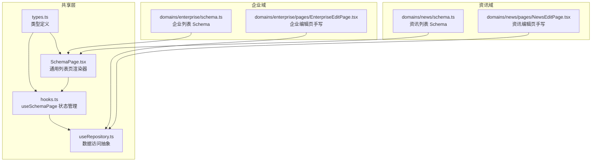
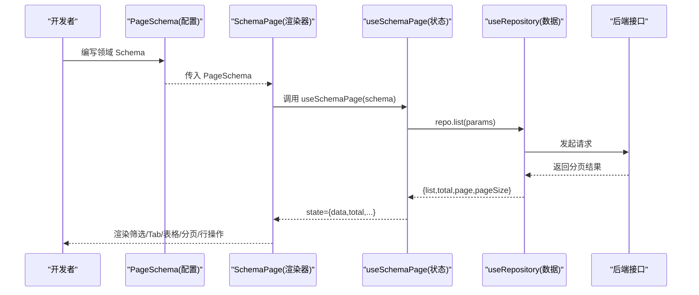
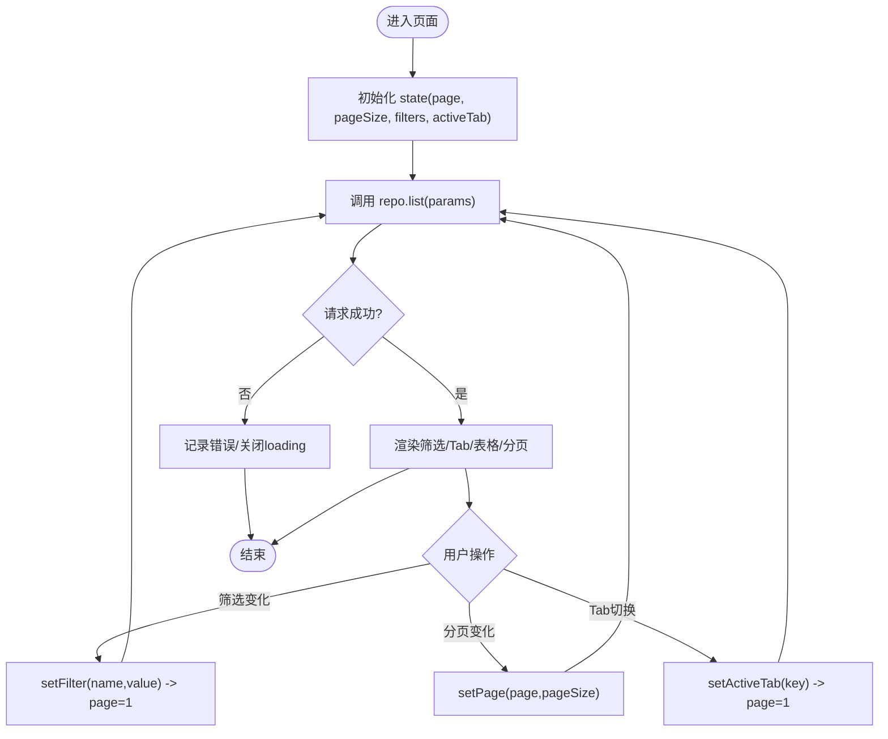
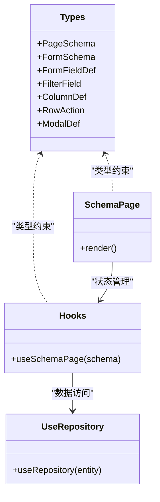

# 表单状态管理

<cite>
**本文引用的文件**
- [types.ts](file://hj-admin/src/shared/schema-engine/types.ts)
- [SchemaPage.tsx](file://hj-admin/src/shared/schema-engine/SchemaPage.tsx)
- [hooks.ts](file://hj-admin/src/shared/schema-engine/hooks.ts)
- [useRepository.ts](file://hj-admin/src/shared/data/useRepository.ts)
- [schema.ts（企业域）](file://hj-admin/src/domains/enterprise/schema.ts)
- [schema.ts（资讯域）](file://hj-admin/src/domains/news/schema.ts)
- [EnterpriseEditPage.tsx](file://hj-admin/src/domains/enterprise/pages/EnterpriseEditPage.tsx)
- [NewsEditPage.tsx](file://hj-admin/src/domains/news/pages/NewsEditPage.tsx)
</cite>

## 目录
1. [引言](#引言)
2. [项目结构](#项目结构)
3. [核心组件](#核心组件)
4. [架构总览](#架构总览)
5. [详细组件分析](#详细组件分析)
6. [依赖关系分析](#依赖关系分析)
7. [性能考量](#性能考量)
8. [故障排查指南](#故障排查指南)
9. [结论](#结论)
10. [附录](#附录)

## 引言
本文件面向“氢界大数据平台”的表单与页面状态管理，聚焦于 Schema 驱动的通用列表页渲染引擎及其在复杂业务场景中的扩展能力。文档将系统阐述：
- Schema 驱动的表单字段定义、联动与布局
- 表单数据绑定与同步策略（受控与非受控组件的使用场景）
- 验证机制现状与可扩展点（实时、批量、自定义）
- 表单状态生命周期（初始化、提交、重置、错误恢复）
- 复杂表单模式（动态表单、嵌套表单、条件渲染）

说明：当前仓库中已实现“列表页 + 筛选栏 + Tab + 表格 + 分页 + 行操作”的完整 Schema 驱动方案；表单 Schema 类型已定义但尚未在通用引擎中落地为可渲染的表单组件。编辑类页面采用手写 React 组件实现，适合复杂交互与 NER 面板等场景。

## 项目结构
围绕表单与页面状态管理的核心代码位于 shared/schema-engine 与 domains 两个层面：
- shared/schema-engine：提供 PageSchema/FormSchema 类型、SchemaPage 渲染器、useSchemaPage 状态 Hook、以及渲染器注册表入口
- domains：各业务域通过 schema.ts 声明式配置页面（筛选、列、分页、Tab、行操作），并通过 useRepository 接入数据层

图表来源
- [types.ts:1-216](file://hj-admin/src/shared/schema-engine/types.ts#L1-L216)
- [SchemaPage.tsx:1-226](file://hj-admin/src/shared/schema-engine/SchemaPage.tsx#L1-L226)
- [hooks.ts:1-106](file://hj-admin/src/shared/schema-engine/hooks.ts#L1-L106)
- [useRepository.ts:1-24](file://hj-admin/src/shared/data/useRepository.ts#L1-L24)
- [schema.ts（企业域）:1-64](file://hj-admin/src/domains/enterprise/schema.ts#L1-L64)
- [schema.ts（资讯域）:1-123](file://hj-admin/src/domains/news/schema.ts#L1-L123)

章节来源
- [types.ts:1-216](file://hj-admin/src/shared/schema-engine/types.ts#L1-L216)
- [SchemaPage.tsx:1-226](file://hj-admin/src/shared/schema-engine/SchemaPage.tsx#L1-L226)
- [hooks.ts:1-106](file://hj-admin/src/shared/schema-engine/hooks.ts#L1-L106)
- [useRepository.ts:1-24](file://hj-admin/src/shared/data/useRepository.ts#L1-L24)
- [schema.ts（企业域）:1-64](file://hj-admin/src/domains/enterprise/schema.ts#L1-L64)
- [schema.ts（资讯域）:1-123](file://hj-admin/src/domains/news/schema.ts#L1-L123)

## 核心组件
- PageSchema 与 FilterField/ColumnDef/RowAction/ModalDef 等类型：统一描述页面结构与行为，是“写配置即页面”的基础
- FormSchema/FormFieldDef：定义表单字段、布局、联动等，目前作为弹窗 formSchema 预留能力
- SchemaPage：根据 PageSchema 自动渲染筛选栏、Tab、表格、分页、行操作等
- useSchemaPage：封装筛选、分页、Tab、选中行、数据加载等状态与副作用
- useRepository：按 entity 注入 Repository，屏蔽具体数据源差异

章节来源
- [types.ts:106-174](file://hj-admin/src/shared/schema-engine/types.ts#L106-L174)
- [SchemaPage.tsx:75-226](file://hj-admin/src/shared/schema-engine/SchemaPage.tsx#L75-L226)
- [hooks.ts:20-106](file://hj-admin/src/shared/schema-engine/hooks.ts#L20-L106)
- [useRepository.ts:1-24](file://hj-admin/src/shared/data/useRepository.ts#L1-L24)

## 架构总览
下图展示从 Schema 到 UI 的端到端流程：Schema 声明 → 类型约束 → 渲染器解析 → 状态 Hook 管理 → 数据层访问。

图表来源
- [SchemaPage.tsx:75-226](file://hj-admin/src/shared/schema-engine/SchemaPage.tsx#L75-L226)
- [hooks.ts:20-106](file://hj-admin/src/shared/schema-engine/hooks.ts#L20-L106)
- [useRepository.ts:1-24](file://hj-admin/src/shared/data/useRepository.ts#L1-L24)

## 详细组件分析

### 表单字段的状态定义与联动逻辑
- 字段类型与属性：FormFieldType 覆盖输入、选择、日期、级联、树选择等；FormFieldDef 支持 label、placeholder、defaultValue、colSpan、linkage 等
- 联动模型：FormFieldDef.linkage 以 field + handler 形式表达“父字段变化时重新计算子字段选项”，适用于多级联动、条件选项等
- 布局：FormSchema 支持 columns 与 layout，便于多列排布与响应式布局

建议落地方式（概念性说明）：
- 在 ModalDef.formSchema 处引入表单渲染器，基于 FormSchema 生成受控表单
- 使用 linkage.handler 在父字段 onChange 时触发子字段 options 重算
- 对 defaultValue 进行初始值填充，结合 required 与 placeholder 提升可用性

章节来源
- [types.ts:106-129](file://hj-admin/src/shared/schema-engine/types.ts#L106-L129)

### 表单数据的绑定与同步策略
- 受控组件：推荐用于需要即时校验、联动、或与其他状态联动的字段（如 select/cascader 的联动）
- 非受控组件：适合一次性读取或简单展示的场景（如只读信息区）
- 当前工程实践：
  - 列表页筛选栏由 SchemaPage 内部以受控方式渲染（FilterBar 内 Input/Select/RangePicker 均绑定 value 与 onChange）
  - 编辑页（企业/资讯）采用手写组件，标题等字段使用 useState 做受控绑定，富文本区域使用 contentEditable 的非受控模式

章节来源
- [SchemaPage.tsx:16-73](file://hj-admin/src/shared/schema-engine/SchemaPage.tsx#L16-L73)
- [NewsEditPage.tsx:10-36](file://hj-admin/src/domains/news/pages/NewsEditPage.tsx#L10-L36)
- [EnterpriseEditPage.tsx:29-50](file://hj-admin/src/domains/enterprise/pages/EnterpriseEditPage.tsx#L29-L50)

### 表单验证的实现方式
- 现状：当前 Schema 类型未内置验证规则字段，也未在通用引擎中实现表单验证器
- 可扩展点：
  - 在 FormFieldDef 增加 rules 数组（必填、格式、长度、正则、异步校验等）
  - 在表单渲染器中集成实时校验（onChange/onBlur）、批量校验（onSubmit）
  - 支持自定义验证器函数，允许跨字段校验与异步校验（如查重）
- 参考实践（来自 HTML 原型页面的思路）：
  - 单字段即时校验（如信用代码长度）
  - 提交前二次确认与提示
  - 忽略校验的降级路径（容错提交）

章节来源
- [types.ts:106-129](file://hj-admin/src/shared/schema-engine/types.ts#L106-L129)
- [新闻原型页面片段（HTML）:3502-3512](file://氢界大数据平台 — 运营管理后台 v3.2.html#L3502-L3512)

### 表单状态的生命周期管理
- 初始化：useSchemaPage 在首次挂载时根据 schema.pagination.pageSize 设置默认分页，并加载数据；filters 初始为空对象
- 变更与刷新：
  - setFilter/resetFilters 更新 filters 并回退至第一页
  - setPage/setActiveTab 更新分页/Tab 并触发重新加载
  - refresh 主动刷新数据
- 提交与重置（表单侧）：
  - 建议在表单渲染器中暴露 onValidate/onSubmit/onReset 回调，分别对接持久化与本地状态清理
- 错误恢复：
  - useSchemaPage 在 fetch 失败时仅关闭 loading，未显示用户可见的错误提示；可在上层捕获并展示 Toast/Modal

章节来源
- [hooks.ts:20-106](file://hj-admin/src/shared/schema-engine/hooks.ts#L20-L106)
- [SchemaPage.tsx:75-110](file://hj-admin/src/shared/schema-engine/SchemaPage.tsx#L75-L110)

### 复杂表单的处理模式
- 动态表单：通过 FormFieldDef.linkage 实现“父字段变化→子字段选项重算”，满足多级联动、条件显示等
- 嵌套表单：借助 FormSchema.columns 与 layout 组合，或在 ModalDef.customRender 中嵌入子表单组件
- 条件渲染：在 RowAction.visible、Tab.filter 中已有条件渲染范式；表单侧可通过 linkage 与条件字段控制显隐

章节来源
- [types.ts:106-129](file://hj-admin/src/shared/schema-engine/types.ts#L106-L129)
- [SchemaPage.tsx:146-152](file://hj-admin/src/shared/schema-engine/SchemaPage.tsx#L146-L152)

### 列表页与筛选栏的状态流

图表来源
- [hooks.ts:36-85](file://hj-admin/src/shared/schema-engine/hooks.ts#L36-L85)
- [SchemaPage.tsx:146-220](file://hj-admin/src/shared/schema-engine/SchemaPage.tsx#L146-L220)

## 依赖关系分析
- types.ts 是所有 Schema 与渲染器的类型基石
- hooks.ts 依赖 useRepository 获取数据，被 SchemaPage 消费
- SchemaPage 消费 hooks.ts 提供的状态与方法，并负责 UI 组装
- 各域 schema.ts 仅声明配置，不直接耦合 UI 与数据层
- 编辑页（EnterpriseEditPage/NewsEditPage）为手写组件，独立于 Schema 引擎，但仍通过 useRepository 访问数据

图表来源
- [types.ts:1-216](file://hj-admin/src/shared/schema-engine/types.ts#L1-216)
- [hooks.ts:1-106](file://hj-admin/src/shared/schema-engine/hooks.ts#L1-L106)
- [SchemaPage.tsx:1-226](file://hj-admin/src/shared/schema-engine/SchemaPage.tsx#L1-L226)
- [useRepository.ts:1-24](file://hj-admin/src/shared/data/useRepository.ts#L1-L24)

章节来源
- [types.ts:1-216](file://hj-admin/src/shared/schema-engine/types.ts#L1-L216)
- [hooks.ts:1-106](file://hj-admin/src/shared/schema-engine/hooks.ts#L1-L106)
- [SchemaPage.tsx:1-226](file://hj-admin/src/shared/schema-engine/SchemaPage.tsx#L1-L226)
- [useRepository.ts:1-24](file://hj-admin/src/shared/data/useRepository.ts#L1-L24)

## 性能考量
- 列表数据：useSchemaPage 在 page/pageSize/filters 变化时触发一次请求，避免重复渲染
- 列渲染：SchemaPage 使用 useMemo 缓存 columns 与 actionColumn，减少不必要的重建
- 筛选栏：FilterBar 内每个字段均为受控组件，若选项较多或异步加载，建议结合防抖与缓存
- 大数据量：可考虑虚拟滚动、增量加载、服务端排序/过滤

[本节为通用指导，无需源码引用]

## 故障排查指南
- Repository 未注册：当 entity 未在数据上下文注册时，useRepository 会返回空操作的 fallback 并输出警告日志
- 数据加载失败：useSchemaPage 在 catch 分支仅关闭 loading，未展示用户可见错误；建议在 SchemaPage 或上层添加错误提示
- 路由导航：行操作 navigateTo 使用字符串模板替换 :id，需确保 record.id 存在且类型正确

章节来源
- [useRepository.ts:11-23](file://hj-admin/src/shared/data/useRepository.ts#L11-L23)
- [hooks.ts:48-52](file://hj-admin/src/shared/schema-engine/hooks.ts#L48-L52)
- [SchemaPage.tsx:124-131](file://hj-admin/src/shared/schema-engine/SchemaPage.tsx#L124-L131)

## 结论
- 当前仓库已具备完善的“Schema 驱动列表页”能力，涵盖筛选、Tab、表格、分页与行操作
- 表单 Schema 类型已就绪，可作为弹窗表单与复杂编辑页的统一描述语言；后续可在 ModalDef.formSchema 处落地通用表单渲染器
- 验证与错误处理尚待完善，建议补充 rules、实时/批量校验与错误提示
- 复杂表单可采用 linkage 实现联动，结合条件渲染与嵌套布局满足多样化需求

[本节为总结性内容，无需源码引用]

## 附录

### 关键类型速览（节选）
- FormFieldType：input | textarea | select | radio | checkbox | datePicker | rangePicker | number | colorPicker | treeSelect | cascader
- FormFieldDef：name/label/type/required/options/placeholder/defaultValue/colSpan/linkage
- FormSchema：fields/layout/columns
- PageSchema：id/title/description/entity/filters/columns/rowKey/pagination/rowActions/batchActions/toolbarActions/modals/tabs/quickFilters

章节来源
- [types.ts:106-174](file://hj-admin/src/shared/schema-engine/types.ts#L106-L174)

### 示例页面与 Schema 对照
- 企业域列表：filters/columns/rowActions/tabs 均在 schema.ts 中声明
- 资讯域列表：filters/columns/rowActions/tabs/quickFilters 均在 schema.ts 中声明
- 企业编辑页：手写组件，包含步骤、卡片、单选/多选等复杂交互
- 资讯编辑页：手写组件，含标签、富文本、NER 关联面板

章节来源
- [schema.ts（企业域）:1-64](file://hj-admin/src/domains/enterprise/schema.ts#L1-L64)
- [schema.ts（资讯域）:1-123](file://hj-admin/src/domains/news/schema.ts#L1-L123)
- [EnterpriseEditPage.tsx:1-117](file://hj-admin/src/domains/enterprise/pages/EnterpriseEditPage.tsx#L1-L117)
- [NewsEditPage.tsx:1-166](file://hj-admin/src/domains/news/pages/NewsEditPage.tsx#L1-L166)