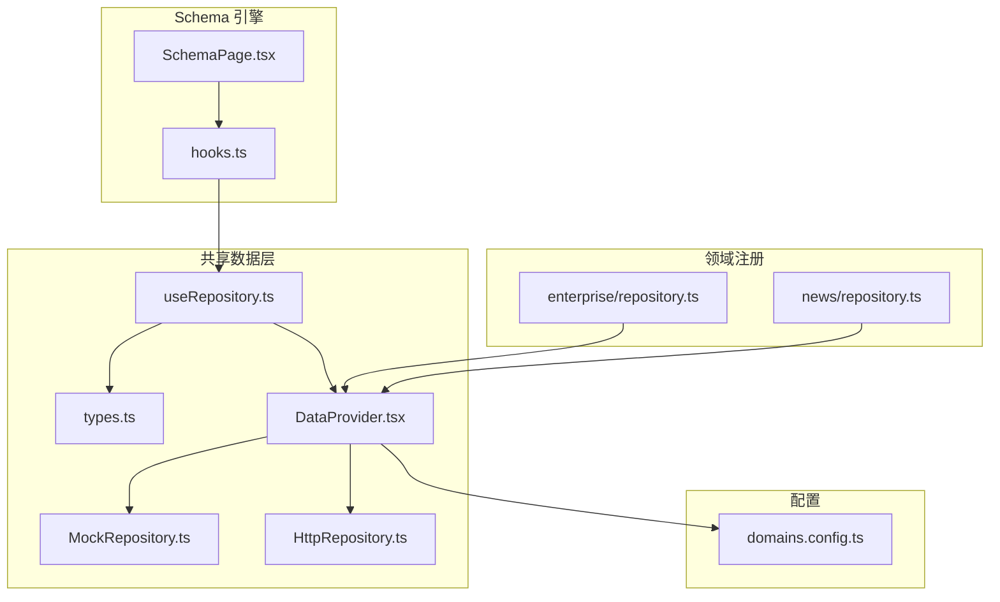
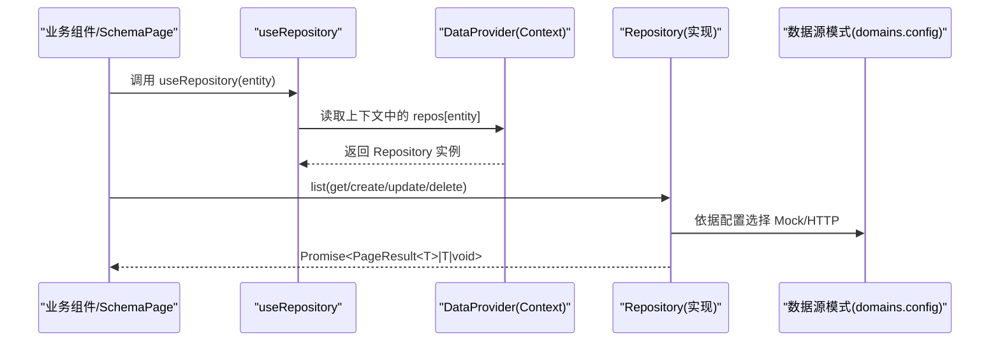
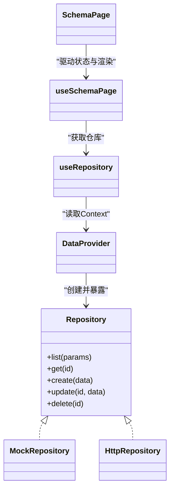

# useRepository Hook

<cite>
**本文引用的文件**   
- [useRepository.ts](file://hj-admin/src/shared/data/useRepository.ts)
- [types.ts](file://hj-admin/src/shared/data/types.ts)
- [MockRepository.ts](file://hj-admin/src/shared/data/MockRepository.ts)
- [HttpRepository.ts](file://hj-admin/src/shared/data/HttpRepository.ts)
- [DataProvider.tsx](file://hj-admin/src/shared/data/DataProvider.tsx)
- [domains.config.ts](file://hj-admin/src/config/domains.config.ts)
- [hooks.ts](file://hj-admin/src/shared/schema-engine/hooks.ts)
- [SchemaPage.tsx](file://hj-admin/src/shared/schema-engine/SchemaPage.tsx)
- [enterprise/repository.ts](file://hj-admin/src/domains/enterprise/repository.ts)
- [news/repository.ts](file://hj-admin/src/domains/news/repository.ts)
</cite>

## 目录
1. [简介](#简介)
2. [项目结构](#项目结构)
3. [核心组件](#核心组件)
4. [架构总览](#架构总览)
5. [详细组件分析](#详细组件分析)
6. [依赖关系分析](#依赖关系分析)
7. [性能与优化建议](#性能与优化建议)
8. [故障排查指南](#故障排查指南)
9. [结论](#结论)
10. [附录：使用示例与最佳实践](#附录使用示例与最佳实践)

## 简介
本文件面向氢界大数据平台的数据访问层，系统性阐述 useRepository Hook 的设计模式、实现原理与使用方法。该 Hook 通过 React Context 提供按“域（domain）”划分的数据仓库实例，统一封装 list/get/create/update/delete 等 CRUD 操作，并配合 QueryParams/PageResult 类型契约，屏蔽 Mock 与 HTTP 数据源差异，使业务组件以一致的方式完成分页、筛选、排序、增删改查以及错误与加载状态管理。

## 项目结构
围绕 useRepository 的关键代码位于 shared/data 目录，并在各 domain 的 repository.ts 中注册初始数据；schema-engine 中的 hooks.ts 和 SchemaPage.tsx 展示了如何在页面层消费该 Hook。

图表来源
- [useRepository.ts:1-24](file://hj-admin/src/shared/data/useRepository.ts#L1-L24)
- [types.ts:1-36](file://hj-admin/src/shared/data/types.ts#L1-L36)
- [MockRepository.ts:1-101](file://hj-admin/src/shared/data/MockRepository.ts#L1-L101)
- [HttpRepository.ts:1-70](file://hj-admin/src/shared/data/HttpRepository.ts#L1-L70)
- [DataProvider.tsx:1-44](file://hj-admin/src/shared/data/DataProvider.tsx#L1-L44)
- [domains.config.ts:1-18](file://hj-admin/src/config/domains.config.ts#L1-L18)
- [hooks.ts:1-106](file://hj-admin/src/shared/schema-engine/hooks.ts#L1-L106)
- [SchemaPage.tsx:1-226](file://hj-admin/src/shared/schema-engine/SchemaPage.tsx#L1-L226)
- [enterprise/repository.ts:1-6](file://hj-admin/src/domains/enterprise/repository.ts#L1-L6)
- [news/repository.ts:1-11](file://hj-admin/src/domains/news/repository.ts#L1-L11)

章节来源
- [useRepository.ts:1-24](file://hj-admin/src/shared/data/useRepository.ts#L1-L24)
- [DataProvider.tsx:1-44](file://hj-admin/src/shared/data/DataProvider.tsx#L1-L44)
- [domains.config.ts:1-18](file://hj-admin/src/config/domains.config.ts#L1-L18)
- [hooks.ts:1-106](file://hj-admin/src/shared/schema-engine/hooks.ts#L1-L106)
- [SchemaPage.tsx:1-226](file://hj-admin/src/shared/schema-engine/SchemaPage.tsx#L1-L226)
- [enterprise/repository.ts:1-6](file://hj-admin/src/domains/enterprise/repository.ts#L1-L6)
- [news/repository.ts:1-11](file://hj-admin/src/domains/news/repository.ts#L1-L11)

## 核心组件
- Repository 接口与查询参数类型：定义统一的 CRUD 契约与查询参数结构。
- MockRepository：内存模拟数据源，支持关键词搜索、多字段筛选、排序与分页，并模拟网络延迟。
- HttpRepository：HTTP 数据源实现，将 QueryParams 转换为 URLSearchParams 并发起 REST 请求。
- DataProvider：根据 domains.config 为每个域创建对应的 Repository 实例，并通过 Context 暴露。
- useRepository：在任意组件中以 entity 名称获取对应域的 Repository 实例。
- useSchemaPage：在 Schema 页面中组合 useRepository，统一管理 loading、分页、筛选、Tab 切换与刷新。

章节来源
- [types.ts:1-36](file://hj-admin/src/shared/data/types.ts#L1-L36)
- [MockRepository.ts:1-101](file://hj-admin/src/shared/data/MockRepository.ts#L1-L101)
- [HttpRepository.ts:1-70](file://hj-admin/src/shared/data/HttpRepository.ts#L1-L70)
- [DataProvider.tsx:1-44](file://hj-admin/src/shared/data/DataProvider.tsx#L1-L44)
- [useRepository.ts:1-24](file://hj-admin/src/shared/data/useRepository.ts#L1-L24)
- [hooks.ts:1-106](file://hj-admin/src/shared/schema-engine/hooks.ts#L1-L106)

## 架构总览
useRepository 作为数据访问入口，向上被 useSchemaPage 与业务组件调用，向下由 DataProvider 注入具体实现（Mock/HTTP）。domains.config 控制数据源模式，domain 的 repository.ts 负责注册初始 mock 数据。

图表来源
- [useRepository.ts:1-24](file://hj-admin/src/shared/data/useRepository.ts#L1-L24)
- [DataProvider.tsx:1-44](file://hj-admin/src/shared/data/DataProvider.tsx#L1-L44)
- [domains.config.ts:1-18](file://hj-admin/src/config/domains.config.ts#L1-L18)
- [MockRepository.ts:1-101](file://hj-admin/src/shared/data/MockRepository.ts#L1-L101)
- [HttpRepository.ts:1-70](file://hj-admin/src/shared/data/HttpRepository.ts#L1-L70)

## 详细组件分析

### 类型契约与查询参数
- QueryParams：包含 page、pageSize、filters、sort、search 等字段，用于构建统一查询条件。
- PageResult：包含 list、total、page、pageSize，供表格分页展示。
- Repository：定义 list/get/create/update/delete 五个方法签名，所有数据源需遵循此契约。

章节来源
- [types.ts:1-36](file://hj-admin/src/shared/data/types.ts#L1-L36)

### MockRepository 实现要点
- 内存数据维护：内部保存一份数据副本，支持 create/update/delete 的本地变更。
- 过滤与排序：支持 search 关键词匹配、filters 多字段等值筛选、sort 单字段升/降序。
- 分页：基于 page/pageSize 计算切片范围，返回 total 为过滤后总数。
- 延迟模拟：所有异步方法均 await 一个可配置的延迟，便于前端体验接近真实 API。

章节来源
- [MockRepository.ts:1-101](file://hj-admin/src/shared/data/MockRepository.ts#L1-L101)

### HttpRepository 实现要点
- 端点拼接：baseUrl/domain 组合成资源根路径。
- 请求封装：统一设置 Content-Type，非 ok 响应抛出错误。
- 查询参数映射：
  - page/pageSize/search 直接映射为同名 query 参数。
  - sort.field/sort.order 映射为 sortField/sortOrder。
  - filters 展开为 filter.<key>=value 形式。
- REST 语义：GET 列表/详情，POST 创建，PUT 更新，DELETE 删除。

章节来源
- [HttpRepository.ts:1-70](file://hj-admin/src/shared/data/HttpRepository.ts#L1-L70)

### DataProvider 与 useRepository
- DataProvider：遍历 domains.config，按 mode 创建 MockRepository 或 HttpRepository，并以 Context 提供。
- useRepository：从 Context 取出 repos[entity]，若未找到则返回空操作的 fallback，避免运行时崩溃并给出警告。

章节来源
- [DataProvider.tsx:1-44](file://hj-admin/src/shared/data/DataProvider.tsx#L1-L44)
- [useRepository.ts:1-24](file://hj-admin/src/shared/data/useRepository.ts#L1-L24)
- [domains.config.ts:1-18](file://hj-admin/src/config/domains.config.ts#L1-L18)

### Schema 页面集成：useSchemaPage
- 使用 useRepository(schema.entity) 获取仓库实例。
- 维护 loading、data、total、page、pageSize、filters、activeTab、selectedRowKeys 等状态。
- 监听 page/pageSize/filters 变化自动触发 fetchData，调用 repo.list(params)。
- 提供 setFilter/resetFilters/setPage/setActiveTab/refresh 等方法，供 SchemaPage 渲染器驱动。

章节来源
- [hooks.ts:1-106](file://hj-admin/src/shared/schema-engine/hooks.ts#L1-L106)
- [SchemaPage.tsx:1-226](file://hj-admin/src/shared/schema-engine/SchemaPage.tsx#L1-L226)

### 领域数据注册
- 各 domain 的 repository.ts 通过 registerMockData 向 DataProvider 注册初始数据，以便 MockRepository 初始化。
- 当前 news、enterprise 等域已注册 mock 数据，便于开发期联调。

章节来源
- [news/repository.ts:1-11](file://hj-admin/src/domains/news/repository.ts#L1-L11)
- [enterprise/repository.ts:1-6](file://hj-admin/src/domains/enterprise/repository.ts#L1-L6)

## 依赖关系分析
- useRepository 依赖 DataContext（由 DataProvider 提供），不直接耦合具体实现。
- DataProvider 依赖 domains.config 决定使用 Mock/HTTP 实现。
- useSchemaPage 依赖 useRepository 进行数据拉取，并将结果交给 SchemaPage 渲染。
- 领域模块通过 registerMockData 反向填充 DataProvider 的 mock 数据注册表。

图表来源
- [types.ts:1-36](file://hj-admin/src/shared/data/types.ts#L1-L36)
- [MockRepository.ts:1-101](file://hj-admin/src/shared/data/MockRepository.ts#L1-L101)
- [HttpRepository.ts:1-70](file://hj-admin/src/shared/data/HttpRepository.ts#L1-L70)
- [DataProvider.tsx:1-44](file://hj-admin/src/shared/data/DataProvider.tsx#L1-L44)
- [useRepository.ts:1-24](file://hj-admin/src/shared/data/useRepository.ts#L1-L24)
- [hooks.ts:1-106](file://hj-admin/src/shared/schema-engine/hooks.ts#L1-L106)
- [SchemaPage.tsx:1-226](file://hj-admin/src/shared/schema-engine/SchemaPage.tsx#L1-L226)

## 性能与优化建议
- 服务端分页优先：当数据量较大时，务必启用后端分页，避免一次性加载全量数据。
- 合理设置 pageSize：默认 20 适合多数场景，可根据业务调整。
- 减少不必要的重渲染：
  - 对列 render 函数使用 useMemo 包裹。
  - 避免在每次渲染时新建对象作为 props。
- 防抖/节流：
  - 搜索输入框建议加防抖，避免频繁触发 list。
  - 批量筛选重置时可合并多次 setState。
- 缓存策略：
  - 对于静态字典类数据（如标签、枚举），可在应用级缓存或使用独立仓库缓存。
- 错误边界与重试：
  - 在网络异常时提供重试按钮与友好提示。
- 懒加载与虚拟滚动：
  - 长列表考虑虚拟滚动方案，降低 DOM 压力。

## 故障排查指南
- 未找到 Repository 的实体名：
  - 现象：控制台输出警告，返回空操作仓库。
  - 排查：确认 entity 名称是否在 domains.config 中注册，且 DataProvider 已正确包裹应用。
- 筛选/排序无效：
  - 现象：Mock 下有效但 HTTP 下无效。
  - 排查：检查后端是否支持 filter.<key>、sortField、sortOrder 等参数约定。
- 分页不正确：
  - 现象：total 与实际不符或翻页无变化。
  - 排查：确认后端返回的 total 是否为过滤后的总数，并确保 page/pageSize 传递正确。
- 新增/更新/删除失败：
  - 现象：HTTP 报错或无响应。
  - 排查：检查请求方法与路径是否正确，Content-Type 是否为 application/json，后端是否返回成功状态码。
- 首次加载卡住：
  - 现象：loading 一直为 true。
  - 排查：查看 fetch 是否抛错，useSchemaPage 的错误分支是否关闭 loading。

章节来源
- [useRepository.ts:1-24](file://hj-admin/src/shared/data/useRepository.ts#L1-L24)
- [HttpRepository.ts:1-70](file://hj-admin/src/shared/data/HttpRepository.ts#L1-L70)
- [hooks.ts:1-106](file://hj-admin/src/shared/schema-engine/hooks.ts#L1-L106)

## 结论
useRepository Hook 通过“统一契约 + 上下文注入 + 配置化数据源”的模式，实现了跨数据源的无缝切换与一致的 CRUD 体验。结合 useSchemaPage 的状态管理，开发者可以专注于业务逻辑与页面配置，无需关心底层数据源细节。随着后端 API 就绪，只需修改 domains.config 即可平滑迁移至 HTTP 数据源。

## 附录：使用示例与最佳实践

### 在业务组件中使用 useRepository
- 获取仓库实例：在组件内调用 useRepository('news') 或 useRepository('enterprise')。
- 列表查询：调用 repo.list({ page, pageSize, filters, sort, search })，处理返回的 PageResult。
- 详情获取：repo.get(id)，注意捕获未找到的异常。
- 新增/更新：repo.create(data)/repo.update(id, data)，成功后刷新列表。
- 删除：repo.delete(id)，确认后刷新列表。

章节来源
- [useRepository.ts:1-24](file://hj-admin/src/shared/data/useRepository.ts#L1-L24)
- [types.ts:1-36](file://hj-admin/src/shared/data/types.ts#L1-L36)
- [MockRepository.ts:1-101](file://hj-admin/src/shared/data/MockRepository.ts#L1-L101)
- [HttpRepository.ts:1-70](file://hj-admin/src/shared/data/HttpRepository.ts#L1-L70)

### 在 Schema 页面中使用 useSchemaPage
- 配置 schema.entity 指向目标域。
- 使用 useSchemaPage(schema) 获取 state 与操作方法。
- 将 state.loading、state.data、state.total、state.page、state.pageSize 绑定到 Table。
- 通过 setFilter/resetFilters/setPage/setActiveTab/refresh 驱动交互。

章节来源
- [hooks.ts:1-106](file://hj-admin/src/shared/schema-engine/hooks.ts#L1-L106)
- [SchemaPage.tsx:1-226](file://hj-admin/src/shared/schema-engine/SchemaPage.tsx#L1-L226)

### 切换数据源（Mock/HTTP）
- 修改 domains.config 中对应域的 mode 为 'http'。
- 确保后端 API 路径与 HttpRepository 的约定一致（RESTful、参数命名）。
- 保留 domain 的 repository.ts 不变，仅切换模式即可。

章节来源
- [domains.config.ts:1-18](file://hj-admin/src/config/domains.config.ts#L1-L18)
- [DataProvider.tsx:1-44](file://hj-admin/src/shared/data/DataProvider.tsx#L1-L44)
- [HttpRepository.ts:1-70](file://hj-admin/src/shared/data/HttpRepository.ts#L1-L70)

### 查询参数构建与传递机制
- 分页：page/pageSize 直接映射为同名查询参数。
- 筛选：filters 展开为 filter.<key>=value，忽略 undefined/null/空字符串。
- 排序：sort.field/sort.order 映射为 sortField/sortOrder。
- 搜索：search 作为通用关键词参数。

章节来源
- [HttpRepository.ts:1-70](file://hj-admin/src/shared/data/HttpRepository.ts#L1-L70)
- [types.ts:1-36](file://hj-admin/src/shared/data/types.ts#L1-L36)

### 错误处理与加载状态
- 加载状态：useSchemaPage 在请求前设置 loading=true，完成后置 false。
- 错误处理：捕获异常并记录日志，保持 loading=false，建议在 UI 层增加错误提示与重试。
- 空仓库保护：useRepository 在未找到实体时返回空操作仓库，避免崩溃。

章节来源
- [hooks.ts:1-106](file://hj-admin/src/shared/schema-engine/hooks.ts#L1-L106)
- [useRepository.ts:1-24](file://hj-admin/src/shared/data/useRepository.ts#L1-L24)