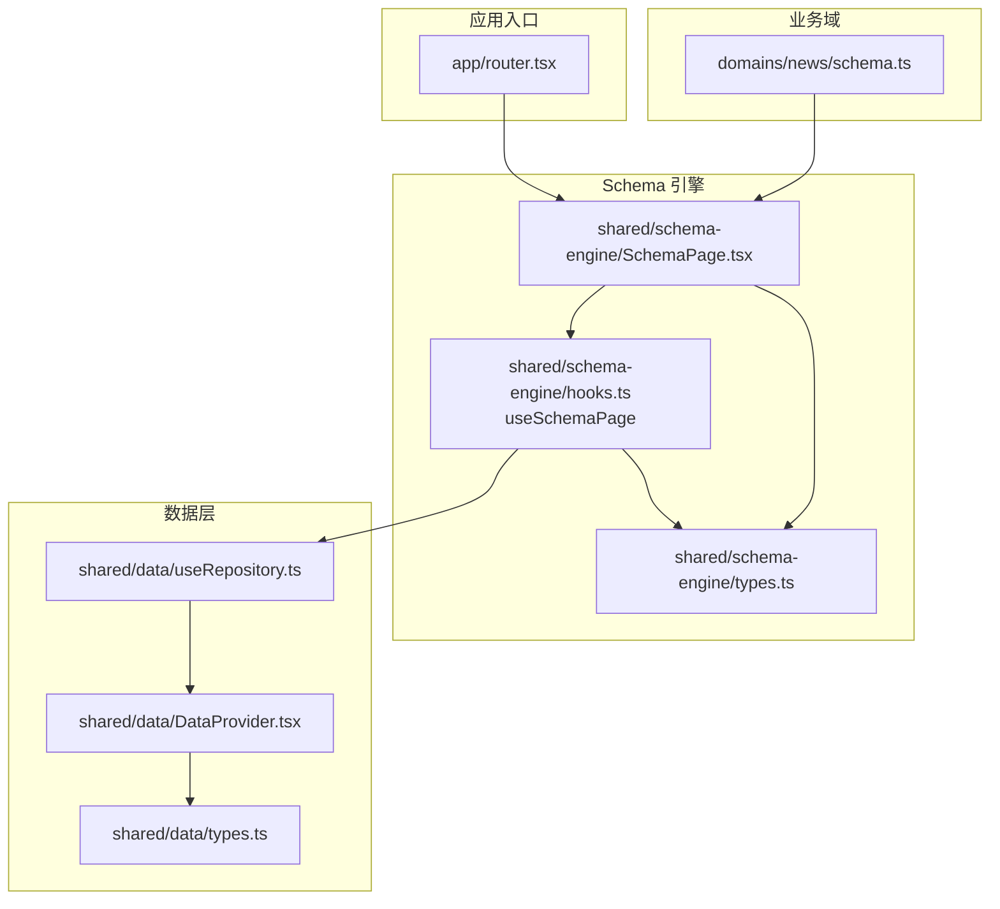
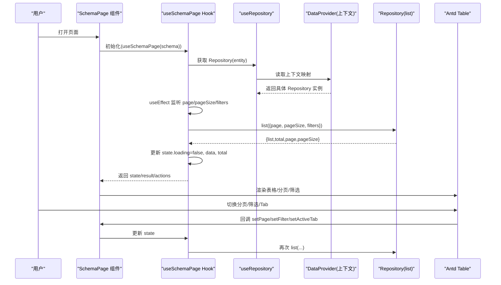
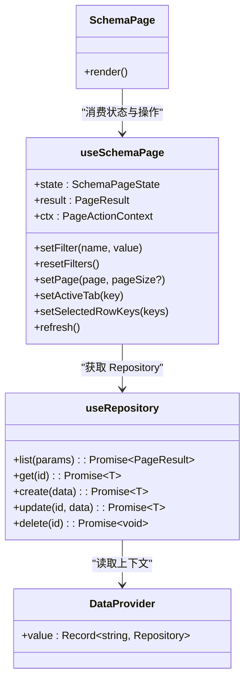

# useSchemaPage Hook 文档

<cite>
**本文引用的文件**   
- [hooks.ts](file://hj-admin/src/shared/schema-engine/hooks.ts)
- [SchemaPage.tsx](file://hj-admin/src/shared/schema-engine/SchemaPage.tsx)
- [types.ts](file://hj-admin/src/shared/schema-engine/types.ts)
- [useRepository.ts](file://hj-admin/src/shared/data/useRepository.ts)
- [DataProvider.tsx](file://hj-admin/src/shared/data/DataProvider.tsx)
- [types.ts（数据层）](file://hj-admin/src/shared/data/types.ts)
- [router.tsx](file://hj-admin/src/app/router.tsx)
- [schema.ts（资讯域示例）](file://hj-admin/src/domains/news/schema.ts)
</cite>

## 目录
1. [简介](#简介)
2. [项目结构](#项目结构)
3. [核心组件与状态](#核心组件与状态)
4. [架构总览](#架构总览)
5. [详细实现分析](#详细实现分析)
6. [依赖关系分析](#依赖关系分析)
7. [性能与缓存特性](#性能与缓存特性)
8. [使用示例与集成指南](#使用示例与集成指南)
9. [故障排查](#故障排查)
10. [结论](#结论)

## 简介
本文件面向“氢界大数据平台”的运营后台，聚焦于 Schema 驱动列表页的核心 Hook：useSchemaPage。该 Hook 将“筛选、分页、Tab 分组、行选择、数据加载”等通用能力封装为可复用的状态与操作，配合 SchemaPage 渲染器，使业务页面通过声明式配置即可自动生成完整的数据列表页。

本文将深入解析：
- 设计模式与实现原理
- 页面数据的自动获取、缓存与同步机制
- SchemaPageState 状态结构与字段管理
- fetchData 异步处理逻辑（参数构建、错误处理、重试机制现状与建议）
- 筛选器管理、分页控制、标签页切换、行选择的实现细节
- 在业务页面中的集成方式与最佳实践

## 项目结构
围绕 useSchemaPage 的关键代码位于 shared/schema-engine 与 shared/data 两个模块中，并通过 app 路由与 domain schema 进行组合。

图表来源
- [router.tsx:25-57](file://hj-admin/src/app/router.tsx#L25-L57)
- [SchemaPage.tsx:76-110](file://hj-admin/src/shared/schema-engine/SchemaPage.tsx#L76-L110)
- [hooks.ts:20-57](file://hj-admin/src/shared/schema-engine/hooks.ts#L20-L57)
- [useRepository.ts:8-23](file://hj-admin/src/shared/data/useRepository.ts#L8-L23)
- [DataProvider.tsx:26-41](file://hj-admin/src/shared/data/DataProvider.tsx#L26-L41)
- [types.ts（数据层）:1-36](file://hj-admin/src/shared/data/types.ts#L1-L36)
- [schema.ts（资讯域示例）:22-53](file://hj-admin/src/domains/news/schema.ts#L22-L53)

章节来源
- [router.tsx:25-57](file://hj-admin/src/app/router.tsx#L25-L57)
- [SchemaPage.tsx:76-110](file://hj-admin/src/shared/schema-engine/SchemaPage.tsx#L76-L110)
- [hooks.ts:20-57](file://hj-admin/src/shared/schema-engine/hooks.ts#L20-L57)
- [useRepository.ts:8-23](file://hj-admin/src/shared/data/useRepository.ts#L8-L23)
- [DataProvider.tsx:26-41](file://hj-admin/src/shared/data/DataProvider.tsx#L26-L41)
- [types.ts（数据层）:1-36](file://hj-admin/src/shared/data/types.ts#L1-L36)
- [schema.ts（资讯域示例）:22-53](file://hj-admin/src/domains/news/schema.ts#L22-L53)

## 核心组件与状态
- useSchemaPage：提供页面级状态与操作方法，负责根据 state 变化触发数据请求，并维护 loading、data、total、page、pageSize、filters、activeTab、selectedRowKeys 等状态。
- SchemaPage：基于 PageSchema 自动渲染筛选栏、Tab、表格、分页、批量操作与行操作，内部调用 useSchemaPage 完成数据流与控制流。
- Repository 抽象：统一 list/get/create/update/delete 契约，由 DataProvider 按域注入 Mock 或 HTTP 实现。

章节来源
- [hooks.ts:9-18](file://hj-admin/src/shared/schema-engine/hooks.ts#L9-L18)
- [hooks.ts:20-105](file://hj-admin/src/shared/schema-engine/hooks.ts#L20-L105)
- [SchemaPage.tsx:76-226](file://hj-admin/src/shared/schema-engine/SchemaPage.tsx#L76-L226)
- [types.ts（Schema 引擎）:132-174](file://hj-admin/src/shared/schema-engine/types.ts#L132-L174)
- [useRepository.ts:8-23](file://hj-admin/src/shared/data/useRepository.ts#L8-L23)
- [DataProvider.tsx:26-41](file://hj-admin/src/shared/data/DataProvider.tsx#L26-L41)

## 架构总览
useSchemaPage 处于“配置驱动 + 数据访问”的中间层：它从 Schema 读取 entity 名称，通过 useRepository 获取对应 Repository，再在 state 变化时发起 list 请求，并将结果回写到本地 state 与 result。

图表来源
- [SchemaPage.tsx:76-110](file://hj-admin/src/shared/schema-engine/SchemaPage.tsx#L76-L110)
- [hooks.ts:20-57](file://hj-admin/src/shared/schema-engine/hooks.ts#L20-L57)
- [useRepository.ts:8-23](file://hj-admin/src/shared/data/useRepository.ts#L8-L23)
- [DataProvider.tsx:26-41](file://hj-admin/src/shared/data/DataProvider.tsx#L26-L41)

## 详细实现分析

### SchemaPageState 状态结构与管理
- loading：布尔值，表示当前是否正在请求数据。fetchData 开始时置 true，成功或失败后均置 false。
- data：T[]，当前页数据列表，来源于 repository.list 返回的 list。
- total：number，总记录数，来源于 repository.list 返回的 total。
- page：number，当前页码；setPage 修改后触发重新加载。
- pageSize：number，每页条数；默认来自 schema.pagination.pageSize。
- filters：Record<string, unknown>，筛选条件集合；setFilter/resetFilters 修改后触发重新加载，且重置到第一页。
- activeTab：string | undefined，当前激活 Tab key；setActiveTab 修改后触发重新加载，且重置到第一页。
- selectedRowKeys：string[]，表格选中行的主键集合；由 SchemaPage 绑定 rowSelection 的 onChange 更新。

注意：
- 当 filters 或 activeTab 变化时，Hook 会主动将 page 重置为 1，保证筛选/分组语义正确。
- result 是独立的状态快照，保存最近一次 list 的原始响应，便于上层扩展使用。

章节来源
- [hooks.ts:9-18](file://hj-admin/src/shared/schema-engine/hooks.ts#L9-L18)
- [hooks.ts:23-34](file://hj-admin/src/shared/schema-engine/hooks.ts#L23-L34)
- [hooks.ts:59-81](file://hj-admin/src/shared/schema-engine/hooks.ts#L59-L81)
- [SchemaPage.tsx:200-219](file://hj-admin/src/shared/schema-engine/SchemaPage.tsx#L200-L219)

### fetchData 异步处理逻辑
- 参数构建：以 state.page、state.pageSize、state.filters 为基础，合并可选的 overrides，形成 QueryParams 传给 repository.list。
- 错误处理：捕获异常后打印日志，并将 loading 置为 false。当前未实现自动重试或用户提示。
- 副作用触发：useEffect 监听 page、pageSize、filters 的变化，自动调用 fetchData。

建议（非现有实现）：
- 增加网络超时与指数退避重试策略。
- 对错误进行分级处理（如 4xx/5xx），并提供用户可见的错误提示。
- 支持取消重复请求（AbortController）以避免竞态。

章节来源
- [hooks.ts:36-57](file://hj-admin/src/shared/schema-engine/hooks.ts#L36-L57)
- [types.ts（数据层）:4-18](file://hj-admin/src/shared/data/types.ts#L4-L18)

### 筛选器管理（setFilter、resetFilters）
- setFilter(name, value)：写入 filters[name] = value，同时将 page 重置为 1，触发重新加载。
- resetFilters()：清空 filters 并回到第 1 页，触发重新加载。
- 与 UI 联动：SchemaPage 的 FilterBar 将 values 与 onChange/onReset 绑定到 setFilter/resetFilters。

章节来源
- [hooks.ts:59-69](file://hj-admin/src/shared/schema-engine/hooks.ts#L59-L69)
- [SchemaPage.tsx:16-33](file://hj-admin/src/shared/schema-engine/SchemaPage.tsx#L16-L33)

### 分页控制（setPage）
- setPage(page, pageSize?)：更新当前页码与可选的 pageSize，触发重新加载。
- 与 UI 联动：Table 的 pagination.onChange 调用 setPage。

章节来源
- [hooks.ts:71-73](file://hj-admin/src/shared/schema-engine/hooks.ts#L71-L73)
- [SchemaPage.tsx:210-217](file://hj-admin/src/shared/schema-engine/SchemaPage.tsx#L210-L217)

### 标签页切换（setActiveTab）
- setActiveTab(key)：设置 activeTab 并重置 page 为 1，触发重新加载。
- 与 UI 联动：Tabs 的 onChange 调用 setActiveTab。
- 前端过滤：SchemaPage 会根据 activeTab 对应的 filter 函数对 data 做前端过滤显示（不影响后端请求）。

章节来源
- [hooks.ts:75-77](file://hj-admin/src/shared/schema-engine/hooks.ts#L75-L77)
- [SchemaPage.tsx:146-152](file://hj-admin/src/shared/schema-engine/SchemaPage.tsx#L146-L152)

### 行选择（selectedRowKeys）
- setSelectedRowKeys(keys)：更新选中行主键数组。
- 与 UI 联动：当 schema.batchActions 存在时，Table 启用 rowSelection，onChange 调用 setSelectedRowKeys。

章节来源
- [hooks.ts:79-81](file://hj-admin/src/shared/schema-engine/hooks.ts#L79-L81)
- [SchemaPage.tsx:206-209](file://hj-admin/src/shared/schema-engine/SchemaPage.tsx#L206-L209)

### 刷新（refresh）
- refresh：直接调用 fetchData，用于手动刷新数据。
- 上下文注入：SchemaPage 会将 navigate 与 refresh 注入到 PageActionContext，供行操作等场景使用。

章节来源
- [hooks.ts:83-92](file://hj-admin/src/shared/schema-engine/hooks.ts#L83-L92)
- [SchemaPage.tsx:82-87](file://hj-admin/src/shared/schema-engine/SchemaPage.tsx#L82-L87)

### 数据源与 Repository 注入
- useRepository(entity)：从 DataProvider 上下文中查找 entity 对应的 Repository 实例。若未注册，返回空操作的 fallback，避免崩溃。
- DataProvider：根据 domainConfig 决定每个域使用 MockRepository 还是 HttpRepository，并注入到上下文。

章节来源
- [useRepository.ts:8-23](file://hj-admin/src/shared/data/useRepository.ts#L8-L23)
- [DataProvider.tsx:26-41](file://hj-admin/src/shared/data/DataProvider.tsx#L26-L41)
- [types.ts（数据层）:20-27](file://hj-admin/src/shared/data/types.ts#L20-L27)

## 依赖关系分析
- useSchemaPage 依赖：
  - React Hooks：useState、useCallback、useEffect
  - types.ts（Schema 引擎）：PageSchema、PageActionContext
  - useRepository：获取 Repository
  - data/types.ts：QueryParams、PageResult
- SchemaPage 依赖：
  - useSchemaPage：获取状态与操作
  - renderers：列渲染器注册表
  - Antd：Table/Tabs/Select/Input/Button 等
- Router 与 Domain Schema：
  - router.tsx 根据 route.schema 渲染 SchemaPage
  - domains/news/schema.ts 定义 PageSchema，驱动页面行为

图表来源
- [hooks.ts:20-105](file://hj-admin/src/shared/schema-engine/hooks.ts#L20-L105)
- [SchemaPage.tsx:76-110](file://hj-admin/src/shared/schema-engine/SchemaPage.tsx#L76-L110)
- [useRepository.ts:8-23](file://hj-admin/src/shared/data/useRepository.ts#L8-L23)
- [DataProvider.tsx:26-41](file://hj-admin/src/shared/data/DataProvider.tsx#L26-L41)

章节来源
- [hooks.ts:20-105](file://hj-admin/src/shared/schema-engine/hooks.ts#L20-L105)
- [SchemaPage.tsx:76-110](file://hj-admin/src/shared/schema-engine/SchemaPage.tsx#L76-L110)
- [useRepository.ts:8-23](file://hj-admin/src/shared/data/useRepository.ts#L8-L23)
- [DataProvider.tsx:26-41](file://hj-admin/src/shared/data/DataProvider.tsx#L26-L41)

## 性能与缓存特性
- 当前实现要点：
  - 无服务端缓存：每次 page/pageSize/filters 变化都会触发新的 list 请求。
  - 无去抖/节流：筛选输入即时变更会频繁触发请求（可通过外部包装优化）。
  - 前端 Tab 过滤：在已加载数据基础上进行前端过滤，减少额外请求但可能放大内存占用。
- 优化建议（非现有实现）：
  - 引入请求去抖（如 300ms）以减少高频筛选带来的抖动。
  - 使用 AbortController 取消过期请求，避免竞态导致的数据错乱。
  - 对相同参数的请求进行短期缓存（如 5s），提升交互体验。
  - 大列表虚拟滚动（结合 Antd Table 的虚拟滚动方案）降低渲染压力。

[本节为通用指导，不直接分析具体文件]

## 使用示例与集成指南

### 在业务域中声明 Schema
- 在域的 schema.ts 中定义 PageSchema，包括 filters、columns、pagination、rowActions 等。
- 在 manifest.ts 中将 schema 挂载到路由项上。
- 路由系统会自动渲染 SchemaPage，无需手写列表页 JSX。

章节来源
- [schema.ts（资讯域示例）:22-53](file://hj-admin/src/domains/news/schema.ts#L22-L53)
- [router.tsx:39-51](file://hj-admin/src/app/router.tsx#L39-L51)

### 在自定义页面中使用 useSchemaPage
- 步骤概览：
  1) 导入 useSchemaPage 与类型定义。
  2) 传入 PageSchema 调用 Hook，得到 state、result 与操作方法。
  3) 将 state 绑定到 Antd Table 的 dataSource、loading、pagination 等属性。
  4) 将 setFilter/resetFilters/setPage/setActiveTab/setSelectedRowKeys 绑定到 UI 控件。
  5) 如需导航或弹窗，使用 ctx.refresh/navigate/showModal。

- 参考路径（不含代码内容）：
  - [hooks.ts:20-105](file://hj-admin/src/shared/schema-engine/hooks.ts#L20-L105)
  - [SchemaPage.tsx:76-226](file://hj-admin/src/shared/schema-engine/SchemaPage.tsx#L76-L226)
  - [types.ts（Schema 引擎）:132-174](file://hj-admin/src/shared/schema-engine/types.ts#L132-L174)

### 常见用法要点
- 筛选：调用 setFilter(name, value)，会自动回到第 1 页并触发请求。
- 重置：调用 resetFilters，清空筛选并回到第 1 页。
- 分页：调用 setPage(page, pageSize?)，触发请求。
- Tab：调用 setActiveTab(key)，重置到第 1 页，并在前端过滤展示。
- 行选择：调用 setSelectedRowKeys(keys)，配合 batchActions 使用。
- 刷新：调用 refresh 或 ctx.refresh，重新拉取数据。

章节来源
- [hooks.ts:59-85](file://hj-admin/src/shared/schema-engine/hooks.ts#L59-L85)
- [SchemaPage.tsx:146-219](file://hj-admin/src/shared/schema-engine/SchemaPage.tsx#L146-L219)

## 故障排查
- 现象：页面空白或无数据
  - 检查 domainConfig 是否正确注册了 entity 的数据源模式。
  - 确认 useRepository 能拿到对应 Repository，否则将返回空操作的 fallback。
- 现象：筛选无效或请求不触发
  - 确认 setFilter/resetFilters 被正确调用，且 filters 对象发生变化。
  - 检查 useEffect 的依赖是否包含 filters。
- 现象：分页不生效
  - 确认 Table 的 pagination.onChange 调用了 setPage。
  - 确认后端返回的 total 与 list 长度一致。
- 现象：Tab 切换无效果
  - 确认 tabs.filter 函数返回布尔值，且 activeTab 与 tab.key 匹配。
- 现象：行选择无法持久
  - 确认 rowKey 与数据主键一致，且 setSelectedRowKeys 被调用。

章节来源
- [useRepository.ts:11-23](file://hj-admin/src/shared/data/useRepository.ts#L11-L23)
- [hooks.ts:54-57](file://hj-admin/src/shared/schema-engine/hooks.ts#L54-L57)
- [SchemaPage.tsx:200-219](file://hj-admin/src/shared/schema-engine/SchemaPage.tsx#L200-L219)

## 结论
useSchemaPage 将“配置即页面”的理念落地为可复用的状态与数据流，屏蔽了筛选、分页、Tab、行选择等复杂交互的实现细节，显著降低了列表页的开发与维护成本。结合 SchemaPage 渲染器与 Repository 抽象，平台实现了高内聚、低耦合的架构，便于在不同数据源（Mock/HTTP）之间无缝切换。

未来可在以下方面增强：
- 请求去抖与取消、错误重试与用户提示
- 短期请求缓存与并发控制
- 更丰富的筛选与排序能力（服务端排序、高级查询）
- 批量操作的二次确认与全局反馈

[本节为总结性内容，不直接分析具体文件]