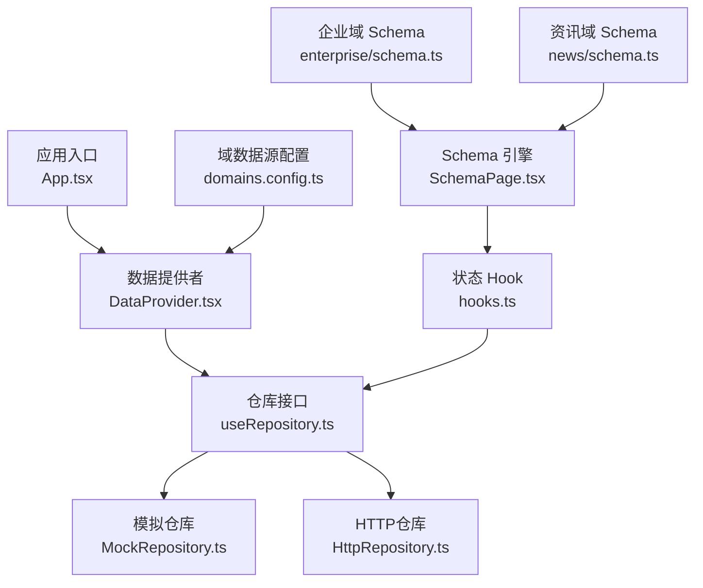
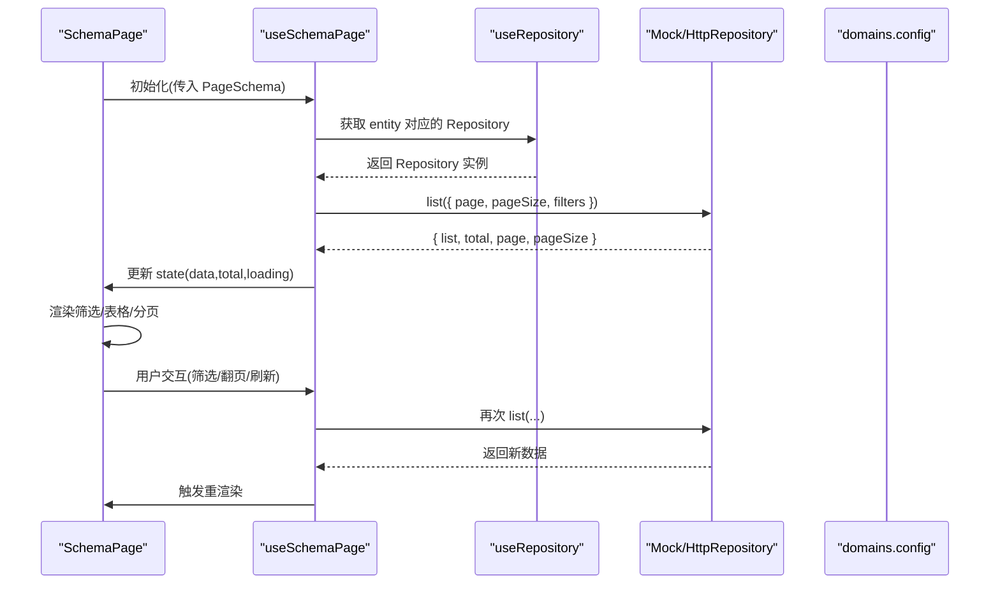
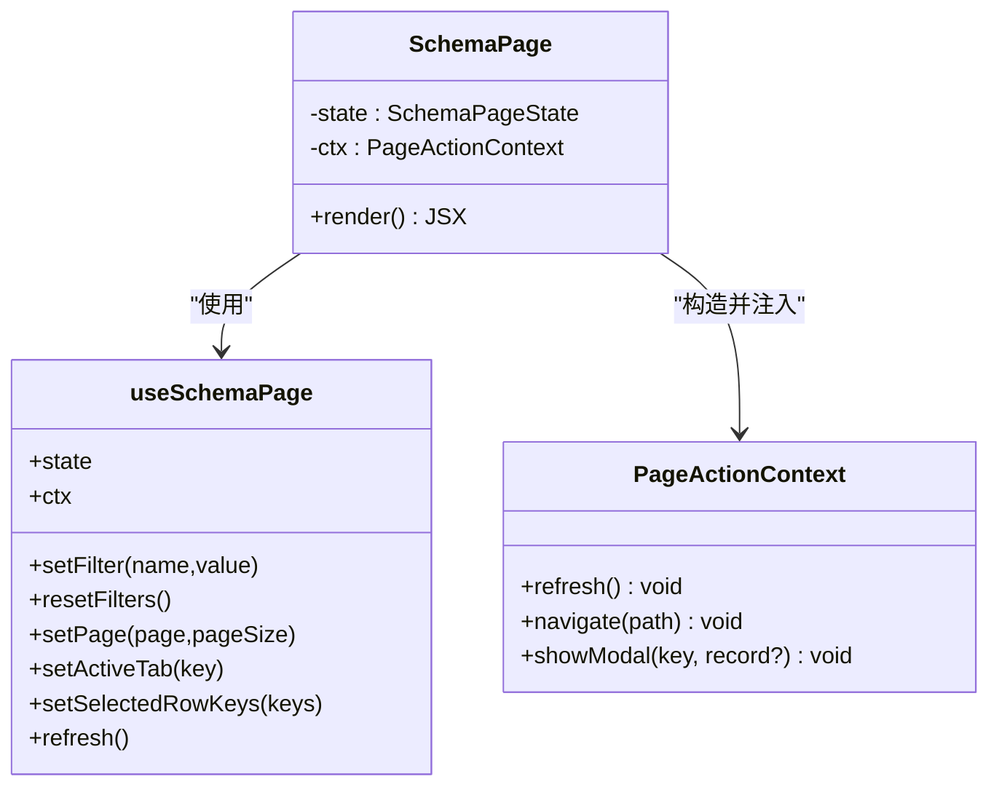
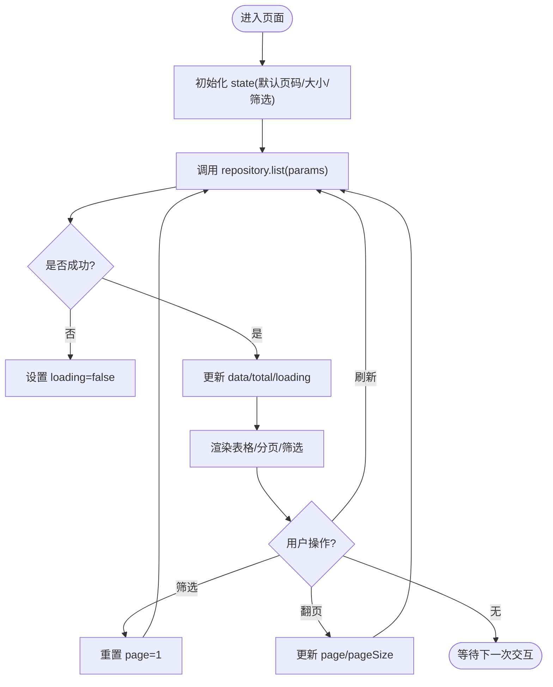
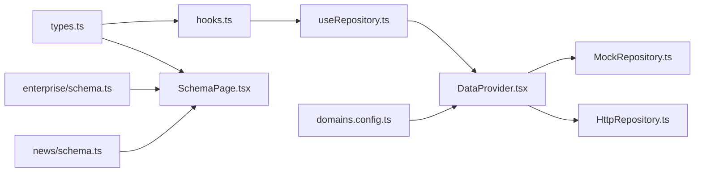

# 状态管理模式

<cite>
**本文引用的文件**
- [App.tsx](file://hj-admin/src/app/App.tsx)
- [SchemaPage.tsx](file://hj-admin/src/shared/schema-engine/SchemaPage.tsx)
- [hooks.ts](file://hj-admin/src/shared/schema-engine/hooks.ts)
- [types.ts](file://hj-admin/src/shared/schema-engine/types.ts)
- [DataProvider.tsx](file://hj-admin/src/shared/data/DataProvider.tsx)
- [useRepository.ts](file://hj-admin/src/shared/data/useRepository.ts)
- [HttpRepository.ts](file://hj-admin/src/shared/data/HttpRepository.ts)
- [MockRepository.ts](file://hj-admin/src/shared/data/MockRepository.ts)
- [domains.config.ts](file://hj-admin/src/config/domains.config.ts)
- [enterprise/schema.ts](file://hj-admin/src/domains/enterprise/schema.ts)
- [news/schema.ts](file://hj-admin/src/domains/news/schema.ts)
- [enterprise/repository.ts](file://hj-admin/src/domains/enterprise/repository.ts)
- [news/repository.ts](file://hj-admin/src/domains/news/repository.ts)
- [EnterpriseEditPage.tsx](file://hj-admin/src/domains/enterprise/pages/EnterpriseEditPage.tsx)
- [NewsEditPage.tsx](file://hj-admin/src/domains/news/pages/NewsEditPage.tsx)
</cite>

## 目录
1. [引言](#引言)
2. [项目结构](#项目结构)
3. [核心组件](#核心组件)
4. [架构总览](#架构总览)
5. [详细组件分析](#详细组件分析)
6. [依赖关系分析](#依赖关系分析)
7. [性能考虑](#性能考虑)
8. [故障排查指南](#故障排查指南)
9. [结论](#结论)
10. [附录](#附录)

## 引言
本文件面向氢界大数据平台，系统化阐述基于 Schema 驱动的状态管理模式。重点覆盖：
- 声明式配置驱动的 CRUD 状态管理（列表、筛选、分页、行操作、批量操作、弹窗）
- PageActionContext 上下文对象的设计与使用（refresh、navigate、showModal）
- 本地状态与远程数据的同步策略
- 表单状态管理与验证模式（含复杂表单）
- 状态持久化方案（URL 同步与本地存储）
- 最佳实践与性能优化建议

## 项目结构
整体采用“域 + Schema + 渲染引擎”的分层组织方式：
- 应用入口负责挂载 Provider 链与路由
- 数据层通过 DataProvider 按域注册 Repository（Mock/HTTP），统一对外提供 list/get/create/update/delete
- 渲染层通过 SchemaPage 将 PageSchema 自动渲染为筛选栏、表格、分页、Tab、行操作等
- 业务域通过 schema.ts 声明页面行为，repository.ts 注入 Mock 数据或切换为 HTTP

图表来源
- [App.tsx:1-21](file://hj-admin/src/app/App.tsx#L1-L21)
- [DataProvider.tsx:1-44](file://hj-admin/src/shared/data/DataProvider.tsx#L1-L44)
- [useRepository.ts:1-24](file://hj-admin/src/shared/data/useRepository.ts#L1-L24)
- [MockRepository.ts:1-101](file://hj-admin/src/shared/data/MockRepository.ts#L1-L101)
- [HttpRepository.ts:1-70](file://hj-admin/src/shared/data/HttpRepository.ts#L1-L70)
- [SchemaPage.tsx:1-226](file://hj-admin/src/shared/schema-engine/SchemaPage.tsx#L1-L226)
- [hooks.ts:1-106](file://hj-admin/src/shared/schema-engine/hooks.ts#L1-L106)
- [domains.config.ts:1-18](file://hj-admin/src/config/domains.config.ts#L1-L18)
- [enterprise/schema.ts:1-64](file://hj-admin/src/domains/enterprise/schema.ts#L1-L64)
- [news/schema.ts:1-123](file://hj-admin/src/domains/news/schema.ts#L1-L123)

章节来源
- [App.tsx:1-21](file://hj-admin/src/app/App.tsx#L1-L21)
- [DataProvider.tsx:1-44](file://hj-admin/src/shared/data/DataProvider.tsx#L1-L44)
- [domains.config.ts:1-18](file://hj-admin/src/config/domains.config.ts#L1-L18)

## 核心组件
- SchemaPage：通用列表页渲染器，根据 PageSchema 自动渲染筛选栏、Tab、表格、分页、行操作等，是“写配置即写页面”的核心
- useSchemaPage：封装页面级状态（loading、data、total、page、pageSize、filters、activeTab、selectedRowKeys）与数据加载逻辑
- PageActionContext：在行操作/工具栏操作中提供 refresh、navigate、showModal 能力
- DataProvider/useRepository：按域注册并获取 Repository，屏蔽 Mock/HTTP 差异
- HttpRepository/MockRepository：统一的 CRUD 接口实现，分别对接后端 API 与内存数据

章节来源
- [SchemaPage.tsx:1-226](file://hj-admin/src/shared/schema-engine/SchemaPage.tsx#L1-L226)
- [hooks.ts:1-106](file://hj-admin/src/shared/schema-engine/hooks.ts#L1-L106)
- [types.ts:1-216](file://hj-admin/src/shared/schema-engine/types.ts#L1-L216)
- [DataProvider.tsx:1-44](file://hj-admin/src/shared/data/DataProvider.tsx#L1-L44)
- [useRepository.ts:1-24](file://hj-admin/src/shared/data/useRepository.ts#L1-L24)
- [HttpRepository.ts:1-70](file://hj-admin/src/shared/data/HttpRepository.ts#L1-L70)
- [MockRepository.ts:1-101](file://hj-admin/src/shared/data/MockRepository.ts#L1-L101)

## 架构总览
下图展示了从页面到数据源的完整调用链路，以及状态在组件与 Hook 之间的流转。

图表来源
- [SchemaPage.tsx:76-110](file://hj-admin/src/shared/schema-engine/SchemaPage.tsx#L76-L110)
- [hooks.ts:20-57](file://hj-admin/src/shared/schema-engine/hooks.ts#L20-L57)
- [useRepository.ts:8-23](file://hj-admin/src/shared/data/useRepository.ts#L8-L23)
- [MockRepository.ts:20-67](file://hj-admin/src/shared/data/MockRepository.ts#L20-L67)
- [HttpRepository.ts:29-46](file://hj-admin/src/shared/data/HttpRepository.ts#L29-L46)
- [domains.config.ts:7-17](file://hj-admin/src/config/domains.config.ts#L7-L17)

## 详细组件分析

### SchemaPage 与 PageActionContext
- 作用：接收 PageSchema，内部组合 useSchemaPage 提供的状态与方法，渲染筛选栏、Tab、表格、分页、行操作；同时构造 PageActionContext 注入给行操作回调
- PageActionContext 字段：
  - refresh：刷新当前列表数据
  - navigate：跳转到指定路径（支持 :id 占位符替换）
  - showModal：打开对应 key 的弹窗（当前为占位，可在扩展中接入 Modal/Drawer）
- 行操作处理：
  - 支持 visible 条件显示
  - 支持 confirm 确认提示
  - 支持 navigateTo 声明式导航
  - 支持 onClick(record, ctx) 自定义逻辑

图表来源
- [SchemaPage.tsx:76-142](file://hj-admin/src/shared/schema-engine/SchemaPage.tsx#L76-L142)
- [hooks.ts:83-105](file://hj-admin/src/shared/schema-engine/hooks.ts#L83-L105)
- [types.ts:210-216](file://hj-admin/src/shared/schema-engine/types.ts#L210-L216)

章节来源
- [SchemaPage.tsx:76-142](file://hj-admin/src/shared/schema-engine/SchemaPage.tsx#L76-L142)
- [hooks.ts:83-105](file://hj-admin/src/shared/schema-engine/hooks.ts#L83-L105)
- [types.ts:210-216](file://hj-admin/src/shared/schema-engine/types.ts#L210-L216)

### 状态同步机制（本地状态与远程数据）
- 本地状态：由 useSchemaPage 维护 loading、data、total、page、pageSize、filters、activeTab、selectedRowKeys
- 远程数据：通过 repository.list(params) 拉取，params 包含 page、pageSize、filters、search、sort
- 同步策略：
  - 初次加载：useEffect 监听 page/pageSize/filters 变化触发 fetchData
  - 筛选变化：重置 page=1 并重新请求
  - 翻页：更新 page/pageSize 后触发请求
  - 刷新：显式调用 refresh 触发一次 fetchData
  - 错误处理：catch 分支设置 loading=false，避免卡死

图表来源
- [hooks.ts:20-57](file://hj-admin/src/shared/schema-engine/hooks.ts#L20-L57)
- [MockRepository.ts:20-67](file://hj-admin/src/shared/data/MockRepository.ts#L20-L67)
- [HttpRepository.ts:29-46](file://hj-admin/src/shared/data/HttpRepository.ts#L29-L46)

章节来源
- [hooks.ts:20-57](file://hj-admin/src/shared/schema-engine/hooks.ts#L20-L57)
- [MockRepository.ts:20-67](file://hj-admin/src/shared/data/MockRepository.ts#L20-L67)
- [HttpRepository.ts:29-46](file://hj-admin/src/shared/data/HttpRepository.ts#L29-L46)

### 表单状态管理与验证模式
- 简单表单：可使用 FormSchema.fields 定义字段类型、必填、选项、联动等，结合 Ant Design Form 进行受控绑定与校验
- 复杂表单：如企业编辑页、资讯编辑页，适合使用自定义组件，自行管理局部状态（useState）、跨区块联动、异步提交
- 验证模式建议：
  - 前端即时校验（必填、格式、范围）
  - 提交前二次校验（服务端字段约束）
  - 错误信息集中展示（顶部提示 + 字段级错误）
- 复杂表单状态处理：
  - 分区块状态隔离（基本信息、关联确认、分类等）
  - 依赖解锁（如先完成关联再解锁分类）
  - 草稿暂存（本地存储或后端暂存接口）

章节来源
- [types.ts:106-129](file://hj-admin/src/shared/schema-engine/types.ts#L106-L129)
- [EnterpriseEditPage.tsx:1-117](file://hj-admin/src/domains/enterprise/pages/EnterpriseEditPage.tsx#L1-L117)
- [NewsEditPage.tsx:1-166](file://hj-admin/src/domains/news/pages/NewsEditPage.tsx#L1-L166)

### 状态持久化方案
- URL 状态同步：
  - 将关键查询参数（如 keyword、status、source、dateRange）映射到 URL query，便于分享与回退
  - 页面初始化时从 URL 读取并回填 filters，用户修改 filters 时同步写入 URL
- 本地存储：
  - 使用 localStorage/sessionStorage 缓存最近筛选条件、分页大小、展开 Tab 等
  - 注意键名冲突与过期清理策略
- 服务端持久化：
  - 对重要筛选视图可保存为“我的筛选”，供后续复用

[本节为概念性说明，不直接分析具体文件]

### 数据源切换与 Repository 抽象
- 通过 domains.config.ts 配置每个域的数据源模式（mock/http）
- DataProvider 根据配置创建对应 Repository 实例并注入 DataContext
- useRepository 按 entity 名称获取 Repository，未找到时返回空操作的 fallback，避免运行时崩溃
- 切换至 http 后，无需改动 Schema 与页面代码

章节来源
- [domains.config.ts:1-18](file://hj-admin/src/config/domains.config.ts#L1-L18)
- [DataProvider.tsx:26-41](file://hj-admin/src/shared/data/DataProvider.tsx#L26-L41)
- [useRepository.ts:8-23](file://hj-admin/src/shared/data/useRepository.ts#L8-L23)
- [HttpRepository.ts:1-70](file://hj-admin/src/shared/data/HttpRepository.ts#L1-L70)
- [MockRepository.ts:1-101](file://hj-admin/src/shared/data/MockRepository.ts#L1-L101)

### 领域示例：企业与资讯
- 企业域：
  - 提供待处理池与已确认池两个页面 Schema，包含筛选、列渲染、行操作、Tab 分组
  - 通过 enterprise/repository.ts 注册 mock 数据
- 资讯域：
  - 提供资讯池、已发布资讯、数据源管理等页面 Schema
  - 通过 news/repository.ts 注册 mock 数据

章节来源
- [enterprise/schema.ts:1-64](file://hj-admin/src/domains/enterprise/schema.ts#L1-L64)
- [enterprise/repository.ts:1-6](file://hj-admin/src/domains/enterprise/repository.ts#L1-L6)
- [news/schema.ts:1-123](file://hj-admin/src/domains/news/schema.ts#L1-L123)
- [news/repository.ts:1-11](file://hj-admin/src/domains/news/repository.ts#L1-L11)

## 依赖关系分析
- 低耦合高内聚：
  - SchemaPage 仅依赖 hooks 与 types，不关心数据源细节
  - useSchemaPage 仅依赖 useRepository，屏蔽 Mock/HTTP 差异
  - DataProvider 集中管理各域 Repository 的生命周期
- 外部依赖：
  - antd 提供 UI 组件
  - react-router-dom 提供路由能力
- 潜在循环依赖：
  - 当前未见循环引用，但需避免在 domain 模块中反向引入 shared 层中的具体实现类

图表来源
- [types.ts:1-216](file://hj-admin/src/shared/schema-engine/types.ts#L1-L216)
- [hooks.ts:1-106](file://hj-admin/src/shared/schema-engine/hooks.ts#L1-L106)
- [SchemaPage.tsx:1-226](file://hj-admin/src/shared/schema-engine/SchemaPage.tsx#L1-L226)
- [useRepository.ts:1-24](file://hj-admin/src/shared/data/useRepository.ts#L1-L24)
- [DataProvider.tsx:1-44](file://hj-admin/src/shared/data/DataProvider.tsx#L1-L44)
- [MockRepository.ts:1-101](file://hj-admin/src/shared/data/MockRepository.ts#L1-L101)
- [HttpRepository.ts:1-70](file://hj-admin/src/shared/data/HttpRepository.ts#L1-L70)
- [domains.config.ts:1-18](file://hj-admin/src/config/domains.config.ts#L1-L18)
- [enterprise/schema.ts:1-64](file://hj-admin/src/domains/enterprise/schema.ts#L1-L64)
- [news/schema.ts:1-123](file://hj-admin/src/domains/news/schema.ts#L1-L123)

章节来源
- [types.ts:1-216](file://hj-admin/src/shared/schema-engine/types.ts#L1-L216)
- [hooks.ts:1-106](file://hj-admin/src/shared/schema-engine/hooks.ts#L1-L106)
- [SchemaPage.tsx:1-226](file://hj-admin/src/shared/schema-engine/SchemaPage.tsx#L1-L226)
- [useRepository.ts:1-24](file://hj-admin/src/shared/data/useRepository.ts#L1-L24)
- [DataProvider.tsx:1-44](file://hj-admin/src/shared/data/DataProvider.tsx#L1-L44)
- [MockRepository.ts:1-101](file://hj-admin/src/shared/data/MockRepository.ts#L1-L101)
- [HttpRepository.ts:1-70](file://hj-admin/src/shared/data/HttpRepository.ts#L1-L70)
- [domains.config.ts:1-18](file://hj-admin/src/config/domains.config.ts#L1-L18)
- [enterprise/schema.ts:1-64](file://hj-admin/src/domains/enterprise/schema.ts#L1-L64)
- [news/schema.ts:1-123](file://hj-admin/src/domains/news/schema.ts#L1-L123)

## 性能考虑
- 减少不必要的重渲染：
  - 使用 useMemo 包裹 columns、actionColumn、displayData 等计算结果
  - 将高频回调用 useCallback 稳定引用
- 分页与筛选：
  - 优先服务端分页与过滤，避免全量数据在前端处理
  - 大列表开启虚拟滚动（当数据量极大时）
- 网络请求：
  - 合并重复请求（防抖/节流）
  - 合理设置超时与重试策略
- 渲染优化：
  - 固定列宽、按需渲染列内容
  - 长文本使用 ellipsis 与 Tooltip
- 状态最小化：
  - 仅保留必要状态，避免在 state 中存放派生数据

[本节为通用指导，不直接分析具体文件]

## 故障排查指南
- Repository 未注册：
  - 现象：控制台警告提示 entity 未找到，返回空操作
  - 排查：检查 domains.config.ts 与 useRepository 的 entity 名称是否一致
- 数据为空或加载失败：
  - 现象：loading 一直为 true 或列表为空
  - 排查：查看 fetch 异常分支是否正确设置 loading=false；检查后端返回结构与 PageResult 约定
- 筛选无效：
  - 现象：筛选条件未生效
  - 排查：确认 filters 字段名与后端 filter.* 参数命名一致；MockRepository 的过滤逻辑是否匹配
- 行操作未触发：
  - 现象：点击行操作无响应
  - 排查：检查 visible 条件、confirm 确认、navigateTo 路径是否正确；onClick 是否被正确传递 ctx

章节来源
- [useRepository.ts:11-23](file://hj-admin/src/shared/data/useRepository.ts#L11-L23)
- [hooks.ts:48-52](file://hj-admin/src/shared/schema-engine/hooks.ts#L48-L52)
- [MockRepository.ts:35-45](file://hj-admin/src/shared/data/MockRepository.ts#L35-L45)
- [HttpRepository.ts:20-27](file://hj-admin/src/shared/data/HttpRepository.ts#L20-L27)

## 结论
该状态管理模式以 Schema 为核心，将页面行为声明化，配合 useSchemaPage 统一管理本地状态与远程数据，通过 DataProvider/useRepository 抽象数据源，实现了“配置即页面”的高效开发体验。PageActionContext 提供了标准化的操作上下文，便于在行操作与工具栏中复用刷新、导航与弹窗能力。结合 URL 同步与本地存储，可实现良好的用户体验与可分享性。在生产环境中，逐步将数据源切换为 HTTP，并持续优化渲染与网络请求，可获得更稳定的性能表现。

## 附录
- 快速上手清单：
  - 在 domains.config.ts 中配置域的数据源模式
  - 在 domain/schema.ts 中声明 PageSchema
  - 在 domain/repository.ts 中注册 Mock 数据（或切换为 HTTP）
  - 在路由中指向 SchemaPage 或自定义组件
- 扩展点：
  - 在 SchemaPage 中增强 showModal 的实现，支持动态弹窗与表单提交
  - 在 useSchemaPage 中增加 URL 同步逻辑，将 filters/page 等状态持久化到地址栏
  - 在 Repository 层增加缓存与并发控制

[本节为补充说明，不直接分析具体文件]