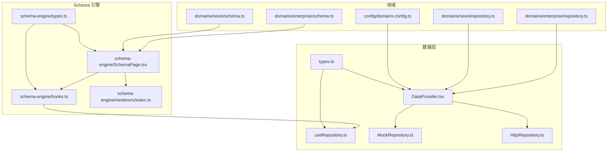
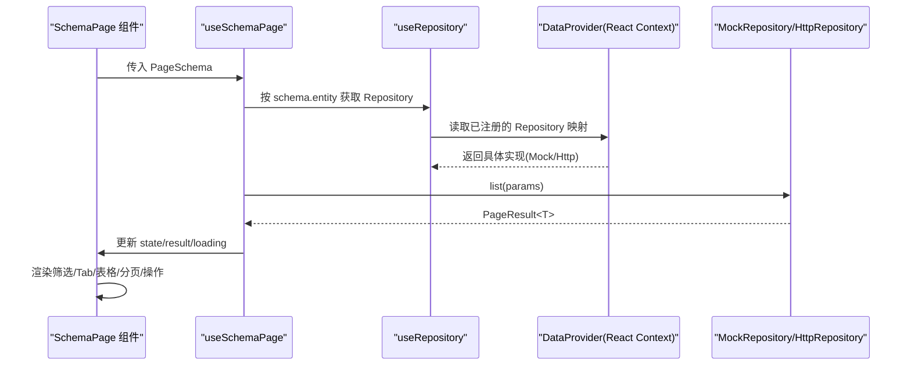
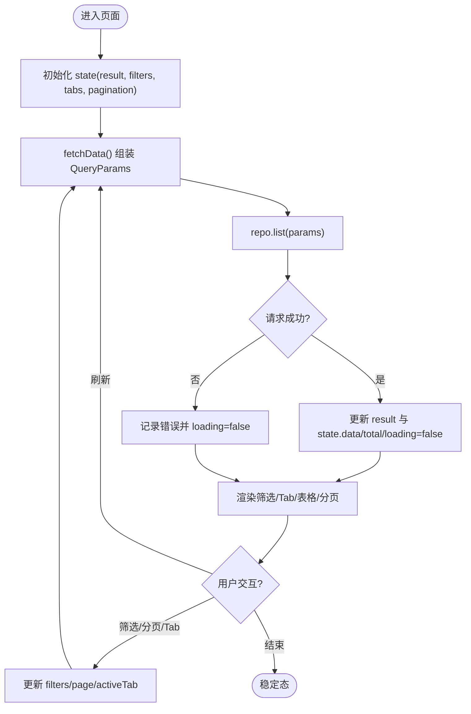
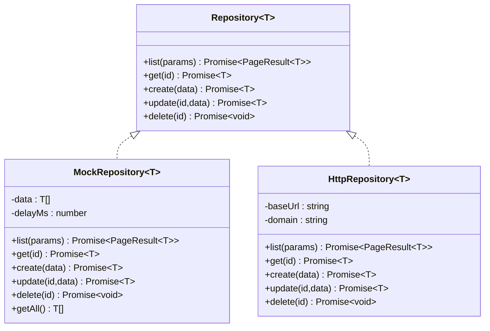
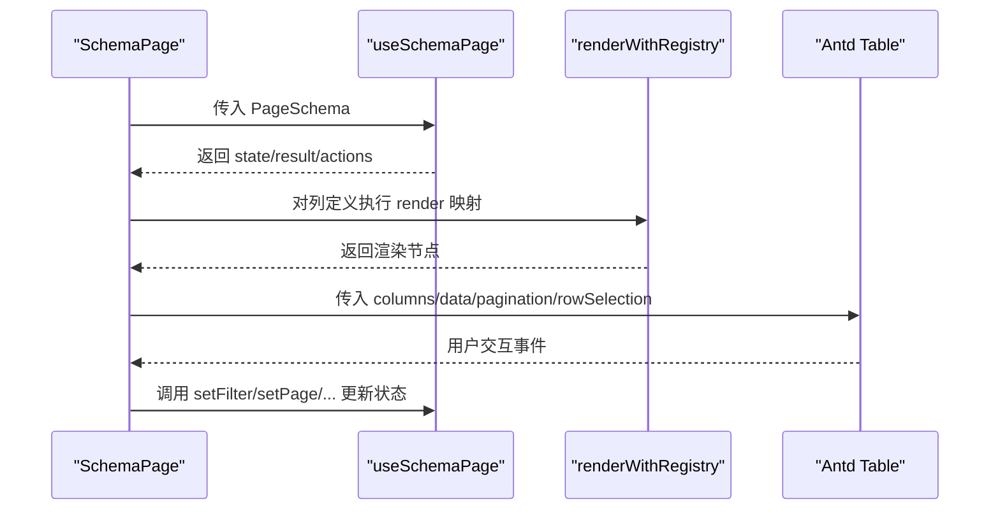
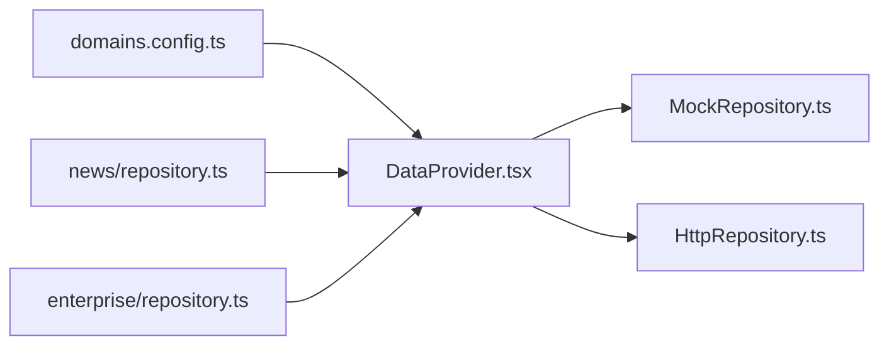
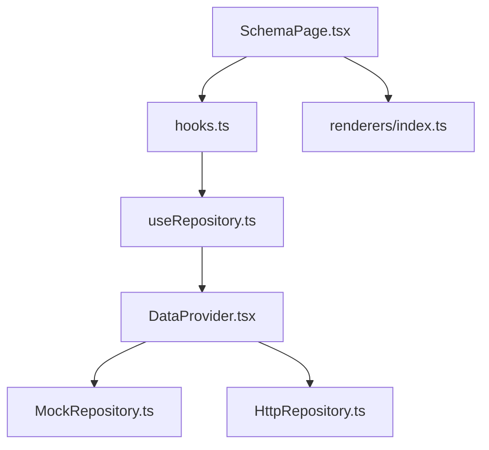

# 页面状态管理

<cite>
**本文引用的文件**
- [src/shared/schema-engine/hooks.ts](file://src/shared/schema-engine/hooks.ts)
- [src/shared/schema-engine/types.ts](file://src/shared/schema-engine/types.ts)
- [src/shared/schema-engine/renderers/index.ts](file://src/shared/schema-engine/renderers/index.ts)
- [src/shared/data/useRepository.ts](file://src/shared/data/useRepository.ts)
- [src/shared/data/DataProvider.tsx](file://src/shared/data/DataProvider.tsx)
- [src/shared/data/MockRepository.ts](file://src/shared/data/MockRepository.ts)
- [src/shared/data/HttpRepository.ts](file://src/shared/data/HttpRepository.ts)
- [src/shared/data/types.ts](file://src/shared/data/types.ts)
- [src/config/domains.config.ts](file://src/config/domains.config.ts)
- [src/shared/schema-engine/SchemaPage.tsx](file://src/shared/schema-engine/SchemaPage.tsx)
- [src/domains/news/schema.ts](file://src/domains/news/schema.ts)
- [src/domains/news/repository.ts](file://src/domains/news/repository.ts)
- [src/domains/enterprise/schema.ts](file://src/domains/enterprise/schema.ts)
- [src/domains/enterprise/repository.ts](file://src/domains/enterprise/repository.ts)
</cite>

## 目录
1. [简介](#简介)
2. [项目结构](#项目结构)
3. [核心组件](#核心组件)
4. [架构总览](#架构总览)
5. [详细组件分析](#详细组件分析)
6. [依赖关系分析](#依赖关系分析)
7. [性能与缓存](#性能与缓存)
8. [故障排查指南](#故障排查指南)
9. [结论](#结论)
10. [附录：最佳实践与扩展建议](#附录最佳实践与扩展建议)

## 简介
本文件面向氢界大数据平台的“页面状态管理”能力，围绕 Schema 驱动的状态管理模式展开，重点说明以下内容：
- useSchemaPage Hook 的设计模式与实现原理：包括筛选、分页、Tab、选中行、数据加载等状态的统一管理与自动刷新。
- useRepository Hook 的使用方法：在任意组件中获取域 Repository，完成数据查询、更新、删除等操作的状态管理。
- Schema 驱动的 CRUD 自动生成：通过 PageSchema 配置自动生成列表页的筛选、表格、分页、操作列、弹窗等逻辑。
- 异步处理模式：统一的 loading、错误处理与重试机制（可扩展）。
- 表单状态管理与验证策略：基于 FormSchema 的声明式表单渲染与校验（类型定义完备，渲染器可接入）。
- 状态持久化方案：URL 同步、本地存储与跨组件共享的策略建议。

## 项目结构
该项目的状态管理由“数据层抽象 + 领域注册 + Schema 引擎 + 通用页面渲染器”组成，核心文件分布如下：
- 数据层抽象与上下文：types.ts、useRepository.ts、DataProvider.tsx、MockRepository.ts、HttpRepository.ts
- Schema 引擎与类型：types.ts、hooks.ts、SchemaPage.tsx、renderers/index.ts
- 领域配置与示例：domains.config.ts、news/schema.ts、enterprise/schema.ts、各域 repository.ts

图表来源
- [src/shared/data/types.ts:1-36](file://src/shared/data/types.ts#L1-L36)
- [src/shared/data/useRepository.ts:1-24](file://src/shared/data/useRepository.ts#L1-L24)
- [src/shared/data/DataProvider.tsx:1-44](file://src/shared/data/DataProvider.tsx#L1-L44)
- [src/shared/data/MockRepository.ts:1-101](file://src/shared/data/MockRepository.ts#L1-L101)
- [src/shared/data/HttpRepository.ts:1-70](file://src/shared/data/HttpRepository.ts#L1-L70)
- [src/shared/schema-engine/types.ts:1-216](file://src/shared/schema-engine/types.ts#L1-L216)
- [src/shared/schema-engine/hooks.ts:1-106](file://src/shared/schema-engine/hooks.ts#L1-L106)
- [src/shared/schema-engine/SchemaPage.tsx:1-226](file://src/shared/schema-engine/SchemaPage.tsx#L1-L226)
- [src/config/domains.config.ts:1-18](file://src/config/domains.config.ts#L1-L18)
- [src/domains/news/schema.ts:1-123](file://src/domains/news/schema.ts#L1-L123)
- [src/domains/enterprise/schema.ts:1-64](file://src/domains/enterprise/schema.ts#L1-L64)
- [src/domains/news/repository.ts:1-11](file://src/domains/news/repository.ts#L1-L11)
- [src/domains/enterprise/repository.ts:1-6](file://src/domains/enterprise/repository.ts#L1-L6)

章节来源
- [src/shared/data/types.ts:1-36](file://src/shared/data/types.ts#L1-L36)
- [src/shared/data/useRepository.ts:1-24](file://src/shared/data/useRepository.ts#L1-L24)
- [src/shared/data/DataProvider.tsx:1-44](file://src/shared/data/DataProvider.tsx#L1-L44)
- [src/shared/data/MockRepository.ts:1-101](file://src/shared/data/MockRepository.ts#L1-L101)
- [src/shared/data/HttpRepository.ts:1-70](file://src/shared/data/HttpRepository.ts#L1-L70)
- [src/shared/schema-engine/types.ts:1-216](file://src/shared/schema-engine/types.ts#L1-L216)
- [src/shared/schema-engine/hooks.ts:1-106](file://src/shared/schema-engine/hooks.ts#L1-L106)
- [src/shared/schema-engine/SchemaPage.tsx:1-226](file://src/shared/schema-engine/SchemaPage.tsx#L1-L226)
- [src/config/domains.config.ts:1-18](file://src/config/domains.config.ts#L1-L18)
- [src/domains/news/schema.ts:1-123](file://src/domains/news/schema.ts#L1-L123)
- [src/domains/enterprise/schema.ts:1-64](file://src/domains/enterprise/schema.ts#L1-L64)
- [src/domains/news/repository.ts:1-11](file://src/domains/news/repository.ts#L1-L11)
- [src/domains/enterprise/repository.ts:1-6](file://src/domains/enterprise/repository.ts#L1-L6)

## 核心组件
- useSchemaPage Hook：封装页面级状态（loading、data、total、page、pageSize、filters、activeTab、selectedRowKeys），提供 setFilter/resetFilters/setPage/setActiveTab/setSelectedRowKeys/refresh 等方法，并维护 result 结果集用于外部消费。
- useRepository Hook：从 DataProvider 上下文中按 entity 名称获取对应 Repository 实例，若未注册则返回空操作的 fallback，避免运行时崩溃。
- DataProvider：根据 domains.config.ts 为每个域创建 MockRepository 或 HttpRepository，并通过 React Context 暴露给子树。
- SchemaPage 组件：读取 PageSchema，自动渲染筛选栏、Tab、表格、分页、行操作、批量操作、工具栏等；结合 renderers 注册表进行字段渲染。
- Repository 接口与实现：统一 list/get/create/update/delete 契约；MockRepository 提供内存过滤/分页/排序与延迟模拟；HttpRepository 提供 RESTful 请求封装。

章节来源
- [src/shared/schema-engine/hooks.ts:1-106](file://src/shared/schema-engine/hooks.ts#L1-L106)
- [src/shared/data/useRepository.ts:1-24](file://src/shared/data/useRepository.ts#L1-L24)
- [src/shared/data/DataProvider.tsx:1-44](file://src/shared/data/DataProvider.tsx#L1-L44)
- [src/shared/schema-engine/SchemaPage.tsx:1-226](file://src/shared/schema-engine/SchemaPage.tsx#L1-L226)
- [src/shared/data/types.ts:1-36](file://src/shared/data/types.ts#L1-L36)
- [src/shared/data/MockRepository.ts:1-101](file://src/shared/data/MockRepository.ts#L1-L101)
- [src/shared/data/HttpRepository.ts:1-70](file://src/shared/data/HttpRepository.ts#L1-L70)

## 架构总览
下图展示了 Schema 驱动页面的端到端流程：Schema 描述页面结构与行为，SchemaPage 使用 useSchemaPage 管理状态，useSchemaPage 通过 useRepository 获取 Repository，最终由 MockRepository 或 HttpRepository 完成数据访问。

图表来源
- [src/shared/schema-engine/hooks.ts:1-106](file://src/shared/schema-engine/hooks.ts#L1-L106)
- [src/shared/data/useRepository.ts:1-24](file://src/shared/data/useRepository.ts#L1-L24)
- [src/shared/data/DataProvider.tsx:1-44](file://src/shared/data/DataProvider.tsx#L1-L44)
- [src/shared/data/MockRepository.ts:1-101](file://src/shared/data/MockRepository.ts#L1-L101)
- [src/shared/data/HttpRepository.ts:1-70](file://src/shared/data/HttpRepository.ts#L1-L70)

## 详细组件分析

### useSchemaPage Hook 设计与实现
- 状态模型
  - loading：是否加载中
  - data：当前页数据数组
  - total：总条数
  - page/pageSize：分页参数
  - filters：筛选条件集合
  - activeTab：当前激活 Tab
  - selectedRowKeys：选中行键集合
  - result：完整分页结果（list/total/page/pageSize）
- 数据获取与同步
  - fetchData 合并 page、pageSize、filters 与可选 overrides，调用 repo.list，成功后更新 result 与 state.loading=false，失败时仅关闭 loading。
  - useEffect 监听 page、pageSize、filters 变化触发重新加载。
- 交互方法
  - setFilter：设置单个筛选值并重置到第一页
  - resetFilters：清空筛选并回到第一页
  - setPage：切换页码或每页大小
  - setActiveTab：切换 Tab 并重置到第一页
  - setSelectedRowKeys：批量选择
  - refresh：手动刷新
- 操作上下文
  - ctx.refresh/navigate/showModal 预留注入点，SchemaPage 会注入真实 navigate 与 showModal。

图表来源
- [src/shared/schema-engine/hooks.ts:1-106](file://src/shared/schema-engine/hooks.ts#L1-L106)

章节来源
- [src/shared/schema-engine/hooks.ts:1-106](file://src/shared/schema-engine/hooks.ts#L1-L106)

### useRepository Hook 使用方法
- 用法
  - 在任意组件中调用 const repo = useRepository('entityName')，即可得到该域的 Repository 实例。
  - 支持泛型约束，如 useRepository<NewsItem>('news')。
- 未注册时的降级
  - 若未在 DataProvider 中注册对应 entity，将返回空操作的 fallback Repository，并在控制台输出警告，避免运行时崩溃。
- 典型操作
  - 列表：repo.list({ page, pageSize, filters, sort, search })
  - 详情：repo.get(id)
  - 新增：repo.create(data)
  - 更新：repo.update(id, data)
  - 删除：repo.delete(id)

图表来源
- [src/shared/data/types.ts:1-36](file://src/shared/data/types.ts#L1-L36)
- [src/shared/data/MockRepository.ts:1-101](file://src/shared/data/MockRepository.ts#L1-L101)
- [src/shared/data/HttpRepository.ts:1-70](file://src/shared/data/HttpRepository.ts#L1-L70)

章节来源
- [src/shared/data/useRepository.ts:1-24](file://src/shared/data/useRepository.ts#L1-L24)
- [src/shared/data/types.ts:1-36](file://src/shared/data/types.ts#L1-L36)
- [src/shared/data/MockRepository.ts:1-101](file://src/shared/data/MockRepository.ts#L1-L101)
- [src/shared/data/HttpRepository.ts:1-70](file://src/shared/data/HttpRepository.ts#L1-L70)

### Schema 驱动的页面生成
- PageSchema 描述页面结构：标题、描述、实体名、筛选、列、分页、行操作、批量操作、工具栏、弹窗、Tab、快捷筛选等。
- SchemaPage 组件解析 PageSchema：
  - 动态构建 Table columns，支持字符串渲染器引用与自定义函数。
  - 动态渲染筛选栏（select/input/dateRange 等）。
  - 动态渲染 Tab 分组与计数。
  - 动态渲染行操作（含导航、确认提示、可见性控制）。
  - 绑定分页与批量选择。
- 渲染器注册表：renderWithRegistry 将列定义的 render 字符串映射到具体渲染器（如 link、status-badge、percent、date-or-dash 等）。

图表来源
- [src/shared/schema-engine/SchemaPage.tsx:1-226](file://src/shared/schema-engine/SchemaPage.tsx#L1-L226)
- [src/shared/schema-engine/hooks.ts:1-106](file://src/shared/schema-engine/hooks.ts#L1-L106)
- [src/shared/schema-engine/renderers/index.ts](file://src/shared/schema-engine/renderers/index.ts)

章节来源
- [src/shared/schema-engine/types.ts:1-216](file://src/shared/schema-engine/types.ts#L1-L216)
- [src/shared/schema-engine/SchemaPage.tsx:1-226](file://src/shared/schema-engine/SchemaPage.tsx#L1-L226)
- [src/shared/schema-engine/renderers/index.ts](file://src/shared/schema-engine/renderers/index.ts)

### 领域数据源与注册
- 域配置：domains.config.ts 声明每个域的数据源模式（mock/http），切换时无需改动 Schema 与页面代码。
- DataProvider：遍历 domainConfig，为每个域创建对应的 Repository 实例，并通过 Context 提供。
- 领域注册：各域的 repository.ts 通过 registerMockData 向 DataProvider 注入初始数据（开发阶段）。

图表来源
- [src/config/domains.config.ts:1-18](file://src/config/domains.config.ts#L1-L18)
- [src/shared/data/DataProvider.tsx:1-44](file://src/shared/data/DataProvider.tsx#L1-L44)
- [src/domains/news/repository.ts:1-11](file://src/domains/news/repository.ts#L1-L11)
- [src/domains/enterprise/repository.ts:1-6](file://src/domains/enterprise/repository.ts#L1-L6)

章节来源
- [src/config/domains.config.ts:1-18](file://src/config/domains.config.ts#L1-L18)
- [src/shared/data/DataProvider.tsx:1-44](file://src/shared/data/DataProvider.tsx#L1-L44)
- [src/domains/news/repository.ts:1-11](file://src/domains/news/repository.ts#L1-L11)
- [src/domains/enterprise/repository.ts:1-6](file://src/domains/enterprise/repository.ts#L1-L6)

### 表单状态管理与验证策略
- 表单 Schema：FormSchema 与 FormFieldDef 定义了字段类型、必填、选项、占位符、默认值、布局、联动等。
- 渲染与校验：可在 SchemaPage 的 modals/formSchema 中声明表单，配合 renderers 或自定义组件渲染；校验规则可通过 required 与联动 handler 组合实现。
- 建议策略：
  - 基础校验：required、pattern、min/max 等。
  - 联动校验：linkage 字段变化后重新计算选项与校验。
  - 提交前校验：在 onClick 回调中集中校验并阻止提交。
  - 错误展示：统一错误消息容器，提升用户体验。

章节来源
- [src/shared/schema-engine/types.ts:106-174](file://src/shared/schema-engine/types.ts#L106-L174)

### 状态持久化方案
- URL 同步：将 page、pageSize、filters、activeTab 等关键状态同步到 URL 查询参数，便于分享与回退。
- 本地存储：对常用筛选与分页偏好进行 localStorage 持久化，提升复访体验。
- 跨组件共享：通过 DataProvider 或全局状态库（如 Zustand/Redux）共享复杂状态。
- 注意：对于敏感信息不建议持久化；确保序列化安全与版本兼容。

[本节为概念性内容，不直接分析具体文件]

## 依赖关系分析
- 低耦合高内聚
  - Repository 接口解耦数据源实现，Mock/Http 可自由替换。
  - useRepository 仅依赖 DataContext，屏蔽实现细节。
  - useSchemaPage 仅依赖 useRepository 与 types，专注状态编排。
  - SchemaPage 仅依赖 hooks 与 renderers，专注视图拼装。
- 潜在循环依赖
  - 当前未发现循环导入；保持单向依赖链：SchemaPage → hooks → useRepository → DataProvider → Repository 实现。
- 外部依赖
  - Ant Design 组件用于 UI 渲染。
  - react-router-dom 用于导航。

图表来源
- [src/shared/schema-engine/SchemaPage.tsx:1-226](file://src/shared/schema-engine/SchemaPage.tsx#L1-L226)
- [src/shared/schema-engine/hooks.ts:1-106](file://src/shared/schema-engine/hooks.ts#L1-L106)
- [src/shared/data/useRepository.ts:1-24](file://src/shared/data/useRepository.ts#L1-L24)
- [src/shared/data/DataProvider.tsx:1-44](file://src/shared/data/DataProvider.tsx#L1-L44)
- [src/shared/data/MockRepository.ts:1-101](file://src/shared/data/MockRepository.ts#L1-L101)
- [src/shared/data/HttpRepository.ts:1-70](file://src/shared/data/HttpRepository.ts#L1-L70)
- [src/shared/schema-engine/renderers/index.ts](file://src/shared/schema-engine/renderers/index.ts)

章节来源
- [src/shared/schema-engine/SchemaPage.tsx:1-226](file://src/shared/schema-engine/SchemaPage.tsx#L1-L226)
- [src/shared/schema-engine/hooks.ts:1-106](file://src/shared/schema-engine/hooks.ts#L1-L106)
- [src/shared/data/useRepository.ts:1-24](file://src/shared/data/useRepository.ts#L1-L24)
- [src/shared/data/DataProvider.tsx:1-44](file://src/shared/data/DataProvider.tsx#L1-L44)
- [src/shared/data/MockRepository.ts:1-101](file://src/shared/data/MockRepository.ts#L1-L101)
- [src/shared/data/HttpRepository.ts:1-70](file://src/shared/data/HttpRepository.ts#L1-L70)

## 性能与缓存
- 列表请求优化
  - 去抖：对关键词输入增加防抖，减少频繁请求。
  - 增量更新：对 create/update/delete 成功后局部更新 state，避免全量刷新。
  - 预取：对热门筛选条件预取下一页数据。
- 缓存策略
  - 内存缓存：对热点数据（如字典、枚举）做短期缓存。
  - 磁盘缓存：对静态配置（如 quickFilters/options）做持久化缓存。
  - 失效策略：写操作后主动失效相关缓存。
- 渲染优化
  - 大列表虚拟滚动：当数据量大时使用虚拟化表格。
  - 列渲染器复用：避免重复创建渲染函数。
  - useMemo/useCallback：减少不必要的重渲染。

[本节为通用指导，不直接分析具体文件]

## 故障排查指南
- 常见问题
  - 未注册 Repository：控制台出现警告，页面返回空数据。检查 domains.config.ts 与对应域的 repository.ts 是否正确注册。
  - 筛选无效：确认 filters 字段名与后端一致；MockRepository 使用精确匹配，HttpRepository 以 filter.xxx 形式拼接。
  - 分页异常：检查 page/pageSize 传递与后端期望是否一致。
  - 行操作无响应：检查 rowActions.visible 条件与 navigateTo 模板中的 :id 替换。
- 调试建议
  - 打开浏览器网络面板，查看请求参数与响应结构。
  - 在 useSchemaPage 的 fetchData 中打印 params 与 res。
  - 在 DataProvider 中打印创建的 Repository 映射。

章节来源
- [src/shared/data/useRepository.ts:1-24](file://src/shared/data/useRepository.ts#L1-L24)
- [src/shared/data/MockRepository.ts:1-101](file://src/shared/data/MockRepository.ts#L1-L101)
- [src/shared/data/HttpRepository.ts:1-70](file://src/shared/data/HttpRepository.ts#L1-L70)
- [src/shared/schema-engine/SchemaPage.tsx:1-226](file://src/shared/schema-engine/SchemaPage.tsx#L1-L226)

## 结论
通过 Schema 驱动与 Repository 抽象，平台实现了“配置即页面”的高效开发模式：
- useSchemaPage 统一管理页面状态与异步流程，降低样板代码。
- useRepository 提供统一数据访问契约，Mock/Http 无缝切换。
- SchemaPage 将复杂页面拆解为声明式配置，提升可维护性与可测试性。
- 未来可在此基础上扩展缓存、重试、URL 同步、表单校验与持久化等能力，进一步提升用户体验与工程效率。

[本节为总结性内容，不直接分析具体文件]

## 附录：最佳实践与扩展建议
- 新增页面
  - 在领域 schema.ts 中定义 PageSchema。
  - 在领域 repository.ts 中注册 mock 数据（或切换到 http）。
  - 在路由中指向 SchemaPage 并传入 schema。
- 扩展渲染器
  - 在 renderers/index.ts 中注册新的渲染器，并在列定义中使用字符串引用。
- 增强异步处理
  - 在 useSchemaPage 中增加重试次数、超时与错误上报。
- 表单与校验
  - 在 modals.formSchema 中声明表单字段与校验规则，结合联动与自定义校验函数。
- 状态持久化
  - 将 page/filters/activeTab 同步到 URL，并提供恢复入口。

[本节为概念性内容，不直接分析具体文件]