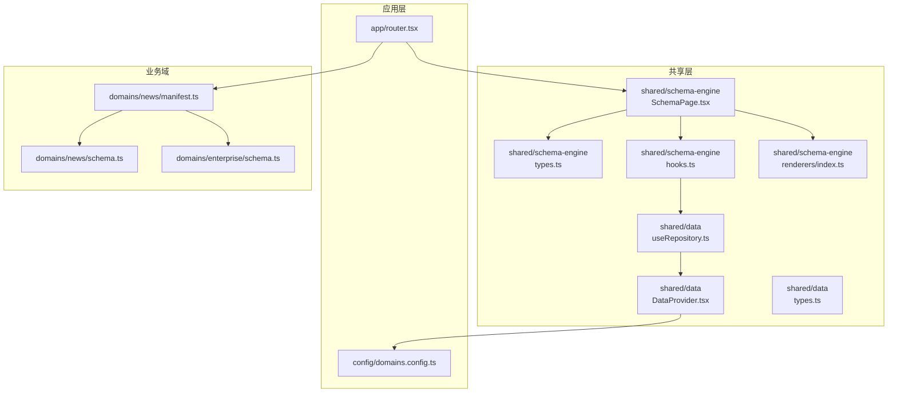
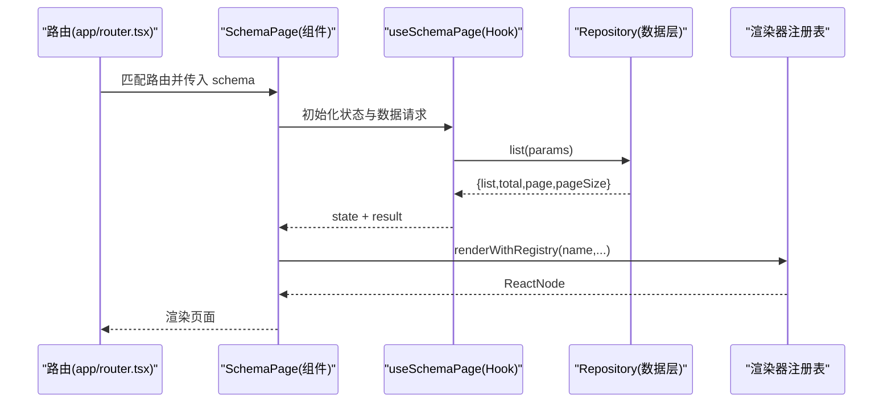
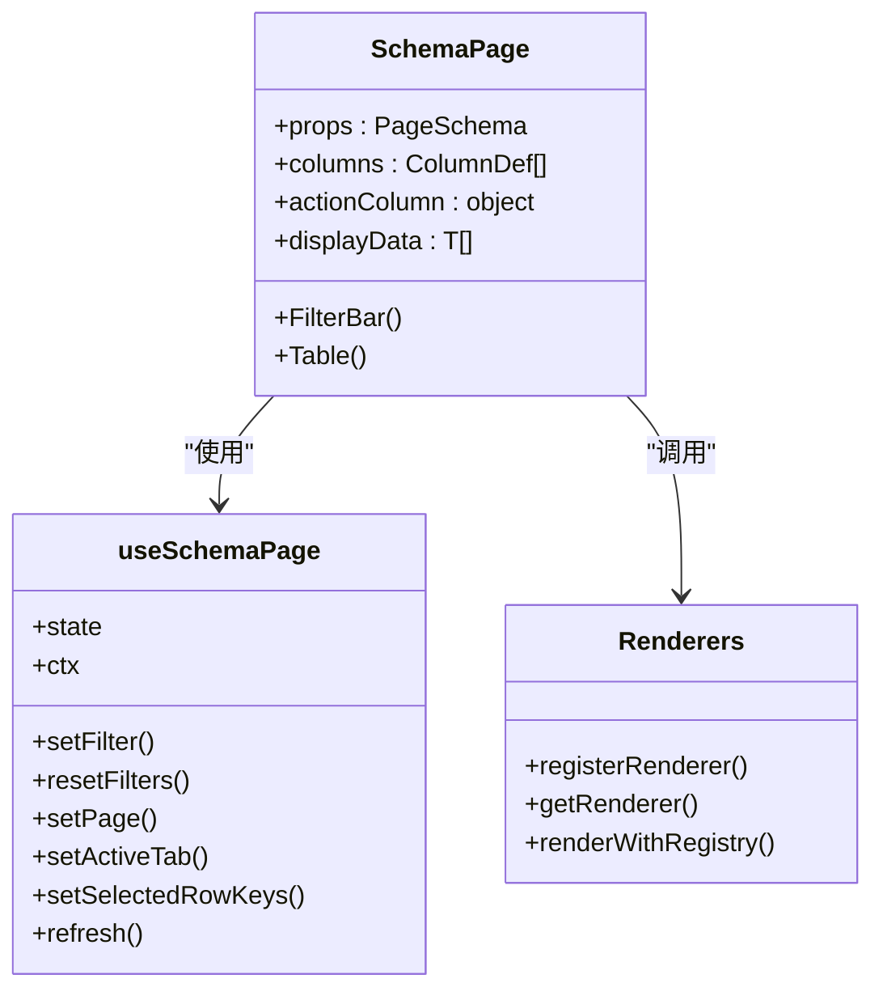
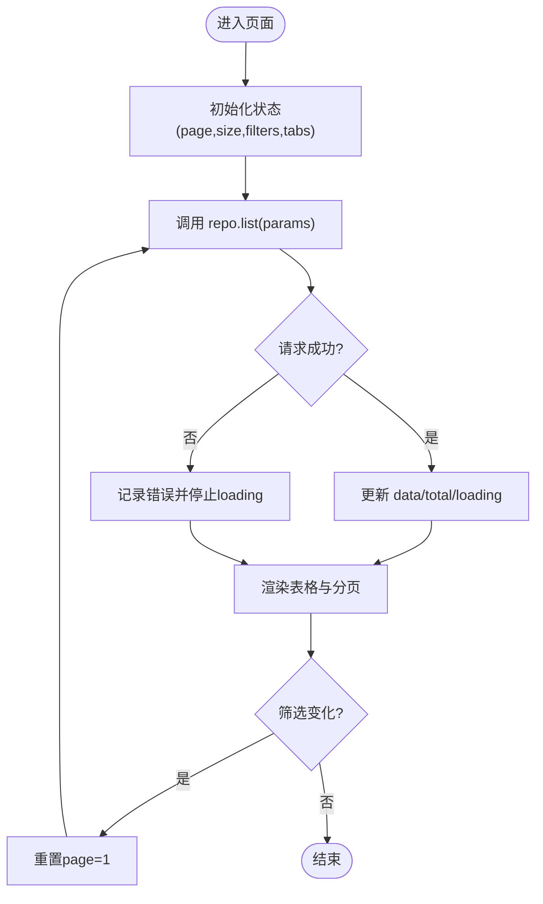
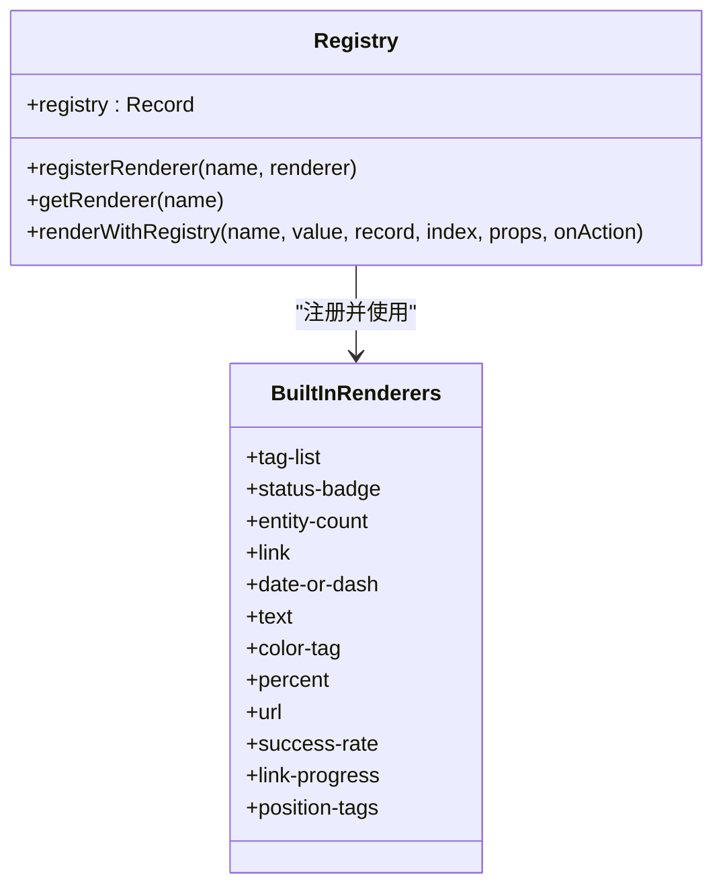
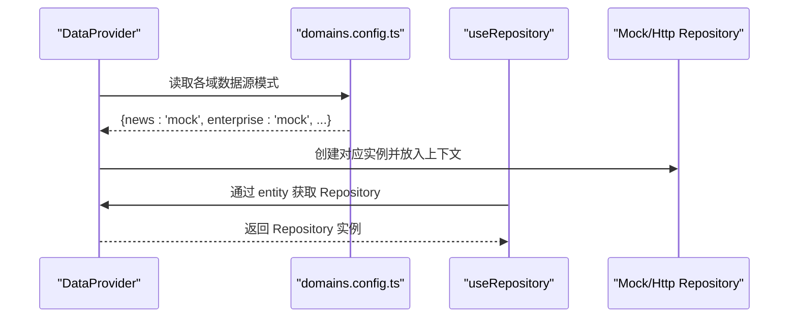
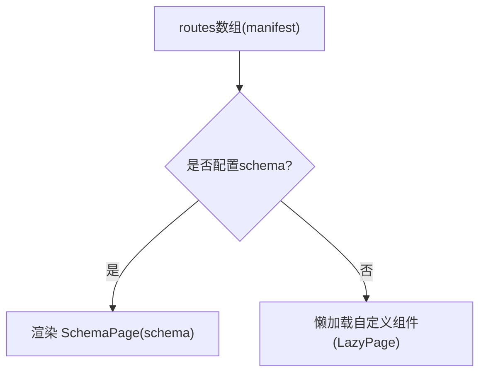
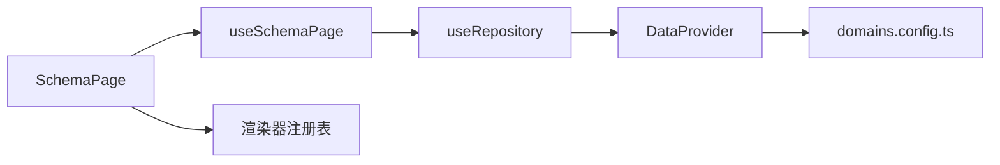

# SchemaPage配置驱动组件

<cite>
**本文引用的文件列表**
- [SchemaPage.tsx](file://hj-admin/src/shared/schema-engine/SchemaPage.tsx)
- [types.ts](file://hj-admin/src/shared/schema-engine/types.ts)
- [hooks.ts](file://hj-admin/src/shared/schema-engine/hooks.ts)
- [renderers/index.ts](file://hj-admin/src/shared/schema-engine/renderers/index.ts)
- [DataProvider.tsx](file://hj-admin/src/shared/data/DataProvider.tsx)
- [useRepository.ts](file://hj-admin/src/shared/data/useRepository.ts)
- [types.ts（数据层）](file://hj-admin/src/shared/data/types.ts)
- [router.tsx](file://hj-admin/src/app/router.tsx)
- [domains.config.ts](file://hj-admin/src/config/domains.config.ts)
- [schema.ts（资讯域）](file://hj-admin/src/domains/news/schema.ts)
- [manifest.ts（资讯域）](file://hj-admin/src/domains/news/manifest.ts)
- [schema.ts（企业域）](file://hj-admin/src/domains/enterprise/schema.ts)
</cite>

## 目录
1. [简介](#简介)
2. [项目结构](#项目结构)
3. [核心组件与能力](#核心组件与能力)
4. [架构总览](#架构总览)
5. [详细组件分析](#详细组件分析)
6. [依赖关系分析](#依赖关系分析)
7. [性能优化策略](#性能优化策略)
8. [故障排查指南](#故障排查指南)
9. [结论](#结论)
10. [附录：Schema配置示例](#附录schema配置示例)

## 简介
本文件面向“氢界大数据平台”的运营后台，系统化阐述基于声明式配置的页面生成方案。通过 SchemaPage 组件与 useSchemaPage Hook，开发者仅需维护轻量、可序列化的 Schema 配置，即可自动生成包含筛选栏、Tab分组、表格、分页、行操作、批量操作、弹窗/抽屉等能力的通用 CRUD 页面。渲染器注册表机制支持以字符串引用方式扩展列渲染器与表单控件，保持配置的可读性与 AI 友好性。

## 项目结构
围绕 Schema 引擎的核心代码位于 shared/schema-engine 目录，配合数据抽象层 shared/data 与路由装配 app/router.tsx，以及各业务域的 manifest 与 schema 定义，形成“配置即页面”的闭环。

图表来源
- [SchemaPage.tsx:1-226](file://hj-admin/src/shared/schema-engine/SchemaPage.tsx#L1-L226)
- [types.ts（Schema引擎）:1-216](file://hj-admin/src/shared/schema-engine/types.ts#L1-L216)
- [hooks.ts:1-106](file://hj-admin/src/shared/schema-engine/hooks.ts#L1-L106)
- [renderers/index.ts:1-163](file://hj-admin/src/shared/schema-engine/renderers/index.ts#L1-L163)
- [DataProvider.tsx:1-43](file://hj-admin/src/shared/data/DataProvider.tsx#L1-L43)
- [useRepository.ts:1-24](file://hj-admin/src/shared/data/useRepository.ts#L1-L24)
- [types.ts（数据层）:1-36](file://hj-admin/src/shared/data/types.ts#L1-L36)
- [router.tsx:34-57](file://hj-admin/src/app/router.tsx#L34-L57)
- [domains.config.ts:1-18](file://hj-admin/src/config/domains.config.ts#L1-L18)
- [schema.ts（资讯域）:1-123](file://hj-admin/src/domains/news/schema.ts#L1-L123)
- [manifest.ts（资讯域）:1-41](file://hj-admin/src/domains/news/manifest.ts#L1-L41)
- [schema.ts（企业域）:1-64](file://hj-admin/src/domains/enterprise/schema.ts#L1-L64)

章节来源
- [router.tsx:34-57](file://hj-admin/src/app/router.tsx#L34-L57)
- [DataProvider.tsx:1-43](file://hj-admin/src/shared/data/DataProvider.tsx#L1-L43)
- [domains.config.ts:1-18](file://hj-admin/src/config/domains.config.ts#L1-L18)

## 核心组件与能力
- SchemaPage 组件：根据 PageSchema 自动渲染筛选栏、Tab、表格、分页、行操作、批量操作、工具栏、弹窗/抽屉等。
- useSchemaPage Hook：封装状态管理，包括筛选、分页、Tab切换、选中行、数据加载与刷新。
- 渲染器注册表：以字符串引用方式注册和调用列渲染器，内置多种常用渲染器，支持扩展。
- 数据抽象层：统一 Repository 接口，支持 Mock 与 HTTP 两种数据源模式，按域动态注入。

章节来源
- [SchemaPage.tsx:75-226](file://hj-admin/src/shared/schema-engine/SchemaPage.tsx#L75-L226)
- [hooks.ts:20-106](file://hj-admin/src/shared/schema-engine/hooks.ts#L20-L106)
- [renderers/index.ts:1-163](file://hj-admin/src/shared/schema-engine/renderers/index.ts#L1-L163)
- [types.ts（Schema引擎）:132-174](file://hj-admin/src/shared/schema-engine/types.ts#L132-L174)
- [useRepository.ts:1-24](file://hj-admin/src/shared/data/useRepository.ts#L1-L24)
- [types.ts（数据层）:20-27](file://hj-admin/src/shared/data/types.ts#L20-L27)

## 架构总览
下图展示了从路由到 SchemaPage 的完整链路，以及数据获取与渲染器的协作关系。

图表来源
- [router.tsx:34-57](file://hj-admin/src/app/router.tsx#L34-L57)
- [SchemaPage.tsx:75-226](file://hj-admin/src/shared/schema-engine/SchemaPage.tsx#L75-L226)
- [hooks.ts:36-57](file://hj-admin/src/shared/schema-engine/hooks.ts#L36-L57)
- [renderers/index.ts:32-46](file://hj-admin/src/shared/schema-engine/renderers/index.ts#L32-L46)

## 详细组件分析

### SchemaPage 组件
- 职责：将 PageSchema 解析为 UI，负责筛选栏、Tab、表格、分页、行操作、批量选择、工具栏等组合渲染。
- 关键逻辑：
  - 列渲染：支持字符串引用渲染器或自定义函数；通过渲染器注册表执行。
  - 行操作：支持条件显示、确认提示、导航跳转与回调。
  - Tab过滤：根据当前激活 Tab 的 filter 函数对数据进行前端过滤。
  - 分页与滚动：透传至底层 Table 组件。
- 交互上下文：提供 refresh、navigate、showModal 等操作上下文，供行操作与弹窗使用。

图表来源
- [SchemaPage.tsx:75-226](file://hj-admin/src/shared/schema-engine/SchemaPage.tsx#L75-L226)
- [hooks.ts:20-106](file://hj-admin/src/shared/schema-engine/hooks.ts#L20-L106)
- [renderers/index.ts:21-46](file://hj-admin/src/shared/schema-engine/renderers/index.ts#L21-L46)

章节来源
- [SchemaPage.tsx:75-226](file://hj-admin/src/shared/schema-engine/SchemaPage.tsx#L75-L226)

### useSchemaPage Hook
- 职责：集中管理筛选、分页、Tab、选中行、加载态与数据结果；在依赖变化时触发数据拉取。
- 数据流：
  - 通过 useRepository 获取对应 entity 的 Repository 实例。
  - 构造 QueryParams（含 page、pageSize、filters），调用 repo.list 获取分页数据。
  - 更新本地 state 与 result，并在错误时降级处理。
- 行为约定：
  - 筛选变化重置页码为第一页。
  - Tab切换重置页码为第一页。
  - 提供 refresh 方法用于手动刷新。

图表来源
- [hooks.ts:20-106](file://hj-admin/src/shared/schema-engine/hooks.ts#L20-L106)
- [types.ts（数据层）:4-18](file://hj-admin/src/shared/data/types.ts#L4-L18)

章节来源
- [hooks.ts:20-106](file://hj-admin/src/shared/schema-engine/hooks.ts#L20-L106)
- [useRepository.ts:1-24](file://hj-admin/src/shared/data/useRepository.ts#L1-L24)
- [types.ts（数据层）:20-27](file://hj-admin/src/shared/data/types.ts#L20-L27)

### 渲染器注册表机制
- 设计目标：以字符串引用渲染器名称，使配置可序列化、AI 友好；新增渲染器只需注册，无需改动 Schema 结构。
- 内置渲染器：标签列表、状态徽章、实体计数、链接、日期或破折号、文本、颜色标签、百分比、URL、成功率、关联进度、位置标签等。
- 扩展方式：通过 registerRenderer 注册新渲染器，Schema 中列定义使用 render: 'renderer-name' 引用。

图表来源
- [renderers/index.ts:19-46](file://hj-admin/src/shared/schema-engine/renderers/index.ts#L19-L46)
- [renderers/index.ts:48-163](file://hj-admin/src/shared/schema-engine/renderers/index.ts#L48-L163)

章节来源
- [renderers/index.ts:1-163](file://hj-admin/src/shared/schema-engine/renderers/index.ts#L1-L163)

### 数据层与数据源切换
- DataProvider：根据 domains.config.ts 中的 domain 配置，为每个 entity 注入 MockRepository 或 HttpRepository 实例。
- useRepository：在任意组件中通过 entity key 获取对应 Repository；若未注册则返回空操作的 fallback，避免崩溃。
- 数据契约：统一的 Repository 接口与分页结果类型，屏蔽后端差异。

图表来源
- [DataProvider.tsx:26-41](file://hj-admin/src/shared/data/DataProvider.tsx#L26-L41)
- [domains.config.ts:7-18](file://hj-admin/src/config/domains.config.ts#L7-L18)
- [useRepository.ts:8-23](file://hj-admin/src/shared/data/useRepository.ts#L8-L23)

章节来源
- [DataProvider.tsx:1-43](file://hj-admin/src/shared/data/DataProvider.tsx#L1-L43)
- [useRepository.ts:1-24](file://hj-admin/src/shared/data/useRepository.ts#L1-L24)
- [types.ts（数据层）:20-27](file://hj-admin/src/shared/data/types.ts#L20-L27)

### 路由装配与懒加载
- 路由层根据 manifest 中的 routes 动态生成路由项。
- 当 route.schema 存在时，直接渲染 SchemaPage；否则通过 LazyPage 懒加载自定义组件。

图表来源
- [router.tsx:34-57](file://hj-admin/src/app/router.tsx#L34-L57)
- [manifest.ts（资讯域）:18-41](file://hj-admin/src/domains/news/manifest.ts#L18-L41)

章节来源
- [router.tsx:34-57](file://hj-admin/src/app/router.tsx#L34-L57)
- [manifest.ts（资讯域）:1-41](file://hj-admin/src/domains/news/manifest.ts#L1-L41)

## 依赖关系分析
- 组件耦合：
  - SchemaPage 强依赖 useSchemaPage 与渲染器注册表，弱依赖 antd 与 react-router-dom。
  - useSchemaPage 依赖 useRepository 与数据层类型。
  - DataProvider 依赖 domains.config.ts 决定数据源实现。
- 外部依赖：
  - antd 提供 UI 基础组件。
  - react-router-dom 提供路由与导航。
- 潜在风险：
  - 渲染器未注册时的回退处理需确保不会中断渲染。
  - Repository 未注册时使用空实现，需保证上层逻辑兼容空数据。

图表来源
- [SchemaPage.tsx:75-226](file://hj-admin/src/shared/schema-engine/SchemaPage.tsx#L75-L226)
- [hooks.ts:20-106](file://hj-admin/src/shared/schema-engine/hooks.ts#L20-L106)
- [useRepository.ts:1-24](file://hj-admin/src/shared/data/useRepository.ts#L1-L24)
- [DataProvider.tsx:26-41](file://hj-admin/src/shared/data/DataProvider.tsx#L26-L41)
- [domains.config.ts:7-18](file://hj-admin/src/config/domains.config.ts#L7-L18)

章节来源
- [SchemaPage.tsx:75-226](file://hj-admin/src/shared/schema-engine/SchemaPage.tsx#L75-L226)
- [hooks.ts:20-106](file://hj-admin/src/shared/schema-engine/hooks.ts#L20-L106)
- [useRepository.ts:1-24](file://hj-admin/src/shared/data/useRepository.ts#L1-L24)
- [DataProvider.tsx:1-43](file://hj-admin/src/shared/data/DataProvider.tsx#L1-L43)
- [domains.config.ts:1-18](file://hj-admin/src/config/domains.config.ts#L1-L18)

## 性能优化策略
- 前端分页与筛选：
  - 使用服务端分页（PageResult）减少首屏数据量。
  - 筛选变化时重置页码，避免大集合全量过滤。
- 渲染器优化：
  - 优先使用内置渲染器，减少重复实现。
  - 复杂渲染器按需注册，避免全局污染。
- 懒加载与预取：
  - 无 schema 的路由通过 LazyPage 懒加载自定义组件，降低初始包体积。
  - 对于详情页或编辑页，可在进入前预取必要数据（例如在路由守卫或父组件中）。
- 缓存机制建议：
  - 在 Repository 层引入内存缓存或持久化缓存（如 localStorage/IndexedDB），对热点查询进行缓存。
  - 结合失效策略（时间戳、版本号）保证数据一致性。
- 虚拟滚动与增量更新：
  - 大数据集场景考虑虚拟滚动（如 antd Table 的 virtual 属性）。
  - 对频繁更新的列表采用增量更新而非整表重绘。

[本节为通用性能指导，不直接分析具体文件]

## 故障排查指南
- 常见错误与定位：
  - Repository 未注册：控制台会输出警告信息，检查 domains.config.ts 是否正确配置该域的数据源模式。
  - 渲染器未找到：控制台输出渲染器缺失警告，检查 renderers/index.ts 是否已注册对应名称。
  - 数据为空：确认 mock 数据是否注册（在 bootstrap 阶段调用 registerMockData），或后端 API 是否正常返回。
- 调试建议：
  - 在 useSchemaPage 的 fetchData 中打印 params 与返回结果，确认分页与筛选参数是否符合预期。
  - 在 SchemaPage 的 columns 映射处打印最终列配置，确认 render 字段是否被正确解析。
  - 在路由层打印 routes 数组，确认 manifest 是否正确导出 schema 与 component。

章节来源
- [useRepository.ts:11-21](file://hj-admin/src/shared/data/useRepository.ts#L11-L21)
- [renderers/index.ts:40-46](file://hj-admin/src/shared/schema-engine/renderers/index.ts#L40-L46)
- [hooks.ts:48-52](file://hj-admin/src/shared/schema-engine/hooks.ts#L48-L52)

## 结论
SchemaPage 通过“配置即页面”的方式，显著降低了 CRUD 页面的开发成本与维护复杂度。其核心优势在于：
- 声明式 Schema 驱动，AI 友好且易于维护。
- 渲染器注册表机制，灵活扩展列渲染与表单控件。
- 统一数据抽象层，无缝切换 Mock 与 HTTP 数据源。
- 路由层自动装配，支持懒加载与按需渲染。

建议在后续迭代中完善表单校验与联动、增强缓存与预取策略，并逐步将更多页面迁移至 Schema 驱动模式，以提升整体研发效率与一致性。

[本节为总结性内容，不直接分析具体文件]

## 附录：Schema配置示例
以下示例展示如何在不同业务域中使用 Schema 配置生成列表页、详情页与编辑页。注意：示例仅描述配置结构与用法，不包含具体代码内容。

- 列表页（资讯池）
  - 配置要点：
    - filters：来源、状态、关联状态、关键词、发布时间范围。
    - columns：标题（链接）、来源、标签（标签列表渲染器）、识别企业（实体计数）、状态（状态徽章）、发布时间（日期或破折号）。
    - rowActions：编辑、发布、下架（条件显示）。
    - pagination：每页条数、显示总数。
  - 参考路径：
    - [schema.ts（资讯域）:22-53](file://hj-admin/src/domains/news/schema.ts#L22-L53)

- 列表页（已发布资讯）
  - 配置要点：
    - quickFilters：快捷筛选（全部、已关联、待补关联）。
    - tabs：全部、已关联、待补关联（带数量与过滤函数）。
    - columns：标题（链接）、来源、标签、关联企业（实体计数）、状态、发布时间。
    - rowActions：编辑。
  - 参考路径：
    - [schema.ts（资讯域）:56-94](file://hj-admin/src/domains/news/schema.ts#L56-L94)

- 列表页（数据源管理）
  - 配置要点：
    - filters：类型、状态、搜索。
    - columns：名称（文本）、类型（颜色标签）、域名（URL）、状态（状态徽章）、最近采集（日期或破折号）、成功率（成功率渲染器）、文章数。
    - rowActions：启用、停用（确认提示）。
  - 参考路径：
    - [schema.ts（资讯域）:97-123](file://hj-admin/src/domains/news/schema.ts#L97-L123)

- 列表页（企业库·待处理池）
  - 配置要点：
    - filters：企业名称搜索。
    - columns：企业名称（链接）、来源、关联进度（关联进度渲染器）、分类状态（状态徽章）、更新时间（日期或破折号）。
    - rowActions：去处理（导航到编辑页）。
    - tabs：待关联、无关联待确认（带数量与过滤函数）。
  - 参考路径：
    - [schema.ts（企业域）:7-31](file://hj-admin/src/domains/enterprise/schema.ts#L7-L31)

- 列表页（企业库·已确认企业）
  - 配置要点：
    - filters：企业性质、企业类型、名称搜索。
    - columns：企业名称（链接）、关联资讯、关联项目、氢能关联度（百分比）、企业性质（状态徽章）、状态（状态徽章）、更新时间（日期或破折号）。
    - rowActions：去分类（条件显示）、查看。
    - tabs：待分类、已分类（带数量与过滤函数）。
  - 参考路径：
    - [schema.ts（企业域）:34-63](file://hj-admin/src/domains/enterprise/schema.ts#L34-L63)

- 详情页与编辑页
  - 配置要点：
    - 在 manifest 中为编辑页配置 component 懒加载，并通过路由参数传递 id。
    - 在 SchemaPage 的行操作中通过 navigateTo 跳转到 '/news/edit/:id' 或 '/enterprise/edit/:id'。
  - 参考路径：
    - [manifest.ts（资讯域）:35-39](file://hj-admin/src/domains/news/manifest.ts#L35-L39)
    - [schema.ts（资讯域）:49](file://hj-admin/src/domains/news/schema.ts#L49)
    - [schema.ts（企业域）:25](file://hj-admin/src/domains/enterprise/schema.ts#L25)

章节来源
- [schema.ts（资讯域）:22-123](file://hj-admin/src/domains/news/schema.ts#L22-L123)
- [schema.ts（企业域）:7-63](file://hj-admin/src/domains/enterprise/schema.ts#L7-L63)
- [manifest.ts（资讯域）:18-41](file://hj-admin/src/domains/news/manifest.ts#L18-L41)