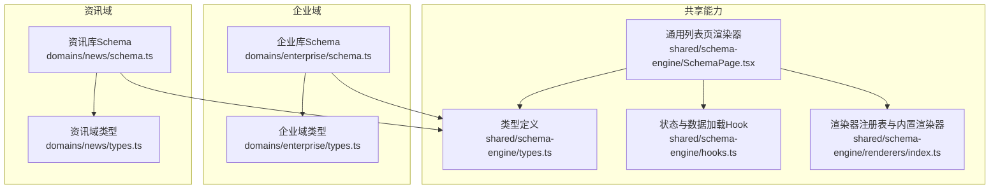
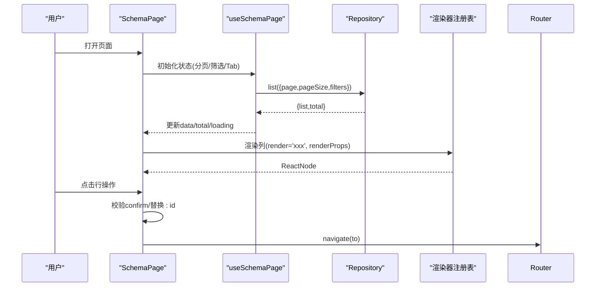
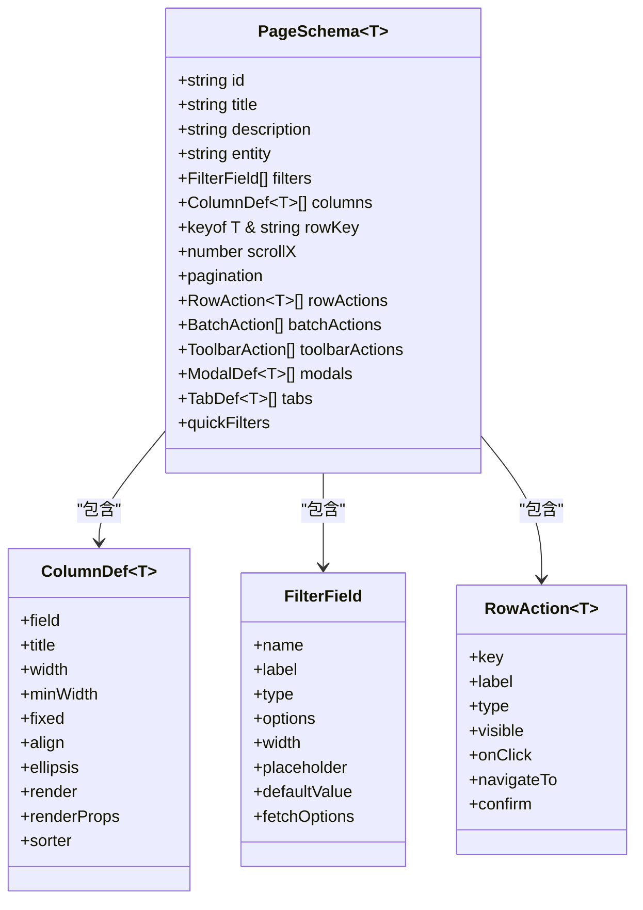

# Schema配置语法

<cite>
**本文引用的文件**   
- [types.ts](file://hj-admin/src/shared/schema-engine/types.ts)
- [SchemaPage.tsx](file://hj-admin/src/shared/schema-engine/SchemaPage.tsx)
- [hooks.ts](file://hj-admin/src/shared/schema-engine/hooks.ts)
- [renderers/index.ts](file://hj-admin/src/shared/schema-engine/renderers/index.ts)
- [enterprise/schema.ts](file://hj-admin/src/domains/enterprise/schema.ts)
- [news/schema.ts](file://hj-admin/src/domains/news/schema.ts)
- [enterprise/types.ts](file://hj-admin/src/domains/enterprise/types.ts)
- [news/types.ts](file://hj-admin/src/domains/news/types.ts)
</cite>

## 目录
1. [简介](#简介)
2. [项目结构](#项目结构)
3. [核心组件](#核心组件)
4. [架构总览](#架构总览)
5. [详细组件分析](#详细组件分析)
6. [依赖关系分析](#依赖关系分析)
7. [性能与体验建议](#性能与体验建议)
8. [故障排查指南](#故障排查指南)
9. [结论](#结论)
10. [附录：完整配置示例与最佳实践](#附录完整配置示例与最佳实践)

## 简介
本文件为“氢界大数据平台”的 Schema 配置语法文档，面向运营后台中基于声明式配置的列表页。通过 PageSchema 描述页面标题、筛选条件、列定义、分页、行操作、Tab 分组等，由 Schema 引擎自动渲染出完整的列表界面，从而将“写页面”降维成“写配置”。

## 项目结构
与 Schema 配置相关的核心代码位于 shared/schema-engine 域，以及各业务域的 schema.ts 文件中。下图展示了关键文件与职责：

图表来源
- [types.ts:1-216](file://hj-admin/src/shared/schema-engine/types.ts#L1-L216)
- [SchemaPage.tsx:1-226](file://hj-admin/src/shared/schema-engine/SchemaPage.tsx#L1-L226)
- [hooks.ts:1-106](file://hj-admin/src/shared/schema-engine/hooks.ts#L1-L106)
- [renderers/index.ts:1-163](file://hj-admin/src/shared/schema-engine/renderers/index.ts#L1-L163)
- [enterprise/schema.ts:1-64](file://hj-admin/src/domains/enterprise/schema.ts#L1-L64)
- [news/schema.ts:1-123](file://hj-admin/src/domains/news/schema.ts#L1-L123)
- [enterprise/types.ts:1-50](file://hj-admin/src/domains/enterprise/types.ts#L1-L50)
- [news/types.ts:1-50](file://hj-admin/src/domains/news/types.ts#L1-L50)

章节来源
- [types.ts:1-216](file://hj-admin/src/shared/schema-engine/types.ts#L1-L216)
- [SchemaPage.tsx:1-226](file://hj-admin/src/shared/schema-engine/SchemaPage.tsx#L1-L226)
- [hooks.ts:1-106](file://hj-admin/src/shared/schema-engine/hooks.ts#L1-L106)
- [renderers/index.ts:1-163](file://hj-admin/src/shared/schema-engine/renderers/index.ts#L1-L163)
- [enterprise/schema.ts:1-64](file://hj-admin/src/domains/enterprise/schema.ts#L1-L64)
- [news/schema.ts:1-123](file://hj-admin/src/domains/news/schema.ts#L1-L123)
- [enterprise/types.ts:1-50](file://hj-admin/src/domains/enterprise/types.ts#L1-L50)
- [news/types.ts:1-50](file://hj-admin/src/domains/news/types.ts#L1-L50)

## 核心组件
- PageSchema：页面级配置对象，描述一个列表页的全部行为与展示。
- ColumnDef：表格列定义，支持字段映射、排序、格式化、渲染器绑定。
- FilterField：筛选字段定义，支持输入框、下拉选择、日期范围等。
- RowAction：行操作定义，支持按钮样式、导航跳转、确认对话框等。
- TabDef：Tab 分组定义，用于按条件过滤并显示数量。
- ModalDef/BatchAction/ToolbarAction：弹窗、批量操作、工具栏操作（扩展能力）。
- 渲染器注册表：以字符串引用方式复用内置或自定义渲染器。

章节来源
- [types.ts:132-174](file://hj-admin/src/shared/schema-engine/types.ts#L132-L174)
- [types.ts:27-41](file://hj-admin/src/shared/schema-engine/types.ts#L27-L41)
- [types.ts:14-24](file://hj-admin/src/shared/schema-engine/types.ts#L14-L24)
- [types.ts:44-56](file://hj-admin/src/shared/schema-engine/types.ts#L44-L56)
- [types.ts:95-104](file://hj-admin/src/shared/schema-engine/types.ts#L95-L104)
- [types.ts:59-74](file://hj-admin/src/shared/schema-engine/types.ts#L59-L74)
- [renderers/index.ts:1-163](file://hj-admin/src/shared/schema-engine/renderers/index.ts#L1-L163)

## 架构总览
Schema 驱动引擎的工作流如下：
- 页面入口使用 PageSchema 声明式配置。
- SchemaPage 根据配置渲染筛选栏、Tab、表格、分页、行操作等。
- useSchemaPage Hook 负责状态管理（筛选、分页、Tab、选中行）和数据加载。
- 列渲染通过 renderWithRegistry 查找并执行渲染器，或调用自定义函数。
- 行操作支持 navigateTo 模板替换与 confirm 确认。

图表来源
- [SchemaPage.tsx:76-226](file://hj-admin/src/shared/schema-engine/SchemaPage.tsx#L76-L226)
- [hooks.ts:20-106](file://hj-admin/src/shared/schema-engine/hooks.ts#L20-L106)
- [renderers/index.ts:32-46](file://hj-admin/src/shared/schema-engine/renderers/index.ts#L32-L46)

## 详细组件分析

### PageSchema 类型与选项
- id/title/description/entity：页面标识、标题、描述、绑定的实体名（对应 Repository key）。
- filters：筛选栏字段数组。
- columns：表格列定义数组。
- rowKey：表格行唯一键。
- scrollX：横向滚动宽度。
- pagination：分页配置，包含 pageSize、showTotal、showSizeChanger。
- rowActions/batchActions/toolbarActions：行操作、批量操作、工具栏操作。
- modals：弹窗/抽屉声明。
- tabs：Tab 分组，支持 count/countField/filter。
- quickFilters：快捷筛选 Chips。

章节来源
- [types.ts:132-174](file://hj-admin/src/shared/schema-engine/types.ts#L132-L174)

### ColumnDef 列配置语法
- field：数据字段名（需与记录类型一致）。
- title：列标题。
- width/minWidth/fixed/align/ellipsis：布局与对齐控制。
- sorter：是否可排序；可传入布尔值或自定义比较函数。
- render：字符串引用渲染器（如 'link'/'status-badge'/'percent'），或自定义渲染函数。
- renderProps：传递给渲染器的额外参数（如 colorMap/to/entityKey 等）。

章节来源
- [types.ts:27-41](file://hj-admin/src/shared/schema-engine/types.ts#L27-L41)
- [SchemaPage.tsx:90-110](file://hj-admin/src/shared/schema-engine/SchemaPage.tsx#L90-L110)

### FilterField 筛选字段配置
- name/label/type：字段名、标签、类型。
- options：静态选项（字符串数组或 label/value 对象数组）。
- fetchOptions：异步加载选项（返回 Promise<FilterOption[]>）。
- width/placeholder/defaultValue：UI 与默认值。
- 支持类型：select/input/dateRange/cascader/treeSelect/radioGroup。

章节来源
- [types.ts:7-24](file://hj-admin/src/shared/schema-engine/types.ts#L7-L24)
- [SchemaPage.tsx:35-73](file://hj-admin/src/shared/schema-engine/SchemaPage.tsx#L35-L73)

### RowAction 行操作配置
- key/label/type：操作标识、文案、样式（primary/default/danger/success）。
- visible：条件显示函数。
- onClick：点击回调，接收 record 与上下文（refresh/navigate/showModal）。
- navigateTo：声明式导航模板，支持 :id 占位符替换。
- confirm：是否需要确认提示。

章节来源
- [types.ts:44-56](file://hj-admin/src/shared/schema-engine/types.ts#L44-L56)
- [SchemaPage.tsx:113-142](file://hj-admin/src/shared/schema-engine/SchemaPage.tsx#L113-L142)

### TabDef 分组配置
- key/label：分组标识与标签。
- count/countField：静态数量或动态字段。
- filter：过滤函数，返回 true 的行进入当前 Tab。

章节来源
- [types.ts:95-104](file://hj-admin/src/shared/schema-engine/types.ts#L95-L104)
- [SchemaPage.tsx:146-152](file://hj-admin/src/shared/schema-engine/SchemaPage.tsx#L146-L152)

### 渲染器注册表与内置渲染器
- 注册机制：registerRenderer(name, renderer)，getRenderer(name)。
- 渲染流程：renderWithRegistry(name, value, record, index, renderProps, onAction)。
- 内置渲染器（部分）：
  - tag-list：标签列表，支持 auto 标记。
  - status-badge：状态徽章，支持 colorMap。
  - entity-count：实体计数，支持 onAction 事件。
  - link：可导航链接，支持 to 模板与 :id 替换。
  - date-or-dash：日期或破折号。
  - text：纯文本。
  - color-tag：颜色标签。
  - percent：百分比，带阈值着色。
  - url：URL 链接，超长截断。
  - success-rate：成功率等级（高/中/低）。
  - link-progress：关联进度文本。
  - position-tags：位置标签。

章节来源
- [renderers/index.ts:1-163](file://hj-admin/src/shared/schema-engine/renderers/index.ts#L1-L163)
- [SchemaPage.tsx:90-110](file://hj-admin/src/shared/schema-engine/SchemaPage.tsx#L90-L110)

### 状态管理与数据加载
- useSchemaPage 封装了 loading/data/total/page/pageSize/filters/activeTab/selectedRowKeys 等状态。
- 初次加载与依赖变化时触发 repo.list(params)。
- setFilter/resetFilters/setPage/setActiveTab/setSelectedRowKeys/refresh 等方法。

章节来源
- [hooks.ts:1-106](file://hj-admin/src/shared/schema-engine/hooks.ts#L1-L106)

## 依赖关系分析
- types.ts 是所有 Schema 的类型基石。
- SchemaPage 消费 types.ts 中的类型，并通过 hooks.ts 获取数据与状态。
- renderers/index.ts 提供渲染器注册与内置实现，供 SchemaPage 在列渲染时调用。
- 各域 schema.ts 基于 types.ts 定义具体 PageSchema，并在 columns/filters/rowActions 中使用内置渲染器与配置项。

图表来源
- [types.ts:132-174](file://hj-admin/src/shared/schema-engine/types.ts#L132-L174)
- [types.ts:27-41](file://hj-admin/src/shared/schema-engine/types.ts#L27-L41)
- [types.ts:14-24](file://hj-admin/src/shared/schema-engine/types.ts#L14-L24)
- [types.ts:44-56](file://hj-admin/src/shared/schema-engine/types.ts#L44-L56)

章节来源
- [types.ts:1-216](file://hj-admin/src/shared/schema-engine/types.ts#L1-L216)

## 性能与体验建议
- 列渲染优先使用内置渲染器，减少重复逻辑；复杂场景再引入自定义函数。
- 对长列表启用 scrollX 避免频繁重排；合理设置列宽与固定列。
- 筛选变更时自动回到第一页，避免大偏移带来的卡顿。
- 使用 showTotal 明确数据规模，提升用户感知。
- 行操作 visible 条件尽量简单高效，避免在高频渲染路径中进行昂贵计算。
- 分页 pageSize 建议 20-50，结合后端分页接口优化传输体积。

[本节为通用建议，不直接分析具体文件]

## 故障排查指南
- 渲染器未找到：控制台会输出警告，检查 render 名称是否在注册表中存在。
- navigateTo 未生效：确认模板中包含 :id 且记录具备 id 字段；同时确保路由已正确注册。
- 筛选无效：检查 FilterField.name 是否与后端查询参数一致；确认 useSchemaPage 的 filters 合并逻辑。
- 分页异常：核对 pagination.pageSize 与后端 page/pageSize 字段映射。
- 行操作 confirm 未弹出：确认 RowAction.confirm 已配置且未被 visible 隐藏。

章节来源
- [renderers/index.ts:32-46](file://hj-admin/src/shared/schema-engine/renderers/index.ts#L32-L46)
- [SchemaPage.tsx:124-131](file://hj-admin/src/shared/schema-engine/SchemaPage.tsx#L124-L131)
- [hooks.ts:36-57](file://hj-admin/src/shared/schema-engine/hooks.ts#L36-L57)

## 结论
通过 PageSchema 声明式配置，平台实现了“配置即页面”的能力。统一的类型定义、渲染器注册表与状态 Hook 使得企业库与资讯库等多域页面可以快速搭建与维护，降低开发成本并提升一致性。

[本节为总结性内容，不直接分析具体文件]

## 附录：完整配置示例与最佳实践

### 企业库配置要点
- 待处理池：
  - 筛选：企业名称关键词输入。
  - 列：企业名称（可导航）、来源、关联进度、分类状态（状态徽章）、更新时间（日期或破折号）。
  - 行操作：去处理（主按钮，导航到编辑页）。
  - Tab：待关联、无关联待确认，分别用 filter 函数过滤 stage。
- 已确认企业：
  - 筛选：企业性质、企业类型、名称搜索。
  - 列：企业名称（可导航）、关联资讯/项目数、氢能关联度（百分比）、企业性质/分类状态（状态徽章）、更新时间。
  - 行操作：去分类（条件可见）、查看（导航）。
  - Tab：待分类、已分类，分别用 filter 函数过滤 classifyStatus。

章节来源
- [enterprise/schema.ts:7-31](file://hj-admin/src/domains/enterprise/schema.ts#L7-L31)
- [enterprise/schema.ts:34-63](file://hj-admin/src/domains/enterprise/schema.ts#L34-L63)
- [enterprise/types.ts:8-36](file://hj-admin/src/domains/enterprise/types.ts#L8-L36)

### 资讯库配置要点
- 资讯池：
  - 筛选：来源、状态、关联状态、关键词、发布时间（日期范围）。
  - 列：标题（可导航）、来源、标签（tag-list）、识别企业（entity-count）、状态（status-badge）、发布时间。
  - 行操作：编辑、发布（条件可见）、下架（条件可见）。
- 已发布资讯：
  - 筛选：来源、关键词。
  - 快捷筛选：关联状态（全部/已关联/待补关联）。
  - 列：标题（可导航）、来源、标签、关联企业（entity-count）、状态、发布时间。
  - 行操作：编辑。
  - Tab：全部、已关联、待补关联（count 静态数量）。
- 数据源管理：
  - 筛选：类型、状态、搜索。
  - 列：来源名称、类型（color-tag）、采集域名（url）、状态（status-badge）、最近采集、成功率（success-rate）、文章数。
  - 行操作：启用、停用（带 confirm）。

章节来源
- [news/schema.ts:22-53](file://hj-admin/src/domains/news/schema.ts#L22-L53)
- [news/schema.ts:56-94](file://hj-admin/src/domains/news/schema.ts#L56-L94)
- [news/schema.ts:97-122](file://hj-admin/src/domains/news/schema.ts#L97-L122)
- [news/types.ts:5-28](file://hj-admin/src/domains/news/types.ts#L5-L28)
- [news/types.ts:40-49](file://hj-admin/src/domains/news/types.ts#L40-L49)

### 配置验证规则与最佳实践
- 必填字段
  - PageSchema：id、title、entity、filters、columns、rowKey、pagination。
  - ColumnDef：field、title。
  - FilterField：name、label、type。
  - RowAction：key、label。
- 可选增强
  - ColumnDef：width/minWidth/fixed/align/ellipsis、sorter、render、renderProps。
  - FilterField：options/fetchOptions、width、placeholder、defaultValue。
  - RowAction：type、visible、onClick、navigateTo、confirm。
  - PageSchema：scrollX、batchActions、toolbarActions、modals、tabs、quickFilters。
- 命名与类型
  - field 必须与记录类型字段一致，避免运行时 undefined。
  - navigateTo 模板中的 :id 需要记录具备 id 字段。
  - render 字符串需在渲染器注册表中存在，否则回退为字符串显示。
- 交互与体验
  - 合理使用 visible 控制行操作可见性，避免冗余按钮。
  - 对敏感操作（如停用）务必配置 confirm。
  - 使用 status-badge 与 color-map 统一视觉语义。
  - 使用 tag-list 与 entity-count 提升信息密度与可点击性。
- 性能
  - 列渲染优先使用内置渲染器。
  - 合理设置 scrollX 与列宽，避免过度重排。
  - 分页 pageSize 适中，结合后端分页接口优化。

章节来源
- [types.ts:132-174](file://hj-admin/src/shared/schema-engine/types.ts#L132-L174)
- [types.ts:27-41](file://hj-admin/src/shared/schema-engine/types.ts#L27-L41)
- [types.ts:14-24](file://hj-admin/src/shared/schema-engine/types.ts#L14-L24)
- [types.ts:44-56](file://hj-admin/src/shared/schema-engine/types.ts#L44-L56)
- [renderers/index.ts:1-163](file://hj-admin/src/shared/schema-engine/renderers/index.ts#L1-L163)
- [SchemaPage.tsx:113-142](file://hj-admin/src/shared/schema-engine/SchemaPage.tsx#L113-L142)