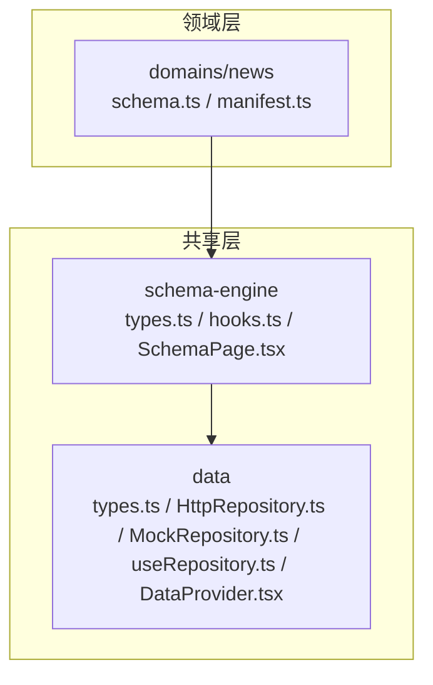
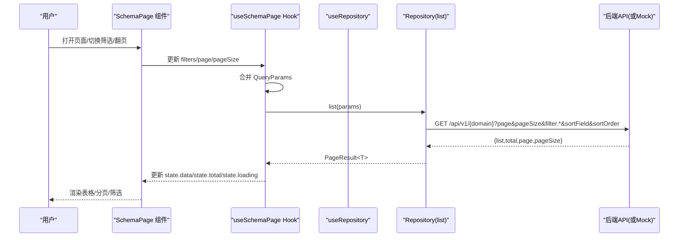
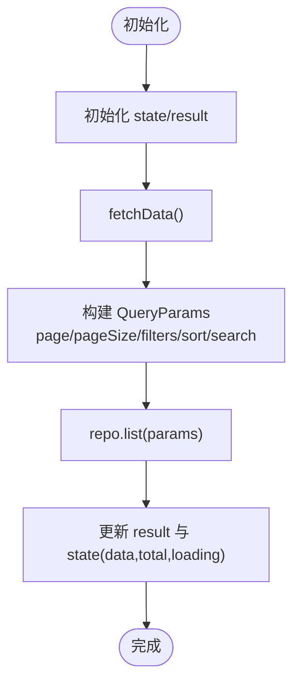
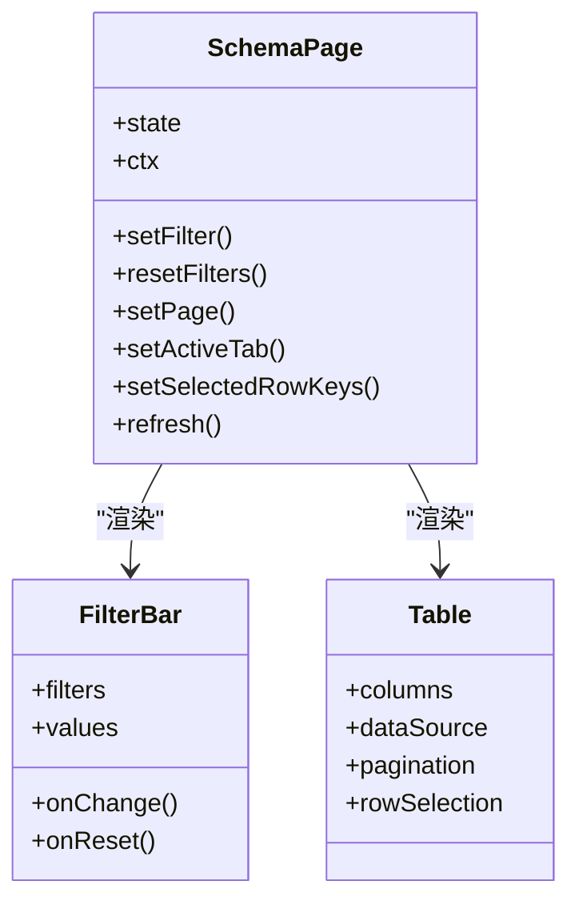
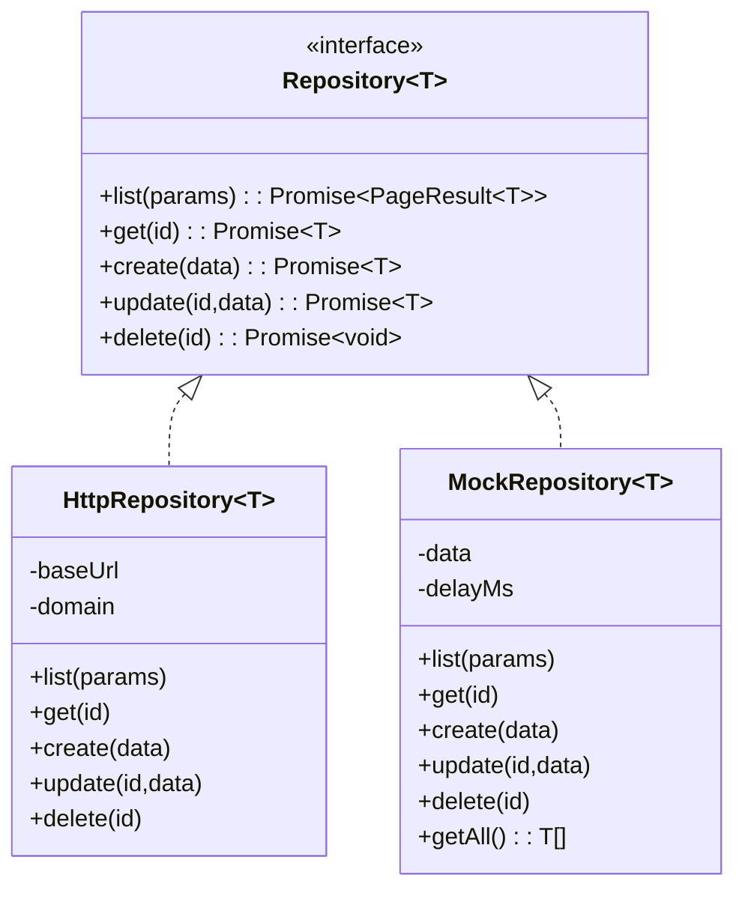
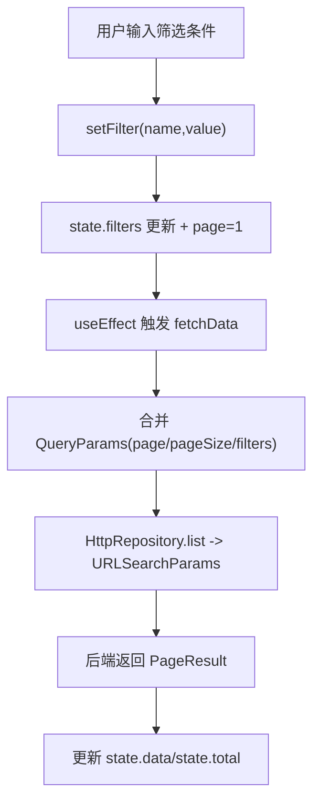
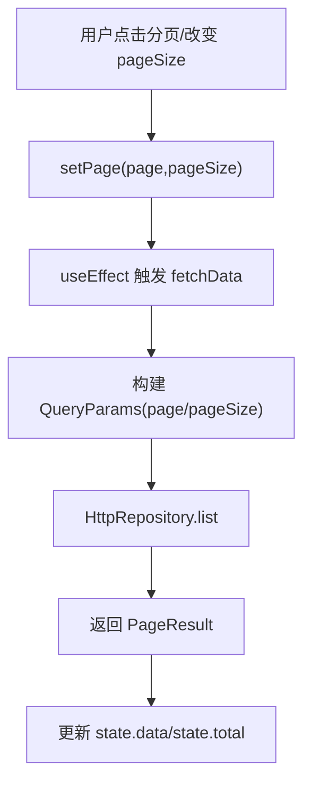
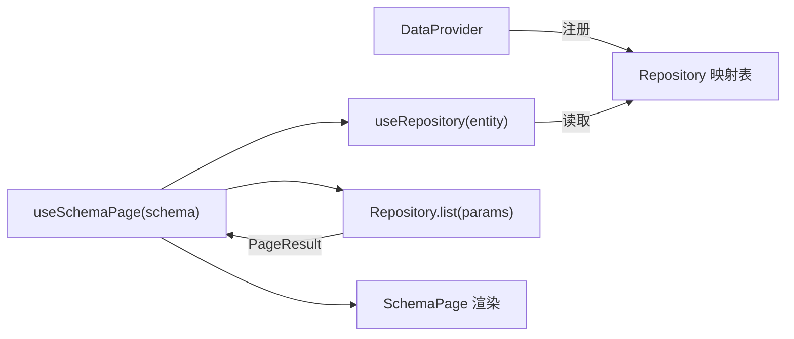
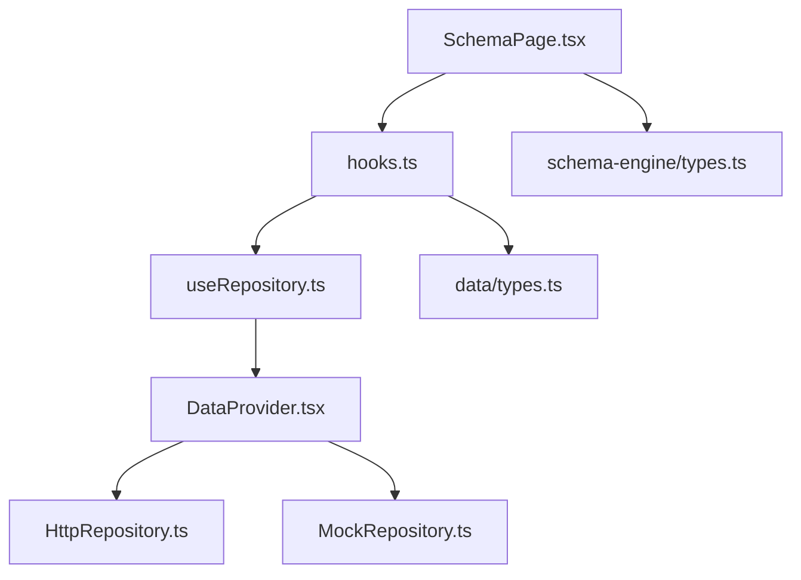

# useSchemaPage Hook 文档

<cite>
**本文引用的文件列表**
- [hooks.ts](file://hj-admin/src/shared/schema-engine/hooks.ts)
- [SchemaPage.tsx](file://hj-admin/src/shared/schema-engine/SchemaPage.tsx)
- [types.ts（Schema 引擎）](file://hj-admin/src/shared/schema-engine/types.ts)
- [HttpRepository.ts](file://hj-admin/src/shared/data/HttpRepository.ts)
- [MockRepository.ts](file://hj-admin/src/shared/data/MockRepository.ts)
- [useRepository.ts](file://hj-admin/src/shared/data/useRepository.ts)
- [DataProvider.tsx](file://hj-admin/src/shared/data/DataProvider.tsx)
- [schema.ts（资讯域）](file://hj-admin/src/domains/news/schema.ts)
- [manifest.ts（资讯域）](file://hj-admin/src/domains/news/manifest.ts)
</cite>

## 目录
1. [简介](#简介)
2. [项目结构](#项目结构)
3. [核心组件与职责](#核心组件与职责)
4. [架构总览](#架构总览)
5. [详细组件分析](#详细组件分析)
6. [依赖关系分析](#依赖关系分析)
7. [性能考虑](#性能考虑)
8. [故障排查指南](#故障排查指南)
9. [结论](#结论)
10. [附录：使用示例与最佳实践](#附录使用示例与最佳实践)

## 简介
本文件面向“氢界大数据平台”的 useSchemaPage Hook，系统性说明其状态管理模式、数据流架构、筛选与搜索机制、分页与排序处理逻辑，并提供在自定义页面中的集成方法与最佳实践。该 Hook 将“写页面”降维为“写配置”，通过 Schema 驱动自动渲染筛选栏、表格、分页、Tab 分组与行操作等通用能力，统一封装了数据获取、表单状态、分页控制、选中行与加载态等核心状态。

## 项目结构
围绕 useSchemaPage 的核心代码分布在共享层与领域层：
- 共享层（shared）
  - schema-engine：提供 Schema 类型定义、通用页面渲染器与 useSchemaPage Hook
  - data：提供 Repository 抽象、HTTP 与 Mock 实现、以及上下文注入
- 领域层（domains）
  - 各业务域通过 manifest 声明路由与 Schema，并通过 repository 注册数据源

图表来源
- [hooks.ts:1-106](file://hj-admin/src/shared/schema-engine/hooks.ts#L1-L106)
- [SchemaPage.tsx:1-226](file://hj-admin/src/shared/schema-engine/SchemaPage.tsx#L1-L226)
- [types.ts（Schema 引擎）:1-216](file://hj-admin/src/shared/schema-engine/types.ts#L1-L216)
- [HttpRepository.ts:1-70](file://hj-admin/src/shared/data/HttpRepository.ts#L1-L70)
- [MockRepository.ts:1-100](file://hj-admin/src/shared/data/MockRepository.ts#L1-L100)
- [useRepository.ts:1-23](file://hj-admin/src/shared/data/useRepository.ts#L1-L23)
- [DataProvider.tsx:1-43](file://hj-admin/src/shared/data/DataProvider.tsx#L1-L43)
- [schema.ts（资讯域）:1-123](file://hj-admin/src/domains/news/schema.ts#L1-L123)
- [manifest.ts（资讯域）:1-42](file://hj-admin/src/domains/news/manifest.ts#L1-L42)

章节来源
- [hooks.ts:1-106](file://hj-admin/src/shared/schema-engine/hooks.ts#L1-L106)
- [SchemaPage.tsx:1-226](file://hj-admin/src/shared/schema-engine/SchemaPage.tsx#L1-L226)
- [types.ts（Schema 引擎）:1-216](file://hj-admin/src/shared/schema-engine/types.ts#L1-L216)
- [HttpRepository.ts:1-70](file://hj-admin/src/shared/data/HttpRepository.ts#L1-L70)
- [MockRepository.ts:1-100](file://hj-admin/src/shared/data/MockRepository.ts#L1-L100)
- [useRepository.ts:1-23](file://hj-admin/src/shared/data/useRepository.ts#L1-L23)
- [DataProvider.tsx:1-43](file://hj-admin/src/shared/data/DataProvider.tsx#L1-L43)
- [schema.ts（资讯域）:1-123](file://hj-admin/src/domains/news/schema.ts#L1-L123)
- [manifest.ts（资讯域）:1-42](file://hj-admin/src/domains/news/manifest.ts#L1-L42)

## 核心组件与职责
- useSchemaPage Hook
  - 维护页面级状态：loading、data、total、page、pageSize、filters、activeTab、selectedRowKeys
  - 组合查询参数并调用 Repository.list 拉取数据
  - 暴露 setFilter/resetFilters/setPage/setActiveTab/setSelectedRowKeys/refresh 等方法
  - 返回 ctx 操作上下文（由上层注入 navigate/showModal）
- SchemaPage 组件
  - 根据 PageSchema 自动渲染筛选栏、Tab、工具栏、表格、分页与行操作
  - 将 Hook 的状态与方法绑定到 UI 控件，驱动数据刷新
- Repository 抽象与实现
  - QueryParams/PageResult 定义统一的查询与分页结果契约
  - HttpRepository 负责将查询参数序列化为 URL 查询串
  - MockRepository 提供内存过滤/分页/排序与延迟模拟，便于开发联调
- DataProvider 与 useRepository
  - 按 domain 注册 Repository 实例（mock/http），组件通过 useRepository(entity) 获取对应仓库

章节来源
- [hooks.ts:1-106](file://hj-admin/src/shared/schema-engine/hooks.ts#L1-L106)
- [SchemaPage.tsx:1-226](file://hj-admin/src/shared/schema-engine/SchemaPage.tsx#L1-L226)
- [types.ts（Schema 引擎）:1-216](file://hj-admin/src/shared/schema-engine/types.ts#L1-L216)
- [HttpRepository.ts:1-70](file://hj-admin/src/shared/data/HttpRepository.ts#L1-L70)
- [MockRepository.ts:1-100](file://hj-admin/src/shared/data/MockRepository.ts#L1-L100)
- [useRepository.ts:1-23](file://hj-admin/src/shared/data/useRepository.ts#L1-L23)
- [DataProvider.tsx:1-43](file://hj-admin/src/shared/data/DataProvider.tsx#L1-L43)

## 架构总览
下图展示了从 Schema 配置到 UI 渲染、再到数据层的完整数据流。

图表来源
- [SchemaPage.tsx:76-226](file://hj-admin/src/shared/schema-engine/SchemaPage.tsx#L76-L226)
- [hooks.ts:20-105](file://hj-admin/src/shared/schema-engine/hooks.ts#L20-L105)
- [HttpRepository.ts:29-46](file://hj-admin/src/shared/data/HttpRepository.ts#L29-L46)
- [MockRepository.ts:20-77](file://hj-admin/src/shared/data/MockRepository.ts#L20-L77)

## 详细组件分析

### useSchemaPage Hook 状态管理
- 状态字段
  - loading：请求进行中
  - data：当前页数据数组
  - total：服务端总数
  - page/pageSize：分页参数
  - filters：筛选条件集合
  - activeTab：当前激活 Tab
  - selectedRowKeys：批量操作选中的行键
- 关键方法
  - fetchData：组装 QueryParams，调用 repo.list，更新 result 与 state
  - setFilter/resetFilters：变更筛选并重置到第一页
  - setPage：切换页码或每页条数
  - setActiveTab：切换 Tab 并重置到第一页
  - setSelectedRowKeys：更新选中行
  - refresh：重新触发 fetchData
- 副作用
  - useEffect 监听 page、pageSize、filters 变化，自动触发 fetchData

图表来源
- [hooks.ts:20-105](file://hj-admin/src/shared/schema-engine/hooks.ts#L20-L105)

章节来源
- [hooks.ts:1-106](file://hj-admin/src/shared/schema-engine/hooks.ts#L1-L106)

### SchemaPage 组件与 UI 绑定
- 自动渲染
  - 筛选栏：根据 schema.filters 动态渲染 select/input/dateRange 等控件
  - Tab 分组：根据 schema.tabs 渲染标签页，并在客户端对数据进行过滤
  - 表格：根据 schema.columns 生成列，支持固定列、对齐、省略、排序、自定义渲染
  - 分页：绑定 state.page/state.pageSize/state.total，onChange 调用 setPage
  - 行操作：根据 schema.rowActions 渲染按钮，支持导航与确认
- 上下文注入
  - 将 Hook 的 refresh 与 React Router 的 navigate 注入 ctx，供行操作回调使用

图表来源
- [SchemaPage.tsx:15-226](file://hj-admin/src/shared/schema-engine/SchemaPage.tsx#L15-L226)

章节来源
- [SchemaPage.tsx:1-226](file://hj-admin/src/shared/schema-engine/SchemaPage.tsx#L1-L226)

### 数据层：Repository 抽象与实现
- 接口契约
  - QueryParams：包含 page、pageSize、filters、sort、search
  - PageResult：包含 list、total、page、pageSize
  - Repository：list/get/create/update/delete
- HTTP 实现
  - 将 QueryParams 序列化为 URLSearchParams
  - 支持 sortField/sortOrder、filter.key=value 形式
- Mock 实现
  - 内存过滤/分页/排序，模拟网络延迟，返回 Promise
  - 提供 getAll 用于 Tab 计数等场景

图表来源
- [types.ts（数据层）:1-36](file://hj-admin/src/shared/data/types.ts#L1-L36)
- [HttpRepository.ts:1-70](file://hj-admin/src/shared/data/HttpRepository.ts#L1-L70)
- [MockRepository.ts:1-100](file://hj-admin/src/shared/data/MockRepository.ts#L1-L100)

章节来源
- [types.ts（数据层）:1-36](file://hj-admin/src/shared/data/types.ts#L1-L36)
- [HttpRepository.ts:1-70](file://hj-admin/src/shared/data/HttpRepository.ts#L1-L70)
- [MockRepository.ts:1-100](file://hj-admin/src/shared/data/MockRepository.ts#L1-L100)

### 筛选与搜索机制
- 动态筛选条件构建
  - 用户在 FilterBar 中修改值时，调用 setFilter(name, value)，Hook 将 filters[name] 更新并重置 page=1
  - 下次 fetchData 会将 filters 合并进 QueryParams
- 查询参数序列化
  - HttpRepository.list 将 filters 以 filter.{key}=value 的形式拼接到 URL
  - search 字段作为全局关键词搜索参数传递
- 客户端过滤（Tab）
  - SchemaPage 根据 activeTab 对应的 filter 函数对已加载数据进行客户端过滤，不触发二次请求

图表来源
- [hooks.ts:59-69](file://hj-admin/src/shared/schema-engine/hooks.ts#L59-L69)
- [HttpRepository.ts:29-46](file://hj-admin/src/shared/data/HttpRepository.ts#L29-L46)
- [SchemaPage.tsx:146-152](file://hj-admin/src/shared/schema-engine/SchemaPage.tsx#L146-L152)

章节来源
- [hooks.ts:59-69](file://hj-admin/src/shared/schema-engine/hooks.ts#L59-L69)
- [HttpRepository.ts:29-46](file://hj-admin/src/shared/data/HttpRepository.ts#L29-L46)
- [SchemaPage.tsx:146-152](file://hj-admin/src/shared/schema-engine/SchemaPage.tsx#L146-L152)

### 分页与排序处理逻辑
- 服务端分页
  - Hook 维护 page/pageSize，每次变化触发 fetchData，HttpRepository 将 page/pageSize 拼入 URL
  - 返回的 total 用于显示“共 X 条”
- 客户端排序
  - ColumnDef.sorter 可传入布尔或比较函数；当为函数时，Table 会在本地进行排序
  - 若需服务端排序，可在 sorter 为 true 时结合 sort 参数传递给后端（当前 Hook 未直接绑定 Table 的 onSortChange，可通过扩展实现）
- 切换策略建议
  - 大数据量优先服务端分页+服务端排序
  - 小数据集可使用客户端排序以提升交互体验

图表来源
- [hooks.ts:71-73](file://hj-admin/src/shared/schema-engine/hooks.ts#L71-L73)
- [HttpRepository.ts:29-46](file://hj-admin/src/shared/data/HttpRepository.ts#L29-L46)

章节来源
- [hooks.ts:71-73](file://hj-admin/src/shared/schema-engine/hooks.ts#L71-L73)
- [HttpRepository.ts:29-46](file://hj-admin/src/shared/data/HttpRepository.ts#L29-L46)
- [types.ts（Schema 引擎）:27-41](file://hj-admin/src/shared/schema-engine/types.ts#L27-L41)

### 错误处理与加载状态
- 加载状态
  - fetchData 开始时设置 loading=true，成功或失败后恢复为 false
- 错误处理
  - 捕获异常并打印日志，保持 loading=false，避免界面卡死
  - 建议在更高层增加用户提示（如 Antd message.error）

章节来源
- [hooks.ts:36-52](file://hj-admin/src/shared/schema-engine/hooks.ts#L36-L52)

### 数据流架构：从 Repository 到 UI
- 数据源注册
  - DataProvider 根据 domainConfig 选择 mock/http 模式，构造 Repository 映射表
  - 组件通过 useRepository(entity) 获取对应仓库
- 数据获取流程
  - SchemaPage 调用 useSchemaPage(schema)
  - Hook 内部通过 useRepository(schema.entity) 获取仓库并调用 list
  - 返回结果更新 state，UI 重渲染

图表来源
- [DataProvider.tsx:26-41](file://hj-admin/src/shared/data/DataProvider.tsx#L26-L41)
- [useRepository.ts:8-23](file://hj-admin/src/shared/data/useRepository.ts#L8-L23)
- [hooks.ts:20-52](file://hj-admin/src/shared/schema-engine/hooks.ts#L20-L52)
- [SchemaPage.tsx:76-110](file://hj-admin/src/shared/schema-engine/SchemaPage.tsx#L76-L110)

章节来源
- [DataProvider.tsx:26-41](file://hj-admin/src/shared/data/DataProvider.tsx#L26-L41)
- [useRepository.ts:8-23](file://hj-admin/src/shared/data/useRepository.ts#L8-L23)
- [hooks.ts:20-52](file://hj-admin/src/shared/schema-engine/hooks.ts#L20-L52)
- [SchemaPage.tsx:76-110](file://hj-admin/src/shared/schema-engine/SchemaPage.tsx#L76-L110)

## 依赖关系分析
- 耦合与内聚
  - useSchemaPage 仅依赖 useRepository 与 types，内聚良好
  - SchemaPage 依赖 hooks 与 renderers，关注 UI 渲染
  - Repository 抽象解耦具体数据源，便于替换
- 外部依赖
  - antd 组件库用于 UI 渲染
  - react-router-dom 用于导航
- 潜在循环依赖
  - 当前结构无循环依赖；Schema 定义位于 domains，Hook 与 UI 位于 shared，层次清晰

图表来源
- [hooks.ts:1-106](file://hj-admin/src/shared/schema-engine/hooks.ts#L1-L106)
- [SchemaPage.tsx:1-226](file://hj-admin/src/shared/schema-engine/SchemaPage.tsx#L1-L226)
- [useRepository.ts:1-23](file://hj-admin/src/shared/data/useRepository.ts#L1-L23)
- [DataProvider.tsx:1-43](file://hj-admin/src/shared/data/DataProvider.tsx#L1-L43)
- [HttpRepository.ts:1-70](file://hj-admin/src/shared/data/HttpRepository.ts#L1-L70)
- [MockRepository.ts:1-100](file://hj-admin/src/shared/data/MockRepository.ts#L1-L100)

章节来源
- [hooks.ts:1-106](file://hj-admin/src/shared/schema-engine/hooks.ts#L1-L106)
- [SchemaPage.tsx:1-226](file://hj-admin/src/shared/schema-engine/SchemaPage.tsx#L1-L226)
- [useRepository.ts:1-23](file://hj-admin/src/shared/data/useRepository.ts#L1-L23)
- [DataProvider.tsx:1-43](file://hj-admin/src/shared/data/DataProvider.tsx#L1-L43)
- [HttpRepository.ts:1-70](file://hj-admin/src/shared/data/HttpRepository.ts#L1-L70)
- [MockRepository.ts:1-100](file://hj-admin/src/shared/data/MockRepository.ts#L1-L100)

## 性能考虑
- 减少不必要的重渲染
  - 使用 useMemo 缓存 columns 与 actionColumn（已在 SchemaPage 中实现）
  - 避免在 filters 对象中频繁创建新引用，必要时在父组件稳定化
- 分页优先服务端
  - 大数据集务必开启服务端分页，避免客户端内存压力
- 排序策略
  - 小数据集可用客户端排序；大数据集应启用服务端排序，并在 Hook 中扩展 sort 参数传递
- 防抖与节流
  - 对于高频输入（如关键词搜索），可在上层对 setFilter 做防抖，降低请求频率
- 懒加载与按需渲染
  - 复杂列渲染器可拆分懒加载，减少首屏开销

[本节为通用指导，无需源码引用]

## 故障排查指南
- 常见问题
  - 页面空白或无数据：检查 entity 是否在 DataProvider 中正确注册
  - 筛选无效：确认 filters 字段名与后端期望一致，且非空值会被序列化
  - 分页不生效：确认 onChange 是否调用 setPage，且后端返回 total 正确
  - 排序不生效：若需服务端排序，需在 Hook 中扩展 sort 参数传递
- 定位步骤
  - 查看控制台日志（fetch 失败会打印错误）
  - 检查 Network 面板中 URL 查询串是否符合预期
  - 验证返回的 PageResult 结构是否匹配

章节来源
- [hooks.ts:48-52](file://hj-admin/src/shared/schema-engine/hooks.ts#L48-L52)
- [HttpRepository.ts:29-46](file://hj-admin/src/shared/data/HttpRepository.ts#L29-L46)

## 结论
useSchemaPage Hook 通过“配置即页面”的方式，将筛选、分页、Tab、行操作与数据获取统一封装，显著降低了重复页面的开发成本。配合 Repository 抽象与 DataProvider，实现了前后端解耦与灵活的数据源切换。建议在后续迭代中完善服务端排序、错误提示与防抖优化，进一步提升用户体验与系统稳定性。

[本节为总结性内容，无需源码引用]

## 附录：使用示例与最佳实践

### 在自定义页面中集成 useSchemaPage
- 步骤概览
  - 在领域 manifest 中声明路由与 schema
  - 在领域 schema 文件中定义 PageSchema（filters/columns/pagination/rowActions/tabs 等）
  - 在页面中使用 <SchemaPage schema={...} /> 即可自动获得筛选、表格、分页与行操作能力
- 参考路径
  - 资讯域清单与路由：[manifest.ts（资讯域）:1-42](file://hj-admin/src/domains/news/manifest.ts#L1-L42)
  - 资讯域 Schema 示例：[schema.ts（资讯域）:1-123](file://hj-admin/src/domains/news/schema.ts#L1-L123)
  - 通用页面渲染器：[SchemaPage.tsx:76-226](file://hj-admin/src/shared/schema-engine/SchemaPage.tsx#L76-L226)

### 常见用法要点
- 筛选联动与默认值
  - 在 FilterField 中设置 defaultValue，或在组件初始化时调用 setFilter 预设条件
- 批量操作
  - 启用 batchActions 后，表格将展示复选框，selectedRowKeys 由 Hook 维护
- 弹窗与抽屉
  - 通过 modals 声明弹窗，并在 rowActions/toolbarActions 中触发 showModal
- 导航与刷新
  - 使用 ctx.navigate 与 ctx.refresh 在行操作中执行跳转与刷新

章节来源
- [manifest.ts（资讯域）:1-42](file://hj-admin/src/domains/news/manifest.ts#L1-L42)
- [schema.ts（资讯域）:1-123](file://hj-admin/src/domains/news/schema.ts#L1-L123)
- [SchemaPage.tsx:76-226](file://hj-admin/src/shared/schema-engine/SchemaPage.tsx#L76-L226)
- [types.ts（Schema 引擎）:132-174](file://hj-admin/src/shared/schema-engine/types.ts#L132-L174)