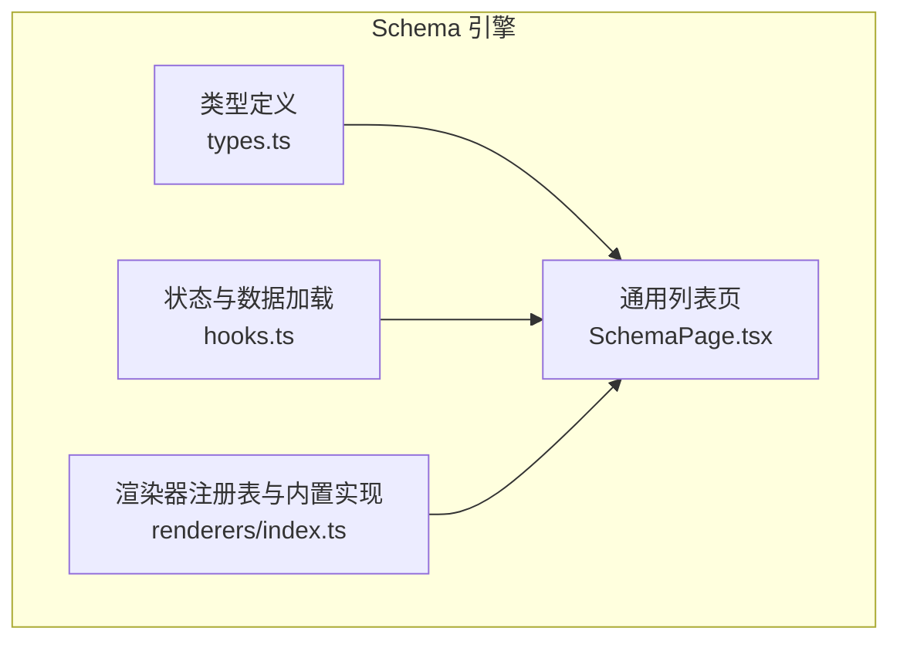
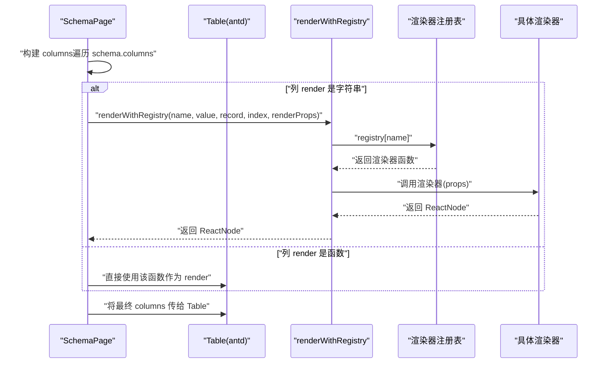
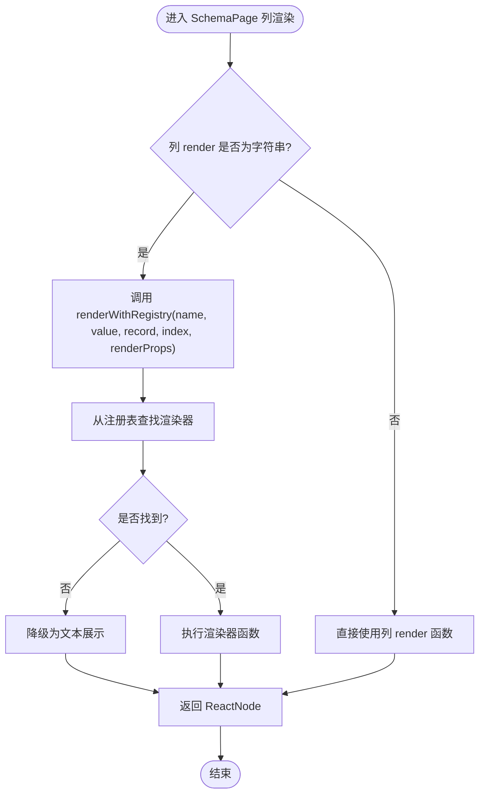
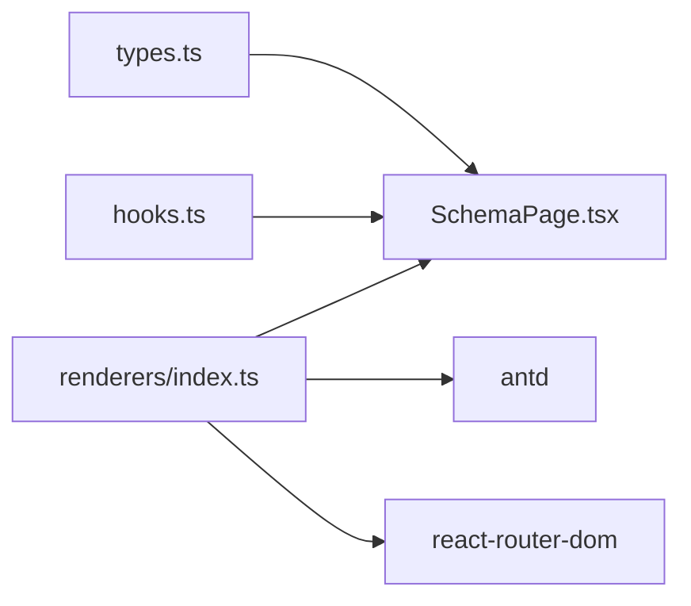

# 渲染器机制

<cite>
**本文引用的文件**   
- [renderers/index.ts](file://hj-admin/src/shared/schema-engine/renderers/index.ts)
- [SchemaPage.tsx](file://hj-admin/src/shared/schema-engine/SchemaPage.tsx)
- [types.ts](file://hj-admin/src/shared/schema-engine/types.ts)
- [hooks.ts](file://hj-admin/src/shared/schema-engine/hooks.ts)
</cite>

## 目录
1. [简介](#简介)
2. [项目结构](#项目结构)
3. [核心组件](#核心组件)
4. [架构总览](#架构总览)
5. [详细组件分析](#详细组件分析)
6. [依赖关系分析](#依赖关系分析)
7. [性能考虑](#性能考虑)
8. [故障排查指南](#故障排查指南)
9. [结论](#结论)
10. [附录](#附录)

## 简介
本文件面向氢界大数据平台的“渲染器机制”，系统性阐述基于注册表模式的列渲染扩展能力。重点包括：
- renderWithRegistry 的注册表模式实现与调用流程
- 如何注册与调用自定义渲染器
- 内置渲染器的功能与用法（如标签、状态徽章、链接等）
- 渲染器接口定义（参数、返回值、错误处理）
- 自定义渲染器开发指南（封装、属性、集成步骤）
- 性能优化策略与调试技巧
- 在业务域中扩展新渲染器类型的方法

## 项目结构
渲染器机制位于 schema-engine 子系统中，围绕“配置驱动页面”的理念，通过 PageSchema 声明式描述表格列、筛选、分页、操作等，再由 SchemaPage 统一渲染。渲染器作为列单元格的可视化扩展点，以字符串名称引用，保持 Schema 可序列化与 AI 友好。



图表来源
- [types.ts:1-216](file://hj-admin/src/shared/schema-engine/types.ts#L1-L216)
- [hooks.ts:1-106](file://hj-admin/src/shared/schema-engine/hooks.ts#L1-L106)
- [SchemaPage.tsx:1-226](file://hj-admin/src/shared/schema-engine/SchemaPage.tsx#L1-L226)
- [renderers/index.ts:1-163](file://hj-admin/src/shared/schema-engine/renderers/index.ts#L1-L163)

章节来源
- [types.ts:1-216](file://hj-admin/src/shared/schema-engine/types.ts#L1-L216)
- [hooks.ts:1-106](file://hj-admin/src/shared/schema-engine/hooks.ts#L1-L106)
- [SchemaPage.tsx:1-226](file://hj-admin/src/shared/schema-engine/SchemaPage.tsx#L1-L226)
- [renderers/index.ts:1-163](file://hj-admin/src/shared/schema-engine/renderers/index.ts#L1-L163)

## 核心组件
- 渲染器接口与注册表
  - RendererProps：传入当前单元格值、整行记录、行索引、额外渲染属性、动作回调
  - Renderer：函数签名，返回 ReactNode
  - registerRenderer/getRenderer：注册与查询渲染器
  - renderWithRegistry：按名称查找并执行渲染，缺失时降级为文本展示
- 通用列表页 SchemaPage
  - 将 ColumnDef.render 支持字符串或函数；字符串走注册表解析
  - 将列渲染结果注入 Table 的 render 字段
- 类型定义 types.ts
  - 明确 ColumnDef.render 可为 string | 函数，以及 renderProps 透传
- 状态与数据 hooks.ts
  - 提供 useSchemaPage 管理筛选、分页、Tab、选中行与数据加载

章节来源
- [renderers/index.ts:9-46](file://hj-admin/src/shared/schema-engine/renderers/index.ts#L9-L46)
- [SchemaPage.tsx:89-110](file://hj-admin/src/shared/schema-engine/SchemaPage.tsx#L89-L110)
- [types.ts:26-41](file://hj-admin/src/shared/schema-engine/types.ts#L26-L41)
- [hooks.ts:20-105](file://hj-admin/src/shared/schema-engine/hooks.ts#L20-L105)

## 架构总览
渲染器机制采用“注册表 + 运行时解析”的模式：Schema 仅声明渲染器名称，实际渲染逻辑由运行期注册的函数完成。SchemaPage 在构建列定义时，若列 render 为字符串，则通过 renderWithRegistry 解析并执行对应渲染器。



图表来源
- [SchemaPage.tsx:89-110](file://hj-admin/src/shared/schema-engine/SchemaPage.tsx#L89-L110)
- [renderers/index.ts:32-46](file://hj-admin/src/shared/schema-engine/renderers/index.ts#L32-L46)

## 详细组件分析

### 渲染器接口与注册表
- 接口定义
  - RendererProps：包含 value、record、index、renderProps、onAction
  - Renderer：函数类型，接收 RendererProps，返回 ReactNode
- 注册与获取
  - registerRenderer：将 name -> renderer 写入内部 registry
  - getRenderer：按名查询渲染器
- 执行入口
  - renderWithRegistry：根据 name 从 registry 取渲染器；未找到时输出降级文本；否则调用渲染器并返回节点

```mermaid
classDiagram
class RendererProps {
+value : unknown
+record : Record<string, unknown>
+index : number
+renderProps? : Record<string, unknown>
+onAction?(action : string, payload? : unknown) : void
}
class Registry {
-registry : Record<string, Renderer>
+registerRenderer(name, renderer) : void
+getRenderer(name) : Renderer|undefined
+renderWithRegistry(name, value, record, index, renderProps?, onAction?) : ReactNode
}
class Renderer {
<<function>>
(props : RendererProps) : ReactNode
}
Registry --> Renderer : "维护映射"
```

图表来源
- [renderers/index.ts:9-46](file://hj-admin/src/shared/schema-engine/renderers/index.ts#L9-L46)

章节来源
- [renderers/index.ts:9-46](file://hj-admin/src/shared/schema-engine/renderers/index.ts#L9-L46)

### 内置渲染器一览与用法
以下内置渲染器均通过 registerRenderer 注册，可在 Schema 中以字符串形式引用。

- tag-list：标签列表渲染
  - 输入：string[]
  - 可选属性：auto（布尔），用于样式区分
  - 用途：展示自动或手动标签集合
- status-badge：状态徽章
  - 输入：任意值（转为字符串）
  - 可选属性：colorMap（Record<string,string>），状态到颜色映射
  - 用途：带颜色的状态标识
- entity-count：实体计数
  - 输入：数字
  - 可选属性：entityKey（字符串），用于事件上下文
  - 行为：点击触发 onAction('entity-click', { entityKey, count })
- link：可导航链接
  - 输入：显示文本
  - 可选属性：to（模板，支持 :id 占位替换）
  - 行为：使用 react-router-dom Link 跳转
- date-or-dash：日期或破折号
  - 输入：字符串或空值
  - 行为：空值显示破折号
- text：纯文本
  - 输入：任意值
  - 行为：空值显示破折号
- color-tag：颜色标签
  - 输入：任意值
  - 可选属性：color（字符串）
- percent：百分比
  - 输入：数字
  - 行为：按阈值着色（高/中/低）
- url：外部链接
  - 输入：URL 字符串
  - 行为：在新窗口打开，超长截断
- success-rate：成功率等级
  - 输入：数字
  - 行为：计算等级并着色
- link-progress：关联进度
  - 输入：字符串
  - 行为：小字号灰色文本
- position-tags：位置标签
  - 输入：string[]
  - 行为：按特定值差异化颜色

章节来源
- [renderers/index.ts:50-162](file://hj-admin/src/shared/schema-engine/renderers/index.ts#L50-L162)

### 在 Schema 中的集成方式
- 列定义 ColumnDef
  - render 支持两种形式：
    - 字符串：引用注册表中的渲染器名称
    - 函数：直接实现渲染逻辑
  - renderProps：传递给渲染器的额外参数对象
- SchemaPage 列渲染流程
  - 当列 render 为字符串时，调用 renderWithRegistry 解析并执行
  - 当列 render 为函数时，直接使用函数作为 Table 的 render



图表来源
- [SchemaPage.tsx:89-110](file://hj-admin/src/shared/schema-engine/SchemaPage.tsx#L89-L110)
- [renderers/index.ts:32-46](file://hj-admin/src/shared/schema-engine/renderers/index.ts#L32-L46)

章节来源
- [types.ts:26-41](file://hj-admin/src/shared/schema-engine/types.ts#L26-L41)
- [SchemaPage.tsx:89-110](file://hj-admin/src/shared/schema-engine/SchemaPage.tsx#L89-L110)

### 自定义渲染器开发指南
- 组件封装
  - 编写一个符合 Renderer 签名的函数，接收 RendererProps，返回 ReactNode
  - 建议对 value 做类型安全转换与空值处理
- 属性定义
  - 通过 renderProps 传递配置项（如颜色、模板、开关等）
  - 避免在渲染器内耦合复杂业务逻辑，尽量保持无副作用
- 注册与集成
  - 使用 registerRenderer 将渲染器注册到全局注册表
  - 在 Schema 的列定义中将 render 设置为该渲染器名称
  - 如需交互，可通过 onAction 回调向上层传递事件
- 示例路径参考
  - 注册与执行入口：[renderers/index.ts:21-46](file://hj-admin/src/shared/schema-engine/renderers/index.ts#L21-L46)
  - 列渲染集成点：[SchemaPage.tsx:89-110](file://hj-admin/src/shared/schema-engine/SchemaPage.tsx#L89-L110)
  - 类型契约：[types.ts:26-41](file://hj-admin/src/shared/schema-engine/types.ts#L26-L41)

章节来源
- [renderers/index.ts:21-46](file://hj-admin/src/shared/schema-engine/renderers/index.ts#L21-L46)
- [SchemaPage.tsx:89-110](file://hj-admin/src/shared/schema-engine/SchemaPage.tsx#L89-L110)
- [types.ts:26-41](file://hj-admin/src/shared/schema-engine/types.ts#L26-L41)

### 在业务域中扩展新的渲染器类型
- 步骤
  - 在渲染器文件中新增 registerRenderer 调用，定义新渲染器名称与实现
  - 在目标域的 Schema 中，将对应列的 render 设置为新渲染器名称，并通过 renderProps 传入所需配置
  - 若需要跨域复用，确保渲染器模块被应用启动时加载（例如在入口或模块初始化处引入）
- 参考路径
  - 新增渲染器注册位置：[renderers/index.ts:48-162](file://hj-admin/src/shared/schema-engine/renderers/index.ts#L48-L162)
  - 列渲染接入点：[SchemaPage.tsx:89-110](file://hj-admin/src/shared/schema-engine/SchemaPage.tsx#L89-L110)

章节来源
- [renderers/index.ts:48-162](file://hj-admin/src/shared/schema-engine/renderers/index.ts#L48-L162)
- [SchemaPage.tsx:89-110](file://hj-admin/src/shared/schema-engine/SchemaPage.tsx#L89-L110)

## 依赖关系分析
- 组件耦合
  - SchemaPage 依赖 renderWithRegistry 进行渲染器解析
  - renderers/index.ts 依赖 antd 与 react-router-dom 提供 UI 与路由能力
  - types.ts 提供统一的类型契约，贯穿 Schema、Hooks 与渲染器
- 外部依赖
  - antd：Tag、Badge、Space、Table 等
  - react-router-dom：Link 用于内部导航



图表来源
- [types.ts:1-216](file://hj-admin/src/shared/schema-engine/types.ts#L1-L216)
- [hooks.ts:1-106](file://hj-admin/src/shared/schema-engine/hooks.ts#L1-L106)
- [SchemaPage.tsx:1-226](file://hj-admin/src/shared/schema-engine/SchemaPage.tsx#L1-L226)
- [renderers/index.ts:1-163](file://hj-admin/src/shared/schema-engine/renderers/index.ts#L1-L163)

章节来源
- [types.ts:1-216](file://hj-admin/src/shared/schema-engine/types.ts#L1-L216)
- [hooks.ts:1-106](file://hj-admin/src/shared/schema-engine/hooks.ts#L1-L106)
- [SchemaPage.tsx:1-226](file://hj-admin/src/shared/schema-engine/SchemaPage.tsx#L1-L226)
- [renderers/index.ts:1-163](file://hj-admin/src/shared/schema-engine/renderers/index.ts#L1-L163)

## 性能考虑
- 渲染器应是无副作用的纯函数，避免在渲染过程中发起网络请求或修改状态
- 合理使用 renderProps 减少重复计算，必要时在父组件缓存计算结果
- 对于大量标签或长列表，优先使用 antd 的 Space/Tag 等高效组件，控制样式复杂度
- 避免在渲染器中进行重型 DOM 操作或频繁重排
- 对 URL 等长文本进行截断显示，减少布局抖动
- 使用稳定的 key（如 index 仅在稳定列表中使用）以避免不必要的重渲染

## 故障排查指南
- 常见现象
  - 控制台出现“渲染器未找到”警告，且单元格显示为降级文本
- 定位方法
  - 检查 Schema 中列的 render 名称是否与注册表一致
  - 确认渲染器模块已被加载并执行了 registerRenderer
  - 核对 renderProps 键名与渲染器内部读取的键名一致
- 相关代码位置
  - 未找到渲染器时的降级逻辑与告警：[renderers/index.ts:32-46](file://hj-admin/src/shared/schema-engine/renderers/index.ts#L32-L46)
  - 列渲染分支与字符串解析：[SchemaPage.tsx:89-110](file://hj-admin/src/shared/schema-engine/SchemaPage.tsx#L89-L110)

章节来源
- [renderers/index.ts:32-46](file://hj-admin/src/shared/schema-engine/renderers/index.ts#L32-L46)
- [SchemaPage.tsx:89-110](file://hj-admin/src/shared/schema-engine/SchemaPage.tsx#L89-L110)

## 结论
渲染器机制通过注册表模式实现了高度可扩展的列渲染能力，配合 Schema 驱动的页面生成，显著降低了重复编码成本。内置渲染器覆盖了标签、状态、链接、百分比、URL、成功率等常见场景；同时提供了清晰的接口与集成路径，便于在业务域中快速扩展新的渲染器类型。遵循无副作用、轻量渲染的原则，并结合合理的性能优化与调试手段，可在保证可维护性的前提下持续提升平台效率。

## 附录
- 关键类型与字段说明
  - ColumnDef.render：支持字符串或函数；字符串走注册表解析
  - ColumnDef.renderProps：向渲染器传递的配置对象
  - RendererProps.onAction：用于渲染器向上层传递交互事件
- 常用内置渲染器速查
  - tag-list、status-badge、entity-count、link、date-or-dash、text、color-tag、percent、url、success-rate、link-progress、position-tags

章节来源
- [types.ts:26-41](file://hj-admin/src/shared/schema-engine/types.ts#L26-L41)
- [renderers/index.ts:50-162](file://hj-admin/src/shared/schema-engine/renderers/index.ts#L50-L162)