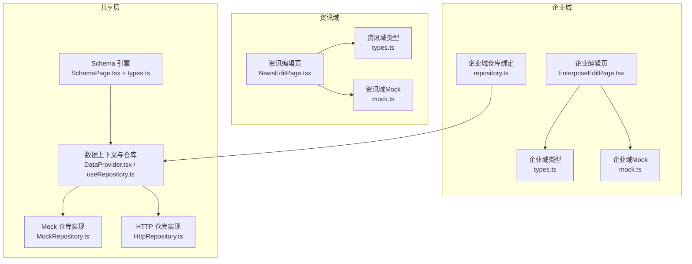
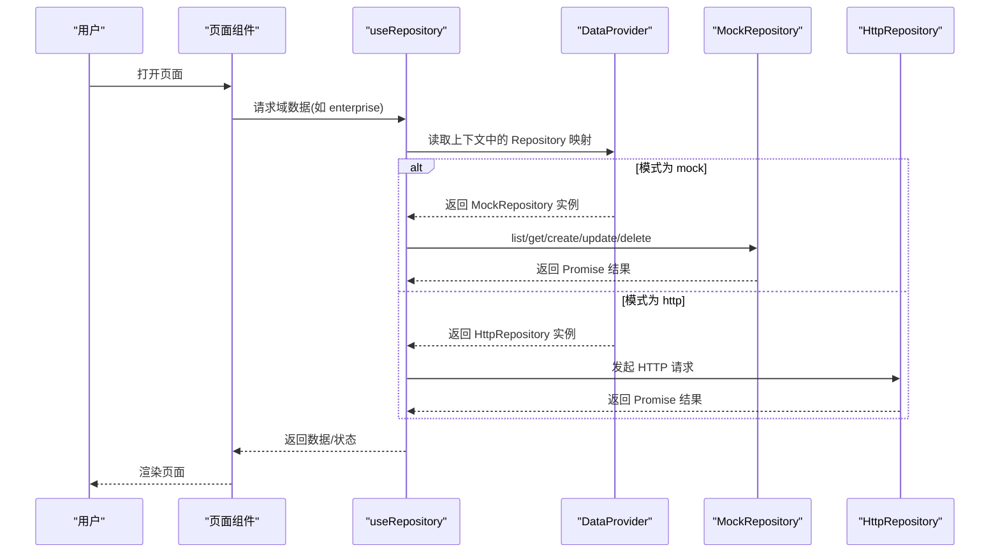
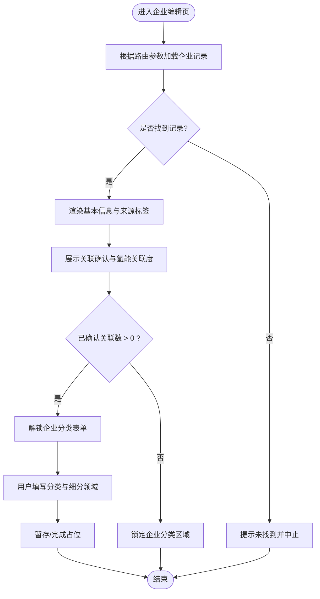
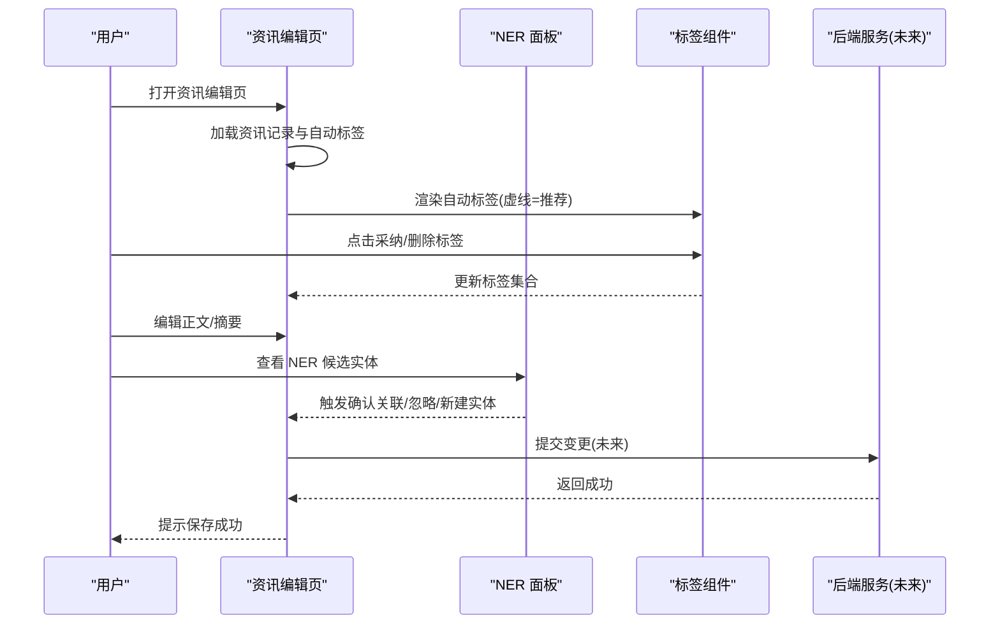
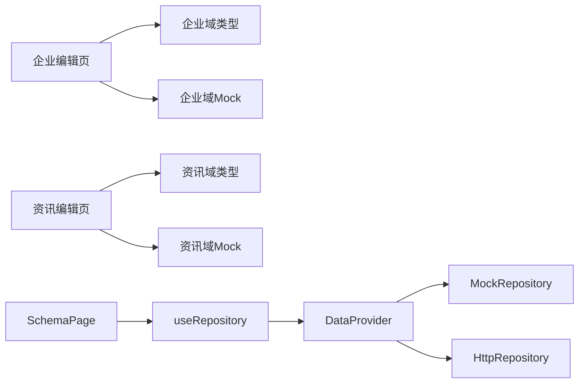

# 业务组件设计

<cite>
**本文引用的文件**
- [EnterpriseEditPage.tsx](file://hj-admin/src/domains/enterprise/pages/EnterpriseEditPage.tsx)
- [NewsEditPage.tsx](file://hj-admin/src/domains/news/pages/NewsEditPage.tsx)
- [types.ts（企业域）](file://hj-admin/src/domains/enterprise/types.ts)
- [mock.ts（企业域）](file://hj-admin/src/domains/enterprise/mock.ts)
- [repository.ts（企业域）](file://hj-admin/src/domains/enterprise/repository.ts)
- [types.ts（资讯域）](file://hj-admin/src/domains/news/types.ts)
- [mock.ts（资讯域）](file://hj-admin/src/domains/news/mock.ts)
- [SchemaPage.tsx](file://hj-admin/src/shared/schema-engine/SchemaPage.tsx)
- [types.ts（Schema引擎）](file://hj-admin/src/shared/schema-engine/types.ts)
- [DataProvider.tsx](file://hj-admin/src/shared/data/DataProvider.tsx)
- [useRepository.ts](file://hj-admin/src/shared/data/useRepository.ts)
- [HttpRepository.ts](file://hj-admin/src/shared/data/HttpRepository.ts)
- [MockRepository.ts](file://hj-admin/src/shared/data/MockRepository.ts)
</cite>

## 目录
1. [引言](#引言)
2. [项目结构](#项目结构)
3. [核心组件](#核心组件)
4. [架构总览](#架构总览)
5. [详细组件分析](#详细组件分析)
6. [依赖分析](#依赖分析)
7. [性能考虑](#性能考虑)
8. [故障排查指南](#故障排查指南)
9. [结论](#结论)
10. [附录](#附录)

## 引言
本设计文档面向氢界大数据平台的业务组件体系，聚焦以下目标：
- 描述领域特定页面组件 EnterpriseEditPage 与 NewsEditPage 的设计与职责边界。
- 阐述共享业务组件的设计理念与复用策略，包括 EntityLink、NER、Tags 等能力在现有代码中的体现与扩展点。
- 明确组件间数据传递与事件通信机制，给出开发规范（接口设计、状态管理、错误处理）。
- 提供测试策略与集成测试方法，确保质量与可维护性。

## 项目结构
本项目采用“按域组织”的目录结构，每个域包含类型定义、Mock 数据、仓库绑定以及页面实现；共享层提供 Schema 驱动引擎与数据访问抽象。

图表来源
- [EnterpriseEditPage.tsx:1-117](file://hj-admin/src/domains/enterprise/pages/EnterpriseEditPage.tsx#L1-L117)
- [NewsEditPage.tsx:1-166](file://hj-admin/src/domains/news/pages/NewsEditPage.tsx#L1-L166)
- [types.ts（企业域）:1-50](file://hj-admin/src/domains/enterprise/types.ts#L1-L50)
- [mock.ts（企业域）:1-24](file://hj-admin/src/domains/enterprise/mock.ts#L1-L24)
- [repository.ts（企业域）:1-6](file://hj-admin/src/domains/enterprise/repository.ts#L1-L6)
- [types.ts（资讯域）:1-50](file://hj-admin/src/domains/news/types.ts#L1-L50)
- [mock.ts（资讯域）:1-60](file://hj-admin/src/domains/news/mock.ts#L1-L60)
- [SchemaPage.tsx:1-226](file://hj-admin/src/shared/schema-engine/SchemaPage.tsx#L1-L226)
- [types.ts（Schema引擎）:1-216](file://hj-admin/src/shared/schema-engine/types.ts#L1-L216)
- [DataProvider.tsx:1-44](file://hj-admin/src/shared/data/DataProvider.tsx#L1-L44)
- [useRepository.ts:1-24](file://hj-admin/src/shared/data/useRepository.ts#L1-L24)
- [MockRepository.ts:1-101](file://hj-admin/src/shared/data/MockRepository.ts#L1-L101)
- [HttpRepository.ts:1-70](file://hj-admin/src/shared/data/HttpRepository.ts#L1-L70)

章节来源
- [EnterpriseEditPage.tsx:1-117](file://hj-admin/src/domains/enterprise/pages/EnterpriseEditPage.tsx#L1-L117)
- [NewsEditPage.tsx:1-166](file://hj-admin/src/domains/news/pages/NewsEditPage.tsx#L1-L166)
- [SchemaPage.tsx:1-226](file://hj-admin/src/shared/schema-engine/SchemaPage.tsx#L1-L226)
- [DataProvider.tsx:1-44](file://hj-admin/src/shared/data/DataProvider.tsx#L1-L44)
- [useRepository.ts:1-24](file://hj-admin/src/shared/data/useRepository.ts#L1-L24)
- [MockRepository.ts:1-101](file://hj-admin/src/shared/data/MockRepository.ts#L1-L101)
- [HttpRepository.ts:1-70](file://hj-admin/src/shared/data/HttpRepository.ts#L1-L70)

## 核心组件
- 企业编辑页（EnterpriseEditPage）
  - 职责：展示企业基本信息、关联确认入口、分类判定（含细分领域多选），并内置简易关联 Tab 子组件以聚合资讯/项目/专利数量与批量操作入口。
  - 数据来源：通过本地 Mock 数据查找对应企业记录，结合类型定义进行渲染。
  - 交互要点：返回导航、暂存/完成按钮、关联度标签、分类解锁条件（需先完成关联确认）。
- 资讯编辑页（NewsEditPage）
  - 职责：标题编辑、正文富文本编辑、摘要生成、自动标签展示与采纳、NER 实体识别结果面板（精确匹配/归一化/相似度三级置信度）、发布/草稿等操作。
  - 数据来源：通过本地 Mock 数据加载资讯条目，使用类型定义展示统计与候选实体。
  - 交互要点：右侧 NER 面板支持确认关联、忽略、创建新实体等动作；底部信息栏展示元数据与版本历史。

章节来源
- [EnterpriseEditPage.tsx:1-117](file://hj-admin/src/domains/enterprise/pages/EnterpriseEditPage.tsx#L1-L117)
- [NewsEditPage.tsx:1-166](file://hj-admin/src/domains/news/pages/NewsEditPage.tsx#L1-L166)
- [types.ts（企业域）:1-50](file://hj-admin/src/domains/enterprise/types.ts#L1-L50)
- [types.ts（资讯域）:1-50](file://hj-admin/src/domains/news/types.ts#L1-L50)

## 架构总览
系统采用“Schema 驱动 + 自定义页面”的双轨模式：
- Schema 驱动：通过 PageSchema 配置筛选、表格、分页、行操作、弹窗、Tab 分组等，由 SchemaPage 统一渲染，降低重复页面代码。
- 自定义页面：对复杂交互场景（如资讯编辑含 NER 面板）采用独立页面组件，灵活控制 UI 与流程。
- 数据访问：通过 DataProvider 注入 Repository 实例，useRepository Hook 获取具体域的数据源；默认使用 MockRepository，生产环境替换为 HttpRepository。

图表来源
- [SchemaPage.tsx:1-226](file://hj-admin/src/shared/schema-engine/SchemaPage.tsx#L1-L226)
- [types.ts（Schema引擎）:1-216](file://hj-admin/src/shared/schema-engine/types.ts#L1-L216)
- [DataProvider.tsx:1-44](file://hj-admin/src/shared/data/DataProvider.tsx#L1-L44)
- [useRepository.ts:1-24](file://hj-admin/src/shared/data/useRepository.ts#L1-L24)
- [MockRepository.ts:1-101](file://hj-admin/src/shared/data/MockRepository.ts#L1-L101)
- [HttpRepository.ts:1-70](file://hj-admin/src/shared/data/HttpRepository.ts#L1-L70)

## 详细组件分析

### 企业编辑页（EnterpriseEditPage）
- 关键职责
  - 基本信息展示：字段来源标注（API/手动/映射），简介输入框。
  - 关联确认：显示氢能关联度分数与种子源标记，提供简易关联 Tab（资讯/项目/专利）与批量操作入口。
  - 企业分类：根据是否已确认关联解锁分类表单，包含维度判断、企业类型多选、细分领域多选（联动选项来源于类型定义）。
- 数据与类型
  - 使用企业域类型定义约束字段与枚举值，细分领域选项来自 BIZ_TYPE_SUBFIELDS。
  - 使用企业域 Mock 数据定位当前企业记录。
- 交互与事件
  - 返回导航、暂存/完成按钮（占位逻辑）。
  - 简易关联 Tab 内部维护 activeTab 状态，展示计数与操作区。
- 复用与扩展
  - 可将“简易关联 Tab”抽取为通用 Tabs简易关联 组件，供其他编辑页复用。
  - 后续可接入 EntityLink 组件用于候选实体快速选择与确认。

图表来源
- [EnterpriseEditPage.tsx:1-117](file://hj-admin/src/domains/enterprise/pages/EnterpriseEditPage.tsx#L1-L117)
- [types.ts（企业域）:1-50](file://hj-admin/src/domains/enterprise/types.ts#L1-L50)
- [mock.ts（企业域）:1-24](file://hj-admin/src/domains/enterprise/mock.ts#L1-L24)

章节来源
- [EnterpriseEditPage.tsx:1-117](file://hj-admin/src/domains/enterprise/pages/EnterpriseEditPage.tsx#L1-L117)
- [types.ts（企业域）:1-50](file://hj-admin/src/domains/enterprise/types.ts#L1-L50)
- [mock.ts（企业域）:1-24](file://hj-admin/src/domains/enterprise/mock.ts#L1-L24)

### 资讯编辑页（NewsEditPage）
- 关键职责
  - 顶部操作：返回列表、标题编辑、状态徽章、省份选择、保存草稿/发布。
  - 左栏：自动标签展示与采纳、正文富文本编辑、摘要生成。
  - 右栏：NER 关联确认面板，展示三类置信度（精确匹配/归一化/相似度）及候选实体，支持确认关联、忽略、创建新实体。
- 数据与类型
  - 使用资讯域类型定义展示 nerEntities/linkedEntities 统计与 autoTags。
  - 使用资讯域 Mock 数据加载条目。
- 交互与事件
  - 标题双向绑定、正文 contentEditable 编辑、标签点击采纳/删除。
  - NER 面板内各区块提供不同操作按钮，便于运营人员快速决策。
- 复用与扩展
  - 可将 NER 面板封装为 NER 组件，接收实体列表与回调，供多页面复用。
  - 自动标签区可封装为 Tags 组件，支持 AI 推荐与人工采纳。

图表来源
- [NewsEditPage.tsx:1-166](file://hj-admin/src/domains/news/pages/NewsEditPage.tsx#L1-L166)
- [types.ts（资讯域）:1-50](file://hj-admin/src/domains/news/types.ts#L1-L50)
- [mock.ts（资讯域）:1-60](file://hj-admin/src/domains/news/mock.ts#L1-L60)

章节来源
- [NewsEditPage.tsx:1-166](file://hj-admin/src/domains/news/pages/NewsEditPage.tsx#L1-L166)
- [types.ts（资讯域）:1-50](file://hj-admin/src/domains/news/types.ts#L1-L50)
- [mock.ts（资讯域）:1-60](file://hj-admin/src/domains/news/mock.ts#L1-L60)

### 共享业务组件设计理念（EntityLink、NER、Tags）
- EntityLink 实体链接组件
  - 目标：将文本片段与知识图谱中的实体进行链接，支持高亮、候选列表、确认/忽略/新建实体。
  - 现状：在企业/资讯编辑页中已有类似能力的内联实现（如资讯正文中的 NER 高亮与右侧面板）。
  - 建议：抽取为通用组件，对外暴露 props（文本、候选实体、回调 onConfirm/onIgnore/onCreate），内部维护选中态与高亮样式。
- NER 命名实体识别组件
  - 目标：集中展示识别结果与置信度等级，提供批量操作与过滤。
  - 现状：资讯编辑页右侧面板实现了 L1/L2/L3 三种置信度的展示与操作。
  - 建议：封装为 NER 面板组件，支持传入不同实体类型（企业/项目/政策/标准/专利）与统计卡片，统一交互与样式。
- Tags 标签组件
  - 目标：统一管理标签的展示、添加、删除、采纳（AI 推荐）与颜色主题。
  - 现状：资讯编辑页左侧展示了自动标签与采纳提示。
  - 建议：封装为 Tags 组件，支持 mode（只读/编辑/AI 推荐），并提供 onChange 回调同步到父组件状态。

[本节为概念性说明，不直接分析具体文件，故无章节来源]

## 依赖分析
- 组件耦合
  - 企业编辑页依赖企业域类型与 Mock 数据，并通过本地状态管理简易关联 Tab。
  - 资讯编辑页依赖资讯域类型与 Mock 数据，并在同一组件内组合多个子模块（标签、正文、NER）。
- 数据层依赖
  - DataProvider 根据 domainConfig 动态注入 MockRepository 或 HttpRepository。
  - useRepository 从 DataContext 获取指定 entity 的 Repository 实例，缺失时返回空操作 fallback，避免运行时崩溃。
- 外部依赖
  - Ant Design 组件库用于 UI 构建。
  - React Router 用于路由与导航。

图表来源
- [EnterpriseEditPage.tsx:1-117](file://hj-admin/src/domains/enterprise/pages/EnterpriseEditPage.tsx#L1-L117)
- [NewsEditPage.tsx:1-166](file://hj-admin/src/domains/news/pages/NewsEditPage.tsx#L1-L166)
- [types.ts（企业域）:1-50](file://hj-admin/src/domains/enterprise/types.ts#L1-L50)
- [types.ts（资讯域）:1-50](file://hj-admin/src/domains/news/types.ts#L1-L50)
- [mock.ts（企业域）:1-24](file://hj-admin/src/domains/enterprise/mock.ts#L1-L24)
- [mock.ts（资讯域）:1-60](file://hj-admin/src/domains/news/mock.ts#L1-L60)
- [DataProvider.tsx:1-44](file://hj-admin/src/shared/data/DataProvider.tsx#L1-L44)
- [useRepository.ts:1-24](file://hj-admin/src/shared/data/useRepository.ts#L1-L24)
- [MockRepository.ts:1-101](file://hj-admin/src/shared/data/MockRepository.ts#L1-L101)
- [HttpRepository.ts:1-70](file://hj-admin/src/shared/data/HttpRepository.ts#L1-L70)
- [SchemaPage.tsx:1-226](file://hj-admin/src/shared/schema-engine/SchemaPage.tsx#L1-L226)

章节来源
- [DataProvider.tsx:1-44](file://hj-admin/src/shared/data/DataProvider.tsx#L1-L44)
- [useRepository.ts:1-24](file://hj-admin/src/shared/data/useRepository.ts#L1-L24)
- [MockRepository.ts:1-101](file://hj-admin/src/shared/data/MockRepository.ts#L1-L101)
- [HttpRepository.ts:1-70](file://hj-admin/src/shared/data/HttpRepository.ts#L1-L70)

## 性能考虑
- 列表与分页
  - SchemaPage 基于 Table 组件实现分页与滚动，建议在大数据量场景下启用虚拟滚动与按需渲染列。
- 数据加载
  - MockRepository 模拟网络延迟，利于体验真实异步态；切换至 HttpRepository 后应增加重试与超时策略。
- 渲染优化
  - 对复杂编辑页（如资讯编辑）可采用懒加载与分块渲染，减少首屏压力。
- 缓存策略
  - 对热点实体（如企业详情）可增加前端缓存，避免重复请求。

[本节为通用指导，不直接分析具体文件，故无章节来源]

## 故障排查指南
- Repository 未注册
  - 现象：控制台警告提示未找到某 entity 的 Repository。
  - 原因：未在 domains.config 中注册或未调用 registerMockData。
  - 处理：检查 domain 配置与 Mock 数据注册，确保 useRepository 能正确获取实例。
- 数据为空或找不到记录
  - 现象：页面提示未找到记录。
  - 原因：路由参数 id 不存在于 Mock 数据或后端返回空。
  - 处理：校验路由参数与数据一致性，必要时增加友好提示与回退逻辑。
- 表单状态异常
  - 现象：分类区域被锁定或标签未生效。
  - 原因：前置条件未满足或状态未同步。
  - 处理：检查解锁条件与状态更新回调，确保父子组件状态一致。

章节来源
- [useRepository.ts:1-24](file://hj-admin/src/shared/data/useRepository.ts#L1-L24)
- [EnterpriseEditPage.tsx:1-117](file://hj-admin/src/domains/enterprise/pages/EnterpriseEditPage.tsx#L1-L117)
- [NewsEditPage.tsx:1-166](file://hj-admin/src/domains/news/pages/NewsEditPage.tsx#L1-L166)

## 结论
- 企业编辑页与资讯编辑页分别承担结构化信息与复杂编辑场景的职责，遵循清晰的职责划分与状态管理。
- 共享层通过 Schema 驱动与 Repository 抽象，显著降低重复页面代码，提升开发效率。
- 建议将 NER、Tags、EntityLink 等能力进一步封装为通用组件，形成稳定的复用基座。
- 配合完善的测试策略与集成方法，可保障组件质量与演进稳定性。

[本节为总结性内容，不直接分析具体文件，故无章节来源]

## 附录

### 业务组件开发规范
- 接口设计
  - 组件 Props 使用 TypeScript 严格定义，区分必填与可选字段。
  - 回调函数采用单向数据流，避免直接修改父组件状态。
- 状态管理
  - 页面级状态使用 useState/useReducer，跨组件状态通过 Context 或上层状态容器管理。
  - 表单状态与展示状态分离，避免耦合。
- 错误处理
  - 数据加载失败时提供降级展示与重试入口。
  - 用户操作失败时给出明确提示与恢复路径。
- 可访问性与国际化
  - 为关键交互元素提供 aria 属性与键盘可达性。
  - 文案抽离，便于后续国际化扩展。

[本节为通用规范，不直接分析具体文件，故无章节来源]

### 组件测试策略与集成测试方法
- 单元测试
  - 针对纯函数与工具方法进行断言，覆盖边界条件与异常分支。
  - 对简单组件（如 Tags）进行快照与交互测试。
- 集成测试
  - 使用 React Testing Library 模拟用户操作，验证页面行为与状态变化。
  - 对 SchemaPage 的筛选、分页、行操作进行端到端验证。
- 数据层测试
  - 对 MockRepository 与 HttpRepository 的 list/get/create/update/delete 进行契约测试。
  - 模拟网络异常与超时，验证错误处理与重试逻辑。
- 回归与持续集成
  - 将关键用例纳入 CI，确保每次提交不破坏既有功能。

[本节为通用测试指导，不直接分析具体文件，故无章节来源]