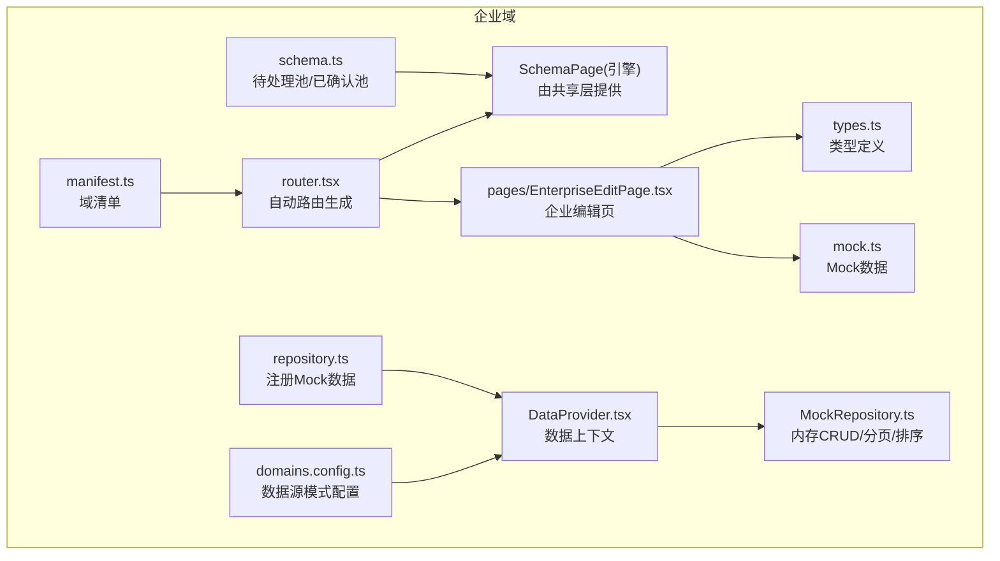
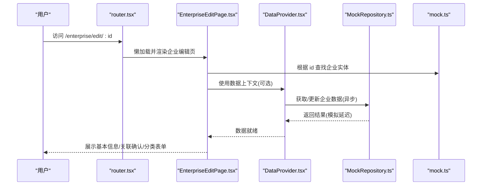
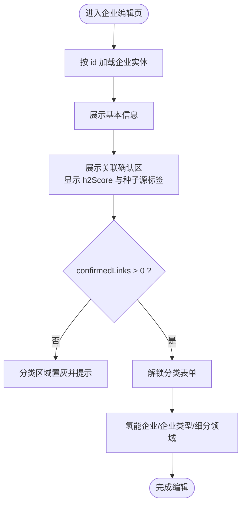
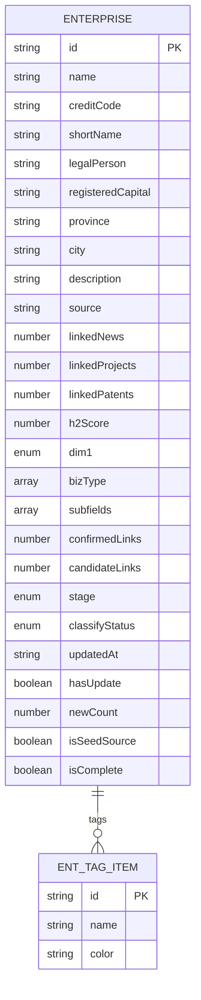
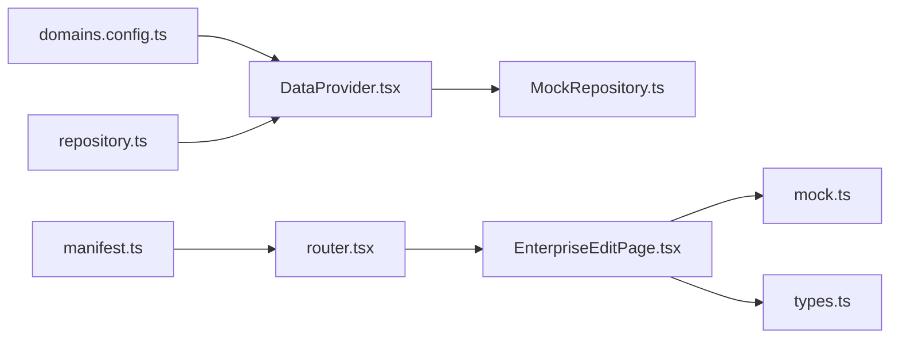

# 企业库业务组件

<cite>
**本文引用的文件**
- [EnterpriseEditPage.tsx](file://hj-admin/src/domains/enterprise/pages/EnterpriseEditPage.tsx)
- [types.ts](file://hj-admin/src/domains/enterprise/types.ts)
- [mock.ts](file://hj-admin/src/domains/enterprise/mock.ts)
- [schema.ts](file://hj-admin/src/domains/enterprise/schema.ts)
- [repository.ts](file://hj-admin/src/domains/enterprise/repository.ts)
- [manifest.ts](file://hj-admin/src/domains/enterprise/manifest.ts)
- [DataProvider.tsx](file://hj-admin/src/shared/data/DataProvider.tsx)
- [MockRepository.ts](file://hj-admin/src/shared/data/MockRepository.ts)
- [domains.config.ts](file://hj-admin/src/config/domains.config.ts)
- [router.tsx](file://hj-admin/src/app/router.tsx)
</cite>

## 目录
1. [简介](#简介)
2. [项目结构](#项目结构)
3. [核心组件](#核心组件)
4. [架构总览](#架构总览)
5. [详细组件分析](#详细组件分析)
6. [依赖关系分析](#依赖关系分析)
7. [性能考虑](#性能考虑)
8. [故障排查指南](#故障排查指南)
9. [结论](#结论)
10. [附录](#附录)

## 简介
本文件为企业库业务组件的权威技术文档，聚焦 EnterpriseEditPage 企业编辑页面的实现与最佳实践。内容覆盖：
- 基本信息展示、关联确认流程、企业分类三大模块
- 页面状态管理、数据绑定与表单验证机制
- 氢能关联度计算逻辑与企业种子源判断规则
- Tabs简易关联组件（资讯、项目、专利）的实现要点
- 企业数据模型定义与 Mock 数据结构说明
- 企业编辑工作流的最佳实践与性能优化建议

## 项目结构
企业域采用“领域清单 + Schema 驱动 + Repository 抽象”的分层组织方式，配合路由懒加载与数据上下文注入，形成高内聚、低耦合的可扩展架构。



图表来源
- [manifest.ts:1-20](file://hj-admin/src/domains/enterprise/manifest.ts#L1-L20)
- [router.tsx:1-58](file://hj-admin/src/app/router.tsx#L1-L58)
- [schema.ts:1-64](file://hj-admin/src/domains/enterprise/schema.ts#L1-L64)
- [EnterpriseEditPage.tsx:1-117](file://hj-admin/src/domains/enterprise/pages/EnterpriseEditPage.tsx#L1-L117)
- [types.ts:1-50](file://hj-admin/src/domains/enterprise/types.ts#L1-L50)
- [mock.ts:1-24](file://hj-admin/src/domains/enterprise/mock.ts#L1-L24)
- [repository.ts:1-6](file://hj-admin/src/domains/enterprise/repository.ts#L1-L6)
- [DataProvider.tsx:1-44](file://hj-admin/src/shared/data/DataProvider.tsx#L1-L44)
- [MockRepository.ts:1-101](file://hj-admin/src/shared/data/MockRepository.ts#L1-L101)
- [domains.config.ts:1-18](file://hj-admin/src/config/domains.config.ts#L1-L18)

章节来源
- [manifest.ts:1-20](file://hj-admin/src/domains/enterprise/manifest.ts#L1-L20)
- [router.tsx:1-58](file://hj-admin/src/app/router.tsx#L1-L58)
- [schema.ts:1-64](file://hj-admin/src/domains/enterprise/schema.ts#L1-L64)
- [DataProvider.tsx:1-44](file://hj-admin/src/shared/data/DataProvider.tsx#L1-L44)
- [MockRepository.ts:1-101](file://hj-admin/src/shared/data/MockRepository.ts#L1-L101)
- [domains.config.ts:1-18](file://hj-admin/src/config/domains.config.ts#L1-L18)

## 核心组件
- 企业编辑页 EnterpriseEditPage
  - 负责基本信息展示、关联确认入口、企业分类表单
  - 内置 Tabs简易关联组件，用于资讯/项目/专利三维度关联管理
- 类型与模型 types.ts
  - 定义企业实体、标签、细分领域映射等关键类型
- Mock 数据 mock.ts
  - 提供示例企业与标签集合，便于本地开发体验
- 领域清单 manifest.ts
  - 声明菜单、路由与懒加载组件
- 列表页 Schema schema.ts
  - 待处理池与已确认池的列、筛选、操作、Tab 分组
- 数据仓库 repository.ts
  - 在启动阶段将 Mock 数据注册到 DataProvider
- 数据上下文 DataProvider.tsx 与 MockRepository.ts
  - 统一注入 Repository 实例，支持 mock/http 两种数据源模式

章节来源
- [EnterpriseEditPage.tsx:1-117](file://hj-admin/src/domains/enterprise/pages/EnterpriseEditPage.tsx#L1-L117)
- [types.ts:1-50](file://hj-admin/src/domains/enterprise/types.ts#L1-L50)
- [mock.ts:1-24](file://hj-admin/src/domains/enterprise/mock.ts#L1-L24)
- [schema.ts:1-64](file://hj-admin/src/domains/enterprise/schema.ts#L1-L64)
- [repository.ts:1-6](file://hj-admin/src/domains/enterprise/repository.ts#L1-L6)
- [DataProvider.tsx:1-44](file://hj-admin/src/shared/data/DataProvider.tsx#L1-L44)
- [MockRepository.ts:1-101](file://hj-admin/src/shared/data/MockRepository.ts#L1-L101)

## 架构总览
企业编辑页通过路由懒加载进入，页面内部以 Ant Design 组件构建表单与卡片区块；Mock 数据通过 DataProvider 注入，MockRepository 提供异步一致的 CRUD 能力。



图表来源
- [router.tsx:1-58](file://hj-admin/src/app/router.tsx#L1-L58)
- [EnterpriseEditPage.tsx:1-117](file://hj-admin/src/domains/enterprise/pages/EnterpriseEditPage.tsx#L1-L117)
- [DataProvider.tsx:1-44](file://hj-admin/src/shared/data/DataProvider.tsx#L1-L44)
- [MockRepository.ts:1-101](file://hj-admin/src/shared/data/MockRepository.ts#L1-L101)
- [mock.ts:1-24](file://hj-admin/src/domains/enterprise/mock.ts#L1-L24)

## 详细组件分析

### 企业编辑页 EnterpriseEditPage
- 基本信息展示
  - 网格布局展示企业全称、社会信用代码、简称、法定代表人、注册资本、省市等字段，并以 Tag 标注数据来源（API/手动/映射）
  - 企业简介使用 TextArea 输入框
- 关联确认
  - 标题区显示“氢能关联度分数”与“种子源企业”判定标签
  - 提示文案引导先完成关联确认，再解锁分类
  - 集成 Tabs简易关联组件，汇总资讯/项目/专利数量与批量操作入口
- 企业分类（受控于关联确认）
  - 当 confirmedLinks > 0 时解锁，否则置灰不可交互
  - 包含：
    - 判断氢能企业（单选：核心/关联/非氢能）
    - 判断企业类型（多选：投资运营型/装备制造型/投资金融型/公共服务型）
    - 判断细分领域（多选，基于 BIZ_TYPE_SUBFIELDS 联动）



图表来源
- [EnterpriseEditPage.tsx:1-117](file://hj-admin/src/domains/enterprise/pages/EnterpriseEditPage.tsx#L1-L117)

章节来源
- [EnterpriseEditPage.tsx:1-117](file://hj-admin/src/domains/enterprise/pages/EnterpriseEditPage.tsx#L1-L117)

#### 页面状态管理与数据绑定
- 状态来源
  - 页面从 mockEnterprises 中按 id 定位当前企业对象
  - 分类表单使用 defaultValue 初始化，未接入受控状态或持久化
- 数据绑定
  - 基本信息为只读展示，仅简介为可编辑输入
  - 分类表单选项来源于 types.ts 中的枚举与 BIZ_TYPE_SUBFIELDS 映射
- 表单验证
  - 当前未实现显式校验逻辑，必填项通过 UI 提示与流程约束（先关联后分类）

章节来源
- [EnterpriseEditPage.tsx:1-117](file://hj-admin/src/domains/enterprise/pages/EnterpriseEditPage.tsx#L1-L117)
- [types.ts:1-50](file://hj-admin/src/domains/enterprise/types.ts#L1-L50)

#### 氢能关联度计算逻辑与种子源判断
- 关联度展示
  - 页面直接读取 ent.h2Score 并在标题区展示
- 种子源判定
  - 当 h2Score >= 70 时标记为“种子源企业”，否则为“非种子源企业”
- 计算规则
  - 当前页面不实现具体算法，仅做展示与阈值判定
  - 后续可在关联确认后触发重算，结合资讯/项目/专利命中情况与权重进行更新

章节来源
- [EnterpriseEditPage.tsx:52-62](file://hj-admin/src/domains/enterprise/pages/EnterpriseEditPage.tsx#L52-L62)

#### Tabs简易关联组件
- 功能概述
  - 以三个 Tab 维度展示资讯、项目、专利的关联数量
  - 顶部统计栏显示“已确认/候选”数量与批量操作按钮
- 交互设计
  - 点击切换 Tab，当前激活态高亮
  - 预留批量确认与全部忽略入口，便于后续扩展具体列表与选择逻辑

```mermaid
classDiagram
class Tabs简易关联 {
+activeTab : string
+tabs : Array<{key,label}>
+ent : {linkedNews : number, linkedProjects : number, linkedPatents : number, confirmedLinks : number, candidateLinks : number}
}
```

图表来源
- [EnterpriseEditPage.tsx:90-114](file://hj-admin/src/domains/enterprise/pages/EnterpriseEditPage.tsx#L90-L114)

章节来源
- [EnterpriseEditPage.tsx:90-114](file://hj-admin/src/domains/enterprise/pages/EnterpriseEditPage.tsx#L90-L114)

### 企业数据模型与 Mock 数据
- 数据模型 types.ts
  - 企业实体 Enterprise 包含基础信息、关联计数、评分、分类字段、标签、阶段与状态等
  - 细分领域映射 BIZ_TYPE_SUBFIELDS 按企业类型给出推荐子领域
- Mock 数据 mock.ts
  - 提供多组企业样例，涵盖不同评分、分类与阶段，便于演示与测试



图表来源
- [types.ts:1-50](file://hj-admin/src/domains/enterprise/types.ts#L1-L50)
- [mock.ts:1-24](file://hj-admin/src/domains/enterprise/mock.ts#L1-L24)

章节来源
- [types.ts:1-50](file://hj-admin/src/domains/enterprise/types.ts#L1-L50)
- [mock.ts:1-24](file://hj-admin/src/domains/enterprise/mock.ts#L1-L24)

### 列表页 Schema（待处理池/已确认池）
- 待处理池
  - 筛选：企业名称关键词
  - 列：名称（跳转编辑）、来源、关联进度、分类状态、更新时间
  - 行操作：去处理（跳转到编辑页）
  - Tab：待关联、无关联待确认（按 stage 过滤）
- 已确认池
  - 筛选：企业性质、企业类型、名称搜索
  - 列：名称（跳转编辑）、关联资讯/项目、氢能关联度、企业性质、状态、更新时间
  - 行操作：去分类（条件可见）、查看
  - Tab：待分类、已分类（按 classifyStatus 过滤）

章节来源
- [schema.ts:1-64](file://hj-admin/src/domains/enterprise/schema.ts#L1-L64)

## 依赖关系分析
- 路由与懒加载
  - manifest.ts 声明企业域路由，其中编辑页使用懒加载组件
  - router.tsx 解析所有域清单并生成路由，有 schema 走 SchemaPage，无 schema 走 LazyPage
- 数据源与上下文
  - domains.config.ts 指定 enterprise 使用 mock 模式
  - DataProvider.tsx 根据配置创建 MockRepository 实例并注入
  - repository.ts 在启动阶段调用 registerMockData 注册企业 Mock 数据
- 页面与数据
  - EnterpriseEditPage.tsx 直接从 mock.ts 中按 id 取数，便于快速原型；也可替换为通过 DataProvider 获取



图表来源
- [domains.config.ts:1-18](file://hj-admin/src/config/domains.config.ts#L1-L18)
- [DataProvider.tsx:1-44](file://hj-admin/src/shared/data/DataProvider.tsx#L1-L44)
- [MockRepository.ts:1-101](file://hj-admin/src/shared/data/MockRepository.ts#L1-L101)
- [repository.ts:1-6](file://hj-admin/src/domains/enterprise/repository.ts#L1-L6)
- [manifest.ts:1-20](file://hj-admin/src/domains/enterprise/manifest.ts#L1-L20)
- [router.tsx:1-58](file://hj-admin/src/app/router.tsx#L1-L58)
- [EnterpriseEditPage.tsx:1-117](file://hj-admin/src/domains/enterprise/pages/EnterpriseEditPage.tsx#L1-L117)
- [types.ts:1-50](file://hj-admin/src/domains/enterprise/types.ts#L1-L50)
- [mock.ts:1-24](file://hj-admin/src/domains/enterprise/mock.ts#L1-L24)

章节来源
- [domains.config.ts:1-18](file://hj-admin/src/config/domains.config.ts#L1-L18)
- [DataProvider.tsx:1-44](file://hj-admin/src/shared/data/DataProvider.tsx#L1-L44)
- [MockRepository.ts:1-101](file://hj-admin/src/shared/data/MockRepository.ts#L1-L101)
- [repository.ts:1-6](file://hj-admin/src/domains/enterprise/repository.ts#L1-L6)
- [manifest.ts:1-20](file://hj-admin/src/domains/enterprise/manifest.ts#L1-L20)
- [router.tsx:1-58](file://hj-admin/src/app/router.tsx#L1-L58)
- [EnterpriseEditPage.tsx:1-117](file://hj-admin/src/domains/enterprise/pages/EnterpriseEditPage.tsx#L1-L117)
- [types.ts:1-50](file://hj-admin/src/domains/enterprise/types.ts#L1-L50)
- [mock.ts:1-24](file://hj-admin/src/domains/enterprise/mock.ts#L1-L24)

## 性能考虑
- 列表页
  - 使用 MockRepository 的内存过滤/排序/分页，避免全量渲染
  - 合理设置 pageSize 与 showTotal，减少首屏压力
- 编辑页
  - 懒加载组件降低主包体积
  - 对 Tabs 内容按需渲染，避免一次性挂载过多 DOM
- 数据层
  - 通过 DataProvider 统一注入 Repository，便于后续切换到 HttpRepository 时保持零改动
  - 利用 domainConfig 集中控制数据源模式，便于 A/B 与灰度

[本节为通用指导，无需源码引用]

## 故障排查指南
- 企业未找到
  - 现象：编辑页显示“企业未找到(id: xxx)”
  - 原因：URL 参数 id 不在 mockEnterprises 中
  - 处理：检查路由参数与 Mock 数据是否匹配
- 分类区域不可用
  - 现象：企业分类卡片置灰且不可交互
  - 原因：confirmedLinks 为 0，需先完成关联确认
  - 处理：在关联确认区执行至少一次确认操作
- 数据不一致
  - 现象：页面展示与预期不符
  - 原因：Mock 数据未更新或未刷新
  - 处理：确认 mock.ts 数据与页面取值字段一致，必要时重启服务

章节来源
- [EnterpriseEditPage.tsx:14-16](file://hj-admin/src/domains/enterprise/pages/EnterpriseEditPage.tsx#L14-L16)
- [EnterpriseEditPage.tsx:64-66](file://hj-admin/src/domains/enterprise/pages/EnterpriseEditPage.tsx#L64-L66)

## 结论
企业编辑页以清晰的三段式结构承载了企业编辑的核心流程：基本信息展示、关联确认与企业分类。通过类型与 Mock 数据的解耦、Schema 驱动的列表页与 Repository 抽象的数据层，系统具备良好的可扩展性与可维护性。建议在后续迭代中完善表单受控与校验、引入后端 API 与增量更新策略，并对 Tabs 简易关联组件进行列表级交互与批量操作的落地。

[本节为总结性内容，无需源码引用]

## 附录

### 企业编辑工作流最佳实践
- 分步引导
  - 明确“先关联、后分类”的顺序，通过 UI 锁定与提示降低误操作
- 实时反馈
  - 在关联确认后即时更新 h2Score 与种子源标签，提升决策信心
- 表单规范
  - 将分类表单改为受控组件，增加必填校验与错误提示
- 数据一致性
  - 通过 DataProvider 与 Repository 统一读写，确保编辑前后数据一致
- 可观测性
  - 记录关键操作日志（如批量确认、忽略），便于审计与回溯

[本节为通用指导，无需源码引用]