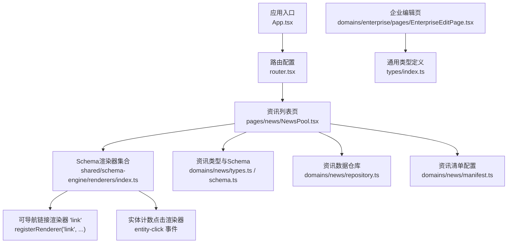
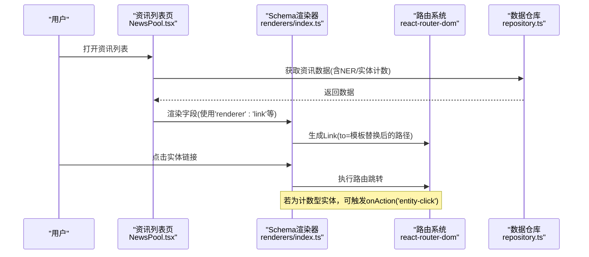
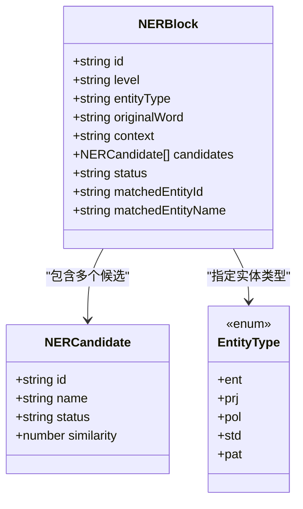
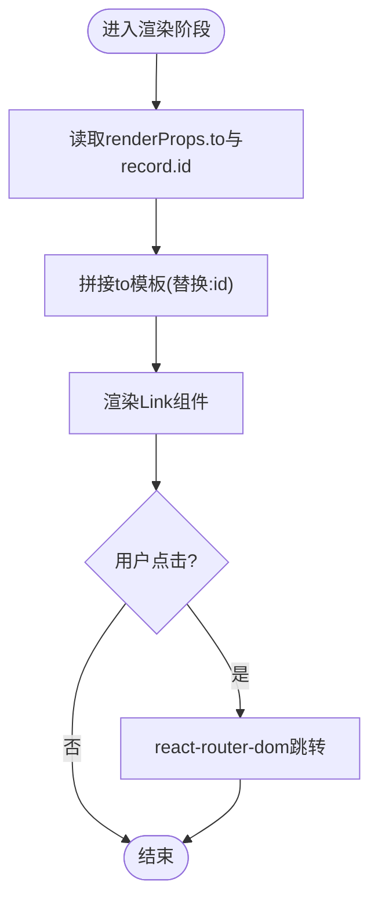
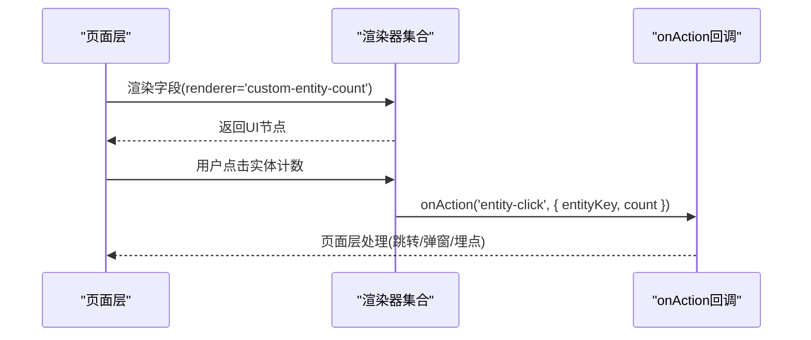
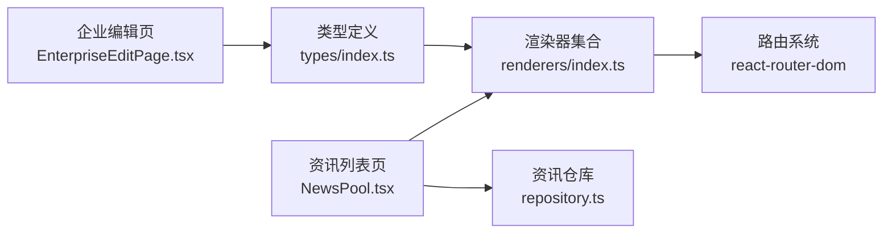

# EntityLink实体链接组件

<cite>
**本文引用的文件**   
- [index.ts](file://hj-admin/src/types/index.ts)
- [index.ts](file://hj-admin/src/shared/schema-engine/renderers/index.ts)
- [NewsPool.tsx](file://hj-admin/src/pages/news/NewsPool.tsx)
- [EnterpriseEditPage.tsx](file://hj-admin/src/domains/enterprise/pages/EnterpriseEditPage.tsx)
- [schema.ts](file://hj-admin/src/domains/news/schema.ts)
- [repository.ts](file://hj-admin/src/domains/news/repository.ts)
- [types.ts](file://hj-admin/src/domains/news/types.ts)
- [manifest.ts](file://hj-admin/src/domains/news/manifest.ts)
- [router.tsx](file://hj-admin/src/app/router.tsx)
</cite>

## 目录
1. [简介](#简介)
2. [项目结构](#项目结构)
3. [核心组件与能力](#核心组件与能力)
4. [架构总览](#架构总览)
5. [详细组件分析](#详细组件分析)
6. [依赖关系分析](#依赖关系分析)
7. [性能考虑](#性能考虑)
8. [故障排查指南](#故障排查指南)
9. [结论](#结论)
10. [附录：Props与事件约定](#附录props与事件约定)

## 简介
EntityLink实体链接组件用于在资讯、企业等页面中，将文本中的实体（如企业、项目、政策、标准、专利）识别并渲染为可点击的链接，支持跳转至对应详情页或弹窗预览。其核心目标包括：
- 实体识别算法：基于NER结果块（NERBlock）与候选集（NERCandidate），结合相似度与状态进行匹配决策。
- 链接生成机制：根据实体类型与上下文，生成可导航的URL或触发事件回调。
- 点击跳转逻辑：通过路由跳转或自定义事件处理，实现统一交互体验。
- 配置化展示：通过Props控制显示格式、跳转路径、高亮样式等。
- 扩展性：提供事件钩子与渲染器注册机制，便于在不同业务场景复用与定制。

## 项目结构
本项目采用领域驱动的组织方式，实体链接相关代码主要分布在以下位置：
- 类型定义：src/types/index.ts
- Schema引擎渲染器：src/shared/schema-engine/renderers/index.ts
- 资讯域：src/domains/news/*
- 企业域：src/domains/enterprise/*
- 路由：src/app/router.tsx

图表来源
- [router.tsx](file://hj-admin/src/app/router.tsx)
- [NewsPool.tsx](file://hj-admin/src/pages/news/NewsPool.tsx)
- [index.ts](file://hj-admin/src/shared/schema-engine/renderers/index.ts)
- [types.ts](file://hj-admin/src/domains/news/types.ts)
- [schema.ts](file://hj-admin/src/domains/news/schema.ts)
- [repository.ts](file://hj-admin/src/domains/news/repository.ts)
- [manifest.ts](file://hj-admin/src/domains/news/manifest.ts)
- [EnterpriseEditPage.tsx](file://hj-admin/src/domains/enterprise/pages/EnterpriseEditPage.tsx)
- [index.ts](file://hj-admin/src/types/index.ts)

章节来源
- [index.ts](file://hj-admin/src/types/index.ts)
- [index.ts](file://hj-admin/src/shared/schema-engine/renderers/index.ts)
- [NewsPool.tsx](file://hj-admin/src/pages/news/NewsPool.tsx)
- [EnterpriseEditPage.tsx](file://hj-admin/src/domains/enterprise/pages/EnterpriseEditPage.tsx)
- [schema.ts](file://hj-admin/src/domains/news/schema.ts)
- [repository.ts](file://hj-admin/src/domains/news/repository.ts)
- [types.ts](file://hj-admin/src/domains/news/types.ts)
- [manifest.ts](file://hj-admin/src/domains/news/manifest.ts)
- [router.tsx](file://hj-admin/src/app/router.tsx)

## 核心组件与能力
- 实体识别数据结构
  - NERBlock：包含原始词、上下文、候选集、状态、已匹配实体ID/名称等。
  - NERCandidate：候选实体名称、状态、相似度。
  - EntityType：实体类型枚举（企业、项目、政策、标准、专利）。
- 链接渲染器
  - registerRenderer('link')：根据模板字符串生成路由地址，使用react-router-dom的Link组件完成跳转。
  - entity-click事件：在计数型实体渲染时触发，供上层统计或打开详情面板。
- 事件与扩展
  - onAction('entity-click', payload)：由渲染器向上抛出，便于页面层统一处理。
  - 自定义渲染器：通过registerRenderer扩展新的实体展示与交互行为。

章节来源
- [index.ts](file://hj-admin/src/types/index.ts)
- [index.ts](file://hj-admin/src/shared/schema-engine/renderers/index.ts)

## 架构总览
EntityLink在系统中的职责边界如下：
- 数据层：从仓库读取资讯/企业数据，其中包含NER结果与实体关联信息。
- 渲染层：Schema引擎按字段类型选择渲染器，'link'渲染器负责生成可导航链接。
- 交互层：点击后通过路由跳转或事件回调，交由页面层决定具体行为（跳转或弹窗）。

图表来源
- [NewsPool.tsx](file://hj-admin/src/pages/news/NewsPool.tsx)
- [index.ts](file://hj-admin/src/shared/schema-engine/renderers/index.ts)
- [repository.ts](file://hj-admin/src/domains/news/repository.ts)

## 详细组件分析

### 实体识别与数据结构
- NERBlock
  - 关键字段：id、level、entityType、originalWord、context、candidates、status、matchedEntityId、matchedEntityName。
  - 用途：表示一段被NER识别的文本片段及其候选匹配结果。
- NERCandidate
  - 关键字段：id、name、status、similarity。
  - 用途：候选实体名称、分类状态与相似度评分，用于排序与选择。
- EntityType
  - 取值：ent、prj、pol、std、pat。
  - 用途：区分不同实体类别，影响跳转路径与展示文案。

图表来源
- [index.ts](file://hj-admin/src/types/index.ts)

章节来源
- [index.ts](file://hj-admin/src/types/index.ts)

### 链接生成与跳转机制
- 渲染器注册
  - registerRenderer('link')：接收value、record、renderProps；以toTemplate.replace(':id', record.id)生成最终路由地址；使用Link组件渲染。
- 点击行为
  - 默认：通过react-router-dom的Link组件完成SPA内跳转。
  - 扩展：对于计数型实体，可通过onAction('entity-click', { entityKey, count })上报事件，由页面层决定是跳转还是弹出预览。

图表来源
- [index.ts](file://hj-admin/src/shared/schema-engine/renderers/index.ts)

章节来源
- [index.ts](file://hj-admin/src/shared/schema-engine/renderers/index.ts)

### 事件处理与自定义渲染器
- 事件模型
  - onAction(type, payload)：type='entity-click'，payload包含entityKey与count。
- 自定义渲染器
  - 通过registerRenderer(name, rendererFn)注册新渲染器，可在Schema字段中指定renderer属性以启用。
- 典型用法
  - 在资讯列表中，对“实体数量”字段使用自定义渲染器，点击后触发entity-click事件，页面层可据此打开侧边栏或弹窗。

图表来源
- [index.ts](file://hj-admin/src/shared/schema-engine/renderers/index.ts)

章节来源
- [index.ts](file://hj-admin/src/shared/schema-engine/renderers/index.ts)

### 业务场景：资讯库与企业库
- 资讯库
  - 列表页使用Schema定义字段与渲染器，'link'渲染器用于跳转到资讯详情或实体详情。
  - 实体计数字段可绑定entity-click事件，用于快速查看某类实体关联情况。
- 企业库
  - 企业编辑页可复用相同的数据结构与渲染器，实现企业维度实体的展示与跳转。

章节来源
- [NewsPool.tsx](file://hj-admin/src/pages/news/NewsPool.tsx)
- [EnterpriseEditPage.tsx](file://hj-admin/src/domains/enterprise/pages/EnterpriseEditPage.tsx)

## 依赖关系分析
- 外部依赖
  - react-router-dom：提供Link组件与路由跳转能力。
  - antd：提供基础UI组件（如Tag等）。
- 内部依赖
  - types/index.ts：定义NERBlock、NERCandidate、EntityType等核心类型。
  - domains/news/*：资讯域的Schema、类型、仓库与清单配置。
  - shared/schema-engine/renderers/index.ts：集中注册各类渲染器，包括'link'与计数型实体渲染器。

图表来源
- [index.ts](file://hj-admin/src/types/index.ts)
- [index.ts](file://hj-admin/src/shared/schema-engine/renderers/index.ts)
- [NewsPool.tsx](file://hj-admin/src/pages/news/NewsPool.tsx)
- [repository.ts](file://hj-admin/src/domains/news/repository.ts)
- [EnterpriseEditPage.tsx](file://hj-admin/src/domains/enterprise/pages/EnterpriseEditPage.tsx)

章节来源
- [index.ts](file://hj-admin/src/types/index.ts)
- [index.ts](file://hj-admin/src/shared/schema-engine/renderers/index.ts)
- [NewsPool.tsx](file://hj-admin/src/pages/news/NewsPool.tsx)
- [repository.ts](file://hj-admin/src/domains/news/repository.ts)
- [EnterpriseEditPage.tsx](file://hj-admin/src/domains/enterprise/pages/EnterpriseEditPage.tsx)

## 性能考虑
- 避免重复计算
  - 对长文本的实体识别与候选排序应在服务端或预处理阶段完成，前端仅消费结果。
- 渲染优化
  - 使用React.memo包裹实体链接渲染节点，减少不必要的重渲染。
  - 对大量实体列表采用虚拟滚动或分页加载。
- 路由跳转
  - 优先使用react-router-dom的Link组件进行客户端跳转，避免整页刷新。
- 事件节流
  - 对高频点击事件（如实体计数）进行防抖/节流，降低事件风暴。

[本节为通用建议，不直接分析具体文件]

## 故障排查指南
- 链接无法跳转
  - 检查renderProps.to模板是否正确，是否包含:id占位符且record.id存在。
  - 确认react-router-dom的路由配置是否覆盖目标路径。
- 实体计数点击无响应
  - 确认页面层是否监听onAction('entity-click')事件并正确实现处理逻辑。
- 实体类型不匹配
  - 检查EntityType枚举值是否与后端返回一致，避免渲染器分支错误。
- 候选实体未显示
  - 检查NERBlock.candidates是否为空，similarity阈值是否过高导致过滤。

章节来源
- [index.ts](file://hj-admin/src/shared/schema-engine/renderers/index.ts)
- [index.ts](file://hj-admin/src/types/index.ts)

## 结论
EntityLink实体链接组件通过统一的类型定义与渲染器机制，实现了跨业务场景的实体识别、链接生成与跳转能力。借助Schema引擎与事件回调，组件具备良好的可扩展性与可维护性。建议在项目中广泛复用该组件，并结合业务需求定制渲染器与事件处理逻辑。

[本节为总结性内容，不直接分析具体文件]

## 附录：Props与事件约定
- Props约定（适用于'renderer': 'link'）
  - to: string | undefined
    - 描述：路由模板字符串，支持:id占位符，将被record.id替换。
    - 示例："/entities/:id"
  - value: any
    - 描述：渲染显示的文本内容。
  - record: object
    - 描述：当前行记录对象，用于提取id等字段。
- 事件约定
  - onAction(type, payload)
    - type: 'entity-click'
    - payload: { entityKey: string; count: number }
    - 说明：用于计数型实体点击时的上报与交互。

章节来源
- [index.ts](file://hj-admin/src/shared/schema-engine/renderers/index.ts)