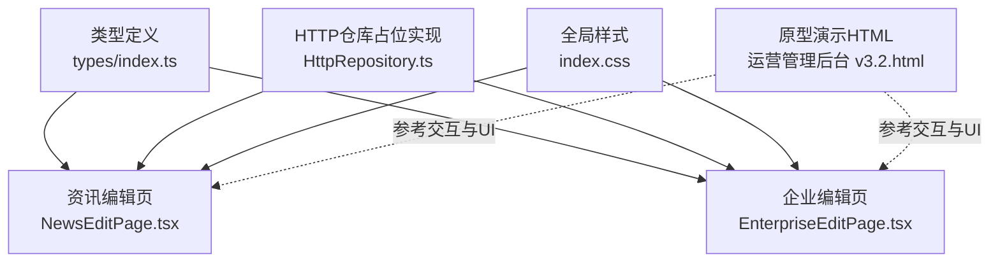
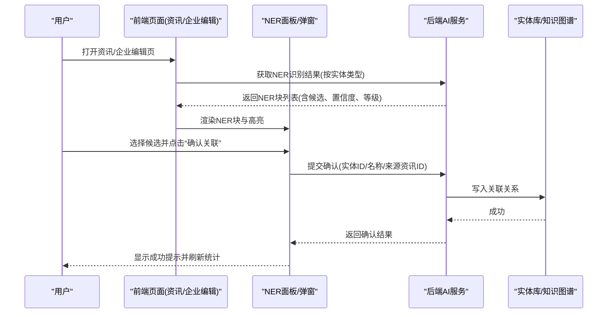
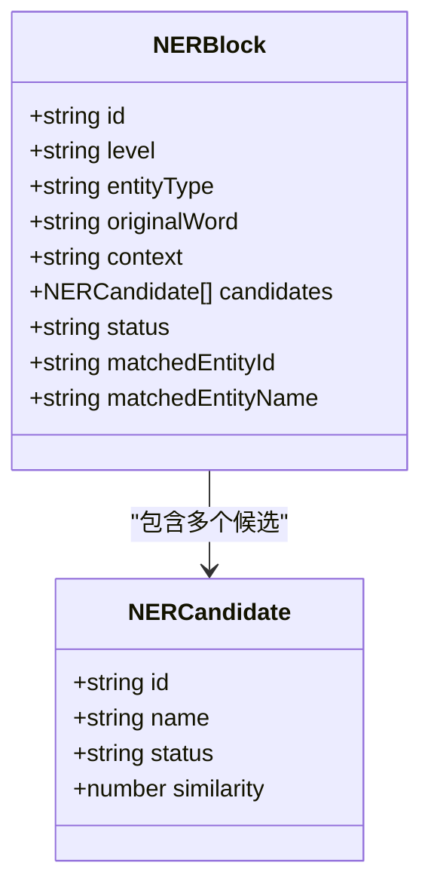
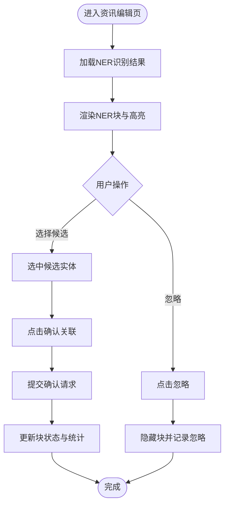
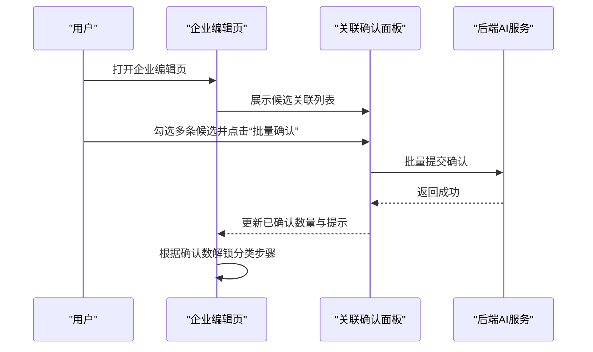
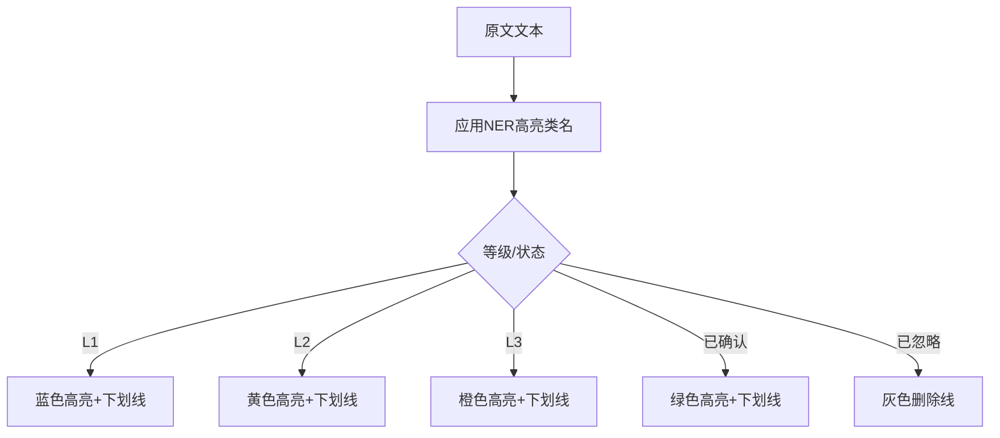
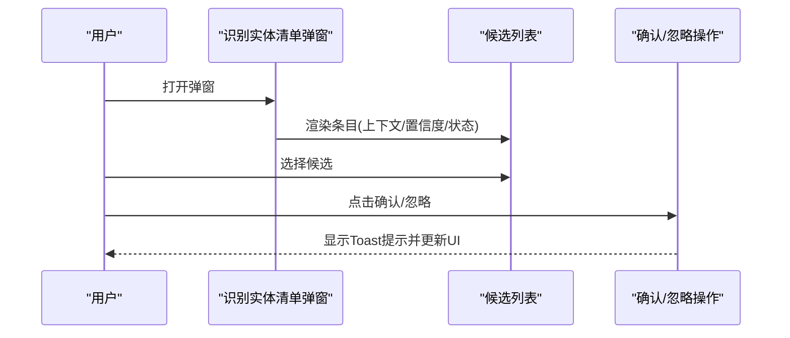
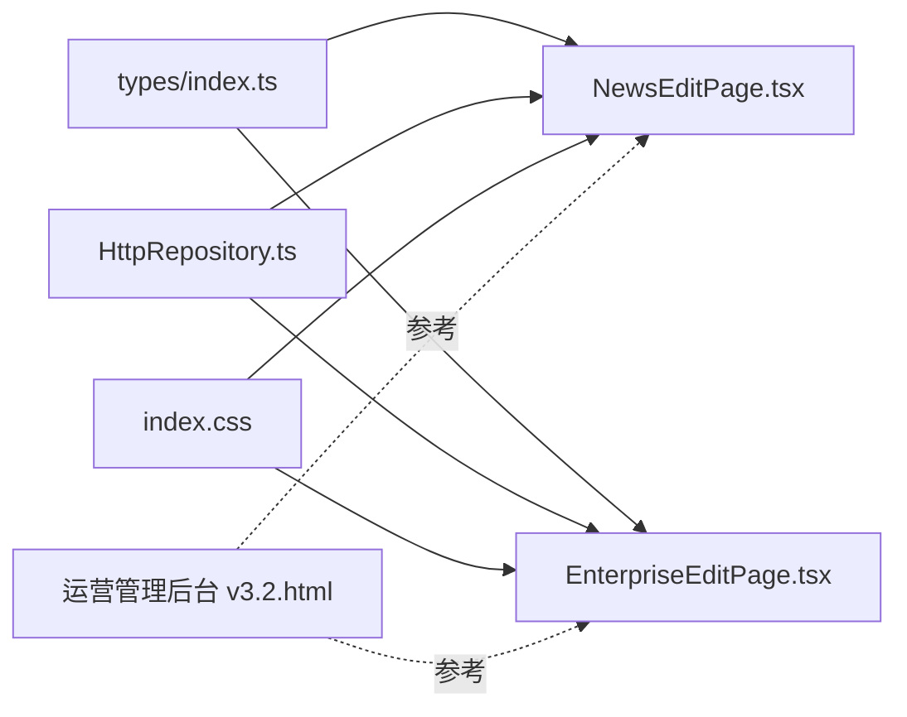

# NER命名实体识别组件

<cite>
**本文引用的文件**   
- [types/index.ts](file://hj-admin/src/types/index.ts)
- [NewsEditPage.tsx](file://hj-admin/src/domains/news/pages/NewsEditPage.tsx)
- [EnterpriseEditPage.tsx](file://hj-admin/src/domains/enterprise/pages/EnterpriseEditPage.tsx)
- [HttpRepository.ts](file://hj-admin/src/shared/data/HttpRepository.ts)
- [index.css](file://hj-admin/src/index.css)
- [运营管理后台 v3.2.html](file://氢界大数据平台 — 运营管理后台 v3.2.html)
</cite>

## 目录
1. [简介](#简介)
2. [项目结构](#项目结构)
3. [核心组件](#核心组件)
4. [架构总览](#架构总览)
5. [详细组件分析](#详细组件分析)
6. [依赖关系分析](#依赖关系分析)
7. [性能与准确率](#性能与准确率)
8. [配置项说明](#配置项说明)
9. [使用示例](#使用示例)
10. [错误处理与降级](#错误处理与降级)
11. [监控指标与调优建议](#监控指标与调优建议)
12. [结论](#结论)

## 简介
本文件面向“NER命名实体识别组件”的集成与使用，覆盖以下方面：
- 实体类型定义、置信度等级与候选匹配机制
- 前端高亮样式与交互流程（确认/忽略/创建新实体）
- 与后端AI服务的通信接口约定与数据格式规范
- 不同业务场景的使用示例（文本标注、智能分类、自动标签）
- 错误处理策略与降级方案
- 性能监控指标与调优建议

该组件在资讯编辑与企业编辑页面中提供“NER关联确认面板”，支持L1/L2/L3三级识别结果展示与人工确认。

## 项目结构
与NER相关的代码主要分布在以下位置：
- 类型定义：统一实体类型、NER块与候选项的数据模型
- 页面组件：资讯编辑页与企业编辑页中的NER面板与交互
- 样式：NER高亮样式与状态色
- 原型演示：运营后台HTML中包含完整的NER交互原型与弹窗

图表来源
- [types/index.ts:55-77](file://hj-admin/src/types/index.ts#L55-L77)
- [NewsEditPage.tsx:80-149](file://hj-admin/src/domains/news/pages/NewsEditPage.tsx#L80-L149)
- [EnterpriseEditPage.tsx:52-86](file://hj-admin/src/domains/enterprise/pages/EnterpriseEditPage.tsx#L52-L86)
- [HttpRepository.ts:1-70](file://hj-admin/src/shared/data/HttpRepository.ts#L1-L70)
- [index.css:5-10](file://hj-admin/src/index.css#L5-L10)
- [运营管理后台 v3.2.html:1654-1821](file://氢界大数据平台 — 运营管理后台 v3.2.html#L1654-L1821)

章节来源
- [types/index.ts:55-77](file://hj-admin/src/types/index.ts#L55-L77)
- [NewsEditPage.tsx:80-149](file://hj-admin/src/domains/news/pages/NewsEditPage.tsx#L80-L149)
- [EnterpriseEditPage.tsx:52-86](file://hj-admin/src/domains/enterprise/pages/EnterpriseEditPage.tsx#L52-L86)
- [HttpRepository.ts:1-70](file://hj-admin/src/shared/data/HttpRepository.ts#L1-L70)
- [index.css:5-10](file://hj-admin/src/index.css#L5-L10)
- [运营管理后台 v3.2.html:1654-1821](file://氢界大数据平台 — 运营管理后台 v3.2.html#L1654-L1821)

## 核心组件
- 实体类型与NER数据模型
  - 实体类型：企业(ent)、项目(prj)、政策(pol)、标准(std)、专利(pat)
  - NER等级：L1精确匹配、L2归一化匹配、L3相似度匹配
  - 状态：已关联、待确认、已确认、已忽略
  - NER块包含原文片段、上下文、候选实体列表、置信度等
- 页面组件
  - 资讯编辑页：NER统计卡片、NER块列表、确认/忽略操作
  - 企业编辑页：关联确认入口、批量确认、氢能关联度计算提示
- 样式
  - L1/L2/L3高亮颜色与下划线样式
  - 已确认/已忽略样式
- HTTP仓库
  - 通用CRUD封装，当前为占位实现，用于后续接入后端API

章节来源
- [types/index.ts:55-77](file://hj-admin/src/types/index.ts#L55-L77)
- [NewsEditPage.tsx:80-149](file://hj-admin/src/domains/news/pages/NewsEditPage.tsx#L80-L149)
- [EnterpriseEditPage.tsx:52-86](file://hj-admin/src/domains/enterprise/pages/EnterpriseEditPage.tsx#L52-L86)
- [index.css:5-10](file://hj-admin/src/index.css#L5-L10)
- [HttpRepository.ts:1-70](file://hj-admin/src/shared/data/HttpRepository.ts#L1-L70)

## 架构总览
NER组件在前端以“NER块”为单位组织识别结果，用户可在资讯编辑页与企业编辑页进行确认或忽略；同时通过HTTP仓库与后端AI服务交互，完成候选实体查询、确认提交等操作。

图表来源
- [NewsEditPage.tsx:80-149](file://hj-admin/src/domains/news/pages/NewsEditPage.tsx#L80-L149)
- [EnterpriseEditPage.tsx:52-86](file://hj-admin/src/domains/enterprise/pages/EnterpriseEditPage.tsx#L52-L86)
- [HttpRepository.ts:1-70](file://hj-admin/src/shared/data/HttpRepository.ts#L1-L70)
- [运营管理后台 v3.2.html:2758-2775](file://氢界大数据平台 — 运营管理后台 v3.2.html#L2758-L2775)

## 详细组件分析

### 数据模型与实体类型
- 实体类型枚举：ent/prj/pol/std/pat
- NER等级：L1/L2/L3
- NER块：包含id、level、entityType、originalWord、context、candidates、status、matchedEntityId/matchedEntityName
- 候选实体：包含id、name、status、similarity

图表来源
- [types/index.ts:55-77](file://hj-admin/src/types/index.ts#L55-L77)

章节来源
- [types/index.ts:55-77](file://hj-admin/src/types/index.ts#L55-L77)

### 资讯编辑页NER面板
- 功能要点
  - 顶部统计卡片：按实体类型展示数量与等级分布
  - NER块列表：每个块显示等级标签、原文片段、候选实体、置信度
  - 操作按钮：确认关联、忽略、创建新实体
  - 手动添加关联按钮
- 交互流程
  - 点击候选项选中，确认后更新状态并刷新统计
  - 忽略后标记为忽略并隐藏对应块

图表来源
- [NewsEditPage.tsx:80-149](file://hj-admin/src/domains/news/pages/NewsEditPage.tsx#L80-L149)
- [运营管理后台 v3.2.html:2758-2775](file://氢界大数据平台 — 运营管理后台 v3.2.html#L2758-L2775)

章节来源
- [NewsEditPage.tsx:80-149](file://hj-admin/src/domains/news/pages/NewsEditPage.tsx#L80-L149)
- [运营管理后台 v3.2.html:2758-2775](file://氢界大数据平台 — 运营管理后台 v3.2.html#L2758-L2775)

### 企业编辑页关联确认
- 功能要点
  - 关联确认入口：显示已确认/候选数量
  - 批量确认与全部忽略
  - 氢能关联度计算提示（≥70分为种子源企业）
- 交互流程
  - 先完成关联确认，再解锁企业分类步骤
  - 批量确认后实时更新统计与提示

图表来源
- [EnterpriseEditPage.tsx:52-86](file://hj-admin/src/domains/enterprise/pages/EnterpriseEditPage.tsx#L52-L86)
- [运营管理后台 v3.2.html:3462-3477](file://氢界大数据平台 — 运营管理后台 v3.2.html#L3462-L3477)

章节来源
- [EnterpriseEditPage.tsx:52-86](file://hj-admin/src/domains/enterprise/pages/EnterpriseEditPage.tsx#L52-L86)
- [运营管理后台 v3.2.html:3462-3477](file://氢界大数据平台 — 运营管理后台 v3.2.html#L3462-L3477)

### 高亮样式与视觉反馈
- L1/L2/L3分别使用不同背景与下划线颜色
- 已确认/已忽略样式区分
- 候选项选中态与悬停态

图表来源
- [index.css:5-10](file://hj-admin/src/index.css#L5-L10)

章节来源
- [index.css:5-10](file://hj-admin/src/index.css#L5-L10)

### 原型演示中的关键交互
- 识别实体清单弹窗：展示原文上下文、置信度、状态与操作
- 候选选择与确认/忽略：单选候选、确认后更新UI并提示
- 批量确认：对候选列表进行批量操作

图表来源
- [运营管理后台 v3.2.html:2424-2447](file://氢界大数据平台 — 运营管理后台 v3.2.html#L2424-L2447)
- [运营管理后台 v3.2.html:2758-2775](file://氢界大数据平台 — 运营管理后台 v3.2.html#L2758-L2775)
- [运营管理后台 v3.2.html:3034-3071](file://氢界大数据平台 — 运营管理后台 v3.2.html#L3034-L3071)

章节来源
- [运营管理后台 v3.2.html:2424-2447](file://氢界大数据平台 — 运营管理后台 v3.2.html#L2424-L2447)
- [运营管理后台 v3.2.html:2758-2775](file://氢界大数据平台 — 运营管理后台 v3.2.html#L2758-L2775)
- [运营管理后台 v3.2.html:3034-3071](file://氢界大数据平台 — 运营管理后台 v3.2.html#L3034-L3071)

## 依赖关系分析
- 类型定义被页面组件引用，确保数据结构一致
- HTTP仓库作为通用数据访问层，便于替换Mock与真实后端
- 样式文件为NER高亮提供统一的视觉规范
- 原型HTML作为交互与UI参考，辅助前端实现

图表来源
- [types/index.ts:55-77](file://hj-admin/src/types/index.ts#L55-L77)
- [NewsEditPage.tsx:80-149](file://hj-admin/src/domains/news/pages/NewsEditPage.tsx#L80-L149)
- [EnterpriseEditPage.tsx:52-86](file://hj-admin/src/domains/enterprise/pages/EnterpriseEditPage.tsx#L52-L86)
- [HttpRepository.ts:1-70](file://hj-admin/src/shared/data/HttpRepository.ts#L1-L70)
- [index.css:5-10](file://hj-admin/src/index.css#L5-L10)
- [运营管理后台 v3.2.html:1654-1821](file://氢界大数据平台 — 运营管理后台 v3.2.html#L1654-L1821)

章节来源
- [types/index.ts:55-77](file://hj-admin/src/types/index.ts#L55-L77)
- [NewsEditPage.tsx:80-149](file://hj-admin/src/domains/news/pages/NewsEditPage.tsx#L80-L149)
- [EnterpriseEditPage.tsx:52-86](file://hj-admin/src/domains/enterprise/pages/EnterpriseEditPage.tsx#L52-L86)
- [HttpRepository.ts:1-70](file://hj-admin/src/shared/data/HttpRepository.ts#L1-L70)
- [index.css:5-10](file://hj-admin/src/index.css#L5-L10)
- [运营管理后台 v3.2.html:1654-1821](file://氢界大数据平台 — 运营管理后台 v3.2.html#L1654-L1821)

## 性能与准确率
- 识别准确率
  - 建议以“已确认/总数”与“忽略率”衡量人工修正成本
  - 按等级(L1/L2/L3)统计准确率，优先提升L2/L3的召回与精度
- 处理性能
  - 前端渲染：避免一次性渲染过多NER块，采用分页或懒加载
  - 网络请求：合并请求、缓存候选实体列表，减少重复调用
  - 批量操作：批量确认/忽略降低后端压力
- 优化建议
  - 对高频实体建立本地缓存
  - 对低置信度(L3)结果进行二次过滤或提示人工复核
  - 使用虚拟滚动优化长列表体验

[本节为通用指导，不直接分析具体文件]

## 配置项说明
以下为NER组件常见可配置项（结合现有类型与UI行为归纳）：
- 识别阈值
  - 置信度阈值：用于过滤低置信度候选（如低于某百分比不展示）
  - 等级阈值：仅展示L1/L2或包含L3的结果
- 实体类型过滤
  - 按实体类型(ent/prj/pol/std/pat)筛选显示
  - 默认开启所有类型，可按业务需求关闭
- 高亮样式
  - L1/L2/L3高亮颜色与下划线样式
  - 已确认/已忽略样式开关
- 交互选项
  - 是否允许“创建新实体”
  - 是否启用批量确认/忽略
  - 是否显示置信度条与等级标签

章节来源
- [types/index.ts:55-77](file://hj-admin/src/types/index.ts#L55-L77)
- [index.css:5-10](file://hj-admin/src/index.css#L5-L10)
- [NewsEditPage.tsx:80-149](file://hj-admin/src/domains/news/pages/NewsEditPage.tsx#L80-L149)
- [EnterpriseEditPage.tsx:52-86](file://hj-admin/src/domains/enterprise/pages/EnterpriseEditPage.tsx#L52-L86)

## 使用示例
- 文本标注
  - 在资讯编辑页打开NER面板，查看各等级识别结果
  - 对候选实体进行选择与确认，忽略误识别
- 智能分类
  - 在企业编辑页完成关联确认后，解锁企业分类步骤
  - 依据系统推荐与人工判断进行分类与细分领域选择
- 自动标签
  - 资讯编辑页展示AI自动打标标签，支持一键采用
  - 与NER结果联动，提升标注效率

章节来源
- [NewsEditPage.tsx:40-77](file://hj-admin/src/domains/news/pages/NewsEditPage.tsx#L40-L77)
- [NewsEditPage.tsx:80-149](file://hj-admin/src/domains/news/pages/NewsEditPage.tsx#L80-L149)
- [EnterpriseEditPage.tsx:64-86](file://hj-admin/src/domains/enterprise/pages/EnterpriseEditPage.tsx#L64-L86)

## 错误处理与降级
- 网络错误
  - HTTP仓库对非2xx响应抛出错误，需在前端捕获并提示
- 空结果
  - 当无NER结果时，显示友好提示与引导操作
- 降级方案
  - 若后端不可用，回退到Mock数据或本地规则匹配
  - 禁用批量操作，仅保留单条确认/忽略
- 用户反馈
  - 使用Toast提示操作结果，必要时提供重试按钮

章节来源
- [HttpRepository.ts:20-27](file://hj-admin/src/shared/data/HttpRepository.ts#L20-L27)
- [运营管理后台 v3.2.html:3082-3090](file://氢界大数据平台 — 运营管理后台 v3.2.html#L3082-L3090)

## 监控指标与调优建议
- 监控指标
  - 识别覆盖率：有NER结果的资讯占比
  - 确认率：已确认/待确认的比例
  - 忽略率：忽略/总数的比例
  - 平均耗时：从加载到确认完成的时长
  - 错误率：网络与渲染异常次数
- 调优建议
  - 针对低确认率的实体类型调整阈值或候选排序
  - 对L3结果增加二次校验或人工复核流程
  - 优化候选实体库质量，提升相似度匹配效果

[本节为通用指导，不直接分析具体文件]

## 结论
NER组件通过清晰的类型定义、直观的NER面板与完善的交互流程，有效提升了文本标注与实体关联的效率。结合HTTP仓库的后端集成能力，可实现端到端的识别-确认-入库闭环。建议在上线前完善错误处理与监控指标，持续优化识别准确率与用户体验。