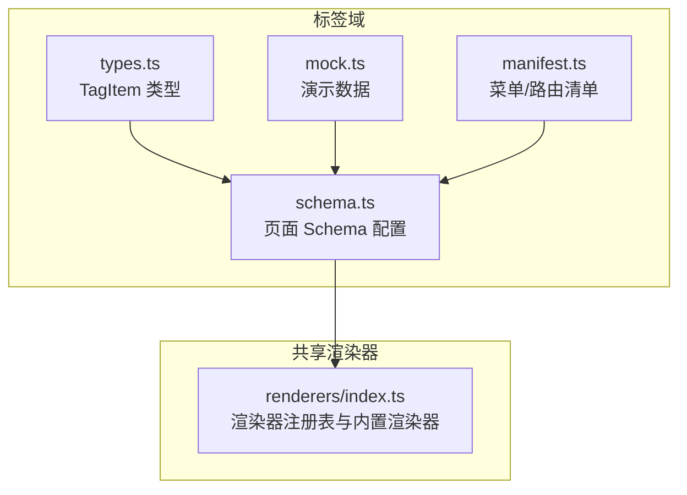
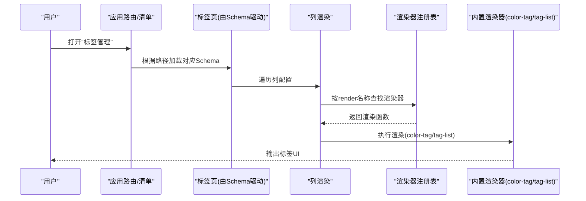
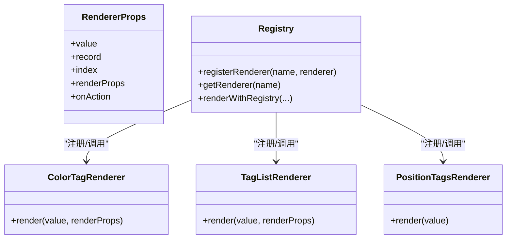
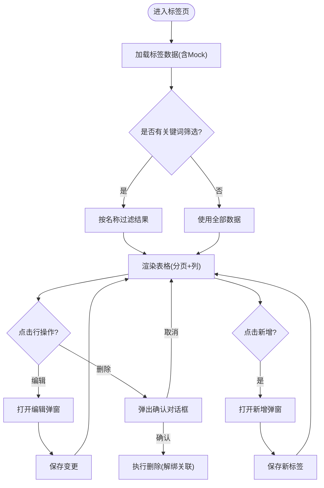
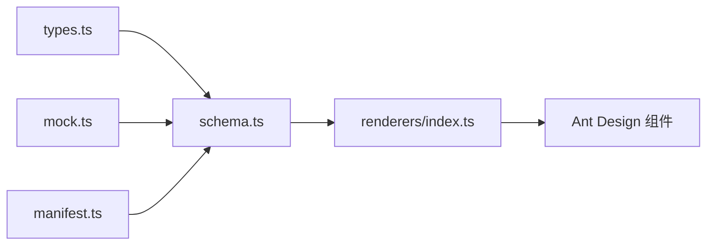

# Tags标签组件

<cite>
**本文引用的文件**   
- [types.ts](file://hj-admin/src/domains/tags/types.ts)
- [schema.ts](file://hj-admin/src/domains/tags/schema.ts)
- [manifest.ts](file://hj-admin/src/domains/tags/manifest.ts)
- [mock.ts](file://hj-admin/src/domains/tags/mock.ts)
- [renderers/index.ts](file://hj-admin/src/shared/schema-engine/renderers/index.ts)
</cite>

## 目录
1. [简介](#简介)
2. [项目结构](#项目结构)
3. [核心组件与能力](#核心组件与能力)
4. [架构总览](#架构总览)
5. [详细组件分析](#详细组件分析)
6. [依赖关系分析](#依赖关系分析)
7. [性能考虑](#性能考虑)
8. [故障排查指南](#故障排查指南)
9. [结论](#结论)
10. [附录：使用示例与最佳实践](#附录使用示例与最佳实践)

## 简介
本文件围绕“Tags标签组件”进行系统化文档化，覆盖数据模型、渲染机制、交互能力、状态管理、样式定制、验证与错误提示、以及大数据量场景下的性能优化策略。该标签系统基于 Schema 驱动与渲染器注册表实现，支持多域（资讯、企业）复用，具备可扩展的渲染能力与统一的配置入口。

## 项目结构
标签相关代码位于“标签域”下，采用领域内聚的组织方式：类型定义、Schema 配置、Mock 数据、路由清单集中管理；通用渲染能力集中在共享渲染器模块中，通过注册表按需加载。

图表来源
- [types.ts:1-10](file://hj-admin/src/domains/tags/types.ts#L1-L10)
- [schema.ts:1-39](file://hj-admin/src/domains/tags/schema.ts#L1-L39)
- [manifest.ts:1-21](file://hj-admin/src/domains/tags/manifest.ts#L1-L21)
- [mock.ts:1-20](file://hj-admin/src/domains/tags/mock.ts#L1-L20)
- [renderers/index.ts:1-163](file://hj-admin/src/shared/schema-engine/renderers/index.ts#L1-L163)

章节来源
- [types.ts:1-10](file://hj-admin/src/domains/tags/types.ts#L1-L10)
- [schema.ts:1-39](file://hj-admin/src/domains/tags/schema.ts#L1-L39)
- [manifest.ts:1-21](file://hj-admin/src/domains/tags/manifest.ts#L1-L21)
- [mock.ts:1-20](file://hj-admin/src/domains/tags/mock.ts#L1-L20)
- [renderers/index.ts:1-163](file://hj-admin/src/shared/schema-engine/renderers/index.ts#L1-L163)

## 核心组件与能力
- 数据模型：统一 TagItem 类型，包含标识、名称、颜色、使用次数、创建/更新时间、类型等字段，支撑资讯与企业两类标签。
- 页面 Schema：以声明式配置描述列、筛选、分页、行操作与工具栏操作，并通过 render 字段引用渲染器。
- 渲染器体系：提供 tag-list、color-tag、position-tags 等内置渲染器，支持扩展自定义渲染逻辑。
- 清单与路由：通过 manifest 将标签域挂载到应用菜单与路由，并注册 Mock 数据用于开发调试。

章节来源
- [types.ts:1-10](file://hj-admin/src/domains/tags/types.ts#L1-L10)
- [schema.ts:1-39](file://hj-admin/src/domains/tags/schema.ts#L1-L39)
- [renderers/index.ts:50-162](file://hj-admin/src/shared/schema-engine/renderers/index.ts#L50-L162)
- [manifest.ts:1-21](file://hj-admin/src/domains/tags/manifest.ts#L1-L21)

## 架构总览
标签系统由“领域配置 + 渲染器注册表”构成。Schema 作为唯一事实源，描述 UI 结构与行为；渲染器负责具体呈现；清单负责装配与注册。

图表来源
- [manifest.ts:10-21](file://hj-admin/src/domains/tags/manifest.ts#L10-L21)
- [schema.ts:5-21](file://hj-admin/src/domains/tags/schema.ts#L5-L21)
- [renderers/index.ts:31-46](file://hj-admin/src/shared/schema-engine/renderers/index.ts#L31-L46)
- [renderers/index.ts:112-116](file://hj-admin/src/shared/schema-engine/renderers/index.ts#L112-L116)
- [renderers/index.ts:50-67](file://hj-admin/src/shared/schema-engine/renderers/index.ts#L50-L67)

## 详细组件分析

### 数据模型与层级关系
- 基础实体 TagItem
  - id: 唯一标识
  - name: 标签名称
  - color: 展示色值
  - usageCount: 使用次数（可用于排序或权重计算）
  - createdAt/updatedAt: 时间戳
  - type: 标签类型（news | enterprise），用于区分不同业务域
- 层级与关联
  - 当前模型为扁平结构，type 字段用于区分业务域；如需树形层级，可在上层聚合层构建父子关系视图，或在新增字段 parent_id 后在展示层组织树。
  - 关联规则：删除标签时，需解绑其关联的资讯或企业实体（由后端或上层业务保证一致性）。

章节来源
- [types.ts:1-10](file://hj-admin/src/domains/tags/types.ts#L1-L10)
- [schema.ts:16-20](file://hj-admin/src/domains/tags/schema.ts#L16-L20)
- [schema.ts:34-38](file://hj-admin/src/domains/tags/schema.ts#L34-L38)

### 渲染器与显示逻辑
- color-tag：以指定颜色渲染单个标签文本，常用于“标签名称/颜色”列。
- tag-list：渲染字符串数组形式的标签列表，支持自动换行与紧凑间距。
- position-tags：位置标签渲染器，按条件设置颜色，便于语义化表达。

图表来源
- [renderers/index.ts:9-46](file://hj-admin/src/shared/schema-engine/renderers/index.ts#L9-L46)
- [renderers/index.ts:112-116](file://hj-admin/src/shared/schema-engine/renderers/index.ts#L112-L116)
- [renderers/index.ts:50-67](file://hj-admin/src/shared/schema-engine/renderers/index.ts#L50-L67)
- [renderers/index.ts:152-162](file://hj-admin/src/shared/schema-engine/renderers/index.ts#L152-L162)

章节来源
- [renderers/index.ts:50-67](file://hj-admin/src/shared/schema-engine/renderers/index.ts#L50-L67)
- [renderers/index.ts:112-116](file://hj-admin/src/shared/schema-engine/renderers/index.ts#L112-L116)
- [renderers/index.ts:152-162](file://hj-admin/src/shared/schema-engine/renderers/index.ts#L152-L162)

### 页面 Schema 与交互能力
- 筛选与搜索：通过 filters 配置关键词输入框，前端可据此过滤本地或远端数据。
- 列渲染：name/color 列使用 color-tag 渲染器，直观展示标签名与颜色。
- 分页：默认 pageSize=20，支持总数展示。
- 行操作：编辑与删除，删除带确认提示，避免误删。
- 工具栏：新增标签按钮，触发新增流程。

图表来源
- [schema.ts:5-21](file://hj-admin/src/domains/tags/schema.ts#L5-L21)
- [schema.ts:23-39](file://hj-admin/src/domains/tags/schema.ts#L23-L39)
- [mock.ts:1-20](file://hj-admin/src/domains/tags/mock.ts#L1-L20)

章节来源
- [schema.ts:5-21](file://hj-admin/src/domains/tags/schema.ts#L5-L21)
- [schema.ts:23-39](file://hj-admin/src/domains/tags/schema.ts#L23-L39)
- [mock.ts:1-20](file://hj-admin/src/domains/tags/mock.ts#L1-L20)

### 状态管理与数据同步
- 状态来源：Schema 驱动的表格通常由上层数据提供者维护本地状态（如分页、筛选、选中项）。
- 数据同步：
  - 新增/编辑：提交成功后刷新列表或局部更新行数据。
  - 删除：确认后移除行并更新计数。
  - 筛选：输入变化即时过滤或触发查询。
- 建议：对频繁更新的字段（如 usageCount）采用增量更新或乐观更新以提升体验。

[本节为通用说明，不直接分析具体文件]

### 样式定制与主题适配
- 单标签样式：可通过 renderProps.color 控制 color-tag 的颜色。
- 列表标签：tag-list 使用紧凑间距与较小字号，适合密集信息展示。
- 主题变量：借助 Ant Design 的 Tag 组件 Token 可全局调整圆角、字号、边框等。
- 自定义类名：在渲染器中为特定标签添加 className，配合 CSS 覆盖实现差异化样式。

章节来源
- [renderers/index.ts:112-116](file://hj-admin/src/shared/schema-engine/renderers/index.ts#L112-L116)
- [renderers/index.ts:50-67](file://hj-admin/src/shared/schema-engine/renderers/index.ts#L50-L67)

### 数据验证与错误提示
- 必填校验：新增/编辑时需校验标签名称非空。
- 重复性校验：建议在前端或后端校验名称唯一性。
- 错误提示：失败时给出明确提示，保留表单状态以便修正。
- 删除保护：删除前二次确认，防止误操作。

章节来源
- [schema.ts:16-20](file://hj-admin/src/domains/tags/schema.ts#L16-L20)
- [schema.ts:34-38](file://hj-admin/src/domains/tags/schema.ts#L34-L38)

### 权重计算与智能推荐
- 权重指标：usageCount 可作为热度权重，结合最近更新时间做衰减加权。
- 推荐策略：
  - 热门优先：按 usageCount 降序展示。
  - 时效增强：近期活跃标签提升排名。
  - 去重与分组：同域内合并相似名称，避免冗余。
- 实现建议：在服务端预计算或使用缓存层维护权重，前端仅消费排序后的结果。

[本节为通用说明，不直接分析具体文件]

## 依赖关系分析
- 领域内依赖：
  - schema.ts 依赖 types.ts 的类型与 mock.ts 的数据。
  - manifest.ts 依赖 schema.ts 的配置，并注册 Mock 数据。
- 跨模块依赖：
  - schema.ts 通过 render 字段引用 renderers/index.ts 中的渲染器。
  - 渲染器依赖 antd 的 Tag/Badge/Space 等组件。

图表来源
- [types.ts:1-10](file://hj-admin/src/domains/tags/types.ts#L1-L10)
- [schema.ts:1-39](file://hj-admin/src/domains/tags/schema.ts#L1-L39)
- [mock.ts:1-20](file://hj-admin/src/domains/tags/mock.ts#L1-L20)
- [manifest.ts:1-21](file://hj-admin/src/domains/tags/manifest.ts#L1-L21)
- [renderers/index.ts:1-163](file://hj-admin/src/shared/schema-engine/renderers/index.ts#L1-L163)

章节来源
- [types.ts:1-10](file://hj-admin/src/domains/tags/types.ts#L1-L10)
- [schema.ts:1-39](file://hj-admin/src/domains/tags/schema.ts#L1-L39)
- [mock.ts:1-20](file://hj-admin/src/domains/tags/mock.ts#L1-L20)
- [manifest.ts:1-21](file://hj-admin/src/domains/tags/manifest.ts#L1-L21)
- [renderers/index.ts:1-163](file://hj-admin/src/shared/schema-engine/renderers/index.ts#L1-L163)

## 性能考虑
- 列表渲染
  - 使用虚拟滚动或分页减少首屏 DOM 节点数量。
  - 对长列表启用 key 稳定且唯一的标识（id）。
- 筛选与搜索
  - 大集合下使用防抖输入，服务端分页+模糊查询优于全量前端过滤。
- 渲染器优化
  - 避免在渲染器中进行昂贵计算，必要时缓存中间结果。
  - 对静态样式尽量使用 CSS 类而非内联 style。
- 数据更新
  - 增量更新与乐观更新减少闪烁与等待感。
  - 批量操作合并请求，降低网络开销。

[本节为通用说明，不直接分析具体文件]

## 故障排查指南
- 渲染器未找到
  - 现象：控制台出现渲染器未注册的警告，单元格回退为原始值。
  - 排查：确认 render 名称与注册表一致，检查 import 顺序与注册时机。
- 颜色不生效
  - 现象：color-tag 显示默认色。
  - 排查：确认 renderProps.color 传入正确，或数据字段 color 存在。
- 删除无效果
  - 现象：点击删除后列表未更新。
  - 排查：确认删除回调已触发并刷新数据源，检查后端返回与状态同步。
- 筛选无效
  - 现象：输入关键词无变化。
  - 排查：确认 filters.name 与前端过滤逻辑字段一致，检查大小写与空格处理。

章节来源
- [renderers/index.ts:31-46](file://hj-admin/src/shared/schema-engine/renderers/index.ts#L31-L46)
- [schema.ts:5-21](file://hj-admin/src/domains/tags/schema.ts#L5-L21)
- [schema.ts:23-39](file://hj-admin/src/domains/tags/schema.ts#L23-L39)

## 结论
标签组件通过 Schema 驱动与渲染器注册表实现了高内聚、低耦合的可扩展方案。当前版本满足基础的增删改查、筛选与可视化需求；在此基础上，可进一步引入树形结构、智能推荐与更完善的权限与审计能力，以满足复杂业务场景。

## 附录：使用示例与最佳实践
- 简单标签选择
  - 使用 color-tag 渲染器展示标签名称与颜色，适用于列表快速识别。
- 复杂标签树
  - 在上层聚合层构建父子关系，使用递归渲染器或 Tree 组件展示层级。
- 智能推荐
  - 基于 usageCount 与时间衰减计算权重，服务端返回 TopN 供前端展示。
- 多选与批量管理
  - 在表格开启多选，批量删除/移动/导出，注意二次确认与进度反馈。
- 动态添加
  - 工具栏新增按钮打开弹窗，完成校验后插入数据并刷新列表。
- 主题适配
  - 通过 Ant Design Token 统一调整 Tag 风格；在渲染器中注入 className 实现场景化样式。

[本节为通用说明，不直接分析具体文件]