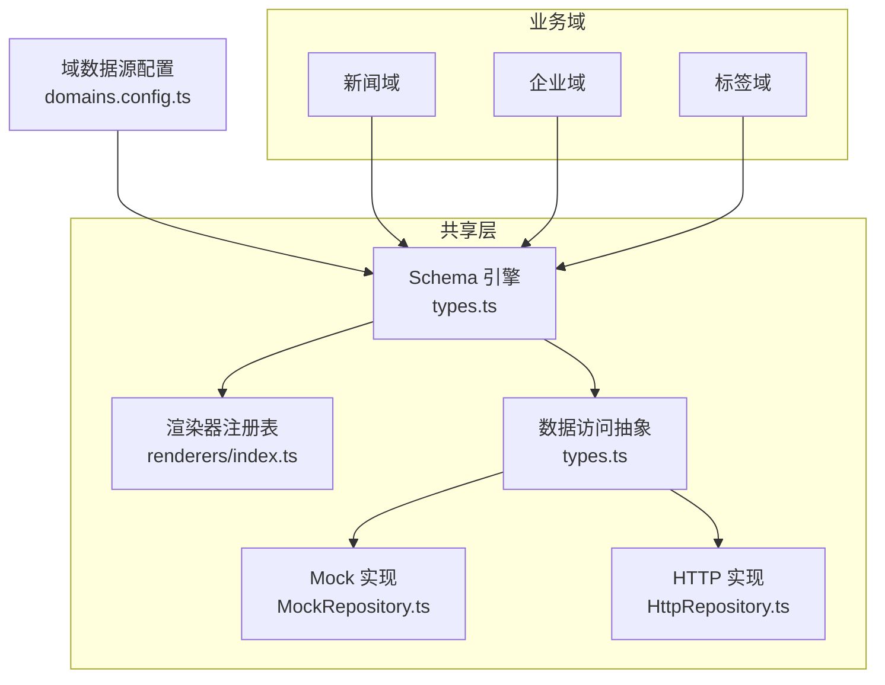
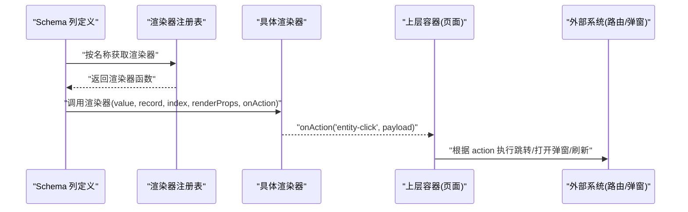
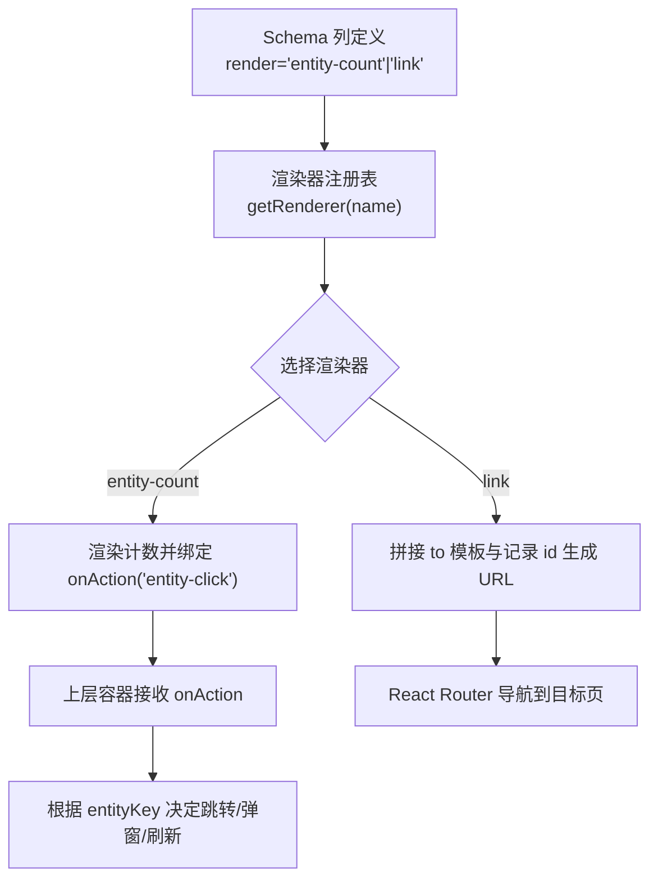
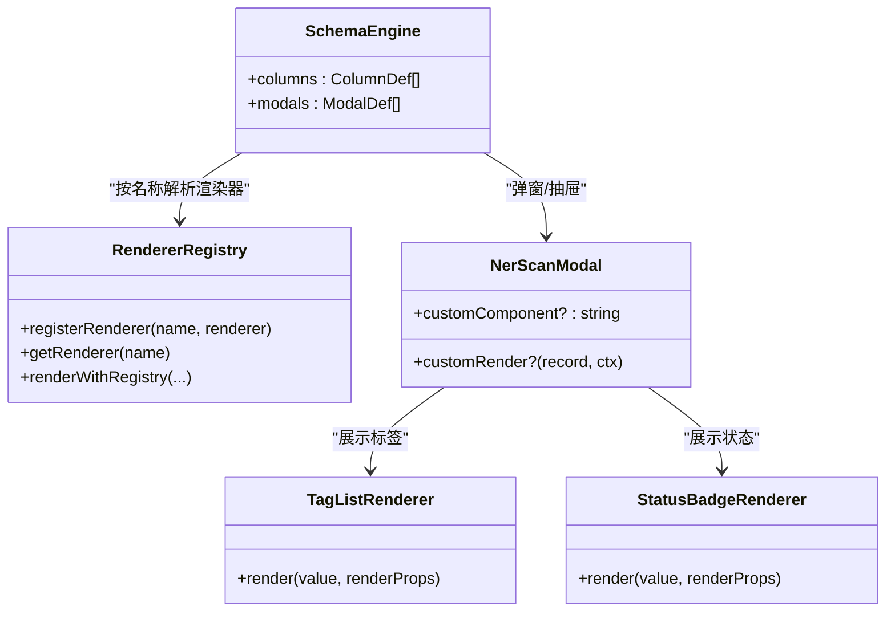
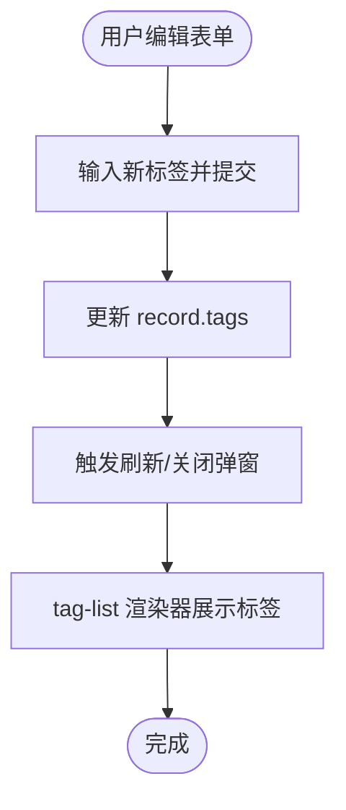
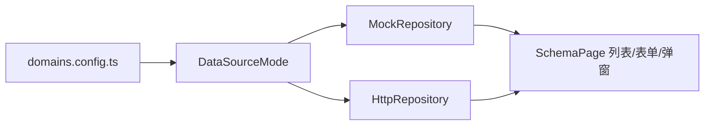
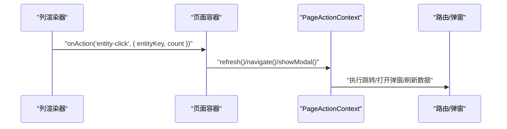
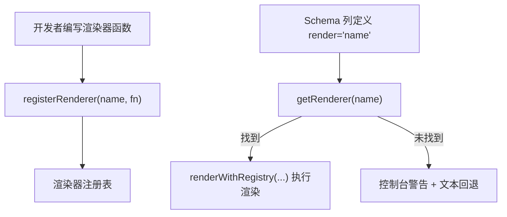
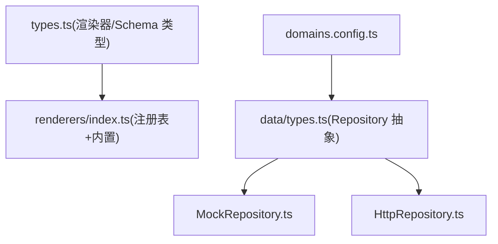

# 共享业务组件

<cite>
**本文引用的文件**   
- [src/shared/schema-engine/renderers/index.ts](file://hj-admin/src/shared/schema-engine/renderers/index.ts)
- [src/shared/schema-engine/types.ts](file://hj-admin/src/shared/schema-engine/types.ts)
- [src/shared/data/types.ts](file://hj-admin/src/shared/data/types.ts)
- [src/shared/data/HttpRepository.ts](file://hj-admin/src/shared/data/HttpRepository.ts)
- [src/shared/data/MockRepository.ts](file://hj-admin/src/shared/data/MockRepository.ts)
- [src/config/domains.config.ts](file://hj-admin/src/config/domains.config.ts)
</cite>

## 目录
1. [引言](#引言)
2. [项目结构](#项目结构)
3. [核心组件](#核心组件)
4. [架构总览](#架构总览)
5. [详细组件分析](#详细组件分析)
6. [依赖关系分析](#依赖关系分析)
7. [性能考量](#性能考量)
8. [故障排查指南](#故障排查指南)
9. [结论](#结论)
10. [附录](#附录)

## 引言
本文件面向“共享业务组件”的设计与实现，聚焦以下目标：
- EntityLink 实体链接组件：实体识别、链接生成、点击跳转等能力说明与扩展方式。
- NER 命名实体识别组件：算法集成思路与结果展示机制（以 Schema 渲染器为承载）。
- Tags 标签组件：多选、搜索、动态添加等交互能力在 Schema 体系中的落地方式。
- 跨域复用策略与配置：通过数据源模式与 Schema 驱动实现“零代码改动”的切换与复用。
- 组件间数据传递与事件通信：基于 onAction 回调与 PageActionContext 的统一契约。
- 自定义渲染器开发指南与扩展点：注册表机制、内置渲染器清单与最佳实践。

## 项目结构
围绕共享能力，仓库采用“领域 + 共享层”的组织方式：
- 共享层 shared
  - schema-engine：Schema 驱动的页面引擎与渲染器注册表，提供列渲染、弹窗、Tab、操作等声明式能力。
  - data：统一的数据访问抽象 Repository，包含 Mock 与 HTTP 两种实现，配合 domainConfig 进行数据源切换。
- 配置 config
  - domains.config.ts：集中声明各域的数据源模式（mock/http），便于批量切换。
- 领域 domains
  - 各业务域通过 manifest 与 schema 组合，使用共享的 SchemaPage 自动渲染列表、筛选、操作与弹窗。

图表来源
- [src/shared/schema-engine/types.ts](file://hj-admin/src/shared/schema-engine/types.ts)
- [src/shared/schema-engine/renderers/index.ts](file://hj-admin/src/shared/schema-engine/renderers/index.ts)
- [src/shared/data/types.ts](file://hj-admin/src/shared/data/types.ts)
- [src/shared/data/MockRepository.ts](file://hj-admin/src/shared/data/MockRepository.ts)
- [src/shared/data/HttpRepository.ts](file://hj-admin/src/shared/data/HttpRepository.ts)
- [src/config/domains.config.ts](file://hj-admin/src/config/domains.config.ts)

章节来源
- [src/shared/schema-engine/types.ts:1-216](file://hj-admin/src/shared/schema-engine/types.ts#L1-L216)
- [src/shared/schema-engine/renderers/index.ts:1-163](file://hj-admin/src/shared/schema-engine/renderers/index.ts#L1-L163)
- [src/shared/data/types.ts:1-36](file://hj-admin/src/shared/data/types.ts#L1-L36)
- [src/shared/data/MockRepository.ts:1-101](file://hj-admin/src/shared/data/MockRepository.ts#L1-L101)
- [src/shared/data/HttpRepository.ts:1-70](file://hj-admin/src/shared/data/HttpRepository.ts#L1-L70)
- [src/config/domains.config.ts:1-18](file://hj-admin/src/config/domains.config.ts#L1-L18)

## 核心组件
本节从“可复用性、可扩展性、可观测性”三个维度，梳理共享组件的核心能力与契约。

- 渲染器注册表
  - 提供 registerRenderer/getRenderer/renderWithRegistry 三件套，支持字符串引用渲染器，保持 Schema 可序列化。
  - 内置多种常用渲染器：tag-list、status-badge、entity-count、link、date-or-dash、text、color-tag、percent、url、success-rate、link-progress、position-tags。
- Schema 类型体系
  - 定义 ColumnDef.render 支持字符串或函数；ModalDef.customComponent/customRender；RowAction/BatchAction/ToolbarAction 等，形成统一的页面声明式描述。
- 数据访问抽象
  - Repository<T> 统一 list/get/create/update/delete 接口；QueryParams/PageResult 规范查询与分页结构。
  - MockRepository 提供内存过滤/排序/分页与延迟模拟；HttpRepository 提供标准 REST 风格请求封装。
- 域数据源配置
  - domains.config.ts 集中声明每个域的数据源模式，便于一键切换 mock/http。

章节来源
- [src/shared/schema-engine/renderers/index.ts:1-163](file://hj-admin/src/shared/schema-engine/renderers/index.ts#L1-L163)
- [src/shared/schema-engine/types.ts:1-216](file://hj-admin/src/shared/schema-engine/types.ts#L1-L216)
- [src/shared/data/types.ts:1-36](file://hj-admin/src/shared/data/types.ts#L1-L36)
- [src/shared/data/MockRepository.ts:1-101](file://hj-admin/src/shared/data/MockRepository.ts#L1-L101)
- [src/shared/data/HttpRepository.ts:1-70](file://hj-admin/src/shared/data/HttpRepository.ts#L1-L70)
- [src/config/domains.config.ts:1-18](file://hj-admin/src/config/domains.config.ts#L1-L18)

## 架构总览
下图展示了 Schema 驱动页面的关键流程：Schema 声明列渲染器名称，渲染器注册表查找并执行渲染；行内动作通过 onAction 向上冒泡，由上层容器处理导航、弹窗刷新等。

图表来源
- [src/shared/schema-engine/renderers/index.ts:22-46](file://hj-admin/src/shared/schema-engine/renderers/index.ts#L22-L46)
- [src/shared/schema-engine/types.ts:27-41](file://hj-admin/src/shared/schema-engine/types.ts#L27-L41)

## 详细组件分析

### EntityLink 实体链接组件
EntityLink 并非独立组件文件，而是通过 Schema 渲染器与行操作协同实现的“实体链接”能力，包括：
- 实体识别：在 Schema 中为字段配置 render='entity-count' 或 link 等渲染器，将原始值映射为可识别的实体标识。
- 链接生成：link 渲染器根据模板 to 与当前记录的 id 拼接目标路径；也可通过 RowAction.navigateTo 声明式导航。
- 点击跳转：entity-count 渲染器触发 onAction('entity-click', { entityKey, count })，上层容器据此执行跳转或弹窗。

图表来源
- [src/shared/schema-engine/renderers/index.ts:78-101](file://hj-admin/src/shared/schema-engine/renderers/index.ts#L78-L101)
- [src/shared/schema-engine/types.ts:44-56](file://hj-admin/src/shared/schema-engine/types.ts#L44-L56)

章节来源
- [src/shared/schema-engine/renderers/index.ts:78-101](file://hj-admin/src/shared/schema-engine/renderers/index.ts#L78-L101)
- [src/shared/schema-engine/types.ts:44-56](file://hj-admin/src/shared/schema-engine/types.ts#L44-L56)

### NER 命名实体识别组件
NER 的“算法集成”与“结果展示”通过 Schema 渲染器与 Modal 机制解耦：
- 算法集成
  - 后端/算法服务以 API 形式暴露实体识别结果；前端通过 HttpRepository 发起请求，或在本地以 MockRepository 模拟。
  - 可在 ModalDef.customComponent 中引入 NER 扫描组件，或使用 customRender 直接渲染识别结果。
- 结果展示
  - 使用 tag-list 渲染器展示识别出的标签集合；使用 status-badge 展示识别质量或置信度等级；使用 percent/success-rate 展示成功率指标。
  - 若需交互式标注，可在 Modal 表单中使用 select/radioGroup/checkbox 等字段，结合 linkage 联动更新选项。

图表来源
- [src/shared/schema-engine/types.ts:80-92](file://hj-admin/src/shared/schema-engine/types.ts#L80-L92)
- [src/shared/schema-engine/renderers/index.ts:51-75](file://hj-admin/src/shared/schema-engine/renderers/index.ts#L51-L75)

章节来源
- [src/shared/schema-engine/types.ts:80-92](file://hj-admin/src/shared/schema-engine/types.ts#L80-L92)
- [src/shared/schema-engine/renderers/index.ts:51-75](file://hj-admin/src/shared/schema-engine/renderers/index.ts#L51-L75)

### Tags 标签组件
Tags 的多选、搜索、动态添加等交互，可通过 Schema 表单字段与渲染器组合实现：
- 多选与搜索
  - 使用 FormFieldDef.type='select' 或 'radioGroup'，并通过 options 或 fetchOptions 异步加载候选项；在表格列中以 tag-list 渲染已选标签。
- 动态添加
  - 在弹窗表单中新增输入框与提交按钮，提交后更新 record.tags 并刷新列表；或通过 RowAction 触发新增逻辑。
- 联动与校验
  - 使用 linkage 实现父级变化时重新计算子级选项；required 控制必填校验。

图表来源
- [src/shared/schema-engine/types.ts:109-129](file://hj-admin/src/shared/schema-engine/types.ts#L109-L129)
- [src/shared/schema-engine/renderers/index.ts:51-67](file://hj-admin/src/shared/schema-engine/renderers/index.ts#L51-L67)

章节来源
- [src/shared/schema-engine/types.ts:109-129](file://hj-admin/src/shared/schema-engine/types.ts#L109-L129)
- [src/shared/schema-engine/renderers/index.ts:51-67](file://hj-admin/src/shared/schema-engine/renderers/index.ts#L51-L67)

### 跨域复用策略与配置
- 数据源切换
  - 通过 domains.config.ts 将 news、enterprise、tags 等域的数据源设置为 'mock' 或 'http'，无需修改 Schema 与页面代码。
- 统一契约
  - 所有域遵循 Repository<T> 与 QueryParams/PageResult 契约，确保不同数据源行为一致。
- 渲染器复用
  - 同一套渲染器在不同域的 Schema 中复用，如 tag-list、status-badge、entity-count 等。

图表来源
- [src/config/domains.config.ts:1-18](file://hj-admin/src/config/domains.config.ts#L1-L18)
- [src/shared/data/types.ts:29-35](file://hj-admin/src/shared/data/types.ts#L29-L35)
- [src/shared/data/MockRepository.ts:1-101](file://hj-admin/src/shared/data/MockRepository.ts#L1-L101)
- [src/shared/data/HttpRepository.ts:1-70](file://hj-admin/src/shared/data/HttpRepository.ts#L1-L70)

章节来源
- [src/config/domains.config.ts:1-18](file://hj-admin/src/config/domains.config.ts#L1-L18)
- [src/shared/data/types.ts:1-36](file://hj-admin/src/shared/data/types.ts#L1-L36)
- [src/shared/data/MockRepository.ts:1-101](file://hj-admin/src/shared/data/MockRepository.ts#L1-L101)
- [src/shared/data/HttpRepository.ts:1-70](file://hj-admin/src/shared/data/HttpRepository.ts#L1-L70)

### 组件间数据传递与事件通信
- 列渲染器 → 上层容器
  - 通过 onAction(action, payload) 向上传递事件，例如 entity-click。
- 行操作 → 上下文
  - RowAction.onClick 接收 record 与 PageActionContext，可调用 refresh/navigate/showModal。
- 弹窗上下文
  - ModalDef 支持 customComponent/customRender，传入 record 与上下文，用于复杂交互。

图表来源
- [src/shared/schema-engine/renderers/index.ts:78-89](file://hj-admin/src/shared/schema-engine/renderers/index.ts#L78-L89)
- [src/shared/schema-engine/types.ts:44-56](file://hj-admin/src/shared/schema-engine/types.ts#L44-L56)
- [src/shared/schema-engine/types.ts:211-216](file://hj-admin/src/shared/schema-engine/types.ts#L211-L216)

章节来源
- [src/shared/schema-engine/renderers/index.ts:78-89](file://hj-admin/src/shared/schema-engine/renderers/index.ts#L78-L89)
- [src/shared/schema-engine/types.ts:44-56](file://hj-admin/src/shared/schema-engine/types.ts#L44-L56)
- [src/shared/schema-engine/types.ts:211-216](file://hj-admin/src/shared/schema-engine/types.ts#L211-L216)

### 自定义渲染器开发指南与扩展点
- 注册渲染器
  - 使用 registerRenderer(name, renderer) 将渲染器加入注册表，Schema 中以 render='name' 引用。
- 渲染器签名
  - 接收 value、record、index、renderProps、onAction，返回 ReactNode。
- 内置渲染器参考
  - tag-list、status-badge、entity-count、link、date-or-dash、text、color-tag、percent、url、success-rate、link-progress、position-tags。
- 错误处理
  - 当注册表中找不到渲染器时，会输出警告并以文本回退显示。

图表来源
- [src/shared/schema-engine/renderers/index.ts:22-46](file://hj-admin/src/shared/schema-engine/renderers/index.ts#L22-L46)

章节来源
- [src/shared/schema-engine/renderers/index.ts:1-163](file://hj-admin/src/shared/schema-engine/renderers/index.ts#L1-L163)

## 依赖关系分析
- 低耦合高内聚
  - 渲染器与 Schema 类型解耦，仅通过名称与 props 约定交互。
  - 数据访问通过 Repository 抽象，Mock/HTTP 实现可替换。
- 直接依赖
  - 渲染器注册表依赖 antd/react-router-dom 等 UI 库。
  - HttpRepository 依赖 fetch 网络栈。
- 潜在循环依赖
  - 当前结构无循环依赖风险；Schema 类型与渲染器注册表相互独立。

图表来源
- [src/shared/schema-engine/types.ts:1-216](file://hj-admin/src/shared/schema-engine/types.ts#L1-L216)
- [src/shared/schema-engine/renderers/index.ts:1-163](file://hj-admin/src/shared/schema-engine/renderers/index.ts#L1-L163)
- [src/shared/data/types.ts:1-36](file://hj-admin/src/shared/data/types.ts#L1-L36)
- [src/shared/data/MockRepository.ts:1-101](file://hj-admin/src/shared/data/MockRepository.ts#L1-L101)
- [src/shared/data/HttpRepository.ts:1-70](file://hj-admin/src/shared/data/HttpRepository.ts#L1-L70)
- [src/config/domains.config.ts:1-18](file://hj-admin/src/config/domains.config.ts#L1-L18)

章节来源
- [src/shared/schema-engine/types.ts:1-216](file://hj-admin/src/shared/schema-engine/types.ts#L1-L216)
- [src/shared/schema-engine/renderers/index.ts:1-163](file://hj-admin/src/shared/schema-engine/renderers/index.ts#L1-L163)
- [src/shared/data/types.ts:1-36](file://hj-admin/src/shared/data/types.ts#L1-L36)
- [src/shared/data/MockRepository.ts:1-101](file://hj-admin/src/shared/data/MockRepository.ts#L1-L101)
- [src/shared/data/HttpRepository.ts:1-70](file://hj-admin/src/shared/data/HttpRepository.ts#L1-L70)
- [src/config/domains.config.ts:1-18](file://hj-admin/src/config/domains.config.ts#L1-L18)

## 性能考量
- 渲染器优化
  - 避免在渲染器中进行重计算，尽量将预处理放在 record 或 renderProps 中。
  - 对长列表使用 key 稳定且最小化 DOM 节点数量（如 tag-list 的 wrap 布局）。
- 数据访问优化
  - MockRepository 的内存过滤/排序适合小数据集；大数据集建议切换到 HttpRepository 并在服务端完成过滤与分页。
  - 合理设置 pageSize，避免一次性渲染过多节点。
- 网络请求
  - HttpRepository 统一封装请求头与错误处理，建议在更高层增加重试与超时策略。

[本节为通用指导，不直接分析具体文件]

## 故障排查指南
- 渲染器未找到
  - 现象：控制台输出渲染器未找到的警告，单元格回退为文本。
  - 排查：确认 registerRenderer 是否被调用、Schema 中 render 名称是否一致。
- 数据源切换无效
  - 现象：切换 domains.config.ts 后仍走 mock。
  - 排查：确认 DataProvider 是否正确读取配置并实例化对应 Repository。
- 行操作未生效
  - 现象：onClick/navigateTo 无响应。
  - 排查：检查 RowAction 的 visible 条件、PageActionContext 注入是否正确。

章节来源
- [src/shared/schema-engine/renderers/index.ts:40-46](file://hj-admin/src/shared/schema-engine/renderers/index.ts#L40-L46)
- [src/shared/data/HttpRepository.ts:20-27](file://hj-admin/src/shared/data/HttpRepository.ts#L20-L27)
- [src/shared/data/MockRepository.ts:76-94](file://hj-admin/src/shared/data/MockRepository.ts#L76-L94)
- [src/config/domains.config.ts:7-17](file://hj-admin/src/config/domains.config.ts#L7-L17)

## 结论
通过 Schema 驱动与渲染器注册表，本项目实现了高度可复用的共享业务组件体系。EntityLink、NER、Tags 等能力均以“声明式 + 可插拔”的方式落地，配合 Repository 抽象与域数据源配置，达成跨域复用与平滑切换。后续可在现有基础上继续扩展更多渲染器与交互场景，并保持向后兼容。

[本节为总结性内容，不直接分析具体文件]

## 附录
- 快速上手
  - 新增渲染器：在渲染器注册表中注册，并在 Schema 中以字符串引用。
  - 新增行操作：在 RowAction 中配置 onClick/navigateTo/confirm。
  - 新增弹窗：在 ModalDef 中使用 customComponent/customRender 或 formSchema。
- 参考路径
  - 渲染器注册与内置实现：[src/shared/schema-engine/renderers/index.ts](file://hj-admin/src/shared/schema-engine/renderers/index.ts)
  - Schema 类型与上下文：[src/shared/schema-engine/types.ts](file://hj-admin/src/shared/schema-engine/types.ts)
  - 数据访问抽象与实现：[src/shared/data/types.ts](file://hj-admin/src/shared/data/types.ts)、[src/shared/data/MockRepository.ts](file://hj-admin/src/shared/data/MockRepository.ts)、[src/shared/data/HttpRepository.ts](file://hj-admin/src/shared/data/HttpRepository.ts)
  - 域数据源配置：[src/config/domains.config.ts](file://hj-admin/src/config/domains.config.ts)