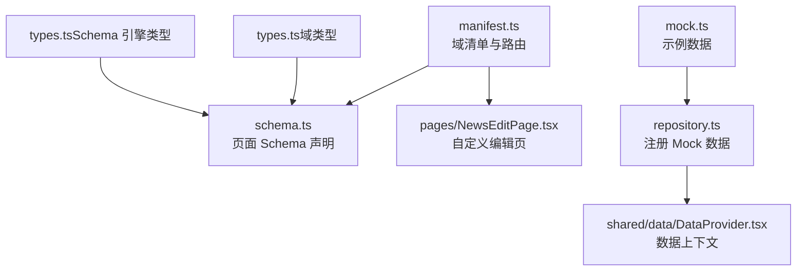
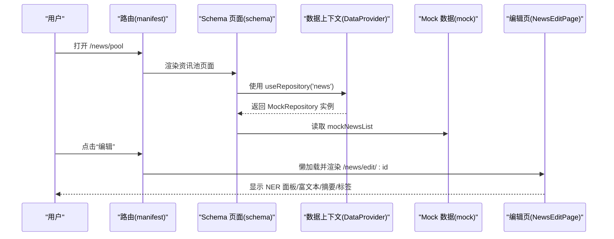
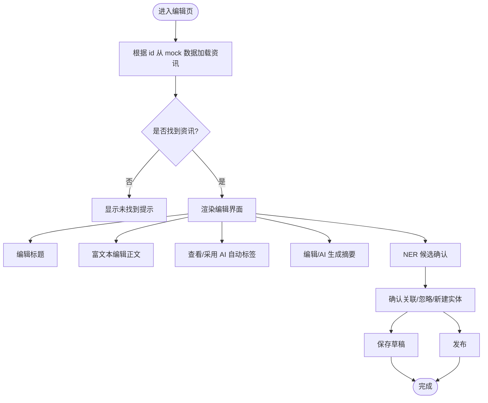
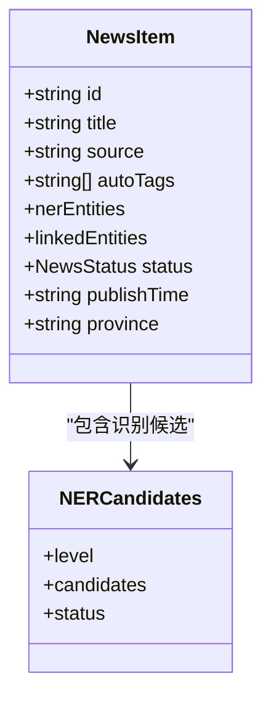
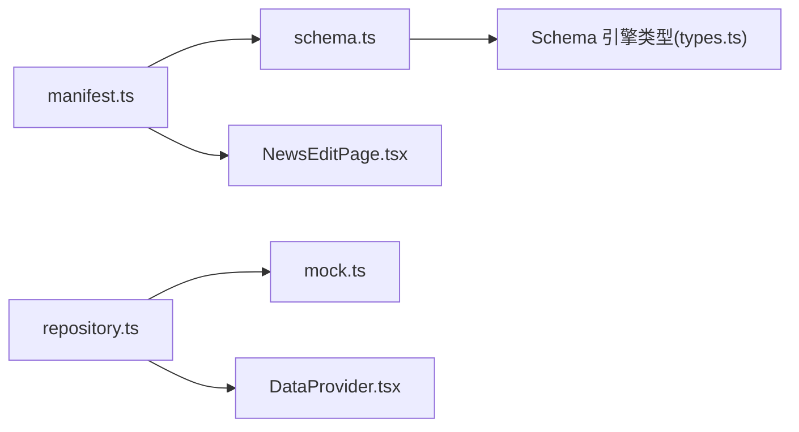

# 资讯库业务组件

<cite>
**本文引用的文件**
- [NewsEditPage.tsx](file://hj-admin/src/domains/news/pages/NewsEditPage.tsx)
- [types.ts](file://hj-admin/src/domains/news/types.ts)
- [schema.ts](file://hj-admin/src/domains/news/schema.ts)
- [repository.ts](file://hj-admin/src/domains/news/repository.ts)
- [manifest.ts](file://hj-admin/src/domains/news/manifest.ts)
- [mock.ts](file://hj-admin/src/domains/news/mock.ts)
- [index.ts](file://hj-admin/src/domains/news/index.ts)
- [DataProvider.tsx](file://hj-admin/src/shared/data/DataProvider.tsx)
- [types.ts（数据层抽象）](file://hj-admin/src/shared/data/types.ts)
- [types.ts（Schema 引擎类型）](file://hj-admin/src/shared/schema-engine/types.ts)
- [NewsPool.tsx](file://hj-admin/src/pages/news/NewsPool.tsx)
</cite>

## 目录
1. [引言](#引言)
2. [项目结构](#项目结构)
3. [核心组件](#核心组件)
4. [架构总览](#架构总览)
5. [详细组件分析](#详细组件分析)
6. [依赖关系分析](#依赖关系分析)
7. [性能与可用性建议](#性能与可用性建议)
8. [故障排查指南](#故障排查指南)
9. [结论](#结论)
10. [附录](#附录)

## 引言
本文件面向“资讯库”业务域，聚焦于资讯编辑页面 NewsEditPage 的实现与周边能力，包括：
- 资讯内容编辑、元数据管理、发布状态控制
- 资讯数据模型与字段说明
- 资讯与企业等实体的自动关联机制与智能推荐流程
- 编辑器集成方案与富文本处理逻辑
- 审核流程与批量操作实现要点
- 数据导入导出与版本管理的最佳实践

## 项目结构
资讯域采用“领域清单 + Schema 驱动 + Repository 抽象”的模块化组织方式。核心文件职责如下：
- manifest.ts：定义资讯域的菜单、路由与页面 Schema 绑定
- schema.ts：声明式页面配置（筛选、列、行操作、分页等）
- types.ts：资讯实体、标签、数据源等类型定义
- repository.ts：将 mock 数据注册到全局 DataProvider
- pages/NewsEditPage.tsx：复杂交互的自定义编辑页（NER 面板、富文本、摘要、标签等）
- shared/data/*：数据上下文与仓库抽象（Mock/Http）
- shared/schema-engine/types.ts：Schema 驱动引擎的类型基石

图表来源
- [manifest.ts:1-42](file://hj-admin/src/domains/news/manifest.ts#L1-L42)
- [schema.ts:1-123](file://hj-admin/src/domains/news/schema.ts#L1-L123)
- [repository.ts:1-11](file://hj-admin/src/domains/news/repository.ts#L1-L11)
- [DataProvider.tsx:1-44](file://hj-admin/src/shared/data/DataProvider.tsx#L1-L44)
- [types.ts（Schema 引擎类型）:1-216](file://hj-admin/src/shared/schema-engine/types.ts#L1-L216)
- [mock.ts:1-60](file://hj-admin/src/domains/news/mock.ts#L1-L60)

章节来源
- [manifest.ts:1-42](file://hj-admin/src/domains/news/manifest.ts#L1-L42)
- [schema.ts:1-123](file://hj-admin/src/domains/news/schema.ts#L1-L123)
- [repository.ts:1-11](file://hj-admin/src/domains/news/repository.ts#L1-L11)
- [DataProvider.tsx:1-44](file://hj-admin/src/shared/data/DataProvider.tsx#L1-L44)
- [types.ts（Schema 引擎类型）:1-216](file://hj-admin/src/shared/schema-engine/types.ts#L1-L216)
- [mock.ts:1-60](file://hj-admin/src/domains/news/mock.ts#L1-L60)

## 核心组件
- 资讯池与已发布列表：通过 schema.ts 声明式渲染，支持筛选、列渲染、行操作、分页、Tab 分组与快捷筛选
- 资讯编辑页：复杂交互页面，包含标题、正文富文本、摘要、AI 自动标签、NER 候选确认、发布状态切换、元数据展示等
- 数据层：通过 repository.ts 将 mock 数据注入 DataProvider，Schema 页面统一通过 useRepository 获取数据

章节来源
- [schema.ts:22-94](file://hj-admin/src/domains/news/schema.ts#L22-L94)
- [NewsEditPage.tsx:1-166](file://hj-admin/src/domains/news/pages/NewsEditPage.tsx#L1-L166)
- [repository.ts:1-11](file://hj-admin/src/domains/news/repository.ts#L1-L11)
- [DataProvider.tsx:1-44](file://hj-admin/src/shared/data/DataProvider.tsx#L1-L44)

## 架构总览
资讯域由“清单驱动路由 + Schema 驱动页面 + Repository 抽象数据访问”构成。编辑页作为复杂交互页面以懒加载组件形式挂载在路由中；其余列表类页面由 Schema 自动生成。

图表来源
- [manifest.ts:18-40](file://hj-admin/src/domains/news/manifest.ts#L18-L40)
- [schema.ts:22-53](file://hj-admin/src/domains/news/schema.ts#L22-L53)
- [DataProvider.tsx:26-41](file://hj-admin/src/shared/data/DataProvider.tsx#L26-L41)
- [repository.ts:7-10](file://hj-admin/src/domains/news/repository.ts#L7-L10)
- [NewsEditPage.tsx:10-18](file://hj-admin/src/domains/news/pages/NewsEditPage.tsx#L10-L18)

## 详细组件分析

### 资讯数据模型与字段说明
- 资讯条目 NewsItem
  - id：唯一标识
  - title：标题
  - source：来源
  - tags：人工标签集合
  - autoTags：AI 自动打标结果
  - nerEntities：识别到的实体数量统计（企业/项目/政策/标准/专利）
  - linkedEntities：已确认关联的实体数量统计
  - status：发布状态（草稿/已发布/已下架/已归档）
  - publishTime：发布时间
  - province：省份/区域
- 数据源 DataSource
  - id/name/type/domain/status/lastCrawl/successRate/articleCount

字段校验规则（当前实现）
- 编辑页未内置前端表单校验；发布/保存动作直接触发导航或提示
- 建议在后续引入 Schema 表单校验或独立校验器，对必填字段（如标题）、长度限制、敏感词等进行约束

章节来源
- [types.ts:1-50](file://hj-admin/src/domains/news/types.ts#L1-L50)
- [NewsEditPage.tsx:10-36](file://hj-admin/src/domains/news/pages/NewsEditPage.tsx#L10-L36)

### 资讯编辑页 NewsEditPage 实现要点
- 顶部操作栏
  - 返回列表、标题输入、状态徽标、省份选择、保存草稿/发布按钮
- 左栏
  - 标签区：展示 AI 自动标签，支持一键全部采用
  - 正文区：contentEditable 富文本容器，内嵌 NER 高亮标记
  - 摘要区：支持 AI 生成摘要
- 右栏：NER 关联确认面板
  - 按置信度分等级（精确匹配/归一化/相似度），提供“确认关联/忽略/创建新实体”等操作
  - 支持手动添加关联
- 底部信息栏
  - 来源、采集时间、编辑人、版本、版本历史、导出关联

图表来源
- [NewsEditPage.tsx:10-166](file://hj-admin/src/domains/news/pages/NewsEditPage.tsx#L10-L166)

章节来源
- [NewsEditPage.tsx:1-166](file://hj-admin/src/domains/news/pages/NewsEditPage.tsx#L1-L166)

### 资讯与企业的自动关联机制与智能推荐
- 自动打标与 NER 识别
  - autoTags 为系统自动生成的标签集合
  - nerEntities 记录各类型实体的识别数量
- 候选确认流程
  - L1 精确匹配：高置信度，可直接确认
  - L2 归一化：中等置信度，可确认或创建新实体
  - L3 相似度：低置信度，需人工判断
- 智能推荐策略（建议）
  - 基于关键词、语义相似度、领域词典与外部知识图谱进行候选排序
  - 结合历史确认行为做个性化权重调整

图表来源
- [types.ts:5-28](file://hj-admin/src/domains/news/types.ts#L5-L28)
- [NewsEditPage.tsx:82-148](file://hj-admin/src/domains/news/pages/NewsEditPage.tsx#L82-L148)

章节来源
- [types.ts:1-50](file://hj-admin/src/domains/news/types.ts#L1-L50)
- [NewsEditPage.tsx:82-148](file://hj-admin/src/domains/news/pages/NewsEditPage.tsx#L82-L148)

### 资讯编辑器集成与富文本处理
- 集成方案
  - 当前使用 contentEditable 原生富文本容器，便于快速集成
  - 可在后续替换为专业富文本编辑器（如 ProseMirror/Tiptap/Quill），保留 NER 高亮样式类名
- 富文本处理逻辑
  - 正文段落与高亮标记共存，NER 高亮通过特定 CSS 类名区分
  - 支持“自动排版”“保存快照”等扩展操作入口

章节来源
- [NewsEditPage.tsx:58-72](file://hj-admin/src/domains/news/pages/NewsEditPage.tsx#L58-L72)

### 审核流程与批量操作
- 审核流程（建议）
  - 草稿 → 待审 → 已发布 → 已下架/已归档
  - 支持多级审核与审计日志
- 批量操作
  - 列表页可通过 rowActions/batchActions 配置批量发布/下架/归档
  - 当前 Schema 定义了单条行操作，可扩展批量操作接口

章节来源
- [schema.ts:48-53](file://hj-admin/src/domains/news/schema.ts#L48-L53)
- [types.ts（Schema 引擎类型）:59-65](file://hj-admin/src/shared/schema-engine/types.ts#L59-L65)

### 资讯数据导入导出与版本管理
- 导入导出（建议）
  - 导入：支持 CSV/Excel 模板导入，含标题、正文、标签、来源、省份等字段映射
  - 导出：支持按筛选条件导出，附带关联实体清单
- 版本管理（建议）
  - 每次保存生成新版本，支持回滚与差异对比
  - 记录变更人、时间与变更摘要

[本节为通用实践建议，不直接分析具体文件]

## 依赖关系分析
- 模块耦合
  - manifest.ts 依赖 schema.ts 与 NewsEditPage 组件
  - repository.ts 依赖 mock.ts 与 DataProvider
  - Schema 页面依赖 shared/schema-engine/types.ts 的类型定义
- 外部依赖
  - Ant Design 组件库用于 UI 构建
  - React Router 用于路由跳转

图表来源
- [manifest.ts:1-42](file://hj-admin/src/domains/news/manifest.ts#L1-L42)
- [schema.ts:1-123](file://hj-admin/src/domains/news/schema.ts#L1-L123)
- [repository.ts:1-11](file://hj-admin/src/domains/news/repository.ts#L1-L11)
- [DataProvider.tsx:1-44](file://hj-admin/src/shared/data/DataProvider.tsx#L1-L44)
- [types.ts（Schema 引擎类型）:1-216](file://hj-admin/src/shared/schema-engine/types.ts#L1-L216)

章节来源
- [manifest.ts:1-42](file://hj-admin/src/domains/news/manifest.ts#L1-L42)
- [schema.ts:1-123](file://hj-admin/src/domains/news/schema.ts#L1-L123)
- [repository.ts:1-11](file://hj-admin/src/domains/news/repository.ts#L1-L11)
- [DataProvider.tsx:1-44](file://hj-admin/src/shared/data/DataProvider.tsx#L1-L44)
- [types.ts（Schema 引擎类型）:1-216](file://hj-admin/src/shared/schema-engine/types.ts#L1-L216)

## 性能与可用性建议
- 列表页
  - 大数据量场景启用后端分页与增量更新
  - 列渲染器按需加载，避免重绘
- 编辑页
  - 富文本内容分段缓存，减少重排
  - NER 候选列表虚拟化渲染
- 网络与缓存
  - 合理设置 HTTP 缓存与 ETag
  - 失败重试与降级策略

[本节为通用优化建议，不直接分析具体文件]

## 故障排查指南
- 编辑页未找到资讯
  - 现象：显示“资讯未找到”
  - 原因：根据 id 在 mock 数据中未匹配到记录
  - 处理：检查路由参数 id 与 mock 数据 id 一致性
- 列表页筛选无效
  - 现象：筛选后无结果
  - 原因：本地过滤逻辑与字段不一致
  - 处理：核对筛选字段与数据字段映射
- 数据源异常
  - 现象：数据源状态为“异常”
  - 原因：抓取失败或域名不可达
  - 处理：检查域名连通性与成功率指标

章节来源
- [NewsEditPage.tsx:16-18](file://hj-admin/src/domains/news/pages/NewsEditPage.tsx#L16-L18)
- [NewsPool.tsx:31-36](file://hj-admin/src/pages/news/NewsPool.tsx#L31-L36)
- [mock.ts:50-59](file://hj-admin/src/domains/news/mock.ts#L50-L59)

## 结论
资讯库业务组件通过“清单 + Schema + Repository”的解耦设计，实现了列表页面的快速搭建与编辑页的灵活定制。当前实现已覆盖资讯编辑、NER 候选确认、基础元数据管理与发布状态控制。后续可在表单校验、批量操作、导入导出与版本管理等方面进一步完善，以提升运营效率与数据质量。

[本节为总结性内容，不直接分析具体文件]

## 附录
- 相关页面与入口
  - 资讯池：/news/pool
  - 已发布资讯：/news/published
  - 数据源管理：/news/sources
  - 资讯编辑：/news/edit/:id

章节来源
- [manifest.ts:18-40](file://hj-admin/src/domains/news/manifest.ts#L18-L40)
- [index.ts:1-4](file://hj-admin/src/domains/news/index.ts#L1-L4)