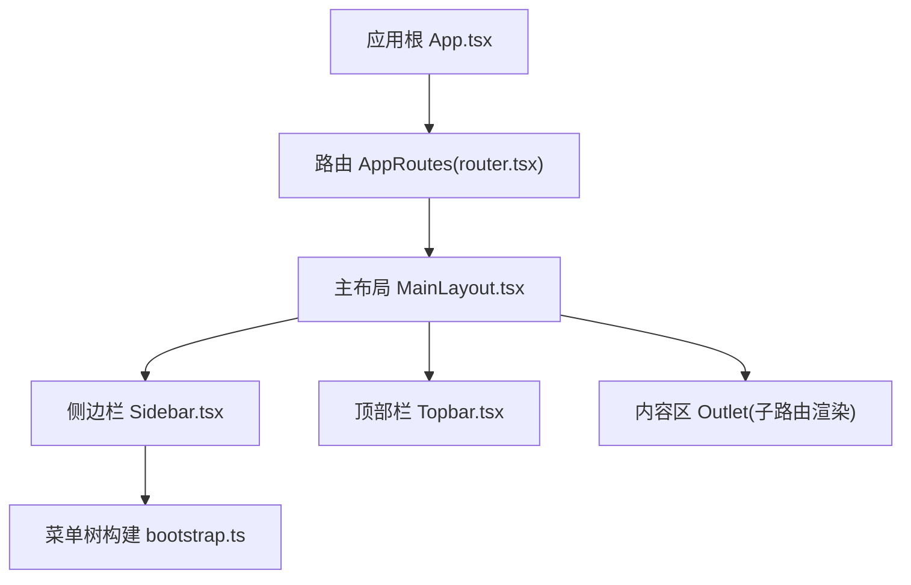
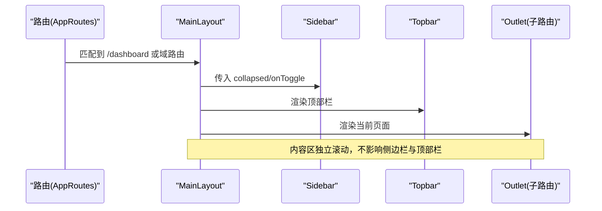
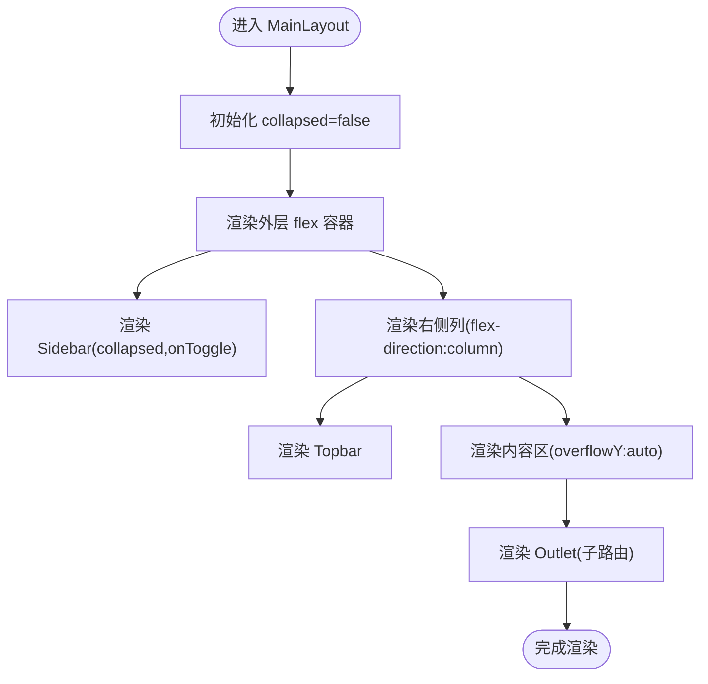
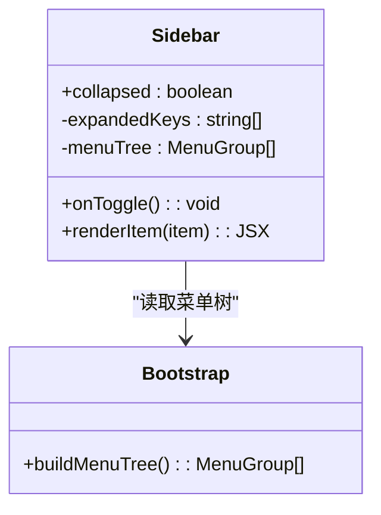
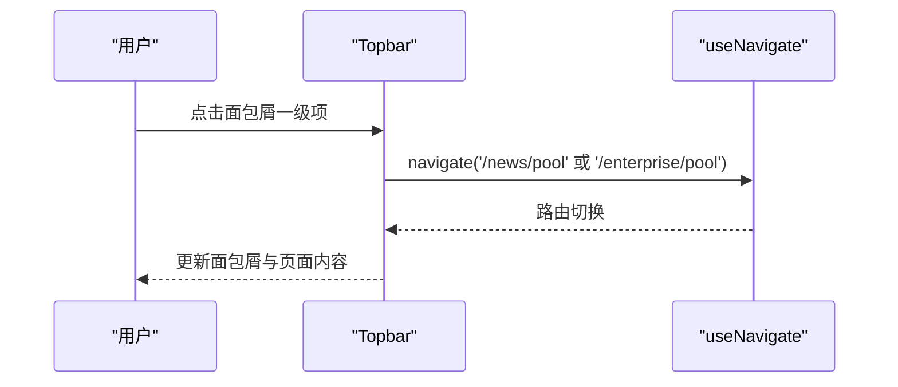
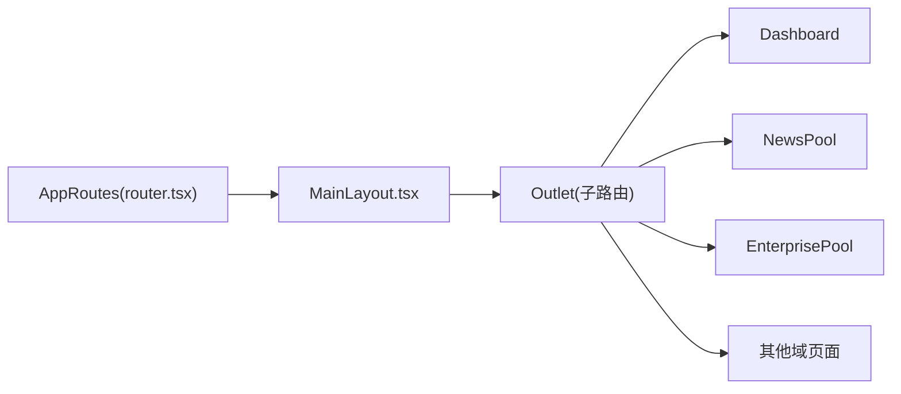
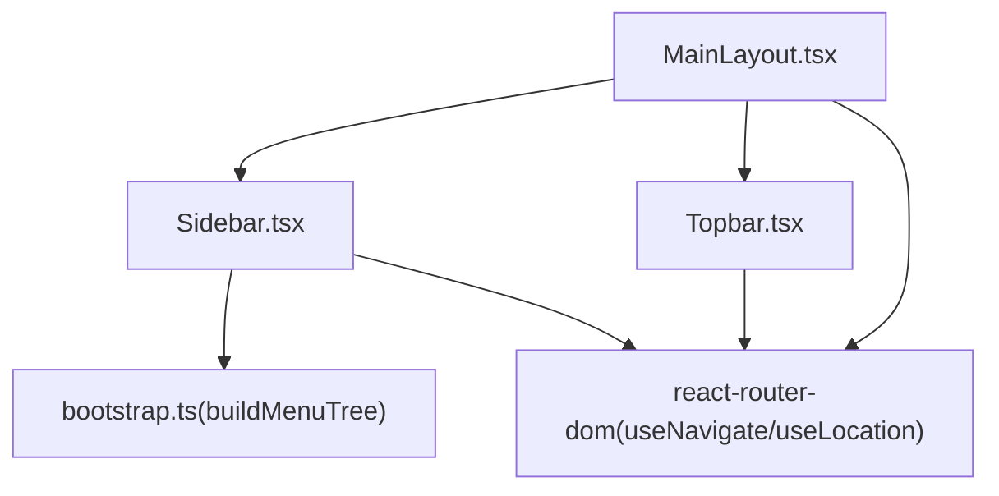

# 布局组件系统

<cite>
**本文引用的文件**   
- [MainLayout.tsx](file://hj-admin/src/layouts/MainLayout.tsx)
- [Sidebar.tsx](file://hj-admin/src/layouts/Sidebar.tsx)
- [Topbar.tsx](file://hj-admin/src/layouts/Topbar.tsx)
- [bootstrap.ts](file://hj-admin/src/app/bootstrap.ts)
- [router.tsx](file://hj-admin/src/app/router.tsx)
- [App.tsx](file://hj-admin/src/app/App.tsx)
- [providers.tsx](file://hj-admin/src/app/providers.tsx)
</cite>

## 目录
1. [简介](#简介)
2. [项目结构](#项目结构)
3. [核心组件](#核心组件)
4. [架构总览](#架构总览)
5. [详细组件分析](#详细组件分析)
6. [依赖关系分析](#依赖关系分析)
7. [性能与优化建议](#性能与优化建议)
8. [故障排查指南](#故障排查指南)
9. [结论](#结论)
10. [附录：定制与扩展指南](#附录定制与扩展指南)

## 简介
本文件面向“氢界大数据平台”的布局子系统，聚焦三大布局组件：主布局 MainLayout、侧边栏 Sidebar、顶部栏 Topbar。文档从架构设计、数据流、交互逻辑、组合模式、路由占位符 Outlet 的使用，到主题与样式覆盖、扩展点与性能优化进行全面说明，帮助开发者快速理解并高效定制布局。

## 项目结构
布局相关代码集中在 src/layouts 下，由应用入口通过路由挂载到页面容器内。整体采用 React + react-router-dom 的组合式架构，布局组件以函数式组件实现，使用内联样式与少量 Ant Design 组件进行增强。

图表来源
- [App.tsx:1-20](file://hj-admin/src/app/App.tsx#L1-L20)
- [router.tsx:1-58](file://hj-admin/src/app/router.tsx#L1-L58)
- [MainLayout.tsx:1-23](file://hj-admin/src/layouts/MainLayout.tsx#L1-L23)
- [Sidebar.tsx:1-156](file://hj-admin/src/layouts/Sidebar.tsx#L1-L156)
- [Topbar.tsx:1-66](file://hj-admin/src/layouts/Topbar.tsx#L1-L66)
- [bootstrap.ts:1-104](file://hj-admin/src/app/bootstrap.ts#L1-L104)

章节来源
- [App.tsx:1-20](file://hj-admin/src/app/App.tsx#L1-L20)
- [router.tsx:1-58](file://hj-admin/src/app/router.tsx#L1-L58)

## 核心组件
- MainLayout：负责整体 flexbox 布局、状态（折叠）管理、区域划分（侧边栏、顶部栏、内容区），并通过 Outlet 注入子路由视图。
- Sidebar：基于 manifest 自动生成的菜单树渲染导航，支持分组、展开/收起、禁用项、角标提示与高亮。
- Topbar：展示面包屑导航、全局操作入口（如告警）、用户信息头像等。

章节来源
- [MainLayout.tsx:1-23](file://hj-admin/src/layouts/MainLayout.tsx#L1-L23)
- [Sidebar.tsx:1-156](file://hj-admin/src/layouts/Sidebar.tsx#L1-L156)
- [Topbar.tsx:1-66](file://hj-admin/src/layouts/Topbar.tsx#L1-L66)

## 架构总览
布局采用“父容器 + 子区域”的嵌套组合模式：
- 外层容器使用 flex 横向排列，左侧为 Sidebar，右侧为纵向列（Topbar + 可滚动内容区）。
- 路由层将 MainLayout 作为布局壳，所有业务页面均在其内部渲染。
- 菜单数据来源于 bootstrap 的自动发现机制，新增域后无需手动维护菜单。

图表来源
- [router.tsx:25-57](file://hj-admin/src/app/router.tsx#L25-L57)
- [MainLayout.tsx:6-20](file://hj-admin/src/layouts/MainLayout.tsx#L6-L20)

## 详细组件分析

### MainLayout 主布局组件
- 布局模式：外层容器使用 display:flex；右侧主体使用 flexDirection:column，形成“左-右”、“上-下”两层 flex 布局。
- 响应式策略：通过固定高度与 overflow:hidden 保证全屏布局；内容区设置 overflowY:auto 实现局部滚动，避免整页滚动。
- 状态管理：使用 useState 维护 collapsed 状态，控制侧边栏宽度与文本显示。
- 组合与占位：通过 <Outlet /> 注入子路由页面，使布局与业务解耦。

图表来源
- [MainLayout.tsx:6-20](file://hj-admin/src/layouts/MainLayout.tsx#L6-L20)

章节来源
- [MainLayout.tsx:1-23](file://hj-admin/src/layouts/MainLayout.tsx#L1-L23)

### Sidebar 侧边栏组件
- 数据来源：通过 buildMenuTree() 从各域的 manifest 自动生成菜单树，新增域即自动出现在菜单中。
- 交互能力：
  - 分组标题与层级缩进
  - 点击分组展开/收起子项
  - 禁用项不可点击且视觉弱化
  - 未读/待办角标（dot/badge）
  - 当前路径高亮与父级高亮联动
- 导航逻辑：
  - 单条目直接跳转
  - 多条目分组点击时优先展开/收起，若仅一个子项则直接跳转
- 状态管理：
  - expandedKeys 维护展开组集合
  - useLocation 监听路径变化，驱动高亮

图表来源
- [Sidebar.tsx:15-107](file://hj-admin/src/layouts/Sidebar.tsx#L15-L107)
- [bootstrap.ts:40-103](file://hj-admin/src/app/bootstrap.ts#L40-L103)

章节来源
- [Sidebar.tsx:1-156](file://hj-admin/src/layouts/Sidebar.tsx#L1-L156)
- [bootstrap.ts:1-104](file://hj-admin/src/app/bootstrap.ts#L1-L104)

### Topbar 顶部栏组件
- 面包屑导航：根据 pathname 映射到多级文本，并以“›”分隔，点击一级可跳转到对应默认列表页。
- 全局操作：提供质量告警入口（带红点提示）与用户头像入口。
- 可扩展性：可在右侧区域继续添加搜索框、通知中心、设置等入口。

图表来源
- [Topbar.tsx:20-62](file://hj-admin/src/layouts/Topbar.tsx#L20-L62)

章节来源
- [Topbar.tsx:1-66](file://hj-admin/src/layouts/Topbar.tsx#L1-L66)

### 布局组合与路由占位符
- 组合模式：AppRoutes 将 MainLayout 作为布局壳，所有业务路由均嵌套在 MainLayout 之下。
- Outlet 使用：MainLayout 中的 <Outlet /> 用于渲染当前匹配的路由页面，确保布局稳定、内容可替换。

图表来源
- [router.tsx:25-57](file://hj-admin/src/app/router.tsx#L25-L57)
- [MainLayout.tsx:10-18](file://hj-admin/src/layouts/MainLayout.tsx#L10-L18)

章节来源
- [router.tsx:1-58](file://hj-admin/src/app/router.tsx#L1-L58)
- [MainLayout.tsx:1-23](file://hj-admin/src/layouts/MainLayout.tsx#L1-L23)

## 依赖关系分析
- 组件耦合：
  - MainLayout 依赖 Sidebar 与 Topbar，并通过 props 传递折叠状态。
  - Sidebar 依赖 bootstrap 的菜单生成器，不关心具体域实现细节。
  - Topbar 依赖 react-router-dom 的导航与位置钩子。
- 外部依赖：
  - react-router-dom：路由与导航
  - antd：Badge 等基础 UI 组件
- 潜在循环依赖：无直接循环引用，菜单数据单向流向 Sidebar。

图表来源
- [MainLayout.tsx:1-23](file://hj-admin/src/layouts/MainLayout.tsx#L1-L23)
- [Sidebar.tsx:1-156](file://hj-admin/src/layouts/Sidebar.tsx#L1-L156)
- [Topbar.tsx:1-66](file://hj-admin/src/layouts/Topbar.tsx#L1-L66)
- [bootstrap.ts:1-104](file://hj-admin/src/app/bootstrap.ts#L1-L104)

章节来源
- [MainLayout.tsx:1-23](file://hj-admin/src/layouts/MainLayout.tsx#L1-L23)
- [Sidebar.tsx:1-156](file://hj-admin/src/layouts/Sidebar.tsx#L1-L156)
- [Topbar.tsx:1-66](file://hj-admin/src/layouts/Topbar.tsx#L1-L66)
- [bootstrap.ts:1-104](file://hj-admin/src/app/bootstrap.ts#L1-L104)

## 性能与优化建议
- 减少重排与重绘
  - 侧边栏宽度切换已使用 transition，建议在频繁折叠场景下避免同时触发大量 DOM 变更。
  - 内容区使用 overflowY:auto 实现局部滚动，避免整页滚动带来的抖动。
- 计算与渲染优化
  - 菜单树已在 Sidebar 中使用 useMemo 缓存，避免重复构建。
  - 对大型菜单可考虑虚拟滚动或分页加载，降低首屏渲染压力。
- 路由与懒加载
  - 非首屏页面建议使用 Suspense + lazy 按需加载，减少初始包体积。
- 事件与状态
  - 避免在高频事件中创建新对象或闭包，必要时使用 useCallback 包裹回调。
- 样式与主题
  - 尽量使用 CSS 变量集中管理颜色、字号、间距，便于主题切换与覆盖。
  - 内联样式适合原型阶段，生产环境建议迁移至 CSS Modules 或 styled-components 以提升可维护性与性能。

[本节为通用性能建议，不直接分析具体文件]

## 故障排查指南
- 面包屑不更新
  - 检查 Topbar 的 pathname 映射表是否包含当前路由键值。
  - 确认路由配置 path 与面包屑映射一致。
- 侧边栏高亮异常
  - 核对菜单 key 是否与路由 path 完全一致。
  - 检查 isParentActive 逻辑是否正确判断子项激活。
- 折叠无效或闪烁
  - 确认 onToggle 回调正确绑定，collapsed 状态未被外部覆盖。
  - 检查 transition 属性与 width/min-width 同步变化。
- 菜单未出现
  - 确认 domains/*/manifest.ts 是否被 import.meta.glob 扫描到。
  - 检查 menuGroup、routes、hideInMenu 字段是否符合约定。

章节来源
- [Topbar.tsx:4-18](file://hj-admin/src/layouts/Topbar.tsx#L4-L18)
- [Sidebar.tsx:25-27](file://hj-admin/src/layouts/Sidebar.tsx#L25-L27)
- [bootstrap.ts:7-17](file://hj-admin/src/app/bootstrap.ts#L7-L17)

## 结论
该布局系统以简洁清晰的组合模式实现了稳定的后台框架：MainLayout 提供骨架与状态，Sidebar 与 Topbar 分别承载导航与全局操作，配合 Outlet 实现内容与布局解耦。菜单数据驱动的机制使得新增功能模块时无需改动布局代码，具备良好的扩展性与可维护性。后续可通过 CSS 变量与主题上下文进一步统一风格，并结合懒加载与虚拟化提升大规模页面的性能表现。

[本节为总结性内容，不直接分析具体文件]

## 附录：定制与扩展指南

### 主题切换
- 推荐方案
  - 在应用根 Provider 中引入主题上下文（例如 ThemeProvider），定义浅色/深色两套变量集。
  - 将内联样式逐步替换为 CSS 变量，使颜色、字号、边框、阴影等可一键切换。
- 最小改动路径
  - 在 MainLayout 顶层容器设置 data-theme 属性，结合 CSS 选择器切换变量。
  - 在 Sidebar 与 Topbar 中将硬编码色值替换为变量引用。

[本节为概念性指导，不直接分析具体文件]

### 样式覆盖
- 优先级策略
  - 使用 CSS Modules 或 styled-components 限定作用域，避免全局污染。
  - 对外暴露 className 或 style 属性，允许上层组件覆盖关键样式。
- 常见覆盖点
  - 侧边栏背景与文字色
  - 顶部栏分割线与阴影
  - 内容区背景与内边距

[本节为概念性指导，不直接分析具体文件]

### 扩展点
- 顶部栏扩展
  - 增加搜索框、通知中心、语言切换、设置面板等入口。
  - 通过插槽或 children 方式注入自定义头部区块。
- 侧边栏扩展
  - 支持二级以上分组、图标库集成、权限过滤、动态 badge 计数。
  - 提供 onBeforeNavigate 钩子，用于权限校验或埋点上报。
- 布局扩展
  - 支持多标签页（Tabs）内容区，保持布局不变的情况下切换多个页面实例。
  - 支持抽屉式辅助面板（如帮助、日志、调试工具）。

[本节为概念性指导，不直接分析具体文件]

### 最佳实践清单
- 将布局状态提升到尽可能高的必要层级，避免跨层级 prop drilling。
- 菜单与路由保持一致的 key/path 约定，减少不一致导致的 bug。
- 对复杂交互组件拆分出小部件，提高可读性与可测试性。
- 使用 Suspense 与错误边界保护异步页面加载与渲染。
- 在开发阶段启用严格模式与 React DevTools，定位不必要的重渲染。

[本节为通用实践建议，不直接分析具体文件]