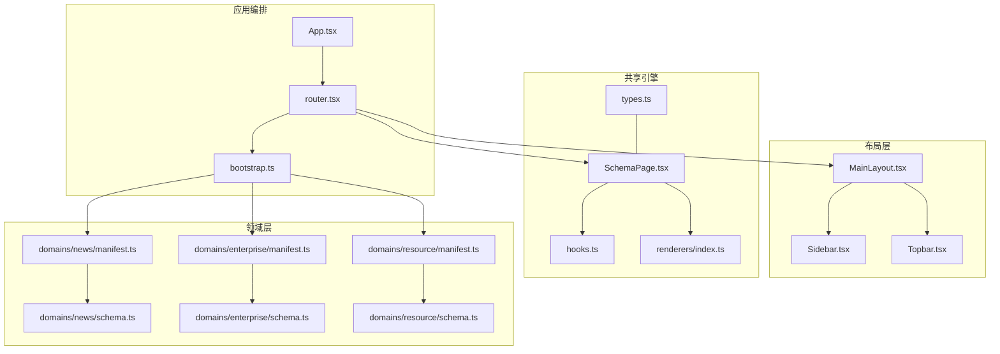
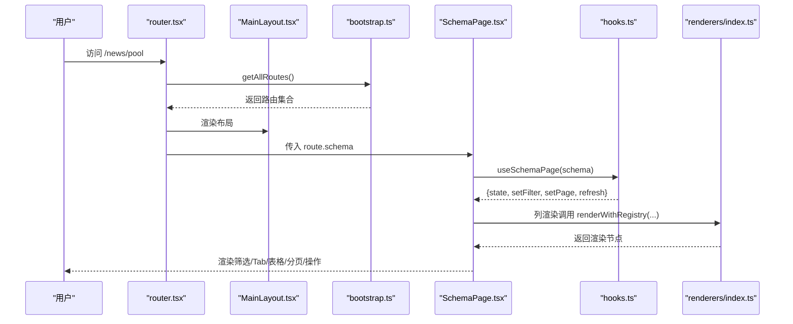
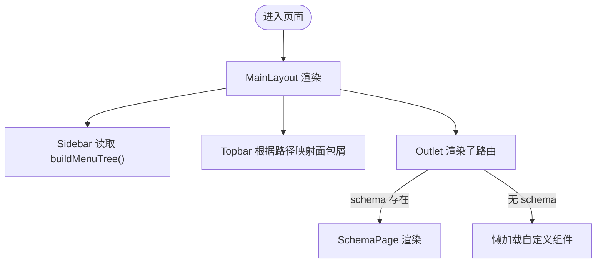
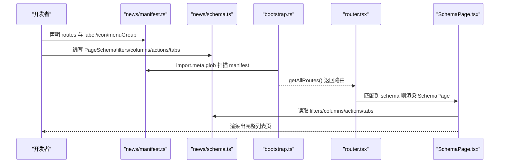
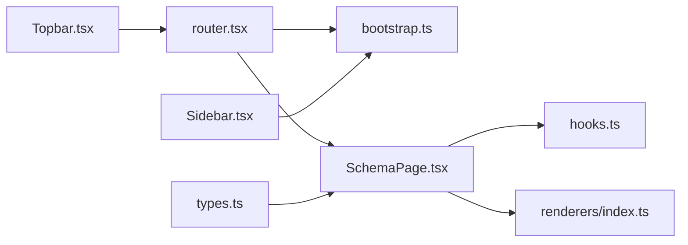

# 组件架构设计

<cite>
**本文引用的文件**
- [App.tsx](file://hj-admin/src/app/App.tsx)
- [bootstrap.ts](file://hj-admin/src/app/bootstrap.ts)
- [router.tsx](file://hj-admin/src/app/router.tsx)
- [MainLayout.tsx](file://hj-admin/src/layouts/MainLayout.tsx)
- [Sidebar.tsx](file://hj-admin/src/layouts/Sidebar.tsx)
- [Topbar.tsx](file://hj-admin/src/layouts/Topbar.tsx)
- [SchemaPage.tsx](file://hj-admin/src/shared/schema-engine/SchemaPage.tsx)
- [hooks.ts](file://hj-admin/src/shared/schema-engine/hooks.ts)
- [types.ts](file://hj-admin/src/shared/schema-engine/types.ts)
- [renderers/index.ts](file://hj-admin/src/shared/schema-engine/renderers/index.ts)
- [manifest.ts（资讯域）](file://hj-admin/src/domains/news/manifest.ts)
- [schema.ts（资讯域）](file://hj-admin/src/domains/news/schema.ts)
- [manifest.ts（企业域）](file://hj-admin/src/domains/enterprise/manifest.ts)
- [schema.ts（企业域）](file://hj-admin/src/domains/enterprise/schema.ts)
- [manifest.ts（资源位域）](file://hj-admin/src/domains/resource/manifest.ts)
- [schema.ts（资源位域）](file://hj-admin/src/domains/resource/schema.ts)
</cite>

## 目录
1. [引言](#引言)
2. [项目结构](#项目结构)
3. [核心组件](#核心组件)
4. [架构总览](#架构总览)
5. [详细组件分析](#详细组件分析)
6. [依赖关系分析](#依赖关系分析)
7. [性能考虑](#性能考虑)
8. [故障排查指南](#故障排查指南)
9. [结论](#结论)
10. [附录：开发规范与测试策略](#附录开发规范与测试策略)

## 引言
本文件面向氢界大数据平台运营管理后台，系统化阐述组件分层架构、配置驱动页面渲染机制、布局复用模式、组件通信方式、开发规范与测试策略。重点围绕 SchemaPage 的配置驱动理念、MainLayout/Sidebar/Topbar 的组合式布局、以及基于 manifest 的自动路由与菜单生成进行深度解析，帮助开发者快速理解并高效扩展系统能力。

## 项目结构
整体采用“应用编排 + 布局层 + 领域域清单 + 共享引擎”的分层组织：
- 应用编排层：入口 App、Provider 链、路由装配
- 布局层：主布局 MainLayout 组合 Sidebar 与 Topbar，承载页面内容区
- 领域层：按业务域划分（news、enterprise、resource 等），每个域提供 manifest 声明路由与菜单信息，并提供 schema 描述页面
- 共享引擎层：Schema 类型定义、SchemaPage 渲染器、useSchemaPage 状态 Hook、渲染器注册表



图表来源
- [App.tsx:1-21](file://hj-admin/src/app/App.tsx#L1-L21)
- [router.tsx:1-58](file://hj-admin/src/app/router.tsx#L1-L58)
- [bootstrap.ts:1-104](file://hj-admin/src/app/bootstrap.ts#L1-L104)
- [MainLayout.tsx:1-23](file://hj-admin/src/layouts/MainLayout.tsx#L1-L23)
- [Sidebar.tsx:1-156](file://hj-admin/src/layouts/Sidebar.tsx#L1-L156)
- [Topbar.tsx:1-66](file://hj-admin/src/layouts/Topbar.tsx#L1-L66)
- [types.ts:1-216](file://hj-admin/src/shared/schema-engine/types.ts#L1-L216)
- [SchemaPage.tsx:1-226](file://hj-admin/src/shared/schema-engine/SchemaPage.tsx#L1-L226)
- [hooks.ts:1-106](file://hj-admin/src/shared/schema-engine/hooks.ts#L1-L106)
- [renderers/index.ts:1-163](file://hj-admin/src/shared/schema-engine/renderers/index.ts#L1-L163)
- [manifest.ts（资讯域）:1-42](file://hj-admin/src/domains/news/manifest.ts#L1-L42)
- [schema.ts（资讯域）:1-123](file://hj-admin/src/domains/news/schema.ts#L1-L123)
- [manifest.ts（企业域）:1-20](file://hj-admin/src/domains/enterprise/manifest.ts#L1-L20)
- [schema.ts（企业域）:1-64](file://hj-admin/src/domains/enterprise/schema.ts#L1-L64)
- [manifest.ts（资源位域）:1-22](file://hj-admin/src/domains/resource/manifest.ts#L1-L22)
- [schema.ts（资源位域）:1-51](file://hj-admin/src/domains/resource/schema.ts#L1-L51)

章节来源
- [App.tsx:1-21](file://hj-admin/src/app/App.tsx#L1-L21)
- [router.tsx:1-58](file://hj-admin/src/app/router.tsx#L1-L58)
- [bootstrap.ts:1-104](file://hj-admin/src/app/bootstrap.ts#L1-L104)
- [MainLayout.tsx:1-23](file://hj-admin/src/layouts/MainLayout.tsx#L1-L23)
- [Sidebar.tsx:1-156](file://hj-admin/src/layouts/Sidebar.tsx#L1-L156)
- [Topbar.tsx:1-66](file://hj-admin/src/layouts/Topbar.tsx#L1-L66)
- [types.ts:1-216](file://hj-admin/src/shared/schema-engine/types.ts#L1-L216)
- [SchemaPage.tsx:1-226](file://hj-admin/src/shared/schema-engine/SchemaPage.tsx#L1-L226)
- [hooks.ts:1-106](file://hj-admin/src/shared/schema-engine/hooks.ts#L1-L106)
- [renderers/index.ts:1-163](file://hj-admin/src/shared/schema-engine/renderers/index.ts#L1-L163)
- [manifest.ts（资讯域）:1-42](file://hj-admin/src/domains/news/manifest.ts#L1-L42)
- [schema.ts（资讯域）:1-123](file://hj-admin/src/domains/news/schema.ts#L1-L123)
- [manifest.ts（企业域）:1-20](file://hj-admin/src/domains/enterprise/manifest.ts#L1-L20)
- [schema.ts（企业域）:1-64](file://hj-admin/src/domains/enterprise/schema.ts#L1-L64)
- [manifest.ts（资源位域）:1-22](file://hj-admin/src/domains/resource/manifest.ts#L1-L22)
- [schema.ts（资源位域）:1-51](file://hj-admin/src/domains/resource/schema.ts#L1-L51)

## 核心组件
- 应用编排
  - App：挂载路由与全局 Provider，不包含业务逻辑
  - router：从 bootstrap 发现所有域清单，动态生成路由；有 schema 的路由使用 SchemaPage 渲染，无 schema 则懒加载自定义组件
  - bootstrap：扫描 domains/*/manifest.ts，汇总路由与构建菜单树
- 布局组件
  - MainLayout：组合 Sidebar 与 Topbar，提供页面内容区 Outlet
  - Sidebar：根据 buildMenuTree() 生成的菜单树渲染侧边栏，支持折叠、展开、禁用项与徽标
  - Topbar：根据路径映射面包屑，提供导航与用户信息区域
- 配置驱动引擎
  - types：定义 PageSchema、ColumnDef、FilterField、RowAction、ModalDef、TabDef、DomainManifest 等核心类型
  - SchemaPage：通用列表页渲染器，根据 PageSchema 自动渲染筛选栏、Tab、表格、分页、行操作与工具栏
  - hooks：useSchemaPage 封装筛选、分页、Tab、选中行与数据加载状态
  - renderers：渲染器注册表与内置渲染器（标签、状态徽章、链接、日期、百分比、成功率等）

章节来源
- [App.tsx:1-21](file://hj-admin/src/app/App.tsx#L1-L21)
- [router.tsx:1-58](file://hj-admin/src/app/router.tsx#L1-L58)
- [bootstrap.ts:1-104](file://hj-admin/src/app/bootstrap.ts#L1-L104)
- [MainLayout.tsx:1-23](file://hj-admin/src/layouts/MainLayout.tsx#L1-L23)
- [Sidebar.tsx:1-156](file://hj-admin/src/layouts/Sidebar.tsx#L1-L156)
- [Topbar.tsx:1-66](file://hj-admin/src/layouts/Topbar.tsx#L1-L66)
- [types.ts:1-216](file://hj-admin/src/shared/schema-engine/types.ts#L1-L216)
- [SchemaPage.tsx:1-226](file://hj-admin/src/shared/schema-engine/SchemaPage.tsx#L1-L226)
- [hooks.ts:1-106](file://hj-admin/src/shared/schema-engine/hooks.ts#L1-L106)
- [renderers/index.ts:1-163](file://hj-admin/src/shared/schema-engine/renderers/index.ts#L1-L163)

## 架构总览
下图展示从入口到页面渲染的关键流程：App 启动 → 路由装配 → 布局包裹 → 根据 manifest 自动生成路由 → 匹配到 schema 时由 SchemaPage 渲染。



图表来源
- [router.tsx:1-58](file://hj-admin/src/app/router.tsx#L1-L58)
- [bootstrap.ts:1-104](file://hj-admin/src/app/bootstrap.ts#L1-L104)
- [MainLayout.tsx:1-23](file://hj-admin/src/layouts/MainLayout.tsx#L1-L23)
- [SchemaPage.tsx:1-226](file://hj-admin/src/shared/schema-engine/SchemaPage.tsx#L1-L226)
- [hooks.ts:1-106](file://hj-admin/src/shared/schema-engine/hooks.ts#L1-L106)
- [renderers/index.ts:1-163](file://hj-admin/src/shared/schema-engine/renderers/index.ts#L1-L163)

## 详细组件分析

### SchemaPage 组件与设计理念
- 设计理念
  - 将“写页面”降维为“写配置”，通过 PageSchema 声明筛选、列、分页、操作、Tab、弹窗等，统一渲染行为
  - 列渲染支持字符串引用渲染器或自定义函数，保持可序列化与可扩展性
- 关键职责
  - 接收 schema，驱动 useSchemaPage 管理筛选、分页、Tab、选中行与数据加载
  - 组装列定义与行操作列，处理可见性与导航
  - 渲染筛选栏、工具栏、表格、分页与 Tab 分组
- 交互细节
  - 行操作支持 navigateTo 模板替换 :id、确认提示、条件显示
  - 工具栏按钮与批量选择联动
  - 筛选变化重置到第一页，Tab 切换重置分页

```mermaid
classDiagram
class SchemaPage {
+props : { schema }
+columns
+actionColumn
+displayData
}
class UseSchemaPage {
+state
+setFilter()
+resetFilters()
+setPage()
+setActiveTab()
+setSelectedRowKeys()
+refresh()
}
class Renderers {
+registerRenderer()
+getRenderer()
+renderWithRegistry()
}
SchemaPage --> UseSchemaPage : "使用"
SchemaPage --> Renderers : "列渲染"
```

图表来源
- [SchemaPage.tsx:1-226](file://hj-admin/src/shared/schema-engine/SchemaPage.tsx#L1-L226)
- [hooks.ts:1-106](file://hj-admin/src/shared/schema-engine/hooks.ts#L1-L106)
- [renderers/index.ts:1-163](file://hj-admin/src/shared/schema-engine/renderers/index.ts#L1-L163)

章节来源
- [SchemaPage.tsx:1-226](file://hj-admin/src/shared/schema-engine/SchemaPage.tsx#L1-L226)
- [hooks.ts:1-106](file://hj-admin/src/shared/schema-engine/hooks.ts#L1-L106)
- [renderers/index.ts:1-163](file://hj-admin/src/shared/schema-engine/renderers/index.ts#L1-L163)
- [types.ts:1-216](file://hj-admin/src/shared/schema-engine/types.ts#L1-L216)

### 布局组件复用机制（MainLayout、Sidebar、Topbar）
- 组合模式
  - MainLayout 作为容器，左侧 Sidebar，右侧顶部 Topbar 与内容区 Outlet
  - Sidebar 通过 buildMenuTree() 从 manifest 自动生成菜单，支持折叠、展开、禁用项与徽标
  - Topbar 通过路径映射生成面包屑，点击一级可跳转至对应默认页
- 复用要点
  - 新增域只需在 manifest 中声明 routes，菜单与路由自动生效
  - 禁用菜单项集中维护，便于灰度与规划



图表来源
- [MainLayout.tsx:1-23](file://hj-admin/src/layouts/MainLayout.tsx#L1-L23)
- [Sidebar.tsx:1-156](file://hj-admin/src/layouts/Sidebar.tsx#L1-L156)
- [Topbar.tsx:1-66](file://hj-admin/src/layouts/Topbar.tsx#L1-L66)
- [bootstrap.ts:1-104](file://hj-admin/src/app/bootstrap.ts#L1-L104)
- [router.tsx:1-58](file://hj-admin/src/app/router.tsx#L1-L58)

章节来源
- [MainLayout.tsx:1-23](file://hj-admin/src/layouts/MainLayout.tsx#L1-L23)
- [Sidebar.tsx:1-156](file://hj-admin/src/layouts/Sidebar.tsx#L1-L156)
- [Topbar.tsx:1-66](file://hj-admin/src/layouts/Topbar.tsx#L1-L66)
- [bootstrap.ts:1-104](file://hj-admin/src/app/bootstrap.ts#L1-L104)
- [router.tsx:1-58](file://hj-admin/src/app/router.tsx#L1-L58)

### 配置驱动页面渲染（以资讯域为例）
- 域清单 manifest 声明路由与菜单分组，routes 中的 schema 字段指向页面配置
- schema 定义筛选、列、分页、行操作、Tab 等，SchemaPage 据此渲染完整页面
- 示例：资讯池页面通过 newsPoolSchema 配置筛选、列渲染器、行操作与分页



图表来源
- [manifest.ts（资讯域）:1-42](file://hj-admin/src/domains/news/manifest.ts#L1-L42)
- [schema.ts（资讯域）:1-123](file://hj-admin/src/domains/news/schema.ts#L1-L123)
- [bootstrap.ts:1-104](file://hj-admin/src/app/bootstrap.ts#L1-L104)
- [router.tsx:1-58](file://hj-admin/src/app/router.tsx#L1-L58)
- [SchemaPage.tsx:1-226](file://hj-admin/src/shared/schema-engine/SchemaPage.tsx#L1-L226)

章节来源
- [manifest.ts（资讯域）:1-42](file://hj-admin/src/domains/news/manifest.ts#L1-L42)
- [schema.ts（资讯域）:1-123](file://hj-admin/src/domains/news/schema.ts#L1-L123)
- [bootstrap.ts:1-104](file://hj-admin/src/app/bootstrap.ts#L1-L104)
- [router.tsx:1-58](file://hj-admin/src/app/router.tsx#L1-L58)
- [SchemaPage.tsx:1-226](file://hj-admin/src/shared/schema-engine/SchemaPage.tsx#L1-L226)

### 组件间通信模式
- props 传递
  - SchemaPage 通过 props 接收 schema，内部通过 useMemo/useCallback 派生 columns、actionColumn、displayData
  - MainLayout 通过 props collapsed/onToggle 控制 Sidebar 折叠状态
- 事件回调
  - 行操作 onClick/navigateTo 触发导航或回调，支持 confirm 确认
  - 筛选 onChange 与重置 onReset 更新 state.filters 并重置分页
- 状态共享
  - useSchemaPage 统一管理 loading/data/total/page/pageSize/filters/activeTab/selectedRowKeys
  - 上下文 PageActionContext 注入 refresh/navigate/showModal，供行操作与弹窗使用

章节来源
- [SchemaPage.tsx:1-226](file://hj-admin/src/shared/schema-engine/SchemaPage.tsx#L1-L226)
- [hooks.ts:1-106](file://hj-admin/src/shared/schema-engine/hooks.ts#L1-L106)
- [types.ts:1-216](file://hj-admin/src/shared/schema-engine/types.ts#L1-L216)
- [MainLayout.tsx:1-23](file://hj-admin/src/layouts/MainLayout.tsx#L1-L23)

### 领域清单与自动路由/菜单
- 自动发现
  - bootstrap 使用 import.meta.glob 扫描 domains/*/manifest.ts，提取 DomainManifest 并按 order 排序
- 路由生成
  - router 遍历 getAllRoutes()，有 schema 使用 SchemaPage，无 schema 懒加载自定义组件
- 菜单构建
  - buildMenuTree 按 menuGroup 分组，合并启用的菜单与禁用的占位菜单，支持 dot/badge/disabled

章节来源
- [bootstrap.ts:1-104](file://hj-admin/src/app/bootstrap.ts#L1-L104)
- [router.tsx:1-58](file://hj-admin/src/app/router.tsx#L1-L58)
- [manifest.ts（企业域）:1-20](file://hj-admin/src/domains/enterprise/manifest.ts#L1-L20)
- [manifest.ts（资源位域）:1-22](file://hj-admin/src/domains/resource/manifest.ts#L1-L22)

## 依赖关系分析
- 低耦合高内聚
  - 领域层仅关注自身 manifest 与 schema，不感知渲染细节
  - 共享引擎提供类型与渲染能力，被路由与页面消费
- 直接依赖
  - router 依赖 bootstrap 获取路由
  - SchemaPage 依赖 hooks 与 renderers
  - Sidebar 依赖 bootstrap 的 buildMenuTree
- 潜在循环
  - 当前未发现循环依赖；manifest 仅导出常量，避免运行时副作用



图表来源
- [router.tsx:1-58](file://hj-admin/src/app/router.tsx#L1-L58)
- [bootstrap.ts:1-104](file://hj-admin/src/app/bootstrap.ts#L1-L104)
- [SchemaPage.tsx:1-226](file://hj-admin/src/shared/schema-engine/SchemaPage.tsx#L1-L226)
- [hooks.ts:1-106](file://hj-admin/src/shared/schema-engine/hooks.ts#L1-L106)
- [renderers/index.ts:1-163](file://hj-admin/src/shared/schema-engine/renderers/index.ts#L1-L163)
- [Sidebar.tsx:1-156](file://hj-admin/src/layouts/Sidebar.tsx#L1-L156)
- [Topbar.tsx:1-66](file://hj-admin/src/layouts/Topbar.tsx#L1-L66)
- [types.ts:1-216](file://hj-admin/src/shared/schema-engine/types.ts#L1-L216)

章节来源
- [router.tsx:1-58](file://hj-admin/src/app/router.tsx#L1-L58)
- [bootstrap.ts:1-104](file://hj-admin/src/app/bootstrap.ts#L1-L104)
- [SchemaPage.tsx:1-226](file://hj-admin/src/shared/schema-engine/SchemaPage.tsx#L1-L226)
- [hooks.ts:1-106](file://hj-admin/src/shared/schema-engine/hooks.ts#L1-L106)
- [renderers/index.ts:1-163](file://hj-admin/src/shared/schema-engine/renderers/index.ts#L1-L163)
- [Sidebar.tsx:1-156](file://hj-admin/src/layouts/Sidebar.tsx#L1-L156)
- [Topbar.tsx:1-66](file://hj-admin/src/layouts/Topbar.tsx#L1-L66)
- [types.ts:1-216](file://hj-admin/src/shared/schema-engine/types.ts#L1-L216)

## 性能考虑
- 路由与模块懒加载
  - 非 schema 页面使用 lazy 与 Suspense，减少首屏体积
- 计算优化
  - SchemaPage 使用 useMemo 缓存 columns、actionColumn、displayData，避免重复计算
- 状态更新最小化
  - useSchemaPage 仅在 page/pageSize/filters 变化时重新请求数据
- 渲染器复用
  - 内置渲染器通过注册表复用，避免重复定义
- 建议
  - 对大型表格启用虚拟滚动（如 antd Table 的 virtual 选项）
  - 对复杂筛选增加防抖与后端分页过滤
  - 对高频重渲染的列渲染器进行 memo 化

[本节为通用指导，无需源码引用]

## 故障排查指南
- 常见错误定位
  - 渲染器未注册：控制台会输出缺失渲染器的警告，检查 renderers/index.ts 是否注册对应名称
  - 路由未生效：确认 manifest 已正确导出且被 bootstrap 扫描到，检查 path 与 hideInMenu 配置
  - 数据加载失败：useSchemaPage 捕获异常并打印日志，检查 entity 对应的 Repository 实现
- 调试建议
  - 在 SchemaPage 中打印最终 columns 与 displayData，确认配置是否正确
  - 在 Topbar 的面包屑映射中补充缺失路径，确保导航体验一致
  - 在 Sidebar 中检查 disabledItems 与 groupOrder 的顺序是否符合预期

章节来源
- [renderers/index.ts:1-163](file://hj-admin/src/shared/schema-engine/renderers/index.ts#L1-L163)
- [hooks.ts:1-106](file://hj-admin/src/shared/schema-engine/hooks.ts#L1-L106)
- [Topbar.tsx:1-66](file://hj-admin/src/layouts/Topbar.tsx#L1-L66)
- [bootstrap.ts:1-104](file://hj-admin/src/app/bootstrap.ts#L1-L104)

## 结论
本架构通过“manifest 声明 + schema 驱动 + 布局组合”的方式，实现了高扩展、低耦合、易维护的后台页面体系。SchemaPage 将页面开发从手写 JSX 转为配置驱动，显著提升效率与一致性；布局组件通过组合模式实现复用；路由与菜单自动发现降低维护成本。配合合理的开发规范与测试策略，可支撑大规模业务域的持续演进。

[本节为总结，无需源码引用]

## 附录：开发规范与测试策略

### 命名约定
- 文件与目录
  - 领域目录：domains/<domain>/，包含 manifest.ts、schema.ts、repository.ts、mock.ts、index.ts、pages/*、types.ts
  - 共享引擎：shared/schema-engine/{types,hooks,SchemaPage,renderers}
  - 布局：layouts/{MainLayout,Sidebar,Topbar}.tsx
- 变量与接口
  - 类型与接口使用 PascalCase（如 PageSchema、ColumnDef、DomainManifest）
  - 组件使用 PascalCase（如 SchemaPage、MainLayout）
  - 常量与枚举使用 UPPER_SNAKE_CASE（如 FilterType、ModalTrigger）

章节来源
- [types.ts:1-216](file://hj-admin/src/shared/schema-engine/types.ts#L1-L216)
- [SchemaPage.tsx:1-226](file://hj-admin/src/shared/schema-engine/SchemaPage.tsx#L1-L226)
- [MainLayout.tsx:1-23](file://hj-admin/src/layouts/MainLayout.tsx#L1-L23)

### 接口设计原则
- 单一职责
  - SchemaPage 专注渲染，useSchemaPage 专注状态，renderers 专注单元格渲染
- 可序列化
  - 列渲染优先使用字符串引用渲染器，保持配置可序列化与 AI 友好
- 可扩展
  - 新增渲染器仅需在 renderers/index.ts 注册，并在 schema 中引用
- 向后兼容
  - 新增可选字段需保证旧配置仍可运行

章节来源
- [types.ts:1-216](file://hj-admin/src/shared/schema-engine/types.ts#L1-L216)
- [renderers/index.ts:1-163](file://hj-admin/src/shared/schema-engine/renderers/index.ts#L1-L163)
- [SchemaPage.tsx:1-226](file://hj-admin/src/shared/schema-engine/SchemaPage.tsx#L1-L226)

### 文档注释标准
- 组件与 Hook
  - 顶部注释说明职责、输入输出、注意事项
  - 对外暴露的接口添加 JSDoc 注释，明确字段含义与约束
- Schema 与 Manifest
  - 在 schema 与 manifest 文件中添加简要说明，标注数据来源与业务含义
- 渲染器
  - 为每个渲染器添加用途与参数说明，便于维护与扩展

[本节为通用指导，无需源码引用]

### 组件测试策略
- 单元测试
  - 针对 useSchemaPage 的状态流转与副作用（筛选、分页、刷新）进行测试
  - 针对 renderers 的渲染结果与边界值进行测试（空值、超长文本、非法颜色）
- 集成测试
  - 验证 manifest 扫描与路由生成，确保新增域后菜单与路由自动出现
  - 端到端场景：打开页面 → 筛选 → 分页 → 行操作 → 导航
- 快照测试
  - 对复杂列渲染与布局输出进行快照对比，防止回归
- 覆盖率要求
  - 核心引擎（SchemaPage、hooks、renderers）覆盖率不低于 80%

[本节为通用指导，无需源码引用]