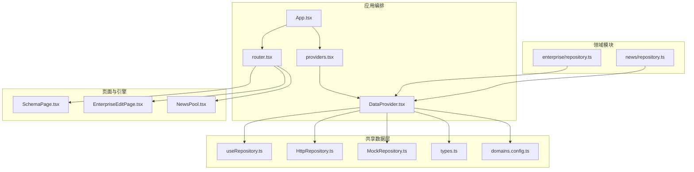
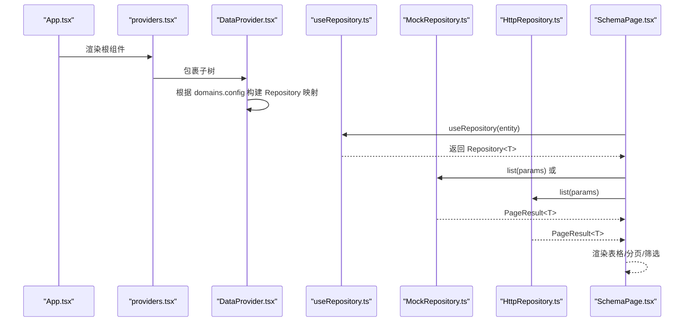
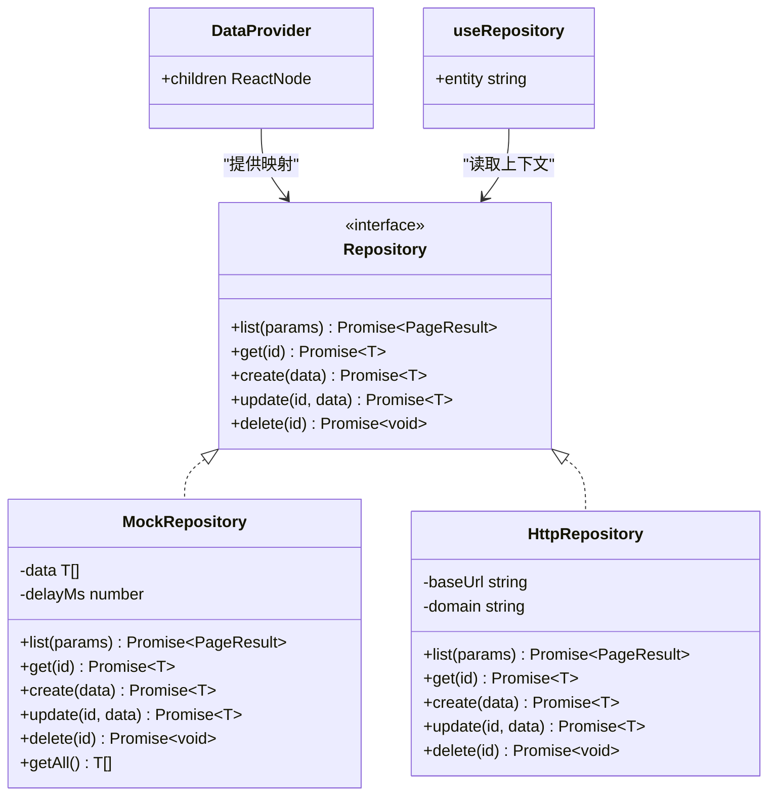
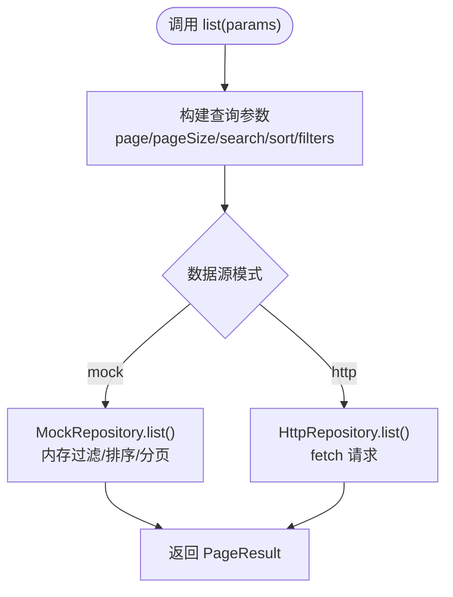
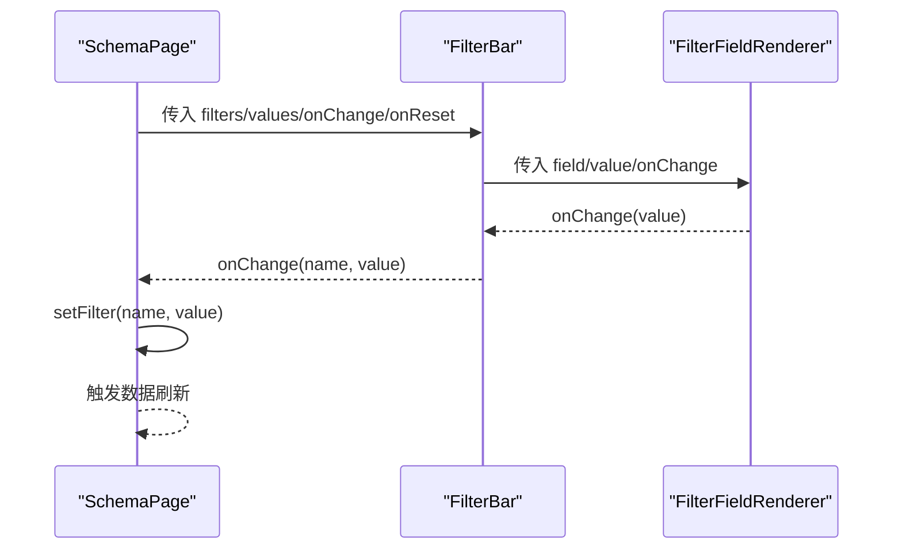
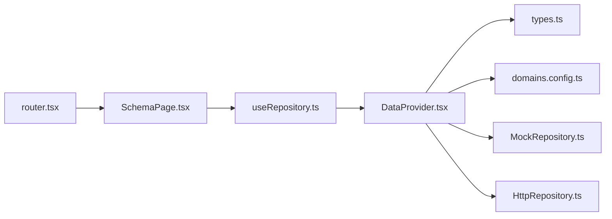

# 组件通信模式

<cite>
**本文引用的文件**   
- [App.tsx](file://hj-admin/src/app/App.tsx)
- [providers.tsx](file://hj-admin/src/app/providers.tsx)
- [router.tsx](file://hj-admin/src/app/router.tsx)
- [DataProvider.tsx](file://hj-admin/src/shared/data/DataProvider.tsx)
- [useRepository.ts](file://hj-admin/src/shared/data/useRepository.ts)
- [HttpRepository.ts](file://hj-admin/src/shared/data/HttpRepository.ts)
- [MockRepository.ts](file://hj-admin/src/shared/data/MockRepository.ts)
- [types.ts](file://hj-admin/src/shared/data/types.ts)
- [domains.config.ts](file://hj-admin/src/config/domains.config.ts)
- [repository.ts（企业域）](file://hj-admin/src/domains/enterprise/repository.ts)
- [repository.ts（资讯域）](file://hj-admin/src/domains/news/repository.ts)
- [SchemaPage.tsx](file://hj-admin/src/shared/schema-engine/SchemaPage.tsx)
- [EnterpriseEditPage.tsx](file://hj-admin/src/domains/enterprise/pages/EnterpriseEditPage.tsx)
- [NewsPool.tsx](file://hj-admin/src/pages/news/NewsPool.tsx)
</cite>

## 目录
1. [简介](#简介)
2. [项目结构](#项目结构)
3. [核心组件与数据流](#核心组件与数据流)
4. [架构总览](#架构总览)
5. [详细组件分析](#详细组件分析)
6. [依赖关系分析](#依赖关系分析)
7. [性能优化建议](#性能优化建议)
8. [调试与常见问题](#调试与常见问题)
9. [结论](#结论)

## 简介
本文件面向氢界大数据平台的前端工程，系统化梳理“组件通信模式”，重点覆盖：
- React Context Provider 模式的实现与全局状态管理、依赖注入
- DataProvider 数据提供者的职责与统一数据源接入方式
- useRepository Hook 的数据访问模式（获取、缓存、同步）
- 父子组件间的 props 传递与事件回调模式
- 跨层级组件通信的最佳实践（状态提升、事件冒泡）
- 组件通信的性能优化（重渲染优化、内存泄漏防护）
- 调试技巧与常见问题解决方案

## 项目结构
本项目采用“应用编排 + 领域驱动 + 共享基础设施”的分层组织方式：
- app 层负责应用级编排（路由、Provider 组合）
- shared 层提供通用能力（数据抽象、仓库实现、Schema 引擎）
- domains 层按业务域组织页面、类型、配置与 mock 数据注册
- config 层集中配置数据源模式（mock/http）

图表来源
- [App.tsx:10-18](file://hj-admin/src/app/App.tsx#L10-L18)
- [providers.tsx:7-13](file://hj-admin/src/app/providers.tsx#L7-L13)
- [DataProvider.tsx:26-41](file://hj-admin/src/shared/data/DataProvider.tsx#L26-L41)
- [useRepository.ts:8-23](file://hj-admin/src/shared/data/useRepository.ts#L8-L23)
- [HttpRepository.ts:7-69](file://hj-admin/src/shared/data/HttpRepository.ts#L7-L69)
- [MockRepository.ts:7-100](file://hj-admin/src/shared/data/MockRepository.ts#L7-L100)
- [types.ts:20-27](file://hj-admin/src/shared/data/types.ts#L20-L27)
- [domains.config.ts:7-17](file://hj-admin/src/config/domains.config.ts#L7-L17)
- [repository.ts（企业域）:1-6](file://hj-admin/src/domains/enterprise/repository.ts#L1-L6)
- [repository.ts（资讯域）:1-11](file://hj-admin/src/domains/news/repository.ts#L1-L11)
- [router.tsx:25-57](file://hj-admin/src/app/router.tsx#L25-L57)
- [SchemaPage.tsx:76-223](file://hj-admin/src/shared/schema-engine/SchemaPage.tsx#L76-L223)
- [EnterpriseEditPage.tsx:9-88](file://hj-admin/src/domains/enterprise/pages/EnterpriseEditPage.tsx#L9-L88)
- [NewsPool.tsx:22-138](file://hj-admin/src/pages/news/NewsPool.tsx#L22-L138)

章节来源
- [App.tsx:10-18](file://hj-admin/src/app/App.tsx#L10-L18)
- [providers.tsx:7-13](file://hj-admin/src/app/providers.tsx#L7-L13)
- [router.tsx:25-57](file://hj-admin/src/app/router.tsx#L25-L57)

## 核心组件与数据流
- AppProviders 作为全局 Provider 组合入口，仅做编排，不包含业务逻辑。
- DataProvider 基于 React Context 提供 Repository 实例映射，按 domain 动态选择 Mock 或 HTTP 实现。
- useRepository Hook 从 Context 中取出对应 entity 的 Repository，供任意组件进行数据访问。
- SchemaPage 通过 useRepository 拉取列表数据，结合筛选、分页、排序等参数完成数据展示。
- 各域在 bootstrap 阶段调用 registerMockData 将本地 mock 数据注入到 DataProvider。

图表来源
- [App.tsx:10-18](file://hj-admin/src/app/App.tsx#L10-L18)
- [providers.tsx:7-13](file://hj-admin/src/app/providers.tsx#L7-L13)
- [DataProvider.tsx:26-41](file://hj-admin/src/shared/data/DataProvider.tsx#L26-L41)
- [useRepository.ts:8-23](file://hj-admin/src/shared/data/useRepository.ts#L8-L23)
- [MockRepository.ts:20-67](file://hj-admin/src/shared/data/MockRepository.ts#L20-L67)
- [HttpRepository.ts:29-46](file://hj-admin/src/shared/data/HttpRepository.ts#L29-L46)
- [SchemaPage.tsx:76-223](file://hj-admin/src/shared/schema-engine/SchemaPage.tsx#L76-L223)

章节来源
- [DataProvider.tsx:26-41](file://hj-admin/src/shared/data/DataProvider.tsx#L26-L41)
- [useRepository.ts:8-23](file://hj-admin/src/shared/data/useRepository.ts#L8-L23)
- [domains.config.ts:7-17](file://hj-admin/src/config/domains.config.ts#L7-L17)

## 架构总览
整体采用“上下文注入 + 仓库抽象 + 配置化页面”的架构：
- 上下文注入：通过 Context 提供 Repository 映射，避免层层透传 props
- 仓库抽象：统一的 Repository 接口屏蔽后端差异，支持 mock/http 切换
- 配置化页面：SchemaPage 根据配置自动渲染筛选、表格、分页、操作列等

图表来源
- [types.ts:20-27](file://hj-admin/src/shared/data/types.ts#L20-L27)
- [MockRepository.ts:7-100](file://hj-admin/src/shared/data/MockRepository.ts#L7-L100)
- [HttpRepository.ts:7-69](file://hj-admin/src/shared/data/HttpRepository.ts#L7-L69)
- [DataProvider.tsx:26-41](file://hj-admin/src/shared/data/DataProvider.tsx#L26-L41)
- [useRepository.ts:8-23](file://hj-admin/src/shared/data/useRepository.ts#L8-L23)

## 详细组件分析

### React Context Provider 模式与全局状态管理
- 作用：在应用顶层通过 Context 暴露 Repository 映射，使任意深度组件均可直接访问数据仓库，无需逐层传递 props。
- 实现要点：
  - 使用 useMemo 构建稳定的 Repository 映射对象，减少不必要的重渲染。
  - 依据 domains.config 中的 DataSourceMode 动态选择 Mock 或 HTTP 实现。
  - 提供 registerMockData 函数，允许各域在启动阶段注入本地数据。
- 适用场景：
  - 全局数据源切换（开发/测试/生产）
  - 多域多实体统一数据访问契约
  - 跨层级组件共享数据访问能力

章节来源
- [DataProvider.tsx:17-41](file://hj-admin/src/shared/data/DataProvider.tsx#L17-L41)
- [domains.config.ts:7-17](file://hj-admin/src/config/domains.config.ts#L7-L17)

### DataProvider 数据提供者组件
- 职责：
  - 维护一个以 domain/entity 为键的 Repository 映射
  - 根据配置创建并注入对应的仓库实例
  - 对外暴露 DataContext.Provider 包裹子树
- 关键流程：
  - 遍历 domainConfig，若 mode 为 'mock'，则用 MockRepository 包装已注册的 mock 数据；否则使用 HttpRepository 指向 API_BASE/domain
  - 将 repos 对象作为 value 提供给子树
- 扩展点：
  - 新增域只需在 domains.config.ts 添加条目，并在对应域的 repository.ts 中调用 registerMockData 注入数据

章节来源
- [DataProvider.tsx:26-41](file://hj-admin/src/shared/data/DataProvider.tsx#L26-L41)
- [repository.ts（企业域）:1-6](file://hj-admin/src/domains/enterprise/repository.ts#L1-L6)
- [repository.ts（资讯域）:1-11](file://hj-admin/src/domains/news/repository.ts#L1-L11)

### useRepository Hook 数据访问模式
- 设计目标：
  - 以 entity 名称为维度获取 Repository，屏蔽具体实现细节
  - 在未找到对应 entity 时返回空操作的 fallback，避免运行时崩溃
- 数据获取与同步：
  - 通过 Repository.list/get/create/update/delete 统一访问
  - 当前未内置缓存层，可在上层（如 SchemaPage 或自定义 Hook）引入缓存策略
- 典型用法：
  - 在页面或子组件中调用 useRepository('news') 获取新闻仓库，再调用 list({ page, pageSize, filters, sort, search }) 获取分页结果

章节来源
- [useRepository.ts:8-23](file://hj-admin/src/shared/data/useRepository.ts#L8-L23)
- [types.ts:20-27](file://hj-admin/src/shared/data/types.ts#L20-L27)

### 数据仓库实现（Mock 与 HTTP）
- MockRepository：
  - 内存过滤、分页、排序，模拟网络延迟，返回 Promise，便于前端体验一致
  - 提供 getAll 方法用于统计计数等场景
- HttpRepository：
  - 基于 fetch 发起请求，构造查询参数（page、pageSize、search、sort、filters）
  - 统一错误处理（非 ok 响应抛出错误）
  - 占位实现，待后端 API 就绪后替换真实逻辑

图表来源
- [MockRepository.ts:20-67](file://hj-admin/src/shared/data/MockRepository.ts#L20-L67)
- [HttpRepository.ts:29-46](file://hj-admin/src/shared/data/HttpRepository.ts#L29-L46)

章节来源
- [MockRepository.ts:7-100](file://hj-admin/src/shared/data/MockRepository.ts#L7-L100)
- [HttpRepository.ts:7-69](file://hj-admin/src/shared/data/HttpRepository.ts#L7-L69)

### 父子组件间 Props 传递与事件回调
- 示例一：SchemaPage 向 FilterBar 传递筛选字段定义与值，并通过 onChange/onReset 回调更新父组件状态
- 示例二：SchemaPage 行操作列通过 onClick 回调触发导航或自定义动作
- 示例三：EnterpriseEditPage 内部 Tabs 简易关联组件通过 props 接收 ent 数据，并使用局部 state 控制 Tab 激活态

图表来源
- [SchemaPage.tsx:16-33](file://hj-admin/src/shared/schema-engine/SchemaPage.tsx#L16-L33)
- [SchemaPage.tsx:35-73](file://hj-admin/src/shared/schema-engine/SchemaPage.tsx#L35-L73)
- [SchemaPage.tsx:76-223](file://hj-admin/src/shared/schema-engine/SchemaPage.tsx#L76-L223)

章节来源
- [SchemaPage.tsx:76-223](file://hj-admin/src/shared/schema-engine/SchemaPage.tsx#L76-L223)
- [EnterpriseEditPage.tsx:91-114](file://hj-admin/src/domains/enterprise/pages/EnterpriseEditPage.tsx#L91-L114)

### 跨层级组件通信最佳实践
- 状态提升：
  - 将筛选条件、分页、Tab 等状态提升到 SchemaPage，向下通过 props 分发，向上通过回调通知变更
- 事件冒泡：
  - 行操作按钮点击事件由 Table 的 render 回调捕获，再触发 navigate 或自定义 action
- 上下文注入：
  - 通过 useRepository 获取仓库实例，避免在深层组件中继续透传 props

章节来源
- [SchemaPage.tsx:76-223](file://hj-admin/src/shared/schema-engine/SchemaPage.tsx#L76-L223)

### 路由与页面集成
- router.tsx 根据 bootstrap 生成的路由清单，自动将带 schema 的路由渲染为 SchemaPage，无 schema 的路由懒加载自定义组件
- Dashboard 始终为自定义组件，其他页面可复用 SchemaPage 快速生成列表页

章节来源
- [router.tsx:25-57](file://hj-admin/src/app/router.tsx#L25-L57)

## 依赖关系分析
- 耦合与内聚：
  - DataProvider 与 types、domains.config 低耦合，高内聚地管理仓库映射
  - useRepository 仅依赖 Context 和类型定义，保持简单稳定
  - 各域通过 registerMockData 注入数据，不侵入共享层
- 外部依赖：
  - Ant Design 组件用于 UI 渲染
  - react-router-dom 用于路由与导航
  - fetch 用于 HTTP 请求

图表来源
- [DataProvider.tsx:26-41](file://hj-admin/src/shared/data/DataProvider.tsx#L26-L41)
- [useRepository.ts:8-23](file://hj-admin/src/shared/data/useRepository.ts#L8-L23)
- [SchemaPage.tsx:76-223](file://hj-admin/src/shared/schema-engine/SchemaPage.tsx#L76-L223)
- [router.tsx:25-57](file://hj-admin/src/app/router.tsx#L25-L57)

章节来源
- [DataProvider.tsx:26-41](file://hj-admin/src/shared/data/DataProvider.tsx#L26-L41)
- [useRepository.ts:8-23](file://hj-admin/src/shared/data/useRepository.ts#L8-L23)
- [SchemaPage.tsx:76-223](file://hj-admin/src/shared/schema-engine/SchemaPage.tsx#L76-L223)
- [router.tsx:25-57](file://hj-admin/src/app/router.tsx#L25-L57)

## 性能优化建议
- 重渲染优化
  - 使用 useMemo 构建稳定的 Repository 映射与列定义，避免每次渲染重建对象
  - 对复杂计算（如 displayData 的 Tab 过滤）使用 useMemo 缓存
  - 合理拆分组件，减少不必要的大组件重渲染
- 数据访问优化
  - 在 useRepository 上层引入轻量缓存（如按 params 键控的 Map），减少重复请求
  - 对频繁读的数据（如字典、枚举）进行持久化缓存
- 内存泄漏防护
  - 在组件卸载时清理定时器、订阅、AbortController 等副作用
  - 避免在闭包中持有大对象引用导致 GC 无法回收
- 交互体验优化
  - 使用 Suspense 与 Loading 状态提升用户体验
  - 对长列表启用虚拟滚动（当数据量较大时）

[本节为通用指导，不直接分析具体文件]

## 调试与常见问题
- 常见问题
  - 未注册 entity 导致 Repository 为空：useRepository 会输出警告并提供空操作 fallback，检查 domains.config 与 registerMockData 调用
  - 数据源切换无效：确认 domains.config 中对应域的模式是否正确
  - 筛选/排序不生效：检查 QueryParams 字段名与后端约定是否一致
- 调试技巧
  - 在 Console 查看 [DataProvider] 相关警告信息
  - 在 Network 面板观察 HTTP 请求参数是否符合预期
  - 使用浏览器 DevTools 的 Performance 面板定位重渲染热点
- 故障排查步骤
  - 确认 DataProvider 已包裹路由与页面
  - 确认各域 repository.ts 已调用 registerMockData 注入数据
  - 确认 SchemaPage 使用的 entity 名称与配置一致

章节来源
- [useRepository.ts:11-21](file://hj-admin/src/shared/data/useRepository.ts#L11-L21)
- [DataProvider.tsx:26-41](file://hj-admin/src/shared/data/DataProvider.tsx#L26-L41)
- [domains.config.ts:7-17](file://hj-admin/src/config/domains.config.ts#L7-L17)

## 结论
本项目通过 React Context Provider 模式实现了统一的全局数据访问与依赖注入，配合 Repository 抽象与配置化页面，显著降低了页面开发成本与维护复杂度。建议在后续迭代中：
- 逐步将更多页面迁移至 SchemaPage，提升一致性
- 在 useRepository 上层引入缓存与重试机制，提升性能与健壮性
- 完善错误边界与日志上报，增强可观测性与可维护性