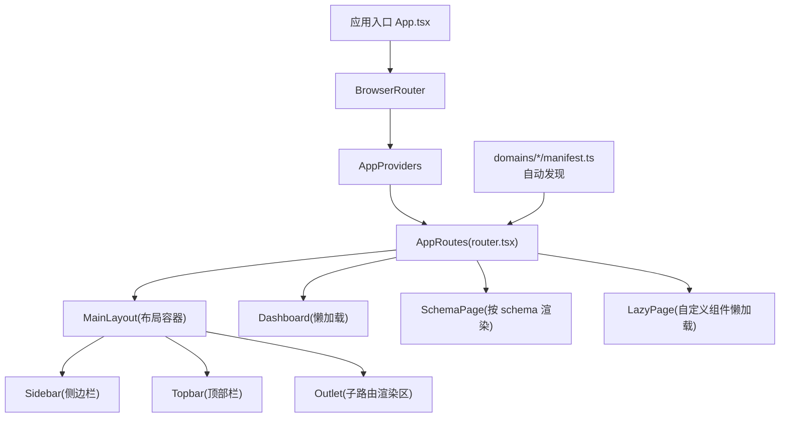
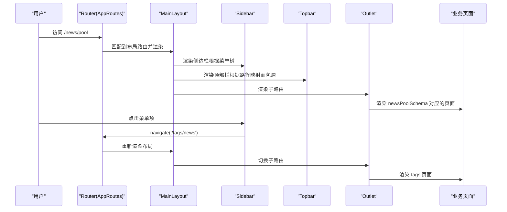
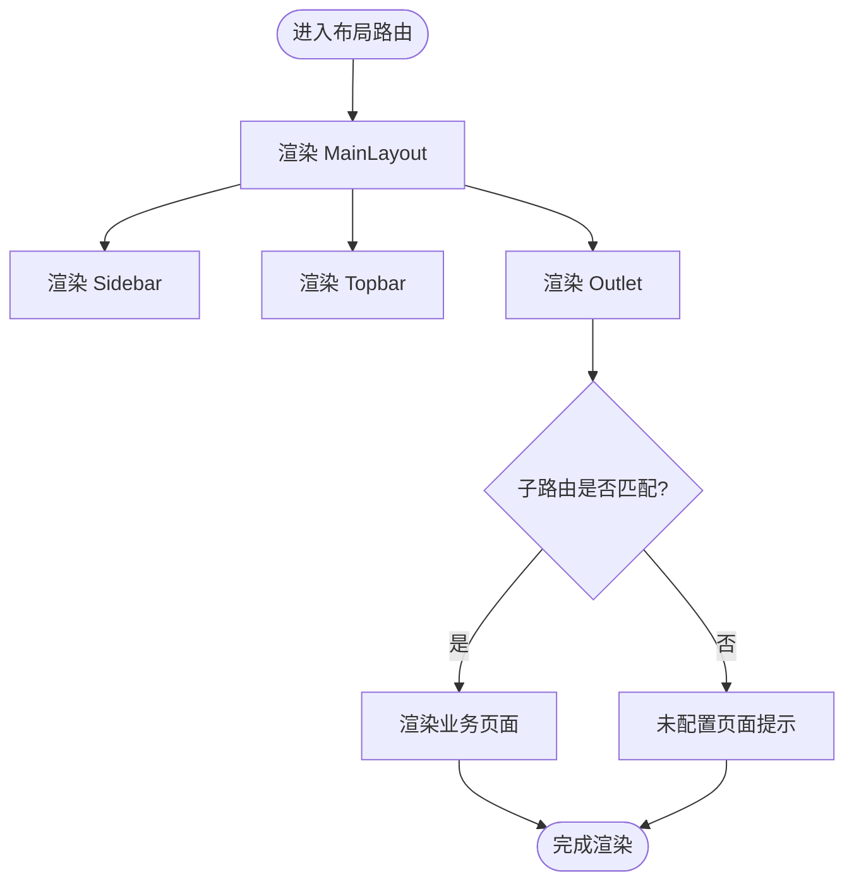
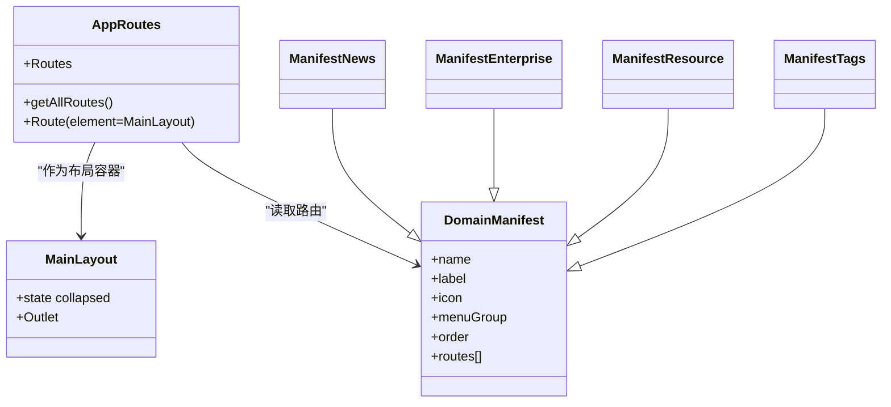
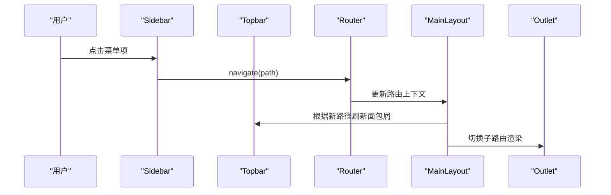
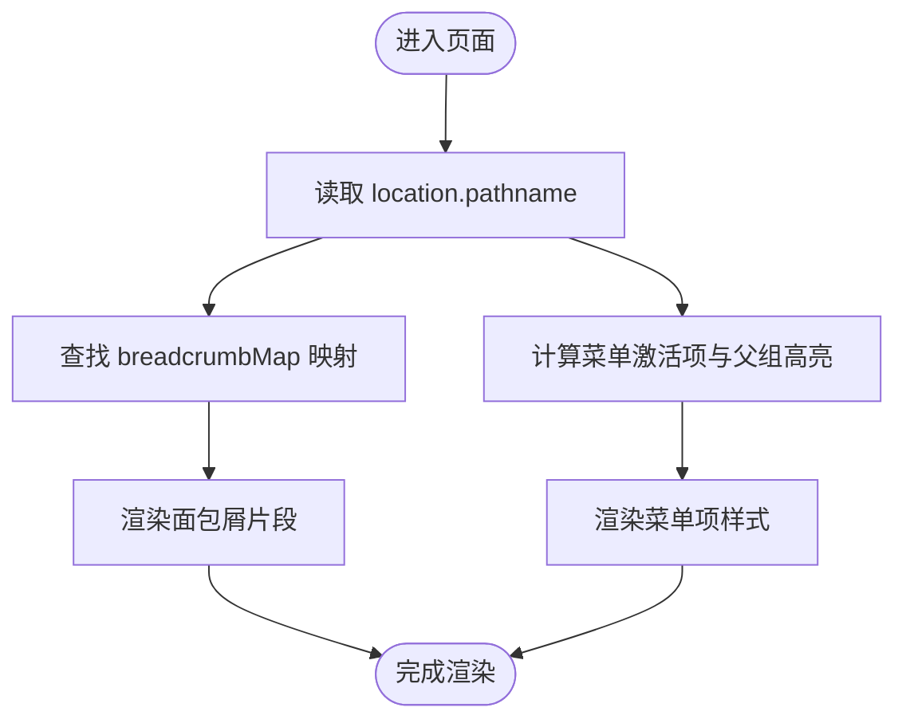
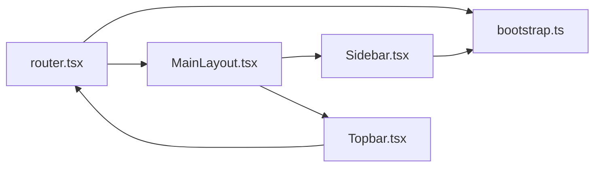

# 布局路由嵌套

<cite>
**本文引用的文件**
- [App.tsx](file://hj-admin/src/app/App.tsx)
- [router.tsx](file://hj-admin/src/app/router.tsx)
- [bootstrap.ts](file://hj-admin/src/app/bootstrap.ts)
- [MainLayout.tsx](file://hj-admin/src/layouts/MainLayout.tsx)
- [Sidebar.tsx](file://hj-admin/src/layouts/Sidebar.tsx)
- [Topbar.tsx](file://hj-admin/src/layouts/Topbar.tsx)
- [news/manifest.ts](file://hj-admin/src/domains/news/manifest.ts)
- [enterprise/manifest.ts](file://hj-admin/src/domains/enterprise/manifest.ts)
- [resource/manifest.ts](file://hj-admin/src/domains/resource/manifest.ts)
- [tags/manifest.ts](file://hj-admin/src/domains/tags/manifest.ts)
</cite>

## 目录
1. [简介](#简介)
2. [项目结构](#项目结构)
3. [核心组件](#核心组件)
4. [架构总览](#架构总览)
5. [详细组件分析](#详细组件分析)
6. [依赖关系分析](#依赖关系分析)
7. [性能与可维护性](#性能与可维护性)
8. [故障排查指南](#故障排查指南)
9. [结论](#结论)
10. [附录](#附录)

## 简介
本文件面向“氢界大数据平台”的布局与路由嵌套体系，围绕 MainLayout 作为路由容器的设计模式展开，系统阐述：
- 根路由、布局路由与业务路由的关系
- 子路由的动态渲染与生命周期管理
- 侧边栏、顶部栏与内容区域的协同机制
- 面包屑导航与激活状态的路由状态同步
- 响应式布局在移动端与桌面端的适配策略

该方案基于 React Router v6 的嵌套路由能力，结合“域清单自动发现 + Schema 驱动页面”的架构，实现新增域即自动生成路由与菜单，降低维护成本并提升扩展性。

## 项目结构
整体采用“应用编排 + 布局容器 + 领域清单驱动”的分层组织方式：
- 应用编排层：提供 BrowserRouter、Provider 链与顶层路由入口
- 布局容器层：MainLayout 作为统一外壳，承载 Sidebar、Topbar 与 Outlet 内容区
- 路由生成层：从各域的 manifest 自动收集路由，动态构建 Routes
- 领域层：每个 domain 通过 manifest 声明路由、菜单分组、Schema 或懒加载组件

图表来源
- [App.tsx:1-21](file://hj-admin/src/app/App.tsx#L1-L21)
- [router.tsx:1-58](file://hj-admin/src/app/router.tsx#L1-L58)
- [bootstrap.ts:1-104](file://hj-admin/src/app/bootstrap.ts#L1-L104)
- [MainLayout.tsx:1-23](file://hj-admin/src/layouts/MainLayout.tsx#L1-L23)

章节来源
- [App.tsx:1-21](file://hj-admin/src/app/App.tsx#L1-L21)
- [router.tsx:1-58](file://hj-admin/src/app/router.tsx#L1-L58)
- [bootstrap.ts:1-104](file://hj-admin/src/app/bootstrap.ts#L1-L104)

## 核心组件
- 应用入口与路由挂载
  - 使用 BrowserRouter 包裹全局路由上下文
  - 通过 AppProviders 注入数据与特性上下文
  - 暴露 AppRoutes 作为路由树根节点
- 布局容器 MainLayout
  - 作为嵌套路由的父级元素，内部包含 Sidebar、Topbar 与 Outlet
  - 通过 state 控制侧边栏折叠状态，影响布局宽度与交互
- 侧边栏 Sidebar
  - 从 bootstrap 的 buildMenuTree() 构建菜单树
  - 根据当前 location.pathname 计算激活项与父组高亮
  - 点击菜单项触发 navigate 跳转
- 顶部栏 Topbar
  - 基于 breadcrumbMap 将 pathname 映射为多级面包屑文本
  - 支持点击面包屑片段进行快速导航
- 路由生成器 AppRoutes
  - 读取 getAllRoutes() 汇总所有域清单中的路由
  - 对带 schema 的路由使用 SchemaPage 渲染
  - 对无 schema 的路由使用 LazyPage 懒加载自定义组件
  - 兜底重定向到 /dashboard

章节来源
- [App.tsx:1-21](file://hj-admin/src/app/App.tsx#L1-L21)
- [MainLayout.tsx:1-23](file://hj-admin/src/layouts/MainLayout.tsx#L1-L23)
- [Sidebar.tsx:1-156](file://hj-admin/src/layouts/Sidebar.tsx#L1-L156)
- [Topbar.tsx:1-66](file://hj-admin/src/layouts/Topbar.tsx#L1-L66)
- [router.tsx:1-58](file://hj-admin/src/app/router.tsx#L1-L58)
- [bootstrap.ts:1-104](file://hj-admin/src/app/bootstrap.ts#L1-L104)

## 架构总览
下图展示“根路由 → 布局路由 → 业务路由”的层级结构与渲染流程。

图表来源
- [router.tsx:25-57](file://hj-admin/src/app/router.tsx#L25-L57)
- [MainLayout.tsx:6-20](file://hj-admin/src/layouts/MainLayout.tsx#L6-L20)
- [Sidebar.tsx:15-107](file://hj-admin/src/layouts/Sidebar.tsx#L15-L107)
- [Topbar.tsx:20-62](file://hj-admin/src/layouts/Topbar.tsx#L20-L62)

## 详细组件分析

### 布局容器 MainLayout 的设计模式
- 角色定位
  - 作为“布局路由”的载体，负责维持全局 UI 框架（侧边栏、顶部栏、内容区）
  - 通过 <Outlet /> 承接子路由渲染，形成父子路由的视觉与逻辑边界
- 关键职责
  - 管理侧边栏折叠状态，影响布局宽度与交互体验
  - 提供统一的背景色、字体、行高与滚动区域样式
- 生命周期与渲染
  - 当子路由变化时，MainLayout 保持自身不卸载，仅更新 Outlet 内的子组件
  - 适合放置需要跨页面共享的状态（如折叠态、主题等）

图表来源
- [MainLayout.tsx:6-20](file://hj-admin/src/layouts/MainLayout.tsx#L6-L20)
- [router.tsx:29-55](file://hj-admin/src/app/router.tsx#L29-L55)

章节来源
- [MainLayout.tsx:1-23](file://hj-admin/src/layouts/MainLayout.tsx#L1-L23)
- [router.tsx:25-57](file://hj-admin/src/app/router.tsx#L25-L57)

### 嵌套路由的实现机制
- 根路由与布局路由
  - AppRoutes 中定义一个以 MainLayout 为 element 的 Route，作为布局容器
  - 其子 Route 即为业务路由，全部在 MainLayout 的 Outlet 内渲染
- 自动路由生成
  - 通过 getAllRoutes() 聚合 domains/*/manifest.ts 中的 routes 数组
  - 有 schema 的路由走 SchemaPage；无 schema 且指定 component 的走 LazyPage
  - 兜底路由重定向至 /dashboard
- 典型路由示例
  - 资讯域：/news/pool、/news/published、/news/sources、/news/edit/:id
  - 企业库：/enterprise/pool、/enterprise/confirmed、/enterprise/edit/:id
  - 资源位：/resource/banner、/resource/icon、/resource/promotion
  - 标签管理：/tags/news、/tags/enterprise

图表来源
- [router.tsx:25-57](file://hj-admin/src/app/router.tsx#L25-L57)
- [bootstrap.ts:20-22](file://hj-admin/src/app/bootstrap.ts#L20-L22)
- [news/manifest.ts:11-41](file://hj-admin/src/domains/news/manifest.ts#L11-L41)
- [enterprise/manifest.ts:6-19](file://hj-admin/src/domains/enterprise/manifest.ts#L6-L19)
- [resource/manifest.ts:11-21](file://hj-admin/src/domains/resource/manifest.ts#L11-L21)
- [tags/manifest.ts:10-20](file://hj-admin/src/domains/tags/manifest.ts#L10-L20)

章节来源
- [router.tsx:1-58](file://hj-admin/src/app/router.tsx#L1-L58)
- [bootstrap.ts:1-104](file://hj-admin/src/app/bootstrap.ts#L1-L104)
- [news/manifest.ts:1-42](file://hj-admin/src/domains/news/manifest.ts#L1-L42)
- [enterprise/manifest.ts:1-20](file://hj-admin/src/domains/enterprise/manifest.ts#L1-L20)
- [resource/manifest.ts:1-22](file://hj-admin/src/domains/resource/manifest.ts#L1-L22)
- [tags/manifest.ts:1-21](file://hj-admin/src/domains/tags/manifest.ts#L1-L21)

### 子路由的动态渲染与生命周期管理
- 动态渲染
  - Schema 驱动的页面通过 SchemaPage 统一渲染，减少样板代码
  - 自定义页面通过 LazyPage 懒加载，按需引入，减小首屏体积
- 生命周期
  - 子路由切换时，MainLayout 不卸载，避免重复初始化全局布局
  - 子组件随路由挂载/卸载而创建/销毁，适合做数据请求与副作用清理
- 错误与空状态
  - 未配置页面的路由会显示占位提示
  - 懒加载过程通过 Suspense 与 Spin 提供加载反馈

章节来源
- [router.tsx:16-51](file://hj-admin/src/app/router.tsx#L16-L51)

### 布局切换与区域协调（侧边栏、顶部栏、内容区）
- 侧边栏
  - 通过 collapsed 状态控制宽度与内容可见性
  - 菜单项点击调用 navigate 进行路由跳转
  - 根据 location.pathname 计算激活项与父组高亮
- 顶部栏
  - 基于 breadcrumbMap 将路径映射为多级面包屑
  - 支持点击面包屑片段跳转到对应一级页
- 内容区
  - 使用 flex 布局与 overflowY 控制滚动区域
  - Outlet 渲染子路由，保证布局稳定与内容独立滚动

图表来源
- [Sidebar.tsx:15-107](file://hj-admin/src/layouts/Sidebar.tsx#L15-L107)
- [Topbar.tsx:20-62](file://hj-admin/src/layouts/Topbar.tsx#L20-L62)
- [MainLayout.tsx:6-20](file://hj-admin/src/layouts/MainLayout.tsx#L6-L20)
- [router.tsx:29-55](file://hj-admin/src/app/router.tsx#L29-L55)

章节来源
- [Sidebar.tsx:1-156](file://hj-admin/src/layouts/Sidebar.tsx#L1-L156)
- [Topbar.tsx:1-66](file://hj-admin/src/layouts/Topbar.tsx#L1-L66)
- [MainLayout.tsx:1-23](file://hj-admin/src/layouts/MainLayout.tsx#L1-L23)

### 路由状态同步机制（面包屑与激活状态）
- 面包屑导航
  - Topbar 通过 useLocation 获取当前路径，查找 breadcrumbMap 得到多级文本
  - 点击面包屑片段执行条件化 navigate，返回上一级或列表页
- 激活状态管理
  - Sidebar 通过 isActive 与 isParentActive 判断当前路径与父组是否激活
  - 根据激活状态改变边框颜色、背景与文字权重，提供清晰视觉反馈

图表来源
- [Topbar.tsx:20-62](file://hj-admin/src/layouts/Topbar.tsx#L20-L62)
- [Sidebar.tsx:25-107](file://hj-admin/src/layouts/Sidebar.tsx#L25-L107)

章节来源
- [Topbar.tsx:1-66](file://hj-admin/src/layouts/Topbar.tsx#L1-L66)
- [Sidebar.tsx:1-156](file://hj-admin/src/layouts/Sidebar.tsx#L1-L156)

### 响应式布局的路由适配
- 现状说明
  - 当前布局使用固定宽度与最小宽度控制侧边栏，未内置断点监听
- 建议方案
  - 在 MainLayout 中增加窗口尺寸监听，在小屏下默认收起侧边栏
  - 在 Sidebar 中根据屏幕宽度调整交互行为（例如点击遮罩关闭）
  - 在 Topbar 中针对小屏隐藏次要操作按钮，保留关键信息
  - 在路由层面，确保移动端优先的页面内容与交互顺序

[本节为通用指导，不涉及具体文件分析]

## 依赖关系分析
- 模块耦合
  - router.tsx 依赖 bootstrap.ts 提供的 getAllRoutes()
  - MainLayout 依赖 react-router-dom 的 Outlet
  - Sidebar 依赖 bootstrap.ts 的 buildMenuTree() 与 react-router-dom 的 useNavigate/useLocation
  - Topbar 依赖 useLocation 与本地面包屑映射表
- 外部依赖
  - react-router-dom：路由上下文、导航与位置监听
  - antd：Spin、Badge 等基础组件
- 潜在风险
  - breadcrumbMap 与路由路径需保持一致，新增路由应同步更新
  - 菜单树与路由清单需一一对应，避免菜单不可达或死链

图表来源
- [router.tsx:1-58](file://hj-admin/src/app/router.tsx#L1-L58)
- [bootstrap.ts:1-104](file://hj-admin/src/app/bootstrap.ts#L1-L104)
- [MainLayout.tsx:1-23](file://hj-admin/src/layouts/MainLayout.tsx#L1-L23)
- [Sidebar.tsx:1-156](file://hj-admin/src/layouts/Sidebar.tsx#L1-L156)
- [Topbar.tsx:1-66](file://hj-admin/src/layouts/Topbar.tsx#L1-L66)

章节来源
- [router.tsx:1-58](file://hj-admin/src/app/router.tsx#L1-L58)
- [bootstrap.ts:1-104](file://hj-admin/src/app/bootstrap.ts#L1-L104)
- [MainLayout.tsx:1-23](file://hj-admin/src/layouts/MainLayout.tsx#L1-L23)
- [Sidebar.tsx:1-156](file://hj-admin/src/layouts/Sidebar.tsx#L1-L156)
- [Topbar.tsx:1-66](file://hj-admin/src/layouts/Topbar.tsx#L1-L66)

## 性能与可维护性
- 性能优化
  - 使用 lazy + Suspense 对非首屏页面进行懒加载，降低初始包体
  - 菜单树通过 useMemo 缓存，避免每次渲染重复计算
- 可维护性
  - 新增域只需在 domains/* 下添加 manifest，即可自动生成路由与菜单
  - 面包屑与菜单均与路由清单解耦，便于独立维护

章节来源
- [router.tsx:16-51](file://hj-admin/src/app/router.tsx#L16-L51)
- [bootstrap.ts:40-103](file://hj-admin/src/app/bootstrap.ts#L40-L103)

## 故障排查指南
- 面包屑不显示或错乱
  - 检查 breadcrumbMap 是否包含当前路径
  - 确认路径大小写与斜杠是否与 manifest 一致
- 菜单无法点击或无高亮
  - 核对 menuGroup 与 label 是否与 manifest 一致
  - 检查 hideInMenu 是否误设为 true
- 页面未配置或空白
  - 确认路由是否同时提供 schema 或 component
  - 查看控制台是否有懒加载失败或模块缺失的错误
- 路由重定向异常
  - 检查通配符路由是否覆盖预期路径
  - 确认 Navigate 的 replace 参数是否符合预期

章节来源
- [Topbar.tsx:20-62](file://hj-admin/src/layouts/Topbar.tsx#L20-L62)
- [router.tsx:39-53](file://hj-admin/src/app/router.tsx#L39-L53)

## 结论
本方案以 MainLayout 为核心布局容器，结合 React Router 的嵌套路由与“域清单自动发现”，实现了：
- 清晰的根路由、布局路由与业务路由分层
- 子路由的动态渲染与稳定的生命周期管理
- 侧边栏、顶部栏与内容区的协同联动
- 面包屑与激活状态的路由状态同步
- 可扩展的响应式布局适配策略

该架构具备良好的扩展性与可维护性，适合持续演进的大型后台系统。

## 附录
- 相关类型与接口
  - MenuGroup、MenuGroupItem：用于构建菜单树的数据结构
  - DomainManifest：域清单的类型定义，包含 name、label、icon、menuGroup、order、routes 等字段

章节来源
- [bootstrap.ts:24-38](file://hj-admin/src/app/bootstrap.ts#L24-L38)