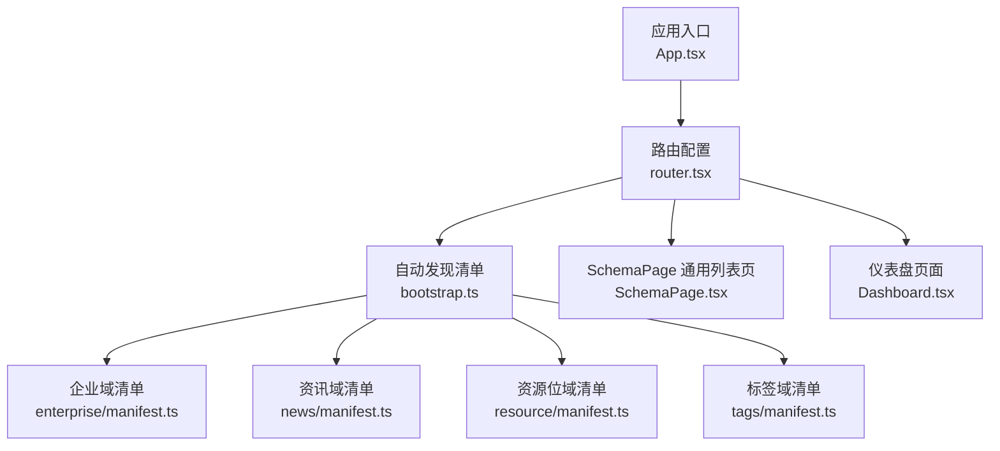
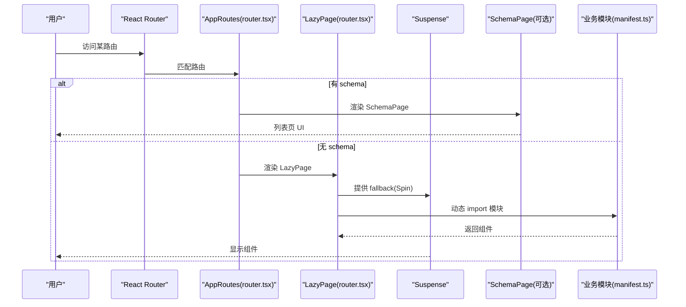
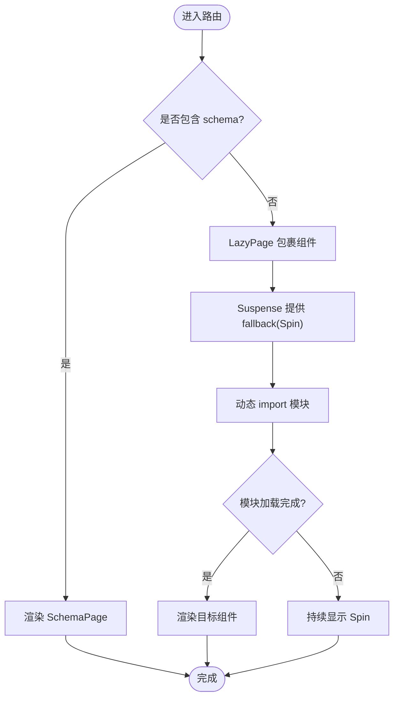
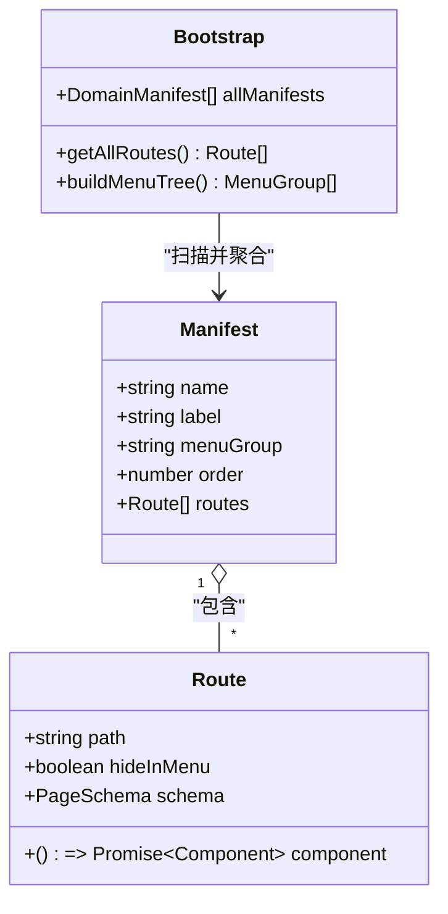
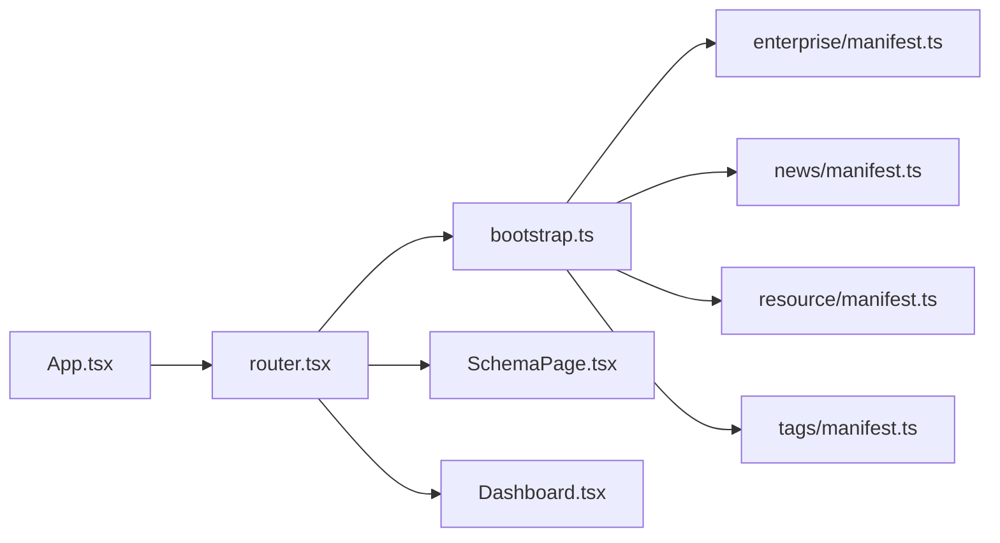

# 懒加载与代码分割

<cite>
**本文引用的文件**
- [App.tsx](file://hj-admin/src/app/App.tsx)
- [router.tsx](file://hj-admin/src/app/router.tsx)
- [bootstrap.ts](file://hj-admin/src/app/bootstrap.ts)
- [SchemaPage.tsx](file://hj-admin/src/shared/schema-engine/SchemaPage.tsx)
- [Dashboard.tsx](file://hj-admin/src/pages/dashboard/Dashboard.tsx)
- [enterprise/manifest.ts](file://hj-admin/src/domains/enterprise/manifest.ts)
- [news/manifest.ts](file://hj-admin/src/domains/news/manifest.ts)
- [resource/manifest.ts](file://hj-admin/src/domains/resource/manifest.ts)
- [tags/manifest.ts](file://hj-admin/src/domains/tags/manifest.ts)
- [vite.config.ts](file://hj-admin/vite.config.ts)
</cite>

## 目录
1. [简介](#简介)
2. [项目结构](#项目结构)
3. [核心组件](#核心组件)
4. [架构总览](#架构总览)
5. [详细组件分析](#详细组件分析)
6. [依赖关系分析](#依赖关系分析)
7. [性能考量](#性能考量)
8. [故障排查指南](#故障排查指南)
9. [结论](#结论)
10. [附录](#附录)

## 简介
本文件面向氢界大数据平台，系统化阐述“懒加载与代码分割”策略。重点包括：
- LazyPage 组件的实现原理与 Suspense 边界设置
- 模块级别的代码分割策略与按需加载业务域模块
- 加载状态管理与 Spin 集成、用户体验优化
- 性能监控方法（加载时间分析与内存使用优化）
- 预加载与缓存机制（路由预取与组件缓存）
- 错误边界处理与降级方案（网络异常时的体验保障）

## 项目结构
本项目采用“领域驱动 + 清单式路由”的组织方式：
- 应用入口与路由编排位于 app 层
- 各业务域在 domains 下以 manifest 声明路由、菜单、Schema
- 通用列表页由 SchemaPage 统一渲染
- 构建工具为 Vite，默认开启动态 import 的代码分割

图表来源
- [App.tsx:1-21](file://hj-admin/src/app/App.tsx#L1-L21)
- [router.tsx:1-58](file://hj-admin/src/app/router.tsx#L1-L58)
- [bootstrap.ts:1-104](file://hj-admin/src/app/bootstrap.ts#L1-L104)
- [enterprise/manifest.ts:1-20](file://hj-admin/src/domains/enterprise/manifest.ts#L1-L20)
- [news/manifest.ts:1-42](file://hj-admin/src/domains/news/manifest.ts#L1-L42)
- [resource/manifest.ts:1-22](file://hj-admin/src/domains/resource/manifest.ts#L1-L22)
- [tags/manifest.ts:1-21](file://hj-admin/src/domains/tags/manifest.ts#L1-L21)
- [SchemaPage.tsx:1-226](file://hj-admin/src/shared/schema-engine/SchemaPage.tsx#L1-L226)
- [Dashboard.tsx:1-105](file://hj-admin/src/pages/dashboard/Dashboard.tsx#L1-L105)

章节来源
- [App.tsx:1-21](file://hj-admin/src/app/App.tsx#L1-L21)
- [router.tsx:1-58](file://hj-admin/src/app/router.tsx#L1-L58)
- [bootstrap.ts:1-104](file://hj-admin/src/app/bootstrap.ts#L1-L104)

## 核心组件
- LazyPage：基于 React.lazy() 的轻量包装器，负责按路由触发模块加载并包裹 Suspense 边界，展示 Spin 加载态。
- AppRoutes：集中管理路由，根据清单生成路由表；对带 schema 的路由走 SchemaPage，否则走 LazyPage。
- bootstrap：利用 Vite 的 import.meta.glob 扫描所有域的 manifest，自动生成路由与菜单树。
- SchemaPage：通用列表页渲染器，通过 PageSchema 配置驱动筛选、Tab、表格、分页与操作列。
- Dashboard：作为常驻页面的示例，同样被 lazy 包裹以演示 Suspense 用法。

章节来源
- [router.tsx:1-58](file://hj-admin/src/app/router.tsx#L1-L58)
- [bootstrap.ts:1-104](file://hj-admin/src/app/bootstrap.ts#L1-L104)
- [SchemaPage.tsx:1-226](file://hj-admin/src/shared/schema-engine/SchemaPage.tsx#L1-L226)
- [Dashboard.tsx:1-105](file://hj-admin/src/pages/dashboard/Dashboard.tsx#L1-L105)

## 架构总览
下图展示了懒加载与代码分割在运行期的关键路径：从路由匹配到模块按需加载，再到 Suspense 边界渲染与 SchemaPage 渲染。

图表来源
- [router.tsx:1-58](file://hj-admin/src/app/router.tsx#L1-L58)
- [SchemaPage.tsx:1-226](file://hj-admin/src/shared/schema-engine/SchemaPage.tsx#L1-L226)
- [enterprise/manifest.ts:1-20](file://hj-admin/src/domains/enterprise/manifest.ts#L1-L20)
- [news/manifest.ts:1-42](file://hj-admin/src/domains/news/manifest.ts#L1-L42)
- [resource/manifest.ts:1-22](file://hj-admin/src/domains/resource/manifest.ts#L1-L22)
- [tags/manifest.ts:1-21](file://hj-admin/src/domains/tags/manifest.ts#L1-L21)

## 详细组件分析

### LazyPage 与 Suspense 边界
- 实现要点
  - 使用 React.lazy() 将 loader 函数延迟执行，仅在首次进入对应路由时触发模块加载。
  - 外层包裹 Suspense，fallback 使用 Ant Design 的 Spin 提供全局一致的加载反馈。
  - 每个路由可独立拥有自己的 Suspense 边界，避免单点阻塞影响其他区域。
- 使用模式
  - 对于自定义页面：在清单中通过 component 字段指向一个返回 Promise 的动态 import 表达式。
  - 对于 Schema 驱动的页面：直接传入 schema，由路由层渲染 SchemaPage，无需额外懒加载包装。
- 最佳实践
  - 保持 fallback 简洁且稳定，避免在 fallback 内发起重请求或复杂计算。
  - 若页面内部还有子模块需要懒加载，可在子组件内继续嵌套 Suspense，形成多级边界。

图表来源
- [router.tsx:1-58](file://hj-admin/src/app/router.tsx#L1-L58)
- [SchemaPage.tsx:1-226](file://hj-admin/src/shared/schema-engine/SchemaPage.tsx#L1-L226)

章节来源
- [router.tsx:1-58](file://hj-admin/src/app/router.tsx#L1-L58)

### 模块级代码分割与按需加载
- 清单式路由
  - 各域通过 manifest.ts 声明 routes，支持两种类型：
    - 带 schema：由 SchemaPage 统一渲染，适合标准 CRUD 场景。
    - 带 component：指向动态 import 表达式，实现模块级代码分割。
- 自动发现
  - bootstrap.ts 使用 import.meta.glob 扫描所有 domains/*/manifest.ts，在构建期收集清单并按 order 排序，运行时通过 getAllRoutes 输出路由表。
- 效果
  - 未访问的域不会参与首屏打包体积；首次进入时才下载对应 chunk。
  - 新增域只需添加 manifest，无需手动注册路由。

图表来源
- [bootstrap.ts:1-104](file://hj-admin/src/app/bootstrap.ts#L1-L104)
- [enterprise/manifest.ts:1-20](file://hj-admin/src/domains/enterprise/manifest.ts#L1-L20)
- [news/manifest.ts:1-42](file://hj-admin/src/domains/news/manifest.ts#L1-L42)
- [resource/manifest.ts:1-22](file://hj-admin/src/domains/resource/manifest.ts#L1-L22)
- [tags/manifest.ts:1-21](file://hj-admin/src/domains/tags/manifest.ts#L1-L21)

章节来源
- [bootstrap.ts:1-104](file://hj-admin/src/app/bootstrap.ts#L1-L104)
- [enterprise/manifest.ts:1-20](file://hj-admin/src/domains/enterprise/manifest.ts#L1-L20)
- [news/manifest.ts:1-42](file://hj-admin/src/domains/news/manifest.ts#L1-L42)
- [resource/manifest.ts:1-22](file://hj-admin/src/domains/resource/manifest.ts#L1-L22)
- [tags/manifest.ts:1-21](file://hj-admin/src/domains/tags/manifest.ts#L1-L21)

### 加载状态管理与用户体验优化
- 全局 Spin
  - 在 Suspense 的 fallback 中使用 Ant Design 的 Spin，确保加载态一致性与可感知性。
- 细粒度控制
  - 针对大页面或复杂交互，可在子组件内再套一层 Suspense，减少整体白屏时间。
- 交互建议
  - 在路由切换前可预取必要数据，降低“先加载组件后拉数据”的二次等待。
  - 对频繁访问的页面进行预加载（见“预加载与缓存”）。

章节来源
- [router.tsx:1-58](file://hj-admin/src/app/router.tsx#L1-L58)

### 性能监控方法
- 加载时间分析
  - 浏览器开发者工具的 Network 面板：观察 chunk 大小、TTFB、资源耗时。
  - Performance 面板：记录从路由切换到组件可见的时间线，定位瓶颈。
  - 自定义埋点：在动态 import 前后打点，统计首次加载时长与失败率。
- 内存使用优化
  - 避免在懒加载模块中持有全局大对象引用，防止 GC 无法回收。
  - 及时清理定时器、事件监听与订阅，避免内存泄漏。
  - 合理使用 useMemo/useCallback 减少重复计算与重渲染。
- 构建产物分析
  - 使用 Vite 插件或第三方工具分析 bundle 组成，识别冗余依赖与重复打包。

[本节为通用指导，不直接分析具体文件]

### 预加载与缓存机制
- 路由预取
  - 在用户悬停菜单项或即将导航时，提前调用对应的动态 import，使后续跳转几乎零等待。
  - 结合路由守卫或菜单点击事件，对高频页面进行预取。
- 组件缓存
  - 使用 React.memo 包裹纯展示型子组件，避免不必要的重渲染。
  - 对大型列表或图表组件，结合虚拟滚动与分页，降低 DOM 压力。
- 数据缓存
  - 在共享数据层（如 DataProvider）中对接口响应做短期缓存，配合失效策略减少重复请求。
- 浏览器缓存
  - 合理设置静态资源缓存头，利用版本化文件名提升缓存命中率。

[本节为通用指导，不直接分析具体文件]

### 错误边界处理与降级方案
- 组件级错误边界
  - 在关键页面或复杂子树外包裹错误边界组件，捕获渲染期错误并回退到友好提示。
- 网络异常降级
  - 对懒加载失败（如网络不可用）提供重试按钮与离线提示。
  - 在路由层增加兜底路由，跳转到首页或维护页。
- 渐进增强
  - 在弱网环境下优先展示骨架屏或精简版页面，待资源就绪后再逐步增强。

[本节为通用指导，不直接分析具体文件]

## 依赖关系分析
- 低耦合高内聚
  - 清单与路由解耦：manifest 仅描述路由元信息，实际渲染逻辑由 SchemaPage 或 LazyPage 承担。
  - 自动发现机制降低注册成本，新增域不影响现有路由系统。
- 外部依赖
  - React Router 负责路由匹配与导航。
  - Ant Design 提供 Spin、Table、Tabs 等 UI 能力。
  - Vite 提供动态 import 与构建期 glob 扫描能力。

图表来源
- [App.tsx:1-21](file://hj-admin/src/app/App.tsx#L1-L21)
- [router.tsx:1-58](file://hj-admin/src/app/router.tsx#L1-L58)
- [bootstrap.ts:1-104](file://hj-admin/src/app/bootstrap.ts#L1-L104)
- [SchemaPage.tsx:1-226](file://hj-admin/src/shared/schema-engine/SchemaPage.tsx#L1-L226)
- [Dashboard.tsx:1-105](file://hj-admin/src/pages/dashboard/Dashboard.tsx#L1-L105)
- [enterprise/manifest.ts:1-20](file://hj-admin/src/domains/enterprise/manifest.ts#L1-L20)
- [news/manifest.ts:1-42](file://hj-admin/src/domains/news/manifest.ts#L1-L42)
- [resource/manifest.ts:1-22](file://hj-admin/src/domains/resource/manifest.ts#L1-L22)
- [tags/manifest.ts:1-21](file://hj-admin/src/domains/tags/manifest.ts#L1-L21)

章节来源
- [App.tsx:1-21](file://hj-admin/src/app/App.tsx#L1-L21)
- [router.tsx:1-58](file://hj-admin/src/app/router.tsx#L1-L58)
- [bootstrap.ts:1-104](file://hj-admin/src/app/bootstrap.ts#L1-L104)

## 性能考量
- 首屏优化
  - 将非关键模块全部懒加载，仅保留必要的公共依赖与首屏组件。
  - 对超大依赖进行拆分或替换为更轻量的实现。
- 并发与优先级
  - 对关键路径（如主列表）优先加载，非关键路径延后或按需触发。
- 缓存策略
  - 对热点页面与常用 chunk 启用强缓存，缩短二次访问耗时。
- 监控与回归
  - 建立性能基线与告警，当 chunk 体积或加载时长超过阈值时触发回归检查。

[本节为通用指导，不直接分析具体文件]

## 故障排查指南
- 常见问题
  - 路由未生效：检查清单中的 path 是否与路由一致，确认 manifest 已被自动发现。
  - 页面空白：确认 Suspense fallback 是否正确渲染，查看控制台是否有模块加载失败的错误。
  - 列表不更新：检查 SchemaPage 的数据源与分页参数是否正确传递。
- 定位步骤
  - 打开 Network 面板，确认对应 chunk 是否成功下载。
  - 在 router.tsx 中打印路由表，验证 getAllRoutes 的输出是否符合预期。
  - 在 SchemaPage 中检查 useSchemaPage 的状态变化与请求链路。
- 恢复措施
  - 对懒加载失败提供重试入口与降级页面。
  - 对缺失的清单或路由进行补全，必要时临时回退到默认页。

章节来源
- [router.tsx:1-58](file://hj-admin/src/app/router.tsx#L1-L58)
- [bootstrap.ts:1-104](file://hj-admin/src/app/bootstrap.ts#L1-L104)
- [SchemaPage.tsx:1-226](file://hj-admin/src/shared/schema-engine/SchemaPage.tsx#L1-L226)

## 结论
通过清单式路由与 React.lazy/Suspense 的组合，氢界大数据平台实现了模块级的代码分割与按需加载。该策略显著降低了首屏体积，提升了路由切换体验。配合预加载、缓存与完善的错误边界，系统在弱网与异常场景下仍能提供稳定的用户体验。建议在后续迭代中持续完善性能监控与回归体系，进一步巩固懒加载带来的收益。

[本节为总结性内容，不直接分析具体文件]

## 附录
- 构建配置
  - Vite 默认支持动态 import 的代码分割，当前 vite.config.ts 已启用 React 插件，无需额外配置即可生效。
- 参考清单
  - 企业库、资讯库、资源位、标签管理等域均通过 manifest 声明路由，便于扩展与维护。

章节来源
- [vite.config.ts:1-8](file://hj-admin/vite.config.ts#L1-L8)
- [enterprise/manifest.ts:1-20](file://hj-admin/src/domains/enterprise/manifest.ts#L1-L20)
- [news/manifest.ts:1-42](file://hj-admin/src/domains/news/manifest.ts#L1-L42)
- [resource/manifest.ts:1-22](file://hj-admin/src/domains/resource/manifest.ts#L1-L22)
- [tags/manifest.ts:1-21](file://hj-admin/src/domains/tags/manifest.ts#L1-L21)