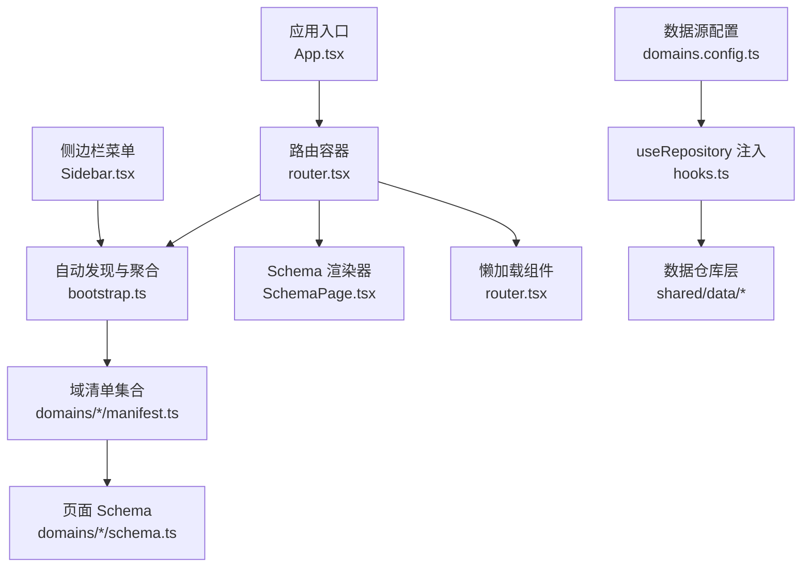
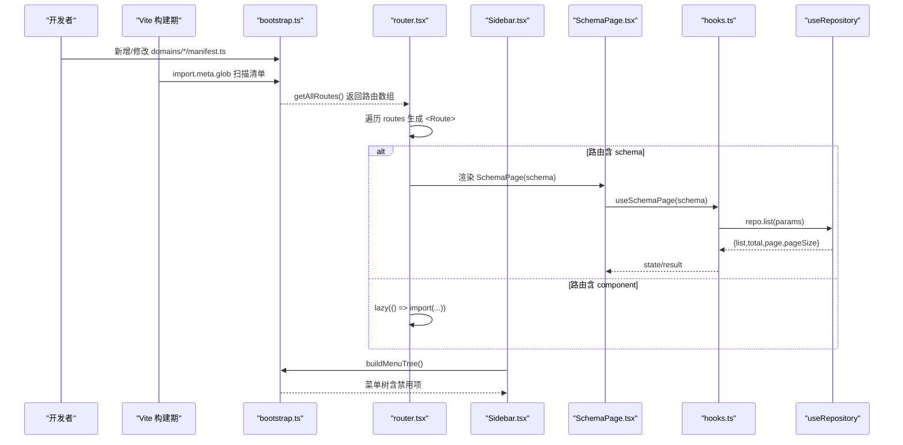
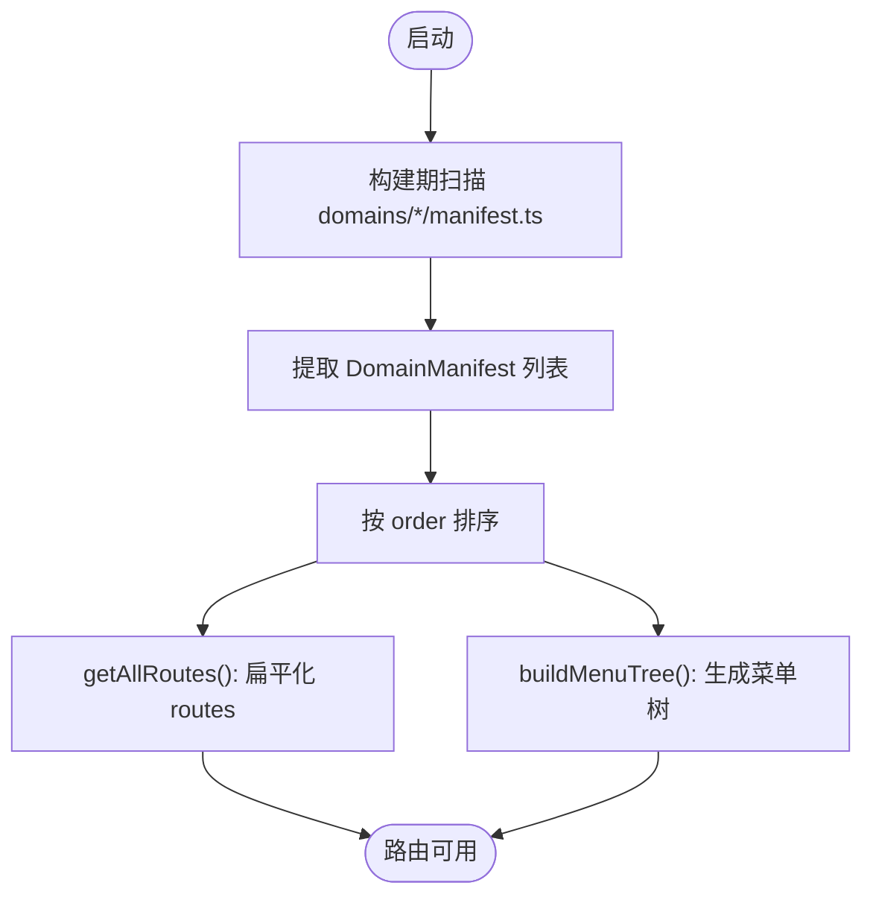
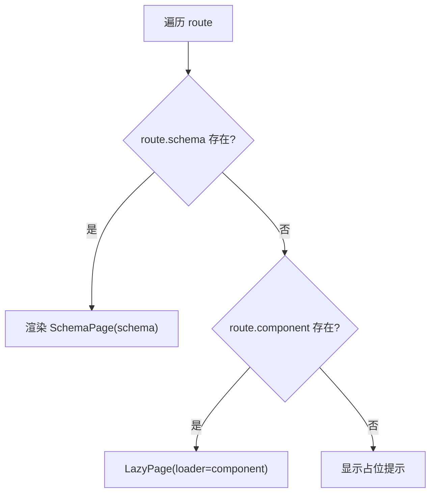
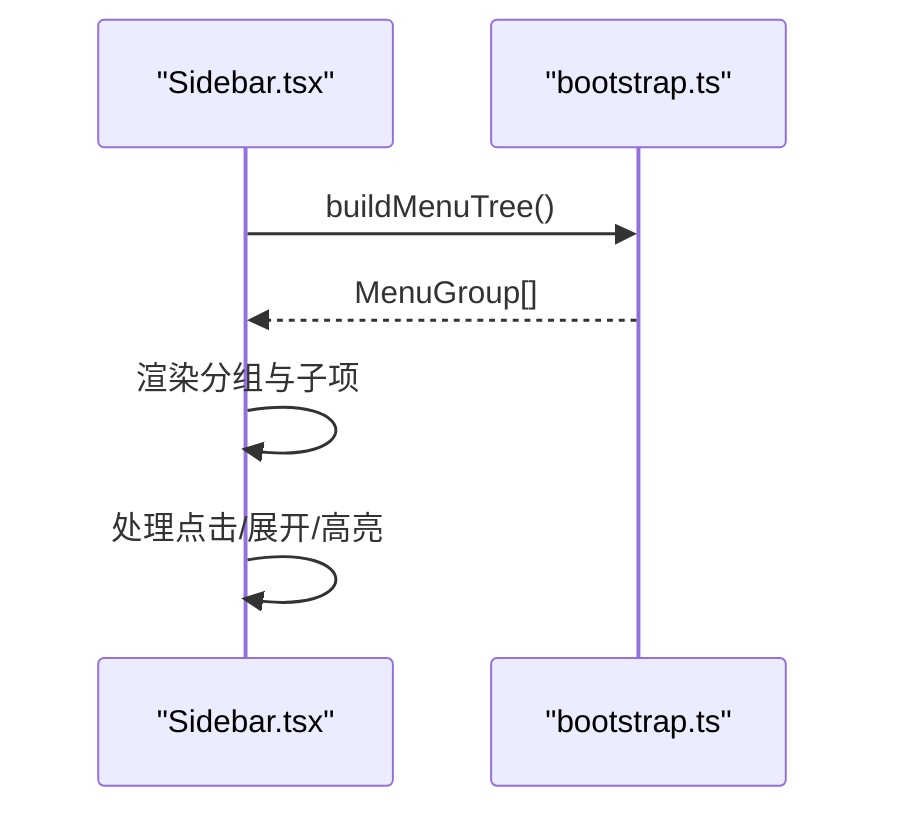
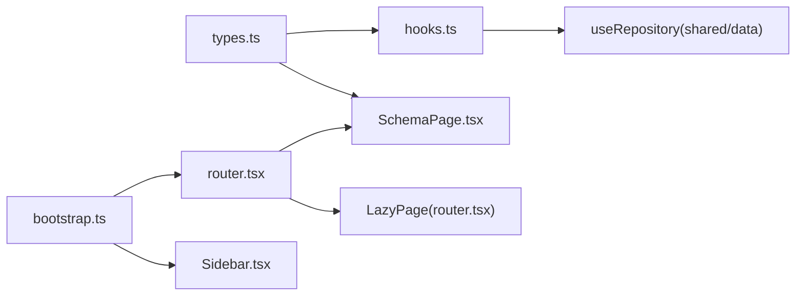

# 自动路由生成机制

<cite>
**本文引用的文件**   
- [router.tsx](file://hj-admin/src/app/router.tsx)
- [bootstrap.ts](file://hj-admin/src/app/bootstrap.ts)
- [App.tsx](file://hj-admin/src/app/App.tsx)
- [SchemaPage.tsx](file://hj-admin/src/shared/schema-engine/SchemaPage.tsx)
- [hooks.ts](file://hj-admin/src/shared/schema-engine/hooks.ts)
- [types.ts](file://hj-admin/src/shared/schema-engine/types.ts)
- [Sidebar.tsx](file://hj-admin/src/layouts/Sidebar.tsx)
- [domains.config.ts](file://hj-admin/src/config/domains.config.ts)
- [manifest.ts（企业域）](file://hj-admin/src/domains/enterprise/manifest.ts)
- [schema.ts（企业域）](file://hj-admin/src/domains/enterprise/schema.ts)
- [manifest.ts（资讯域）](file://hj-admin/src/domains/news/manifest.ts)
- [schema.ts（资讯域）](file://hj-admin/src/domains/news/schema.ts)
- [manifest.ts（资源位域）](file://hj-admin/src/domains/resource/manifest.ts)
- [manifest.ts（标签域）](file://hj-admin/src/domains/tags/manifest.ts)
</cite>

## 目录
1. [简介](#简介)
2. [项目结构](#项目结构)
3. [核心组件](#核心组件)
4. [架构总览](#架构总览)
5. [详细组件分析](#详细组件分析)
6. [依赖关系分析](#依赖关系分析)
7. [性能考量](#性能考量)
8. [故障排查指南](#故障排查指南)
9. [结论](#结论)
10. [附录](#附录)

## 简介
本文件面向氢界大数据平台的“自动路由生成机制”，系统性阐述如何从 DomainManifest 配置中动态提取路由信息，包括路径解析、菜单项生成与权限预留。重点解释 getAllRoutes() 的工作原理，展示声明式路由配置方式，提供 RouteConfig/PageSchema 类型定义与使用示例，说明 SchemaPage 与自定义组件的路由区分逻辑、何时使用 schema 渲染器、何时使用懒加载组件，并给出路由优先级处理与冲突解决策略。

## 项目结构
该功能围绕以下关键模块展开：
- 应用入口与路由挂载：App.tsx、router.tsx
- 自动发现与清单聚合：bootstrap.ts
- 页面渲染引擎：SchemaPage.tsx、hooks.ts、types.ts
- 侧边栏菜单驱动：Sidebar.tsx
- 数据源模式切换：domains.config.ts
- 各域清单与 Schema：domains/*/manifest.ts、domains/*/schema.ts



图示来源
- [App.tsx:1-21](file://hj-admin/src/app/App.tsx#L1-L21)
- [router.tsx:1-58](file://hj-admin/src/app/router.tsx#L1-L58)
- [bootstrap.ts:1-104](file://hj-admin/src/app/bootstrap.ts#L1-L104)
- [SchemaPage.tsx:1-226](file://hj-admin/src/shared/schema-engine/SchemaPage.tsx#L1-L226)
- [hooks.ts:1-106](file://hj-admin/src/shared/schema-engine/hooks.ts#L1-L106)
- [Sidebar.tsx:1-156](file://hj-admin/src/layouts/Sidebar.tsx#L1-L156)
- [domains.config.ts:1-18](file://hj-admin/src/config/domains.config.ts#L1-L18)

章节来源
- [App.tsx:1-21](file://hj-admin/src/app/App.tsx#L1-L21)
- [router.tsx:1-58](file://hj-admin/src/app/router.tsx#L1-L58)
- [bootstrap.ts:1-104](file://hj-admin/src/app/bootstrap.ts#L1-L104)

## 核心组件
- 自动发现与聚合（bootstrap.ts）
  - 构建时扫描所有 domains/*/manifest.ts，导出 allManifests 与 getAllRoutes()
  - buildMenuTree() 将清单转换为菜单树，支持分组、禁用项、子菜单
- 路由装配（router.tsx）
  - 调用 getAllRoutes() 生成 React Router 的 <Route> 列表
  - 有 schema 则走 SchemaPage；无 schema 但有 component 则懒加载；否则占位提示
- 页面渲染引擎（SchemaPage.tsx + hooks.ts + types.ts）
  - 基于 PageSchema 自动生成筛选栏、Tab、表格、分页、行操作等
  - useSchemaPage 封装状态与数据请求，结合 useRepository 完成数据获取
- 菜单驱动（Sidebar.tsx）
  - 通过 buildMenuTree() 渲染侧边栏，支持禁用项与未来批次占位
- 数据源模式（domains.config.ts）
  - 统一配置每个域的数据源模式（mock/http），便于后端接入后平滑切换

章节来源
- [bootstrap.ts:1-104](file://hj-admin/src/app/bootstrap.ts#L1-L104)
- [router.tsx:1-58](file://hj-admin/src/app/router.tsx#L1-L58)
- [SchemaPage.tsx:1-226](file://hj-admin/src/shared/schema-engine/SchemaPage.tsx#L1-L226)
- [hooks.ts:1-106](file://hj-admin/src/shared/schema-engine/hooks.ts#L1-L106)
- [types.ts:1-216](file://hj-admin/src/shared/schema-engine/types.ts#L1-L216)
- [Sidebar.tsx:1-156](file://hj-admin/src/layouts/Sidebar.tsx#L1-L156)
- [domains.config.ts:1-18](file://hj-admin/src/config/domains.config.ts#L1-L18)

## 架构总览
自动路由生成的整体流程如下：



图示来源
- [bootstrap.ts:1-104](file://hj-admin/src/app/bootstrap.ts#L1-L104)
- [router.tsx:1-58](file://hj-admin/src/app/router.tsx#L1-L58)
- [SchemaPage.tsx:1-226](file://hj-admin/src/shared/schema-engine/SchemaPage.tsx#L1-L226)
- [hooks.ts:1-106](file://hj-admin/src/shared/schema-engine/hooks.ts#L1-L106)
- [Sidebar.tsx:1-156](file://hj-admin/src/layouts/Sidebar.tsx#L1-L156)

## 详细组件分析

### 自动发现与路由聚合（bootstrap.ts）
- 构建期扫描
  - 使用 import.meta.glob 在构建时收集所有 domains/*/manifest.ts 模块
  - 提取默认导出的 DomainManifest，并按 order 排序
- 路由提取
  - getAllRoutes() 将所有 manifest.routes 扁平化输出，供 router.tsx 直接渲染
- 菜单构建
  - buildMenuTree() 按 menuGroup 分组，合并启用的菜单项与硬编码的禁用项
  - 支持 collapsible、dot、badge 等元信息，用于侧边栏展示



图示来源
- [bootstrap.ts:1-104](file://hj-admin/src/app/bootstrap.ts#L1-L104)

章节来源
- [bootstrap.ts:1-104](file://hj-admin/src/app/bootstrap.ts#L1-L104)

### 路由装配与渲染决策（router.tsx）
- 入口
  - AppRoutes 调用 getAllRoutes() 获取路由数组
- 渲染决策
  - 若 route.schema 存在 → 使用 <SchemaPage schema={...}/> 渲染
  - 若 route.component 存在 → 使用 LazyPage 包裹懒加载组件
  - 否则显示“页面未配置”占位
- 兜底
  - 通配符 * 重定向到 /dashboard



图示来源
- [router.tsx:1-58](file://hj-admin/src/app/router.tsx#L1-L58)

章节来源
- [router.tsx:1-58](file://hj-admin/src/app/router.tsx#L1-L58)

### 页面渲染引擎（SchemaPage.tsx + hooks.ts + types.ts）
- 类型体系（types.ts）
  - RouteDef：声明式路由定义，包含 path、label、schema/component/hideInMenu
  - DomainManifest：域清单，包含 name、label、icon、menuGroup、order、collapsible、dot、routes 等
  - PageSchema：页面级配置，包含 filters、columns、rowKey、pagination、rowActions、batchActions、toolbarActions、modals、tabs、quickFilters 等
- 状态与数据（hooks.ts）
  - useSchemaPage 管理 loading、data、total、page、pageSize、filters、activeTab、selectedRowKeys
  - 通过 useRepository(schema.entity) 发起 list 请求，支持分页与筛选参数
- 渲染（SchemaPage.tsx）
  - 根据 PageSchema 自动生成筛选栏、Tab、工具栏、表格、分页、行操作列
  - 支持 render 为字符串引用注册表渲染器或自定义函数
  - 行操作支持 navigateTo 替换 :id 进行声明式导航

```mermaid
classDiagram
class RouteDef {
+string path
+string label
+PageSchema? schema
+() => Promise~{default : Component}~? component
+boolean? hideInMenu
}
class DomainManifest {
+string name
+string label
+string? icon
+string menuGroup
+number order
+boolean? collapsible
+boolean? dot
+RouteDef[] routes
+boolean? disabled
+string? badge
}
class PageSchema {
+string id
+string title
+string? description
+string entity
+FilterField[] filters
+ColumnDef[] columns
+string rowKey
+number? scrollX
+Pagination pagination
+RowAction[] rowActions
+BatchAction[] batchActions
+ToolbarAction[] toolbarActions
+ModalDef[] modals
+TabDef[] tabs
+QuickFilters quickFilters
}
DomainManifest --> RouteDef : "包含"
RouteDef --> PageSchema : "可选"
```

图示来源
- [types.ts:1-216](file://hj-admin/src/shared/schema-engine/types.ts#L1-L216)

章节来源
- [types.ts:1-216](file://hj-admin/src/shared/schema-engine/types.ts#L1-L216)
- [hooks.ts:1-106](file://hj-admin/src/shared/schema-engine/hooks.ts#L1-L106)
- [SchemaPage.tsx:1-226](file://hj-admin/src/shared/schema-engine/SchemaPage.tsx#L1-L226)

### 菜单生成与侧边栏（Sidebar.tsx + bootstrap.ts）
- 菜单来源
  - 从 buildMenuTree() 获取分组后的菜单树
- 交互与样式
  - 支持折叠/展开、高亮当前项、禁用项展示与占位徽章
- 扩展点
  - 禁用项以硬编码形式保留，便于后续批次逐步启用



图示来源
- [Sidebar.tsx:1-156](file://hj-admin/src/layouts/Sidebar.tsx#L1-L156)
- [bootstrap.ts:1-104](file://hj-admin/src/app/bootstrap.ts#L1-L104)

章节来源
- [Sidebar.tsx:1-156](file://hj-admin/src/layouts/Sidebar.tsx#L1-L156)
- [bootstrap.ts:1-104](file://hj-admin/src/app/bootstrap.ts#L1-L104)

### 数据源模式切换（domains.config.ts）
- 作用
  - 集中配置各域的数据源模式（mock/http）
- 影响范围
  - 配合 useRepository 与 DataProvider 实现零改动切换后端 API

章节来源
- [domains.config.ts:1-18](file://hj-admin/src/config/domains.config.ts#L1-L18)

### 域清单与 Schema 示例
- 企业域
  - manifest.ts：定义 name、label、menuGroup、order、routes（含 schema 与 component 两种）
  - schema.ts：定义待处理池与已确认企业的 PageSchema（筛选、列、行操作、Tab）
- 资讯域
  - manifest.ts：定义资讯池、已发布、数据源管理与编辑页路由
  - schema.ts：定义对应 PageSchema（含快速筛选、状态色映射、行操作可见性）
- 资源位域与标签域
  - manifest.ts：分别注册 Banner/Icon/推广活动与资讯/企业标签的页面路由

章节来源
- [manifest.ts（企业域）:1-20](file://hj-admin/src/domains/enterprise/manifest.ts#L1-L20)
- [schema.ts（企业域）:1-64](file://hj-admin/src/domains/enterprise/schema.ts#L1-L64)
- [manifest.ts（资讯域）:1-42](file://hj-admin/src/domains/news/manifest.ts#L1-L42)
- [schema.ts（资讯域）:1-123](file://hj-admin/src/domains/news/schema.ts#L1-L123)
- [manifest.ts（资源位域）:1-22](file://hj-admin/src/domains/resource/manifest.ts#L1-L22)
- [manifest.ts（标签域）:1-21](file://hj-admin/src/domains/tags/manifest.ts#L1-L21)

## 依赖关系分析
- 低耦合
  - 路由装配仅依赖 getAllRoutes() 的输出，不关心具体域实现
  - 菜单渲染仅依赖 buildMenuTree() 的输出
- 内聚性
  - Schema 渲染引擎集中在 shared/schema-engine 下，类型、状态、渲染分离清晰
- 外部依赖
  - React Router 负责路由匹配与导航
  - Ant Design 提供 UI 组件
  - Vite import.meta.glob 负责构建期扫描



图示来源
- [types.ts:1-216](file://hj-admin/src/shared/schema-engine/types.ts#L1-L216)
- [hooks.ts:1-106](file://hj-admin/src/shared/schema-engine/hooks.ts#L1-L106)
- [SchemaPage.tsx:1-226](file://hj-admin/src/shared/schema-engine/SchemaPage.tsx#L1-L226)
- [bootstrap.ts:1-104](file://hj-admin/src/app/bootstrap.ts#L1-L104)
- [router.tsx:1-58](file://hj-admin/src/app/router.tsx#L1-L58)
- [Sidebar.tsx:1-156](file://hj-admin/src/layouts/Sidebar.tsx#L1-L156)

章节来源
- [types.ts:1-216](file://hj-admin/src/shared/schema-engine/types.ts#L1-L216)
- [hooks.ts:1-106](file://hj-admin/src/shared/schema-engine/hooks.ts#L1-L106)
- [SchemaPage.tsx:1-226](file://hj-admin/src/shared/schema-engine/SchemaPage.tsx#L1-L226)
- [bootstrap.ts:1-104](file://hj-admin/src/app/bootstrap.ts#L1-L104)
- [router.tsx:1-58](file://hj-admin/src/app/router.tsx#L1-L58)
- [Sidebar.tsx:1-156](file://hj-admin/src/layouts/Sidebar.tsx#L1-L156)

## 性能考量
- 构建期扫描
  - import.meta.glob 在构建阶段完成清单收集，运行时开销极小
- 懒加载
  - 自定义组件通过 lazy 按需加载，减少首屏体积
- 列表渲染
  - SchemaPage 使用 Ant Design Table，建议合理设置 rowKey、固定列宽度与滚动区域，避免不必要的重排
- 数据请求
  - useSchemaPage 对 page/pageSize/filters 变化触发请求，建议在 filters 较多时考虑防抖与缓存策略（可在 useRepository 层扩展）

[本节为通用指导，无需源码引用]

## 故障排查指南
- 路由未生效
  - 检查对应域的 manifest.ts 是否被正确导出且路径符合 domains/*/manifest.ts 约定
  - 确认 getAllRoutes() 是否返回了该路由
- 页面未渲染或空白
  - 若使用 schema：检查 PageSchema 的 entity 是否与 useRepository 注册的 key 一致
  - 若使用 component：确认懒加载路径是否正确，组件是否存在默认导出
- 菜单不显示
  - 检查 manifest.menuGroup 是否在 buildMenuTree 的分组顺序中存在
  - 确认 route.hideInMenu 未被误设为 true
- 数据不更新
  - 检查 filters 变更是否导致 page 重置为 1
  - 查看控制台错误日志，确认 useRepository.list 返回格式是否符合 {list,total,page,pageSize}

章节来源
- [router.tsx:1-58](file://hj-admin/src/app/router.tsx#L1-L58)
- [hooks.ts:1-106](file://hj-admin/src/shared/schema-engine/hooks.ts#L1-L106)
- [bootstrap.ts:1-104](file://hj-admin/src/app/bootstrap.ts#L1-L104)

## 结论
本方案通过“清单驱动 + 构建期扫描 + 声明式 Schema”实现了高度可扩展的自动路由生成机制。新增域仅需添加 manifest 与 schema，即可自动生成路由与菜单，显著降低维护成本。同时，SchemaPage 将常见后台页面抽象为配置，提升一致性并加速交付。

[本节为总结，无需源码引用]

## 附录

### RouteConfig 与 DomainManifest 类型要点
- RouteDef
  - path：路由路径，支持参数段如 :id
  - label：菜单/标题显示名
  - schema：PageSchema，命中则走 SchemaPage 渲染
  - component：懒加载工厂函数，命中则懒加载自定义组件
  - hideInMenu：是否在菜单隐藏
- DomainManifest
  - name/label/icon/menuGroup/order/collapsible/dot：域元信息与菜单展示控制
  - routes：该域下的路由列表
- PageSchema
  - id/title/description/entity：页面标识与数据实体绑定
  - filters/columns/rowKey/pagination：列表页核心配置
  - rowActions/batchActions/toolbarActions/modals/tabs/quickFilters：交互与分组能力

章节来源
- [types.ts:1-216](file://hj-admin/src/shared/schema-engine/types.ts#L1-L216)

### 使用示例（路径指引）
- 带 schema 的列表页
  - 企业域：[manifest.ts（企业域）:14-18](file://hj-admin/src/domains/enterprise/manifest.ts#L14-L18)、[schema.ts（企业域）:7-31](file://hj-admin/src/domains/enterprise/schema.ts#L7-L31)
  - 资讯域：[manifest.ts（资讯域）:18-33](file://hj-admin/src/domains/news/manifest.ts#L18-L33)、[schema.ts（资讯域）:22-53](file://hj-admin/src/domains/news/schema.ts#L22-L53)
- 带 component 的编辑页（懒加载）
  - 企业域：[manifest.ts（企业域）:17](file://hj-admin/src/domains/enterprise/manifest.ts#L17)
  - 资讯域：[manifest.ts（资讯域）:34-39](file://hj-admin/src/domains/news/manifest.ts#L34-L39)
- 多路由同组菜单
  - 资源位域：[manifest.ts（资源位域）:17-21](file://hj-admin/src/domains/resource/manifest.ts#L17-L21)
  - 标签域：[manifest.ts（标签域）:17-20](file://hj-admin/src/domains/tags/manifest.ts#L17-L20)

### 嵌套路由、参数与查询字符串处理
- 路径参数
  - 使用 :id 占位，例如 /news/edit/:id，SchemaPage 的行操作 navigateTo 会替换 :id 进行跳转
- 查询字符串
  - 当前 useSchemaPage 将 filters 作为对象传递给 repository.list，如需持久化到 URL，可在 useSchemaPage 层增加与 location.search 的双向同步逻辑
- 嵌套路由
  - 当前采用扁平路由 + MainLayout 包裹，如需嵌套布局，可在 router.tsx 中为特定 path 引入 Layout 组件并在其内部再挂 <Routes>

章节来源
- [router.tsx:1-58](file://hj-admin/src/app/router.tsx#L1-L58)
- [hooks.ts:1-106](file://hj-admin/src/shared/schema-engine/hooks.ts#L1-L106)
- [SchemaPage.tsx:120-142](file://hj-admin/src/shared/schema-engine/SchemaPage.tsx#L120-L142)

### SchemaPage 与自定义组件的选择策略
- 优先使用 SchemaPage
  - 当页面为典型列表/筛选/分页/行操作场景，且可通过 PageSchema 表达时
- 使用自定义组件
  - 当页面为复杂表单、可视化大屏、非列表型业务界面时，通过 component 懒加载

章节来源
- [router.tsx:38-51](file://hj-admin/src/app/router.tsx#L38-L51)
- [SchemaPage.tsx:1-226](file://hj-admin/src/shared/schema-engine/SchemaPage.tsx#L1-L226)

### 路由优先级与冲突解决策略
- 声明顺序
  - getAllRoutes() 按 manifest.order 排序后扁平化，router.tsx 按顺序渲染 <Route>
- 精确匹配优先
  - 更具体的路径（如 /news/edit/:id）应放在较前位置，避免被宽泛路径（如 /news/*）提前匹配
- 通配符兜底
  - 使用 * 重定向到默认页，确保未知路径不会白屏
- 菜单与路由解耦
  - hideInMenu 可隐藏路由但不影响其可达性，适合编辑页等辅助页面

章节来源
- [bootstrap.ts:10-22](file://hj-admin/src/app/bootstrap.ts#L10-L22)
- [router.tsx:38-57](file://hj-admin/src/app/router.tsx#L38-L57)