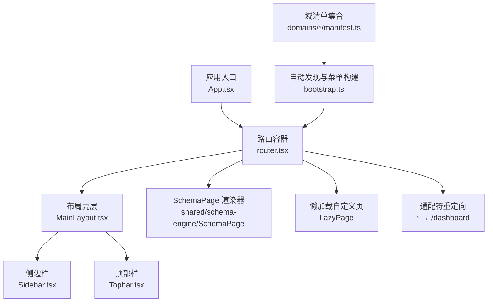
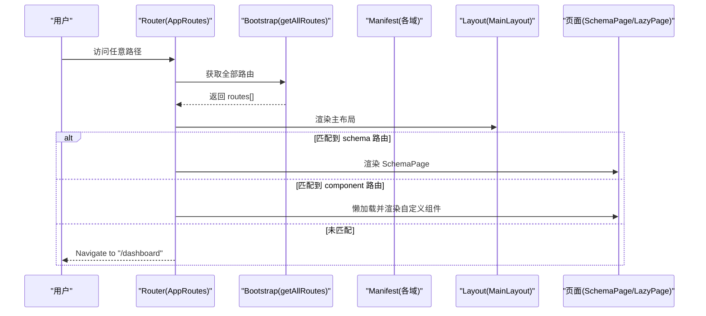
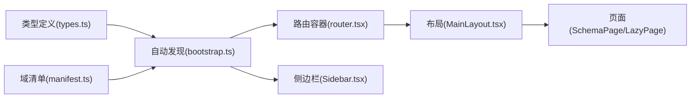

# 路由守卫与权限控制

<cite>
**本文引用的文件**
- [App.tsx](file://hj-admin/src/app/App.tsx)
- [router.tsx](file://hj-admin/src/app/router.tsx)
- [bootstrap.ts](file://hj-admin/src/app/bootstrap.ts)
- [types.ts](file://hj-admin/src/shared/schema-engine/types.ts)
- [MainLayout.tsx](file://hj-admin/src/layouts/MainLayout.tsx)
- [Sidebar.tsx](file://hj-admin/src/layouts/Sidebar.tsx)
- [Topbar.tsx](file://hj-admin/src/layouts/Topbar.tsx)
- [enterprise manifest.ts](file://hj-admin/src/domains/enterprise/manifest.ts)
- [news manifest.ts](file://hj-admin/src/domains/news/manifest.ts)
- [resource manifest.ts](file://hj-admin/src/domains/resource/manifest.ts)
- [tags manifest.ts](file://hj-admin/src/domains/tags/manifest.ts)
</cite>

## 目录
1. [简介](#简介)
2. [项目结构](#项目结构)
3. [核心组件](#核心组件)
4. [架构总览](#架构总览)
5. [详细组件分析](#详细组件分析)
6. [依赖分析](#依赖分析)
7. [性能考虑](#性能考虑)
8. [故障排查指南](#故障排查指南)
9. [结论](#结论)
10. [附录](#附录)

## 简介
本文件面向“氢界大数据平台”的前端工程，聚焦于“路由守卫与权限控制”的设计与实现。当前代码库已具备：
- 基于 DomainManifest 的自动路由发现与生成
- 基于 React Router v6 的路由树构建
- 未匹配路由统一重定向到首页（Dashboard）

但尚未实现：
- 用户认证检查（登录态校验）
- 角色/权限授权验证（如 public/private/role-based）
- 未登录重定向、403/404 页面处理
- 父子路由权限继承与组合规则
- 动态权限更新后的路由重新计算
- 权限调试工具与日志记录

本文将基于现有代码进行现状说明，并给出可落地的扩展方案与最佳实践，帮助开发者在最小改动的前提下完成权限体系的建设。

## 项目结构
前端采用“域驱动 + 清单式声明”的方式组织功能模块。每个域通过 manifest.ts 声明其路由、菜单与元信息；应用启动时自动扫描所有域的清单，生成全局路由与侧边栏菜单。

图示来源
- [App.tsx:1-21](file://hj-admin/src/app/App.tsx#L1-L21)
- [router.tsx:1-58](file://hj-admin/src/app/router.tsx#L1-L58)
- [bootstrap.ts:1-104](file://hj-admin/src/app/bootstrap.ts#L1-L104)
- [MainLayout.tsx:1-23](file://hj-admin/src/layouts/MainLayout.tsx#L1-L23)
- [Sidebar.tsx:1-35](file://hj-admin/src/layouts/Sidebar.tsx#L1-L35)
- [Topbar.tsx:1-33](file://hj-admin/src/layouts/Topbar.tsx#L1-L33)

章节来源
- [App.tsx:1-21](file://hj-admin/src/app/App.tsx#L1-L21)
- [router.tsx:1-58](file://hj-admin/src/app/router.tsx#L1-L58)
- [bootstrap.ts:1-104](file://hj-admin/src/app/bootstrap.ts#L1-L104)
- [MainLayout.tsx:1-23](file://hj-admin/src/layouts/MainLayout.tsx#L1-L23)
- [Sidebar.tsx:1-35](file://hj-admin/src/layouts/Sidebar.tsx#L1-L35)
- [Topbar.tsx:1-33](file://hj-admin/src/layouts/Topbar.tsx#L1-L33)

## 核心组件
- 应用入口 App.tsx：挂载 BrowserRouter、Provider 链与路由容器。
- 路由容器 router.tsx：从 bootstrap 获取全部路由，按 schema 或 component 渲染，未匹配则重定向至 /dashboard。
- 自动发现 bootstrap.ts：扫描 domains/*/manifest.ts，聚合 allManifests，提供 getAllRoutes() 与 buildMenuTree()。
- 类型定义 types.ts：DomainManifest、RouteDef 等核心类型，决定路由与菜单的结构。
- 布局 MainLayout.tsx：承载 Sidebar、Topbar 与 Outlet。
- 侧边栏 Sidebar.tsx：基于 buildMenuTree() 渲染菜单，支持禁用项展示。
- 顶部栏 Topbar.tsx：根据路径映射面包屑。

章节来源
- [App.tsx:1-21](file://hj-admin/src/app/App.tsx#L1-L21)
- [router.tsx:1-58](file://hj-admin/src/app/router.tsx#L1-L58)
- [bootstrap.ts:1-104](file://hj-admin/src/app/bootstrap.ts#L1-L104)
- [types.ts:176-215](file://hj-admin/src/shared/schema-engine/types.ts#L176-L215)
- [MainLayout.tsx:1-23](file://hj-admin/src/layouts/MainLayout.tsx#L1-L23)
- [Sidebar.tsx:1-35](file://hj-admin/src/layouts/Sidebar.tsx#L1-L35)
- [Topbar.tsx:1-33](file://hj-admin/src/layouts/Topbar.tsx#L1-L33)

## 架构总览
当前路由与权限相关的关键流程如下：
- 启动阶段：App.tsx 初始化 BrowserRouter 与 Provider，进入 AppRoutes。
- 路由构建：router.tsx 调用 getAllRoutes() 收集所有域清单中的 routes，生成 <Route> 节点。
- 页面渲染：若 route.schema 存在，使用 SchemaPage 渲染；否则懒加载自定义组件。
- 未匹配处理：通配符 * 重定向到 /dashboard。
- 菜单构建：Sidebar 通过 buildMenuTree() 生成菜单，结合硬编码的禁用项显示。

图示来源
- [router.tsx:25-57](file://hj-admin/src/app/router.tsx#L25-L57)
- [bootstrap.ts:19-22](file://hj-admin/src/app/bootstrap.ts#L19-L22)
- [MainLayout.tsx:6-20](file://hj-admin/src/layouts/MainLayout.tsx#L6-L20)

## 详细组件分析

### 路由与清单类型（RouteDef / DomainManifest）
- RouteDef 定义了单条路由的基本属性：path、label、schema/component、hideInMenu。
- DomainManifest 定义了域级元信息与 routes 列表，用于自动生成路由与菜单。

扩展建议（不改变现有行为）：
- 在 RouteDef 中增加权限字段，例如：
  - access: 'public' | 'private' | 'role:[角色名]'
  - roles?: string[]
  - permissions?: string[]
- 在 DomainManifest 中增加默认权限策略，如 defaultAccess 或 defaultRoles，供子路由继承。

章节来源
- [types.ts:176-215](file://hj-admin/src/shared/schema-engine/types.ts#L176-L215)

### 自动路由生成与未匹配重定向
- router.tsx 遍历 getAllRoutes() 生成的路由表，为每条路由创建 <Route>。
- 未匹配路径通过通配符 * 重定向到 /dashboard。

扩展建议：
- 在路由匹配前插入“前置守卫”，对当前路由的权限进行校验。
- 将通配符重定向逻辑改为“先鉴权再重定向”，未登录跳转登录页，无权限跳转 403。

章节来源
- [router.tsx:25-57](file://hj-admin/src/app/router.tsx#L25-L57)

### 菜单与隐藏路由
- Sidebar 通过 buildMenuTree() 生成菜单，忽略 hideInMenu 的路由。
- 同时支持硬编码的禁用菜单项，便于未来分批开放。

扩展建议：
- 在菜单渲染前增加“可见性判断”，依据用户角色/权限过滤菜单项。
- 对于 hideInMenu 的路由，仍可通过直接 URL 访问，需配合路由守卫控制。

章节来源
- [bootstrap.ts:40-103](file://hj-admin/src/app/bootstrap.ts#L40-L103)
- [Sidebar.tsx:1-35](file://hj-admin/src/layouts/Sidebar.tsx#L1-L35)

### 领域清单示例（enterprise/news/resource/tags）
- 各域 manifest.ts 均遵循 DomainManifest 结构，声明 name、label、menuGroup、order、routes 等。
- 部分路由使用 schema 自动渲染，部分使用 component 懒加载，并支持 hideInMenu。

扩展建议：
- 在 routes 条目上添加权限字段，实现细粒度访问控制。
- 对编辑类路由（如 /enterprise/edit/:id）设置更严格的角色限制。

章节来源
- [enterprise manifest.ts:1-20](file://hj-admin/src/domains/enterprise/manifest.ts#L1-L20)
- [news manifest.ts:1-42](file://hj-admin/src/domains/news/manifest.ts#L1-L42)
- [resource manifest.ts:1-22](file://hj-admin/src/domains/resource/manifest.ts#L1-L22)
- [tags manifest.ts:1-21](file://hj-admin/src/domains/tags/manifest.ts#L1-L21)

### 布局与面包屑
- MainLayout 作为外层壳层，包含 Sidebar、Topbar 与 Outlet。
- Topbar 根据路径映射面包屑文本，提升导航体验。

扩展建议：
- 在 Layout 层注入“全局鉴权上下文”，集中处理登录态与权限状态。
- 在面包屑渲染前，可根据权限隐藏敏感路径的层级。

章节来源
- [MainLayout.tsx:1-23](file://hj-admin/src/layouts/MainLayout.tsx#L1-L23)
- [Topbar.tsx:1-33](file://hj-admin/src/layouts/Topbar.tsx#L1-L33)

## 依赖分析
- 低耦合：路由生成与菜单构建解耦，分别由 bootstrap.ts 提供数据源。
- 单向依赖：router.tsx 依赖 bootstrap.ts 提供的路由表；Sidebar 依赖 bootstrap.ts 提供的菜单树。
- 可扩展点：在 RouteDef 与 DomainManifest 中扩展权限字段，即可在不改动渲染逻辑的情况下接入权限系统。

图示来源
- [types.ts:176-215](file://hj-admin/src/shared/schema-engine/types.ts#L176-L215)
- [bootstrap.ts:1-104](file://hj-admin/src/app/bootstrap.ts#L1-L104)
- [router.tsx:1-58](file://hj-admin/src/app/router.tsx#L1-L58)
- [MainLayout.tsx:1-23](file://hj-admin/src/layouts/MainLayout.tsx#L1-L23)
- [Sidebar.tsx:1-35](file://hj-admin/src/layouts/Sidebar.tsx#L1-L35)

章节来源
- [bootstrap.ts:1-104](file://hj-admin/src/app/bootstrap.ts#L1-L104)
- [router.tsx:1-58](file://hj-admin/src/app/router.tsx#L1-L58)
- [types.ts:176-215](file://hj-admin/src/shared/schema-engine/types.ts#L176-L215)

## 性能考虑
- 懒加载：自定义组件通过 lazy + Suspense 按需加载，减少首屏体积。
- 路由表一次性构建：getAllRoutes() 在启动时聚合一次，避免重复扫描。
- 菜单树缓存：Sidebar 使用 useMemo 缓存菜单树，避免频繁重建。

优化建议：
- 引入路由级预取与错误边界，提升异常场景下的用户体验。
- 对大型页面进行分块加载，结合路由切换时机触发。

章节来源
- [router.tsx:16-23](file://hj-admin/src/app/router.tsx#L16-L23)
- [Sidebar.tsx:15-19](file://hj-admin/src/layouts/Sidebar.tsx#L15-L19)

## 故障排查指南
常见问题与定位方法：
- 未匹配路由跳转到 Dashboard：检查通配符路由配置与目标路径是否正确。
- 菜单项不显示：确认 manifest 中是否设置了 hideInMenu，或 buildMenuTree 分组逻辑是否符合预期。
- 页面未渲染：检查 route.schema 是否存在，或 route.component 是否能正确懒加载。
- 面包屑不正确：核对 Topbar 的 breadcrumbMap 是否覆盖当前路径。

章节来源
- [router.tsx:53](file://hj-admin/src/app/router.tsx#L53)
- [bootstrap.ts:70-95](file://hj-admin/src/app/bootstrap.ts#L70-L95)
- [Topbar.tsx:4-18](file://hj-admin/src/layouts/Topbar.tsx#L4-L18)

## 结论
当前工程已具备完善的“清单驱动路由”基础，但未实现“路由守卫与权限控制”。建议在以下位置扩展：
- 在 RouteDef 与 DomainManifest 中增加权限字段，支持 public/private/role-based 访问控制。
- 在路由匹配前插入鉴权中间件，实现登录态校验与角色授权。
- 完善未登录重定向与 403/404 页面处理。
- 建立父子路由权限继承与组合规则，支持动态权限更新后的路由重新计算。
- 提供权限调试工具与日志记录，辅助快速定位问题。

## 附录

### 权限模型设计建议（概念性）
- 访问级别
  - public：无需登录即可访问
  - private：需要登录
  - role:[角色名]：需要指定角色
- 权限继承与组合
  - 父路由权限向下传递，子路由可收紧不可放宽
  - 多个条件以“且”组合，满足所有条件方可访问
- 动态更新
  - 监听用户角色变更事件，重新计算可用路由与菜单
  - 对当前不可访问的路径进行安全重定向

[本节为概念性内容，不涉及具体源码文件]

### 未登录重定向与 403/404 处理（概念性）
- 未登录：重定向到登录页，并在登录后携带原路径返回
- 无权限：跳转 403 页面，提示“无权访问该资源”
- 不存在：跳转 404 页面，提示“页面不存在”

[本节为概念性内容，不涉及具体源码文件]

### 权限调试工具与日志（概念性）
- 开发模式下输出权限判定过程（入参、规则、结果）
- 提供可视化面板查看当前用户的角色与可用路由
- 记录关键权限决策日志，便于回溯问题

[本节为概念性内容，不涉及具体源码文件]