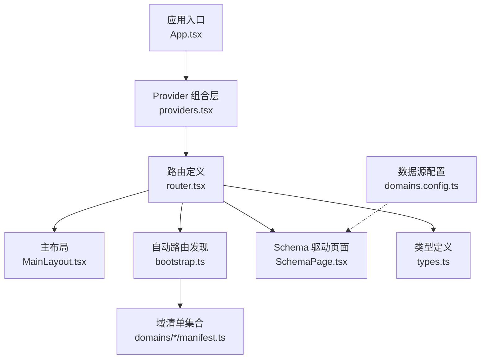
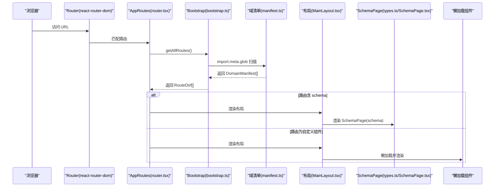
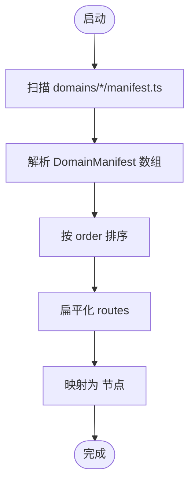
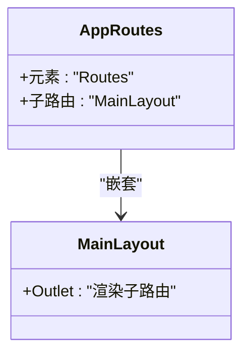
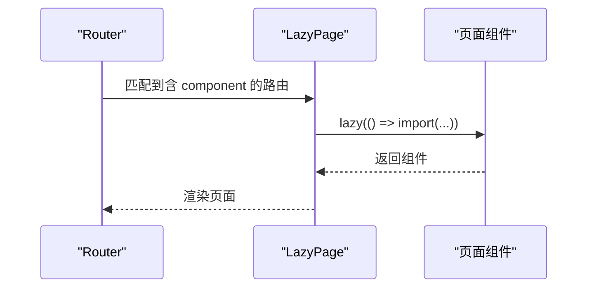
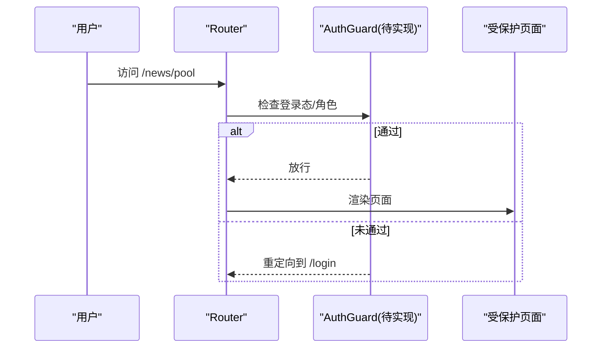
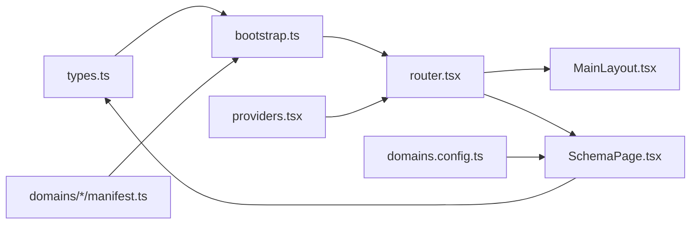

# 路由系统设计

<cite>
**本文引用的文件**   
- [App.tsx](file://hj-admin/src/app/App.tsx)
- [router.tsx](file://hj-admin/src/app/router.tsx)
- [bootstrap.ts](file://hj-admin/src/app/bootstrap.ts)
- [MainLayout.tsx](file://hj-admin/src/layouts/MainLayout.tsx)
- [types.ts](file://hj-admin/src/shared/schema-engine/types.ts)
- [SchemaPage.tsx](file://hj-admin/src/shared/schema-engine/SchemaPage.tsx)
- [providers.tsx](file://hj-admin/src/app/providers.tsx)
- [domains.config.ts](file://hj-admin/src/config/domains.config.ts)
- [manifest.ts（企业域）](file://hj-admin/src/domains/enterprise/manifest.ts)
- [manifest.ts（资讯域）](file://hj-admin/src/domains/news/manifest.ts)
</cite>

## 目录
1. [引言](#引言)
2. [项目结构](#项目结构)
3. [核心组件](#核心组件)
4. [架构总览](#架构总览)
5. [详细组件分析](#详细组件分析)
6. [依赖关系分析](#依赖关系分析)
7. [性能考虑](#性能考虑)
8. [故障排查指南](#故障排查指南)
9. [结论](#结论)
10. [附录](#附录)

## 引言
本设计文档面向氢界大数据平台的前端路由系统，重点阐述以下目标：
- 自动路由生成机制：基于 DomainManifest 配置动态生成路由规则
- 嵌套路由与布局：通过布局组件实现页面嵌套与统一外壳
- 懒加载策略：模块级代码分割与按需加载
- 路由守卫与权限控制：用户认证与角色授权接入点
- 路由配置示例与最佳实践：URL 参数、查询字符串、状态同步
- 性能优化与调试方法

## 项目结构
前端采用 React + React Router v6 的声明式路由。应用入口组合全局 Provider 与路由树；路由层从各域的 manifest 中自动发现并注册路由；有 Schema 的页面由通用列表页渲染器自动渲染，无 Schema 的页面以懒加载方式引入自定义组件。

图示来源
- [App.tsx:1-21](file://hj-admin/src/app/App.tsx#L1-L21)
- [providers.tsx:1-14](file://hj-admin/src/app/providers.tsx#L1-L14)
- [router.tsx:1-58](file://hj-admin/src/app/router.tsx#L1-L58)
- [bootstrap.ts:1-104](file://hj-admin/src/app/bootstrap.ts#L1-L104)
- [MainLayout.tsx:1-23](file://hj-admin/src/layouts/MainLayout.tsx#L1-L23)
- [SchemaPage.tsx:1-226](file://hj-admin/src/shared/schema-engine/SchemaPage.tsx#L1-L226)
- [types.ts:1-216](file://hj-admin/src/shared/schema-engine/types.ts#L1-L216)
- [domains.config.ts:1-18](file://hj-admin/src/config/domains.config.ts#L1-L18)

章节来源
- [App.tsx:1-21](file://hj-admin/src/app/App.tsx#L1-L21)
- [providers.tsx:1-14](file://hj-admin/src/app/providers.tsx#L1-L14)
- [router.tsx:1-58](file://hj-admin/src/app/router.tsx#L1-L58)
- [bootstrap.ts:1-104](file://hj-admin/src/app/bootstrap.ts#L1-L104)
- [MainLayout.tsx:1-23](file://hj-admin/src/layouts/MainLayout.tsx#L1-L23)
- [SchemaPage.tsx:1-226](file://hj-admin/src/shared/schema-engine/SchemaPage.tsx#L1-L226)
- [types.ts:1-216](file://hj-admin/src/shared/schema-engine/types.ts#L1-L216)
- [domains.config.ts:1-18](file://hj-admin/src/config/domains.config.ts#L1-L18)

## 核心组件
- 应用入口与 Provider 编排：在根组件中挂载 BrowserRouter 与全局 Provider，再渲染路由树。
- 路由装配器：从 bootstrap 收集所有域的 manifest，生成 Routes 节点；Dashboard 常驻，其余按 manifest 动态注入。
- 自动发现与菜单构建：利用 Vite 的 import.meta.glob 扫描 domains/*/manifest.ts，提取 routes 并按 order 排序；同时构建侧边栏菜单树。
- 布局嵌套：使用 MainLayout 作为外层容器，内部通过 Outlet 渲染子路由内容。
- Schema 驱动页面：当路由声明了 schema，则使用 SchemaPage 自动渲染筛选、表格、分页、操作等；未声明 schema 的路由则以懒加载方式引入自定义组件。
- 类型契约：DomainManifest、RouteDef、PageSchema 等类型定义了路由与页面的最小可表达集。

章节来源
- [App.tsx:1-21](file://hj-admin/src/app/App.tsx#L1-L21)
- [router.tsx:1-58](file://hj-admin/src/app/router.tsx#L1-L58)
- [bootstrap.ts:1-104](file://hj-admin/src/app/bootstrap.ts#L1-L104)
- [MainLayout.tsx:1-23](file://hj-admin/src/layouts/MainLayout.tsx#L1-L23)
- [SchemaPage.tsx:1-226](file://hj-admin/src/shared/schema-engine/SchemaPage.tsx#L1-L226)
- [types.ts:1-216](file://hj-admin/src/shared/schema-engine/types.ts#L1-L216)

## 架构总览
下图展示了“从域清单到页面渲染”的完整链路：Vite 构建期扫描 manifest → 运行时聚合为路由表 → 路由匹配后根据是否包含 schema 选择 SchemaPage 或懒加载组件 → 布局组件包裹页面内容。

图示来源
- [router.tsx:1-58](file://hj-admin/src/app/router.tsx#L1-L58)
- [bootstrap.ts:1-104](file://hj-admin/src/app/bootstrap.ts#L1-L104)
- [manifest.ts（企业域）:1-20](file://hj-admin/src/domains/enterprise/manifest.ts#L1-L20)
- [manifest.ts（资讯域）:1-42](file://hj-admin/src/domains/news/manifest.ts#L1-L42)
- [MainLayout.tsx:1-23](file://hj-admin/src/layouts/MainLayout.tsx#L1-L23)
- [SchemaPage.tsx:1-226](file://hj-admin/src/shared/schema-engine/SchemaPage.tsx#L1-L226)
- [types.ts:1-216](file://hj-admin/src/shared/schema-engine/types.ts#L1-L216)

## 详细组件分析

### 自动路由生成机制
- 扫描与聚合：bootstrap.ts 使用 import.meta.glob 在构建时扫描所有 domains/*/manifest.ts，将默认导出的 DomainManifest 合并并按 order 排序。
- 路由抽取：getAllRoutes 将所有 manifest 的 routes 扁平化，供 router.tsx 直接映射为 <Route>。
- 菜单联动：buildMenuTree 基于 manifest 的 menuGroup、routes 构建侧边栏分组与子项，支持禁用项占位。

图示来源
- [bootstrap.ts:1-104](file://hj-admin/src/app/bootstrap.ts#L1-L104)
- [router.tsx:1-58](file://hj-admin/src/app/router.tsx#L1-L58)
- [types.ts:176-208](file://hj-admin/src/shared/schema-engine/types.ts#L176-L208)

章节来源
- [bootstrap.ts:1-104](file://hj-admin/src/app/bootstrap.ts#L1-L104)
- [router.tsx:1-58](file://hj-admin/src/app/router.tsx#L1-L58)
- [types.ts:176-208](file://hj-admin/src/shared/schema-engine/types.ts#L176-L208)

### 嵌套路由与布局组件
- 外层布局：MainLayout 提供侧边栏、顶部栏与内容区，并通过 Outlet 渲染子路由。
- 路由嵌套：AppRoutes 将 MainLayout 作为父路由，其下 Dashboard 与各域路由均为子路由，从而实现统一的页面外壳与导航上下文。
- 扩展建议：如需多套布局，可在 AppRoutes 内新增布局路由分支，并在对应分支下挂载不同 Layout 组件。

图示来源
- [router.tsx:25-57](file://hj-admin/src/app/router.tsx#L25-L57)
- [MainLayout.tsx:1-23](file://hj-admin/src/layouts/MainLayout.tsx#L1-L23)

章节来源
- [router.tsx:25-57](file://hj-admin/src/app/router.tsx#L25-L57)
- [MainLayout.tsx:1-23](file://hj-admin/src/layouts/MainLayout.tsx#L1-L23)

### 懒加载与代码分割
- 组件懒加载：对于无 schema 的页面，路由声明 component 为一个返回 Promise 的函数，router.tsx 使用 Suspense + lazy 进行异步加载与降级展示。
- 模块边界：每个域 pages 下的页面组件均可作为独立 chunk 被按需加载，减少首屏体积。
- 建议：对大型页面或第三方重型库进一步拆分，结合路由级 Suspense 提升用户体验。

图示来源
- [router.tsx:16-23](file://hj-admin/src/app/router.tsx#L16-L23)
- [manifest.ts（企业域）:17](file://hj-admin/src/domains/enterprise/manifest.ts#L17-L17)
- [manifest.ts（资讯域）:35-39](file://hj-admin/src/domains/news/manifest.ts#L35-L39)

章节来源
- [router.tsx:16-23](file://hj-admin/src/app/router.tsx#L16-L23)
- [manifest.ts（企业域）:17](file://hj-admin/src/domains/enterprise/manifest.ts#L17-L17)
- [manifest.ts（资讯域）:35-39](file://hj-admin/src/domains/news/manifest.ts#L35-L39)

### 路由守卫与权限验证
当前路由层未内置全局守卫。建议在以下位置接入认证与授权：
- 应用入口 providers.tsx：在 DataProvider 外层增加 AuthProvider，集中管理登录态、角色与令牌刷新。
- 路由层 router.tsx：在 AppRoutes 顶层添加受保护路由包装，对需要鉴权的 path 进行前置校验；未登录重定向至登录页。
- 菜单层 bootstrap.ts：根据角色过滤 buildMenuTree 的输出，隐藏不可见菜单项。
- 页面内：SchemaPage 的行操作/工具栏操作中，依据角色条件显示或禁用按钮。

章节来源
- [providers.tsx:1-14](file://hj-admin/src/app/providers.tsx#L1-L14)
- [router.tsx:25-57](file://hj-admin/src/app/router.tsx#L25-L57)
- [bootstrap.ts:40-103](file://hj-admin/src/app/bootstrap.ts#L40-L103)
- [SchemaPage.tsx:112-142](file://hj-admin/src/shared/schema-engine/SchemaPage.tsx#L112-L142)

### 路由配置示例与最佳实践
- 配置要点
  - 在 domains/<domain>/manifest.ts 中声明 name、label、menuGroup、order、routes。
  - 列表型页面优先使用 schema 字段，交由 SchemaPage 自动渲染；表单/复杂交互页面使用 component 懒加载。
  - 使用 hideInMenu 控制是否在菜单中显示。
- URL 参数处理
  - 路径参数：如 /enterprise/edit/:id，在行操作的 navigateTo 中使用模板替换 id。
  - 查询字符串：建议在 useSchemaPage 的状态管理中维护 filters，并在请求时拼接为 query string，以实现分享链接与刷新保持。
- 路由状态同步
  - 将分页、筛选、Tab 等状态持久化到 URL（query），便于书签与分享。
  - 在页面初始化时从 URL 恢复状态，保证一致性。
- 数据源切换
  - 通过 domains.config.ts 指定各域的数据源模式（mock/http），无需改动 Schema 与页面代码。

章节来源
- [manifest.ts（企业域）:1-20](file://hj-admin/src/domains/enterprise/manifest.ts#L1-L20)
- [manifest.ts（资讯域）:1-42](file://hj-admin/src/domains/news/manifest.ts#L1-L42)
- [SchemaPage.tsx:120-142](file://hj-admin/src/shared/schema-engine/SchemaPage.tsx#L120-L142)
- [domains.config.ts:1-18](file://hj-admin/src/config/domains.config.ts#L1-L18)

## 依赖关系分析
- 低耦合高内聚：路由与业务解耦，manifest 仅描述路由与页面元信息；SchemaPage 负责通用 UI 渲染。
- 外部依赖：React Router v6 提供声明式路由；Ant Design 提供 UI 组件；Vite 提供构建期模块扫描。
- 潜在循环：目前未发现循环引用；若后续引入跨域共享逻辑，需避免在 manifest 中引入运行时副作用。

图示来源
- [types.ts:1-216](file://hj-admin/src/shared/schema-engine/types.ts#L1-L216)
- [bootstrap.ts:1-104](file://hj-admin/src/app/bootstrap.ts#L1-L104)
- [manifest.ts（企业域）:1-20](file://hj-admin/src/domains/enterprise/manifest.ts#L1-L20)
- [manifest.ts（资讯域）:1-42](file://hj-admin/src/domains/news/manifest.ts#L1-L42)
- [router.tsx:1-58](file://hj-admin/src/app/router.tsx#L1-L58)
- [MainLayout.tsx:1-23](file://hj-admin/src/layouts/MainLayout.tsx#L1-L23)
- [SchemaPage.tsx:1-226](file://hj-admin/src/shared/schema-engine/SchemaPage.tsx#L1-L226)
- [providers.tsx:1-14](file://hj-admin/src/app/providers.tsx#L1-L14)
- [domains.config.ts:1-18](file://hj-admin/src/config/domains.config.ts#L1-L18)

章节来源
- [types.ts:1-216](file://hj-admin/src/shared/schema-engine/types.ts#L1-L216)
- [bootstrap.ts:1-104](file://hj-admin/src/app/bootstrap.ts#L1-L104)
- [router.tsx:1-58](file://hj-admin/src/app/router.tsx#L1-L58)
- [SchemaPage.tsx:1-226](file://hj-admin/src/shared/schema-engine/SchemaPage.tsx#L1-L226)
- [domains.config.ts:1-18](file://hj-admin/src/config/domains.config.ts#L1-L18)

## 性能考虑
- 路由级懒加载：对非首屏页面使用 lazy + Suspense，降低首屏包体。
- 组件级拆分：将大页面拆分为多个子模块，按需导入。
- 预取与预加载：对高频访问页面使用浏览器预加载策略（如 link rel="prefetch"）。
- 列表渲染优化：合理设置 Table 的 rowKey、固定列宽度、虚拟滚动（数据量大时）。
- 缓存策略：对静态资源与接口数据进行缓存，减少重复请求。
- 构建优化：开启 Tree Shaking、Code Splitting，按需引入 AntD 组件。

## 故障排查指南
- 路由不生效
  - 确认 manifest 已正确导出 default 且 routes 路径合法。
  - 检查 getAllRoutes 是否正确返回路由数组。
- 页面空白或白屏
  - 检查懒加载组件是否存在默认导出。
  - 查看 Suspense fallback 是否正常显示。
- 菜单不显示
  - 确认 manifest 的 menuGroup 与 label 配置。
  - 检查 hideInMenu 是否误设为 true。
- 权限问题
  - 在未实现全局守卫前，确认页面内按钮与操作的条件渲染。
- 数据源切换无效
  - 核对 domains.config.ts 中的 key 与值是否与 Schema 绑定一致。

章节来源
- [bootstrap.ts:10-22](file://hj-admin/src/app/bootstrap.ts#L10-L22)
- [router.tsx:39-51](file://hj-admin/src/app/router.tsx#L39-L51)
- [SchemaPage.tsx:112-142](file://hj-admin/src/shared/schema-engine/SchemaPage.tsx#L112-L142)
- [domains.config.ts:1-18](file://hj-admin/src/config/domains.config.ts#L1-L18)

## 结论
本路由系统以 DomainManifest 为核心，实现了“配置即路由”的自动化能力，配合 Schema 驱动的通用页面渲染与懒加载策略，显著降低了重复开发成本，提升了可维护性与可扩展性。后续可在现有基础上无缝接入全局鉴权、国际化、埋点与监控等横切关注点。

## 附录
- 术语
  - 域（Domain）：按业务划分的功能集合，每个域拥有独立的 manifest、schema、页面与数据源。
  - Schema：声明式页面配置，用于自动生成筛选、表格、分页与操作。
  - 懒加载：在路由匹配时异步加载组件，减小首屏体积。
- 参考文件
  - 类型定义：[types.ts](file://hj-admin/src/shared/schema-engine/types.ts)
  - 自动发现与菜单：[bootstrap.ts](file://hj-admin/src/app/bootstrap.ts)
  - 路由装配：[router.tsx](file://hj-admin/src/app/router.tsx)
  - 布局与嵌套：[MainLayout.tsx](file://hj-admin/src/layouts/MainLayout.tsx)
  - 通用页面渲染：[SchemaPage.tsx](file://hj-admin/src/shared/schema-engine/SchemaPage.tsx)
  - 数据源配置：[domains.config.ts](file://hj-admin/src/config/domains.config.ts)
  - 示例清单：[manifest.ts（企业域）](file://hj-admin/src/domains/enterprise/manifest.ts)、[manifest.ts（资讯域）](file://hj-admin/src/domains/news/manifest.ts)