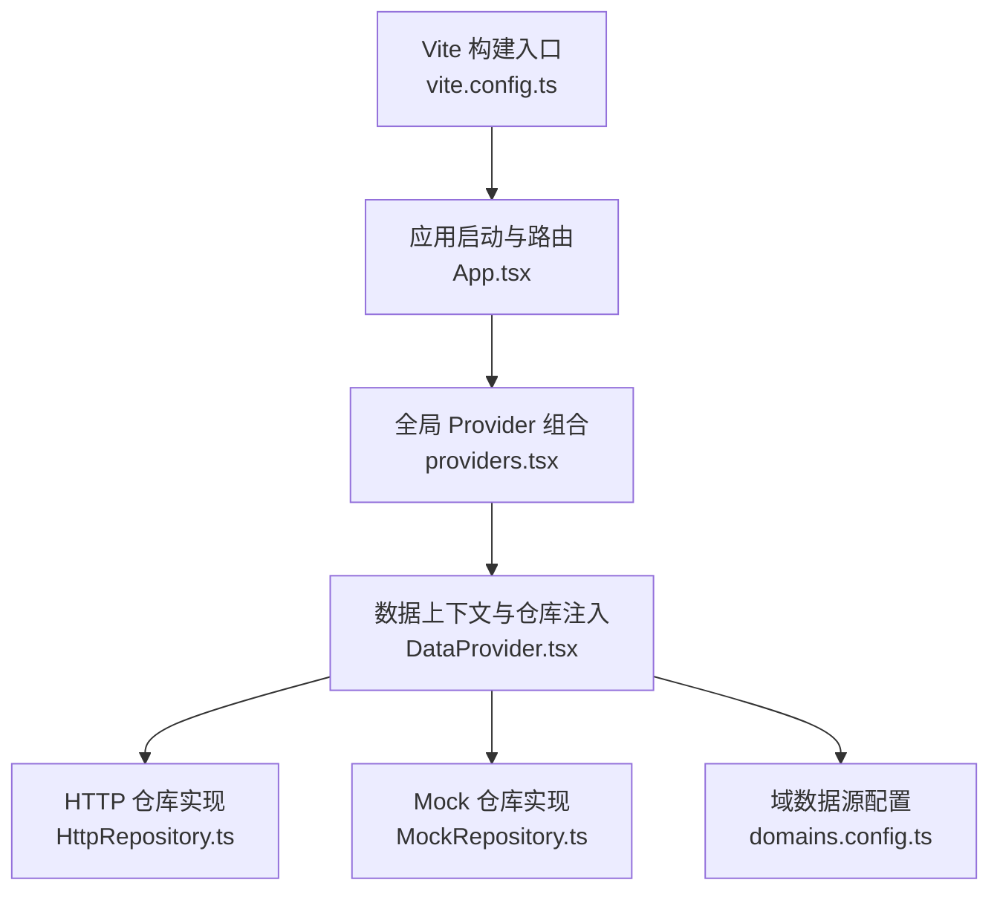
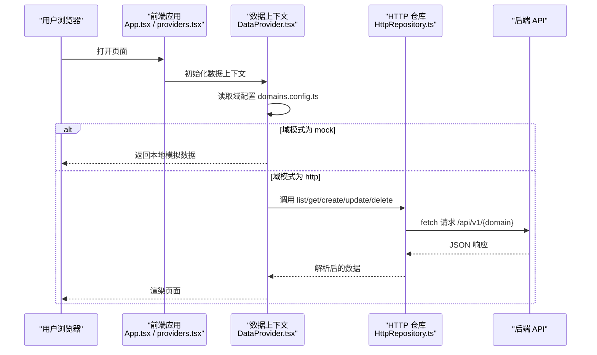
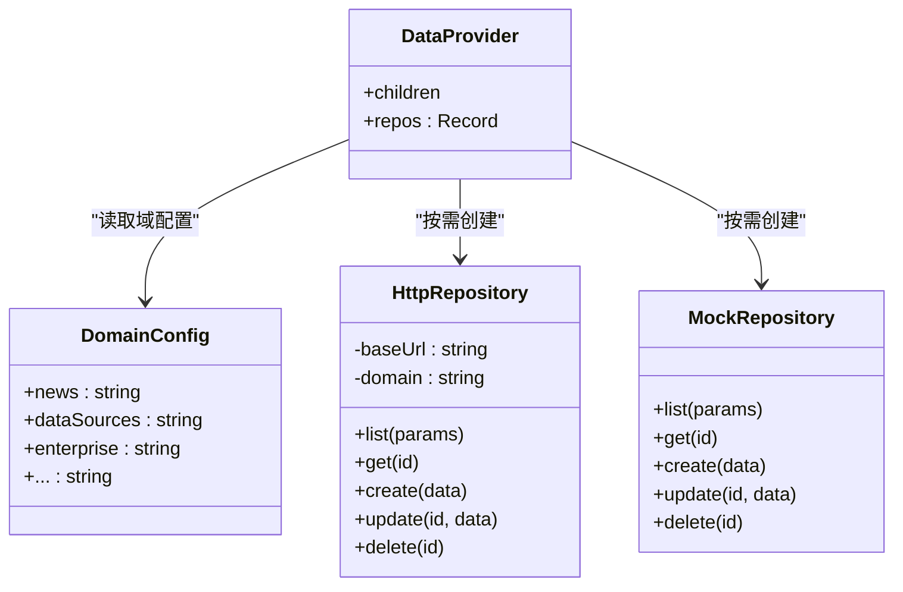
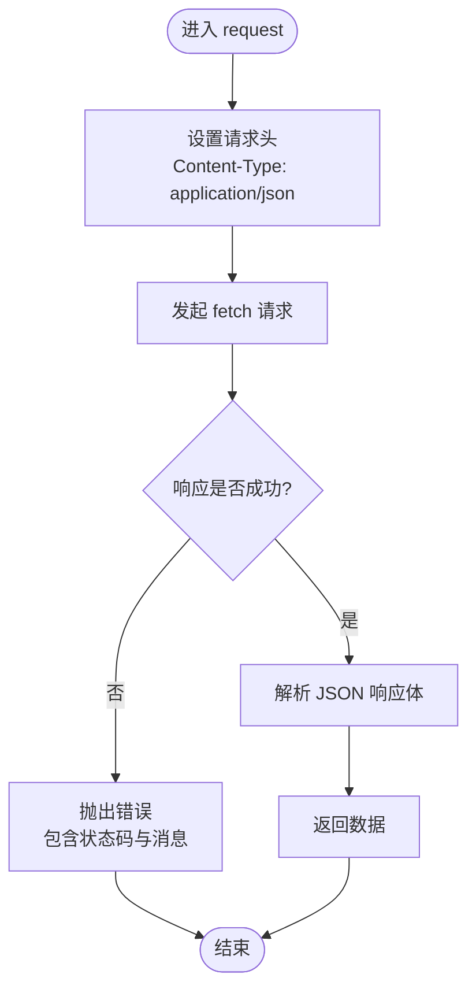
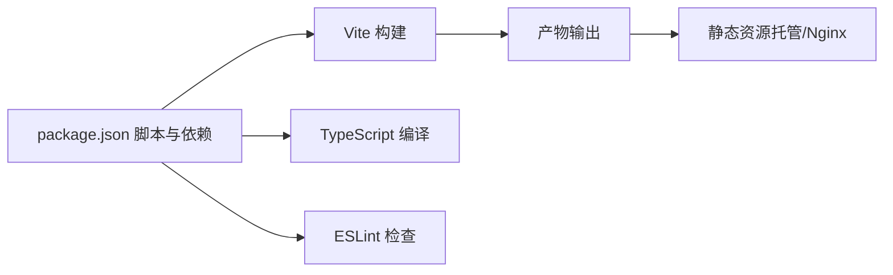

# 部署运维

<cite>
**本文引用的文件**   
- [vite.config.ts](file://hj-admin/vite.config.ts)
- [package.json](file://hj-admin/package.json)
- [domains.config.ts](file://hj-admin/src/config/domains.config.ts)
- [DataProvider.tsx](file://hj-admin/src/shared/data/DataProvider.tsx)
- [HttpRepository.ts](file://hj-admin/src/shared/data/HttpRepository.ts)
- [providers.tsx](file://hj-admin/src/app/providers.tsx)
- [App.tsx](file://hj-admin/src/App.tsx)
</cite>

## 目录
1. [简介](#简介)
2. [项目结构](#项目结构)
3. [核心组件](#核心组件)
4. [架构总览](#架构总览)
5. [详细组件分析](#详细组件分析)
6. [依赖关系分析](#依赖关系分析)
7. [性能与构建优化](#性能与构建优化)
8. [环境变量与配置管理](#环境变量与配置管理)
9. [容器化与编排](#容器化与编排)
10. [监控与日志](#监控与日志)
11. [CI/CD 流水线与自动化部署](#cicd-流水线与自动化部署)
12. [故障排查指南](#故障排查指南)
13. [结论](#结论)

## 简介
本指南面向生产环境的构建、部署与运维，覆盖 Vite 构建优化、代码与资源压缩、环境变量配置、Docker 容器化与编排、监控与日志收集、CI/CD 流水线示例以及故障排查与性能调优建议。文档基于仓库现有前端工程（React + Vite）进行说明，并提供可直接落地的实践方案。

## 项目结构
本项目为 React + Vite 的前端应用，采用领域驱动的组织方式，数据访问层通过 Repository 模式统一封装 Mock 与 HTTP 两种实现，并通过 DataProvider 在运行时按域动态注入。

图表来源
- [vite.config.ts:1-8](file://hj-admin/vite.config.ts#L1-L8)
- [App.tsx:19-42](file://hj-admin/src/App.tsx#L19-L42)
- [providers.tsx:1-13](file://hj-admin/src/app/providers.tsx#L1-L13)
- [DataProvider.tsx:1-44](file://hj-admin/src/shared/data/DataProvider.tsx#L1-L44)
- [HttpRepository.ts:1-70](file://hj-admin/src/shared/data/HttpRepository.ts#L1-L70)
- [domains.config.ts:1-18](file://hj-admin/src/config/domains.config.ts#L1-L18)

章节来源
- [vite.config.ts:1-8](file://hj-admin/vite.config.ts#L1-L8)
- [package.json:1-35](file://hj-admin/package.json#L1-L35)
- [domains.config.ts:1-18](file://hj-admin/src/config/domains.config.ts#L1-L18)
- [DataProvider.tsx:1-44](file://hj-admin/src/shared/data/DataProvider.tsx#L1-L44)
- [HttpRepository.ts:1-70](file://hj-admin/src/shared/data/HttpRepository.ts#L1-L70)
- [providers.tsx:1-13](file://hj-admin/src/app/providers.tsx#L1-L13)
- [App.tsx:19-42](file://hj-admin/src/App.tsx#L19-L42)

## 核心组件
- 构建与脚本：使用 Vite 作为开发与构建工具，TypeScript 编译后打包；提供 dev/build/lint/preview 脚本。
- 数据访问层：通过 HttpRepository 与 MockRepository 抽象统一的 CRUD 接口，由 DataProvider 根据 domains.config.ts 的域配置动态选择实现。
- 运行期配置：当前 API_BASE 硬编码于 DataProvider 中，后续可迁移至环境变量或构建时注入。

章节来源
- [package.json:6-11](file://hj-admin/package.json#L6-L11)
- [HttpRepository.ts:7-27](file://hj-admin/src/shared/data/HttpRepository.ts#L7-L27)
- [DataProvider.tsx:24-38](file://hj-admin/src/shared/data/DataProvider.tsx#L24-L38)
- [domains.config.ts:7-18](file://hj-admin/src/config/domains.config.ts#L7-L18)

## 架构总览
下图展示了从浏览器到后端 API 的请求路径，以及数据源切换机制。

图表来源
- [App.tsx:19-42](file://hj-admin/src/App.tsx#L19-L42)
- [providers.tsx:1-13](file://hj-admin/src/app/providers.tsx#L1-L13)
- [DataProvider.tsx:24-38](file://hj-admin/src/shared/data/DataProvider.tsx#L24-L38)
- [HttpRepository.ts:20-46](file://hj-admin/src/shared/data/HttpRepository.ts#L20-L46)
- [domains.config.ts:7-18](file://hj-admin/src/config/domains.config.ts#L7-L18)

## 详细组件分析

### 数据上下文与仓库注入（DataProvider）
- 职责：根据 domainConfig 为每个域创建对应的 Repository 实例（Mock 或 HTTP），并挂载到 React Context 供业务组件使用。
- 关键点：
  - API_BASE 目前固定为相对路径，便于 Nginx 反向代理到后端服务。
  - 支持按域切换数据源模式，无需改动页面与 Schema。
- 扩展建议：将 API_BASE 改为构建时注入的环境变量，以支持多环境差异化配置。

图表来源
- [DataProvider.tsx:24-38](file://hj-admin/src/shared/data/DataProvider.tsx#L24-L38)
- [domains.config.ts:7-18](file://hj-admin/src/config/domains.config.ts#L7-L18)
- [HttpRepository.ts:7-69](file://hj-admin/src/shared/data/HttpRepository.ts#L7-L69)

章节来源
- [DataProvider.tsx:1-44](file://hj-admin/src/shared/data/DataProvider.tsx#L1-L44)
- [domains.config.ts:1-18](file://hj-admin/src/config/domains.config.ts#L1-L18)
- [HttpRepository.ts:1-70](file://hj-admin/src/shared/data/HttpRepository.ts#L1-L70)

### HTTP 仓库实现（HttpRepository）
- 职责：封装对后端 RESTful API 的通用请求逻辑，统一处理分页、排序、过滤等查询参数。
- 关键点：
  - 统一 Content-Type 为 application/json。
  - 非 2xx 状态码抛出错误，便于上层捕获与展示。
  - 支持 list/get/create/update/delete 标准操作。
- 扩展建议：增加重试、超时、鉴权头注入、错误上报等能力。

图表来源
- [HttpRepository.ts:20-27](file://hj-admin/src/shared/data/HttpRepository.ts#L20-L27)

章节来源
- [HttpRepository.ts:1-70](file://hj-admin/src/shared/data/HttpRepository.ts#L1-L70)

### 应用启动与 Provider 组合
- App.tsx 定义路由与页面映射，providers.tsx 组合全局 Provider（如 DataProvider）。
- 建议在 bootstrap 阶段完成特性开关、埋点初始化、错误上报等全局配置。

章节来源
- [App.tsx:19-42](file://hj-admin/src/App.tsx#L19-L42)
- [providers.tsx:1-13](file://hj-admin/src/app/providers.tsx#L1-L13)

## 依赖关系分析
- 构建与开发：
  - Vite 负责模块加载、热更新与生产构建。
  - TypeScript 负责类型检查与编译。
  - ESLint 负责代码质量检查。
- 运行时依赖：
  - React、ReactDOM、react-router-dom 用于 UI 与路由。
  - Ant Design 与图标库用于组件与图标。
  - dayjs 用于日期处理。

图表来源
- [package.json:6-33](file://hj-admin/package.json#L6-L33)

章节来源
- [package.json:1-35](file://hj-admin/package.json#L1-L35)

## 性能与构建优化
- 构建目标与平台：
  - 明确 target 与 platform，避免引入不必要的 polyfill。
- 分包与缓存：
  - 启用 chunk 拆分策略，分离第三方库与应用代码，提升缓存命中率。
  - 使用文件名哈希，配合长缓存策略。
- 资源优化：
  - 图片与字体启用压缩与懒加载。
  - 开启 gzip 或 brotli 压缩（Nginx 侧）。
- 代码体积控制：
  - 按需引入 UI 组件与图标。
  - 移除未使用的代码与调试信息。
- 构建产物分析：
  - 使用构建分析插件定位大体积依赖，针对性优化。

[本节为通用指导，不直接分析具体文件]

## 环境变量与配置管理
- 现状：
  - API_BASE 在 DataProvider 中硬编码为相对路径，适合通过 Nginx 反向代理到后端。
  - 域数据源模式集中在 domains.config.ts，可按域切换 mock/http。
- 推荐方案：
  - 使用 Vite 环境变量（.env.production/.env.development）注入 API_BASE、功能开关、第三方服务地址等。
  - 在 vite.config.ts 中将环境变量暴露给应用，并在 DataProvider 中读取。
  - 对于敏感配置，建议使用服务端下发或安全存储方案。
- 配置项建议：
  - API_BASE：后端基础路径或域名。
  - FEATURE_FLAGS：功能开关对象，如 analyticsEnabled、debugMode。
  - THIRD_PARTY：第三方服务地址与密钥（注意安全性）。
  - LOG_LEVEL：日志级别。
  - APP_VERSION：应用版本，用于缓存与回滚策略。

章节来源
- [DataProvider.tsx:24-38](file://hj-admin/src/shared/data/DataProvider.tsx#L24-L38)
- [domains.config.ts:7-18](file://hj-admin/src/config/domains.config.ts#L7-L18)

## 容器化与编排
- Dockerfile 要点：
  - 多阶段构建：第一阶段安装依赖并构建产物，第二阶段仅拷贝静态资源，减小镜像体积。
  - 使用轻量级基础镜像（如 nginx:alpine）提供静态服务。
  - 通过构建参数注入环境变量（如 API_BASE），或在 Nginx 配置中替换占位符。
- 镜像构建：
  - 在 CI 中执行构建与镜像推送，确保产物一致性与可追溯性。
- 容器编排：
  - 使用 docker-compose 或 Kubernetes 管理多个实例与服务发现。
  - 结合 Ingress 与 TLS 证书管理，对外暴露 HTTPS 服务。
  - 健康检查与滚动更新，保障高可用。

[本节为通用指导，不直接分析具体文件]

## 监控与日志
- 前端错误追踪：
  - 捕获 window.onerror 与 Promise unhandledrejection，上报至错误追踪平台。
  - 记录关键用户行为与页面生命周期事件，辅助复现问题。
- 性能监控：
  - 采集首屏时间、交互延迟、网络请求耗时等指标。
  - 使用 Performance Observer 与自定义打点统计。
- 访问日志：
  - 通过 Nginx 访问日志收集请求量、状态码分布与慢请求。
  - 集中式日志系统（如 ELK）进行聚合与分析。
- 告警与通知：
  - 设定阈值与规则，触发告警并通知相关人员。

[本节为通用指导，不直接分析具体文件]

## CI/CD 流水线与自动化部署
- 流水线步骤：
  - 拉取代码、安装依赖、类型检查与单元测试。
  - 构建生产包，生成制品与镜像。
  - 推送镜像到镜像仓库，更新部署清单。
  - 自动部署到测试/预发/生产环境，执行健康检查与回滚策略。
- 分支策略与环境隔离：
  - 主分支发布稳定版本，特性分支合并前进行评审与验证。
  - 不同环境使用独立配置与密钥管理。
- 回滚与灰度：
  - 保留历史版本镜像，支持快速回滚。
  - 灰度发布逐步放量，观察指标后再全量。

[本节为通用指导，不直接分析具体文件]

## 故障排查指南
- 常见问题定位：
  - 构建失败：检查 Node 版本与依赖兼容性，确认 TypeScript 与 Vite 配置。
  - 运行时错误：查看浏览器控制台与错误追踪平台，结合堆栈定位。
  - 网络请求失败：检查 API_BASE 与跨域配置，确认后端服务可达。
- 诊断手段：
  - 启用调试模式与详细日志，复现场景并收集上下文。
  - 使用浏览器开发者工具分析网络与性能面板。
  - 通过 Nginx 访问日志与错误日志定位外部因素。
- 恢复策略：
  - 快速回滚到上一稳定版本。
  - 临时降级功能或切换到备用数据源。

章节来源
- [HttpRepository.ts:20-27](file://hj-admin/src/shared/data/HttpRepository.ts#L20-L27)
- [DataProvider.tsx:24-38](file://hj-admin/src/shared/data/DataProvider.tsx#L24-L38)

## 结论
本指南围绕生产环境的构建、部署与运维提供了系统化方案。通过合理的 Vite 构建优化、环境变量管理、容器化与编排、监控与日志体系，以及完善的 CI/CD 流程，可有效提升系统的稳定性、可维护性与交付效率。建议在生产环境中逐步落地上述最佳实践，并结合业务特点持续优化。