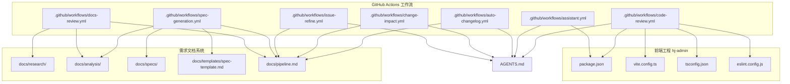
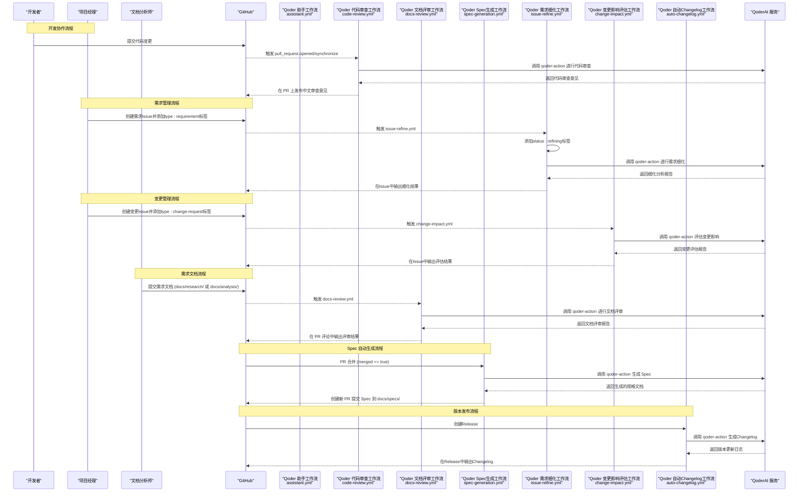
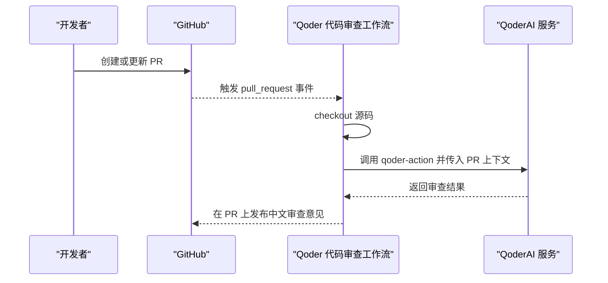
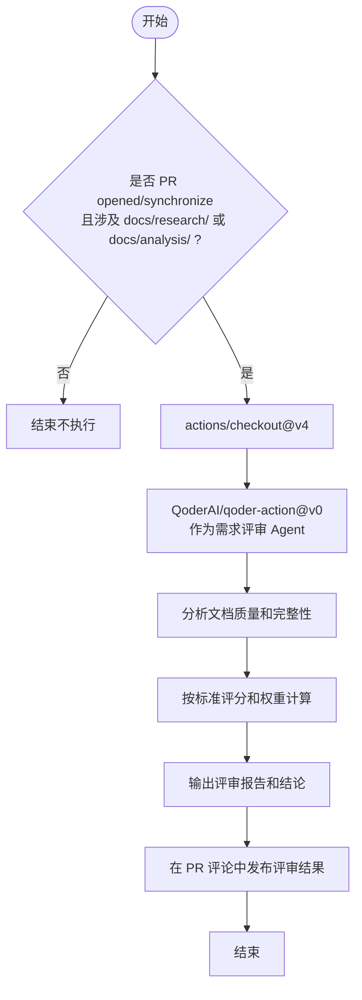
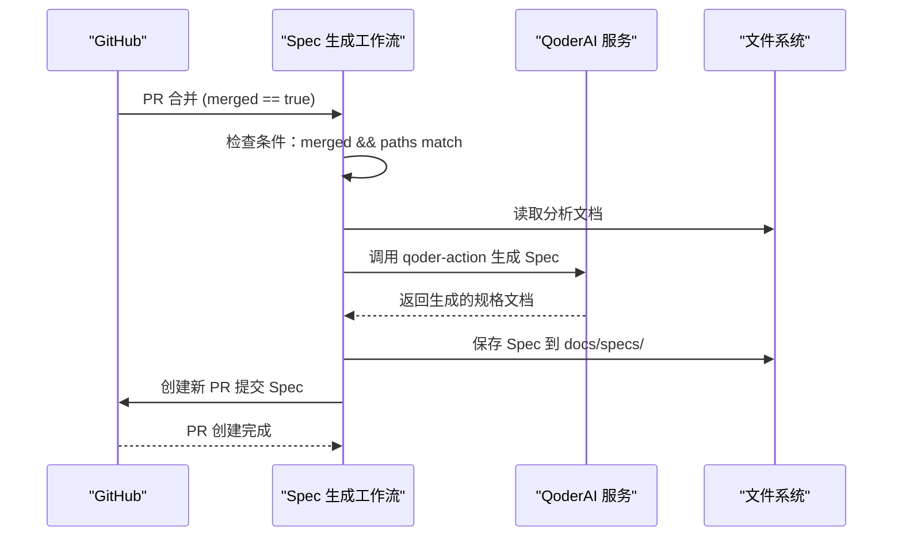
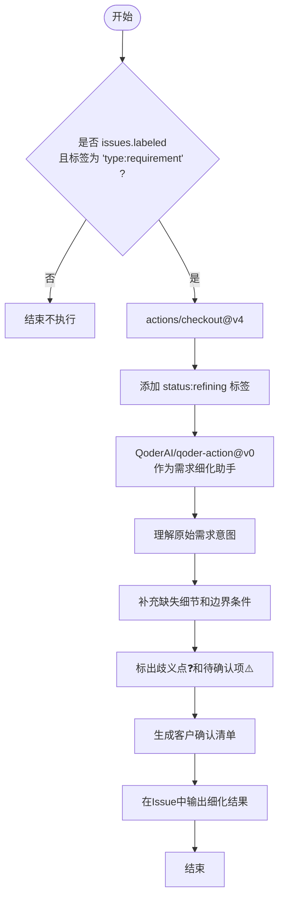
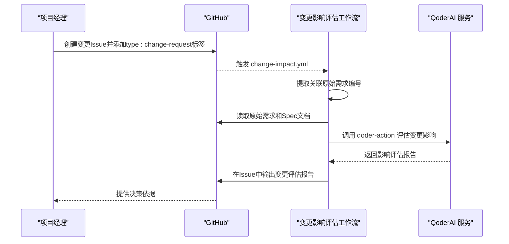
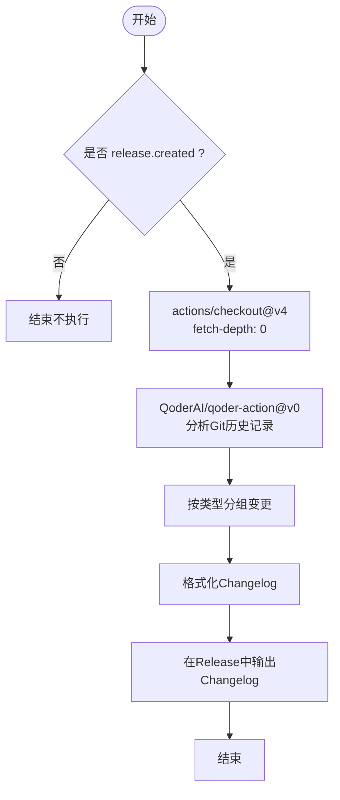
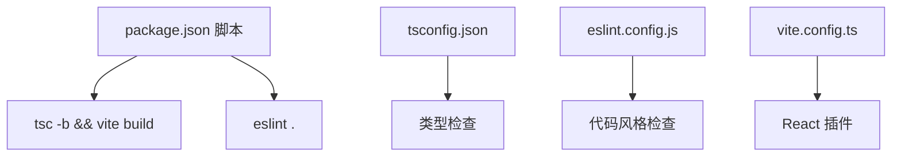
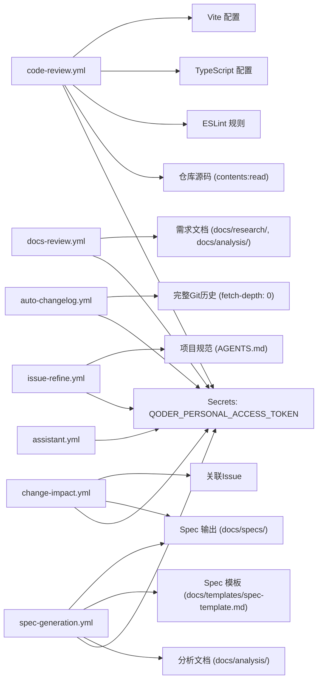

# CI/CD工作流配置

<cite>
**本文引用的文件**
- [assistant.yml](file://.github/workflows/assistant.yml)
- [code-review.yml](file://.github/workflows/code-review.yml)
- [docs-review.yml](file://.github/workflows/docs-review.yml)
- [spec-generation.yml](file://.github/workflows/spec-generation.yml)
- [issue-refine.yml](file://.github/workflows/issue-refine.yml)
- [change-impact.yml](file://.github/workflows/change-impact.yml)
- [auto-changelog.yml](file://.github/workflows/auto-changelog.yml)
- [AGENTS.md](file://AGENTS.md)
- [package.json](file://hj-admin/package.json)
- [vite.config.ts](file://hj-admin/vite.config.ts)
- [tsconfig.json](file://hj-admin/tsconfig.json)
- [eslint.config.js](file://hj-admin/eslint.config.js)
- [pipeline.md](file://docs/pipeline.md)
- [spec-template.md](file://docs/templates/spec-template.md)
</cite>

## 更新摘要
**变更内容**
- 新增三个重要的GitHub Actions工作流：需求自动细化、变更影响评估、自动Changelog生成
- 完善了Issue标签驱动的自动化流程
- 增强了版本管理和发布流程的自动化能力
- 更新了架构总览和详细组件分析章节

## 目录
1. [简介](#简介)
2. [项目结构](#项目结构)
3. [核心组件](#核心组件)
4. [架构总览](#架构总览)
5. [详细组件分析](#详细组件分析)
6. [依赖关系分析](#依赖关系分析)
7. [性能与效率考量](#性能与效率考量)
8. [故障排查指南](#故障排查指南)
9. [结论](#结论)
10. [附录](#附录)

## 简介
本仓库为"氢界大数据平台 — 运营管理后台"的前端工程，采用 Vite + React + Ant Design 技术栈。CI/CD 基于 GitHub Actions 实现，主要包含七个自动化流程：
- Qoder 助手：在 Issue 评论中通过 @qoder 触发 AI 辅助问答与任务处理
- Qoder 代码审查：在 Pull Request 打开或同步时自动进行代码审查并输出中文评审意见
- Qoder 需求文档评审：在涉及需求文档的 PR 中自动进行文档质量评审
- Qoder Spec 自动生成：在需求分析文档合并后自动生成功能规格文档
- **Qoder 需求自动细化**：**新增** - 当Issue添加type:requirement标签时自动进行需求细化分析
- **Qoder 变更影响评估**：**新增** - 当Issue添加type:change-request标签时自动评估变更影响范围
- **Qoder 自动 Changelog**：**新增** - 创建Release时自动生成版本更新日志

此外，工程内还包含构建、类型检查与 ESLint 校验脚本，便于本地与 CI 环境保持一致的开发体验。

## 项目结构
与 CI/CD 直接相关的目录与文件如下：
- .github/workflows：GitHub Actions 工作流定义（包含7个工作流）
- hj-admin：前端工程根目录，包含构建、类型检查与 Lint 配置
- docs：需求文档目录，包含调研、分析和规格文档
- AGENTS.md：项目说明与审查重点（可作为 AI 行为参考）

图表来源
- [assistant.yml:1-30](file://.github/workflows/assistant.yml#L1-L30)
- [code-review.yml:1-27](file://.github/workflows/code-review.yml#L1-L27)
- [docs-review.yml:1-31](file://.github/workflows/docs-review.yml#L1-L31)
- [spec-generation.yml:1-32](file://.github/workflows/spec-generation.yml#L1-L32)
- [issue-refine.yml:1-52](file://.github/workflows/issue-refine.yml#L1-L52)
- [change-impact.yml:1-47](file://.github/workflows/change-impact.yml#L1-L47)
- [auto-changelog.yml:1-36](file://.github/workflows/auto-changelog.yml#L1-L36)
- [package.json:1-35](file://hj-admin/package.json#L1-35)
- [vite.config.ts:1-8](file://hj-admin/vite.config.ts#L1-8)
- [tsconfig.json:1-8](file://hj-admin/tsconfig.json#L1-8)
- [eslint.config.js:1-23](file://hj-admin/eslint.config.js#L1-23)
- [pipeline.md:1-149](file://docs/pipeline.md#L1-L149)
- [spec-template.md:1-105](file://docs/templates/spec-template.md#L1-L105)

章节来源
- [assistant.yml:1-30](file://.github/workflows/assistant.yml#L1-L30)
- [code-review.yml:1-27](file://.github/workflows/code-review.yml#L1-L27)
- [docs-review.yml:1-31](file://.github/workflows/docs-review.yml#L1-L31)
- [spec-generation.yml:1-32](file://.github/workflows/spec-generation.yml#L1-L32)
- [issue-refine.yml:1-52](file://.github/workflows/issue-refine.yml#L1-L52)
- [change-impact.yml:1-47](file://.github/workflows/change-impact.yml#L1-L47)
- [auto-changelog.yml:1-36](file://.github/workflows/auto-changelog.yml#L1-L36)
- [package.json:1-35](file://hj-admin/package.json#L1-35)
- [vite.config.ts:1-8](file://hj-admin/vite.config.ts#L1-8)
- [tsconfig.json:1-8](file://hj-admin/tsconfig.json#L1-8)
- [eslint.config.js:1-23](file://hj-admin/eslint.config.js#L1-L23)
- [pipeline.md:1-149](file://docs/pipeline.md#L1-L149)
- [spec-template.md:1-105](file://docs/templates/spec-template.md#L1-L105)

## 核心组件
- Qoder 助手工作流（assistant.yml）
  - 触发条件：Issue 评论创建事件
  - 运行环境：ubuntu-latest
  - 权限：id-token write、contents read、issues write、pull-requests write
  - 步骤：检出仓库 → 调用 QoderAI/qoder-action@v0 → 传入个人访问令牌与提示词（包含仓库、Issue 编号与评论内容）
- Qoder 代码审查工作流（code-review.yml）
  - 触发条件：Pull Request 的 opened/synchronize 事件
  - 运行环境：ubuntu-latest
  - 权限：id-token write、contents read、pull-requests write
  - 步骤：检出仓库 → 调用 QoderAI/qoder-action@v0 → 传入令牌与提示词（包含仓库、PR 编号与输出语言为中文）
- Qoder 需求文档评审工作流（docs-review.yml）
  - 触发条件：Pull Request 的 opened/synchronize 事件，且路径匹配 docs/research/** 或 docs/analysis/**
  - 运行环境：ubuntu-latest
  - 权限：id-token write、contents read、pull-requests write
  - 步骤：检出仓库 → 调用 QoderAI/qoder-action@v0 → 作为需求评审 Agent 对文档进行评审，按照评审标准和评分规则输出完整评审报告
- Qoder Spec 自动生成工作流（spec-generation.yml）
  - 触发条件：Pull Request 的 closed 事件，且仅当 merged == true，路径匹配 docs/analysis/**
  - 运行环境：ubuntu-latest
  - 权限：id-token write、contents write、pull-requests write
  - 步骤：检出仓库 → 调用 QoderAI/qoder-action@v0 → 基于审核通过的分析文档自动生成功能规格文档，并提交到 docs/specs/ 目录
- **Qoder 需求自动细化工作流（issue-refine.yml）**：**新增**
  - 触发条件：Issue 添加 type:requirement 标签时
  - 运行环境：ubuntu-latest
  - 权限：id-token write、contents read、issues write
  - 步骤：检出仓库 → 添加 status:refining 状态标签 → 调用 QoderAI/qoder-action@v0 → 作为需求细化助手对需求进行细化分析，补充缺失细节和边界条件，标出歧义点和待确认项，生成客户确认清单
- **Qoder 变更影响评估工作流（change-impact.yml）**：**新增**
  - 触发条件：Issue 添加 type:change-request 标签时
  - 运行环境：ubuntu-latest
  - 权限：id-token write、contents read、issues write
  - 步骤：检出仓库 → 调用 QoderAI/qoder-action@v0 → 作为变更影响评估助手，找到关联原始需求，评估影响范围（受影响的Spec文档、代码文件、关联Issue），给出建议并生成变更评估报告
- **Qoder 自动 Changelog 工作流（auto-changelog.yml）**：**新增**
  - 触发条件：GitHub Release 创建时
  - 运行环境：ubuntu-latest
  - 权限：id-token write、contents write
  - 步骤：检出仓库（fetch-depth: 0获取完整历史）→ 调用 QoderAI/qoder-action@v0 → 基于自上一个Release以来合入main分支的所有PR和关联Issue，按类型分组生成Changelog

章节来源
- [assistant.yml:1-30](file://.github/workflows/assistant.yml#L1-L30)
- [code-review.yml:1-27](file://.github/workflows/code-review.yml#L1-L27)
- [docs-review.yml:1-31](file://.github/workflows/docs-review.yml#L1-L31)
- [spec-generation.yml:1-32](file://.github/workflows/spec-generation.yml#L1-L32)
- [issue-refine.yml:1-52](file://.github/workflows/issue-refine.yml#L1-L52)
- [change-impact.yml:1-47](file://.github/workflows/change-impact.yml#L1-L47)
- [auto-changelog.yml:1-36](file://.github/workflows/auto-changelog.yml#L1-L36)

## 架构总览
下图展示了七个工作流的触发点、执行环境与外部服务交互关系，以及从需求管理到版本发布的完整自动化流水线。

图表来源
- [assistant.yml:1-30](file://.github/workflows/assistant.yml#L1-L30)
- [code-review.yml:1-27](file://.github/workflows/code-review.yml#L1-L27)
- [docs-review.yml:1-31](file://.github/workflows/docs-review.yml#L1-L31)
- [spec-generation.yml:1-32](file://.github/workflows/spec-generation.yml#L1-L32)
- [issue-refine.yml:1-52](file://.github/workflows/issue-refine.yml#L1-L52)
- [change-impact.yml:1-47](file://.github/workflows/change-impact.yml#L1-L47)
- [auto-changelog.yml:1-36](file://.github/workflows/auto-changelog.yml#L1-L36)

## 详细组件分析

### Qoder 助手工作流（assistant.yml）
- 触发机制
  - 监听 issue_comment.created 事件，仅当评论内容包含 "@qoder" 时执行
- 执行环境
  - ubuntu-latest
- 权限模型
  - id-token: write（用于 OIDC 令牌签发等）
  - contents: read（读取仓库内容）
  - issues: write（写入 Issue 相关数据）
  - pull-requests: write（必要时可写 PR 信息）
- 关键步骤
  - 使用 actions/checkout@v4 拉取源码
  - 使用 QoderAI/qoder-action@v0 执行助手指令，注入令牌与上下文变量（仓库名、Issue 号、评论内容）

图表来源
- [assistant.yml:1-30](file://.github/workflows/assistant.yml#L1-L30)

章节来源
- [assistant.yml:1-30](file://.github/workflows/assistant.yml#L1-L30)

### Qoder 代码审查工作流（code-review.yml）
- 触发机制
  - 监听 pull_request.opened 与 synchronize 事件
- 执行环境
  - ubuntu-latest
- 权限模型
  - id-token: write
  - contents: read
  - pull-requests: write
- 关键步骤
  - 使用 actions/checkout@v4 拉取源码
  - 使用 QoderAI/qoder-action@v0 执行 /review-pr，指定输出语言为中文

图表来源
- [code-review.yml:1-27](file://.github/workflows/code-review.yml#L1-L27)

章节来源
- [code-review.yml:1-27](file://.github/workflows/code-review.yml#L1-L27)

### Qoder 需求文档评审工作流（docs-review.yml）
- 触发机制
  - 监听 pull_request.opened 与 synchronize 事件
  - 路径过滤：仅当 PR 涉及 docs/research/** 或 docs/analysis/** 目录时触发
- 执行环境
  - ubuntu-latest
- 权限模型
  - id-token: write（用于 OIDC 令牌签发）
  - contents: read（读取仓库内容）
  - pull-requests: write（在 PR 评论中输出评审结果）
- 关键步骤
  - 使用 actions/checkout@v4 拉取源码
  - 使用 QoderAI/qoder-action@v0 执行 /assistant 指令
  - 作为需求评审 Agent，按照评审标准和评分规则对文档进行评审
  - 输出完整的评审报告，标注评审结论为"通过"或"需修改"
- 评审标准
  - 调研文档：调研目标(15%)、调研对象(15%)、调研方法(10%)、原始记录(20%)、关键发现(25%)、文档规范(15%)
  - 分析文档：用户角色(15%)、业务场景(20%)、功能需求(25%)、非功能需求(15%)、边界条件(15%)、文档规范(10%)
  - 评分规则：每个维度 1-5 分，加权平均 ≥ 3.5 分通过，任何维度 ≤ 1 分不通过

图表来源
- [docs-review.yml:1-31](file://.github/workflows/docs-review.yml#L1-L31)
- [pipeline.md:123-136](file://docs/pipeline.md#L123-L136)

章节来源
- [docs-review.yml:1-31](file://.github/workflows/docs-review.yml#L1-L31)
- [pipeline.md:123-136](file://docs/pipeline.md#L123-L136)

### Qoder Spec 自动生成工作流（spec-generation.yml）
- 触发机制
  - 监听 pull_request.closed 事件
  - 条件判断：仅当 github.event.pull_request.merged == true 时执行
  - 路径过滤：仅当 PR 涉及 docs/analysis/** 目录时触发
- 执行环境
  - ubuntu-latest
- 权限模型
  - id-token: write（用于 OIDC 令牌签发）
  - contents: write（写入仓库内容以创建新 PR）
  - pull-requests: write（创建新的 PR 提交 Spec 文档）
- 关键步骤
  - 使用 actions/checkout@v4 拉取源码
  - 使用 QoderAI/qoder-action@v0 执行 /assistant 指令
  - 基于审核通过的分析文档，按照 docs/templates/spec-template.md 模板格式自动生成功能规格文档
  - 将生成的 Spec 文件提交到 docs/specs/ 目录
  - 创建一个新的 PR 来提交 Spec 文件
- 输出规范
  - 命名规范：<功能模块>-spec.md
  - 存放路径：docs/specs/
  - 文档结构：包含基本信息、需求概述、功能设计、接口设计、验收标准、依赖约束、上线计划等完整章节

图表来源
- [spec-generation.yml:1-32](file://.github/workflows/spec-generation.yml#L1-L32)
- [spec-template.md:1-105](file://docs/templates/spec-template.md#L1-L105)

章节来源
- [spec-generation.yml:1-32](file://.github/workflows/spec-generation.yml#L1-L32)
- [spec-template.md:1-105](file://docs/templates/spec-template.md#L1-L105)

### Qoder 需求自动细化工作流（issue-refine.yml）**新增**
- 触发机制
  - 监听 issues.labeled 事件
  - 条件判断：仅当添加的标签名称为 'type:requirement' 时执行
- 执行环境
  - ubuntu-latest
- 权限模型
  - id-token: write（用于 OIDC 令牌签发）
  - contents: read（读取仓库内容）
  - issues: write（操作Issue标签和内容）
- 关键步骤
  - 使用 actions/checkout@v4 拉取源码
  - 使用 actions/github-script@v7 添加 status:refining 状态标签
  - 使用 QoderAI/qoder-action@v0 执行 /assistant 指令
  - 作为需求细化助手，理解原始需求意图，补充缺失细节和边界条件
  - 标出歧义点（用 ❓ 标记）和待确认项（用 ⚠️ 标记）
  - 生成【客户确认清单】，格式为可勾选的清单
  - 参考 AGENTS.md 了解项目背景，参考 .qoder/agents/requirements-analyst.md 方法论
- 输出要求
  - 详细的客户需求细化分析
  - 明确的歧义点和待确认事项
  - 标准化的客户确认清单

图表来源
- [issue-refine.yml:1-52](file://.github/workflows/issue-refine.yml#L1-L52)
- [AGENTS.md:70-87](file://AGENTS.md#L70-L87)

章节来源
- [issue-refine.yml:1-52](file://.github/workflows/issue-refine.yml#L1-L52)
- [AGENTS.md:70-87](file://AGENTS.md#L70-L87)

### Qoder 变更影响评估工作流（change-impact.yml）**新增**
- 触发机制
  - 监听 issues.labeled 事件
  - 条件判断：仅当添加的标签名称为 'type:change-request' 时执行
- 执行环境
  - ubuntu-latest
- 权限模型
  - id-token: write（用于 OIDC 令牌签发）
  - contents: read（读取仓库内容）
  - issues: write（操作Issue内容）
- 关键步骤
  - 使用 actions/checkout@v4 拉取源码
  - 使用 QoderAI/qoder-action@v0 执行 /assistant 指令
  - 作为变更影响评估助手，分析需求变更的影响范围
  - 找到关联的原始需求Issue（从Issue内容中提取关联编号）
  - 阅读原始需求的Spec文件（如有，在docs/specs/目录）
  - 评估影响范围：受影响的Spec文档、代码文件、关联Issue或任务、预估工时影响
  - 给出建议：建议批准/建议延迟/建议拒绝，如果批准需要修改哪些文件
  - 生成【变更评估报告】
- 评估维度
  - 文档影响：需要更新的Spec文档列表
  - 代码影响：需要修改的代码文件和模块
  - 任务影响：需要调整的关联Issue或开发任务
  - 时间影响：预估的额外工时和资源需求

图表来源
- [change-impact.yml:1-47](file://.github/workflows/change-impact.yml#L1-L47)
- [AGENTS.md:104-110](file://AGENTS.md#L104-L110)

章节来源
- [change-impact.yml:1-47](file://.github/workflows/change-impact.yml#L1-L47)
- [AGENTS.md:104-110](file://AGENTS.md#L104-L110)

### Qoder 自动 Changelog 工作流（auto-changelog.yml）**新增**
- 触发机制
  - 监听 release.created 事件
- 执行环境
  - ubuntu-latest
- 权限模型
  - id-token: write（用于 OIDC 令牌签发）
  - contents: write（写入仓库内容以更新Release）
- 关键步骤
  - 使用 actions/checkout@v4 拉取源码，设置 fetch-depth: 0 获取完整Git历史
  - 使用 QoderAI/qoder-action@v0 执行 /assistant 指令
  - 基于自上一个Release以来合入main分支的所有PR和关联Issue，生成本次版本的Changelog
  - 按类型分组：新增功能、Bug修复、性能优化、文档更新、其他
  - 每条记录包含：标题、关联Issue编号、贡献者
  - 如果有重大功能，写一段简要说明
  - 输出为Markdown格式
- 输出格式
  - 版本标题：Release vX.Y.Z
  - 分类清晰的功能分组
  - 详细的变更记录和贡献者信息
  - 重大功能的简要说明

图表来源
- [auto-changelog.yml:1-36](file://.github/workflows/auto-changelog.yml#L1-L36)
- [AGENTS.md:111-116](file://AGENTS.md#L111-L116)

章节来源
- [auto-changelog.yml:1-36](file://.github/workflows/auto-changelog.yml#L1-L36)
- [AGENTS.md:111-116](file://AGENTS.md#L111-L116)

### 工程构建与质量门禁（本地与 CI 一致）
- 构建与预览
  - dev/build/lint/preview 脚本由 package.json 提供
- 类型检查
  - tsconfig.json 聚合 app/node 子配置，确保类型一致性
- 代码风格
  - eslint.config.js 启用 JS/TS/React Hooks/Refresh 规则集，忽略 dist 目录
- 构建工具
  - vite.config.ts 启用 React 插件

图表来源
- [package.json:1-35](file://hj-admin/package.json#L1-35)
- [tsconfig.json:1-8](file://hj-admin/tsconfig.json#L1-8)
- [eslint.config.js:1-23](file://hj-admin/eslint.config.js#L1-23)
- [vite.config.ts:1-8](file://hj-admin/vite.config.ts#L1-8)

章节来源
- [package.json:1-35](file://hj-admin/package.json#L1-35)
- [tsconfig.json:1-8](file://hj-admin/tsconfig.json#L1-8)
- [eslint.config.js:1-23](file://hj-admin/eslint.config.js#L1-23)
- [vite.config.ts:1-8](file://hj-admin/vite.config.ts#L1-8)

### 与项目规范与审查重点的衔接
- AGENTS.md 明确了编码规范与审查重点，可作为 AI 助手与审查行为的参考依据
- 建议将审查关注点（如参数化查询、权限检查、敏感信息保护、Schema 类型完整性、域结构约束）纳入 qoder-action 的 prompt 或团队约定中，以增强一致性
- 需求文档评审遵循 docs/pipeline.md 中定义的评审标准和评分规则
- Spec 生成严格遵循 docs/templates/spec-template.md 模板格式
- **新增的工作流遵循 AGENTS.md 中的Issue标签体系和分支规范**
- **变更影响评估和自动Changelog功能完善了版本管理的自动化闭环**

章节来源
- [AGENTS.md:1-142](file://AGENTS.md#L1-L142)
- [pipeline.md:1-149](file://docs/pipeline.md#L1-L149)
- [spec-template.md:1-105](file://docs/templates/spec-template.md#L1-L105)

## 依赖关系分析
- 外部依赖
  - GitHub Actions 运行时（ubuntu-latest）
  - QoderAI 服务（通过 qoder-action@v0 调用）
- 内部依赖
  - assistant.yml 与 code-review.yml 均依赖仓库源码（contents: read）
  - docs-review.yml 依赖需求文档目录（docs/research/** 和 docs/analysis/**）
  - spec-generation.yml 依赖分析文档和模板文件
  - **issue-refine.yml 依赖项目规范和Agent方法论**
  - **change-impact.yml 依赖Spec文档和关联Issue**
  - **auto-changelog.yml 依赖完整的Git历史记录**
  - code-review.yml 与工程质量脚本（ESLint、TypeScript、Vite）共同保障代码质量基线
- 权限依赖
  - 需要配置 QODER_PERSONAL_ACCESS_TOKEN 作为 GitHub Secrets 供工作流使用
  - spec-generation.yml 需要额外的 contents: write 权限以创建新 PR
  - **auto-changelog.yml 需要 contents: write 权限以更新Release内容**

图表来源
- [assistant.yml:1-30](file://.github/workflows/assistant.yml#L1-L30)
- [code-review.yml:1-27](file://.github/workflows/code-review.yml#L1-L27)
- [docs-review.yml:1-31](file://.github/workflows/docs-review.yml#L1-L31)
- [spec-generation.yml:1-32](file://.github/workflows/spec-generation.yml#L1-L32)
- [issue-refine.yml:1-52](file://.github/workflows/issue-refine.yml#L1-L52)
- [change-impact.yml:1-47](file://.github/workflows/change-impact.yml#L1-L47)
- [auto-changelog.yml:1-36](file://.github/workflows/auto-changelog.yml#L1-L36)
- [eslint.config.js:1-23](file://hj-admin/eslint.config.js#L1-23)
- [tsconfig.json:1-8](file://hj-admin/tsconfig.json#L1-8)
- [vite.config.ts:1-8](file://hj-admin/vite.config.ts#L1-8)
- [spec-template.md:1-105](file://docs/templates/spec-template.md#L1-L105)

章节来源
- [assistant.yml:1-30](file://.github/workflows/assistant.yml#L1-L30)
- [code-review.yml:1-27](file://.github/workflows/code-review.yml#L1-L27)
- [docs-review.yml:1-31](file://.github/workflows/docs-review.yml#L1-L31)
- [spec-generation.yml:1-32](file://.github/workflows/spec-generation.yml#L1-L32)
- [issue-refine.yml:1-52](file://.github/workflows/issue-refine.yml#L1-L52)
- [change-impact.yml:1-47](file://.github/workflows/change-impact.yml#L1-L47)
- [auto-changelog.yml:1-36](file://.github/workflows/auto-changelog.yml#L1-L36)
- [eslint.config.js:1-23](file://hj-admin/eslint.config.js#L1-23)
- [tsconfig.json:1-8](file://hj-admin/tsconfig.json#L1-8)
- [vite.config.ts:1-8](file://hj-admin/vite.config.ts#L1-8)
- [spec-template.md:1-105](file://docs/templates/spec-template.md#L1-L105)

## 性能与效率考量
- 并行与缓存
  - 当前工作流未显式缓存 node_modules 与构建产物；建议在后续版本引入缓存策略以减少安装与构建时间
- 最小权限原则
  - 已声明必要的 permissions；可根据实际输出范围进一步收敛权限
- 触发粒度
  - 代码审查在每次 PR 同步都会触发，若变更频繁可考虑按路径过滤或按需触发，以降低资源消耗
  - 文档评审通过路径过滤精确控制触发范围，避免不必要的评审
  - Spec 生成仅在 PR 合并时触发，避免重复生成
  - **需求细化仅在添加特定标签时触发，避免不必要的处理**
  - **变更影响评估仅在变更请求时触发，精准定位影响范围**
  - **自动Changelog仅在Release创建时触发，避免频繁的日志生成**
- 文档处理优化
  - 需求文档评审针对特定目录进行，减少无关文件的处理开销
  - Spec 生成基于已审核通过的文档，确保输入质量
  - **需求细化工作流通过标签体系精确控制触发时机**
  - **变更影响评估工作流通过关联Issue分析减少不必要的影响范围**
  - **自动Changelog工作流通过fetch-depth: 0确保完整的历史记录分析**
- **新增工作流的性能优化**
  - **issue-refine.yml 使用条件判断避免不必要的执行**
  - **change-impact.yml 智能识别关联Issue减少人工查找时间**
  - **auto-changelog.yml 只在Release创建时执行，避免频繁的日志维护**

[本节为通用指导，无需引用具体文件]

## 故障排查指南
- 未触发工作流
  - 确认事件类型与条件匹配（例如 assistant.yml 需评论内容包含 "@qoder"）
  - 检查路径过滤条件是否正确（docs-review.yml 和 spec-generation.yml 的路径匹配）
  - 验证 spec-generation.yml 的合并条件（github.event.pull_request.merged == true）
  - **检查标签条件：issue-refine.yml 需要 type:requirement 标签，change-impact.yml 需要 type:change-request 标签**
  - **验证release事件：auto-changelog.yml 需要正确的release创建事件**
- 鉴权失败
  - 检查 Secrets 是否配置了 QODER_PERSONAL_ACCESS_TOKEN，且名称完全一致
- 权限不足
  - 检查工作流 permissions 是否包含所需读写范围（issues/pull-requests/contents/id-token）
  - 特别注意 spec-generation.yml 需要 contents: write 权限
  - **auto-changelog.yml 需要 contents: write 权限以更新Release内容**
- 审查结果异常
  - 核对 qoder-action 的 prompt 参数是否正确传递了 REPO、PR_NUMBER 与 OUTPUT_LANGUAGE
  - 检查文档评审的评分标准和权重配置
- 文档评审问题
  - 确认文档是否符合对应模板格式
  - 检查评审维度和权重设置
  - 验证文档质量是否达到通过标准（加权平均 ≥ 3.5 分）
- Spec 生成失败
  - 检查分析文档是否完整且符合模板要求
  - 验证模板文件是否存在且格式正确
  - 确认输出目录权限和路径
- **需求细化问题**
  - **确认Issue已正确添加 type:requirement 标签**
  - **检查Issue内容是否包含足够的需求描述**
  - **验证AGENTS.md和项目规范文件是否存在**
- **变更影响评估问题**
  - **确认Issue已正确添加 type:change-request 标签**
  - **检查关联的原始需求Issue编号是否正确**
  - **验证相关Spec文档是否存在**
- **自动Changelog问题**
  - **确认Release创建事件是否正确触发**
  - **检查fetch-depth: 0配置是否正确**
  - **验证Git历史记录是否完整**
- 构建/Lint 不一致
  - 本地执行 npm run lint 与 npm run build，确保与 CI 环境一致

章节来源
- [assistant.yml:1-30](file://.github/workflows/assistant.yml#L1-L30)
- [code-review.yml:1-27](file://.github/workflows/code-review.yml#L1-L27)
- [docs-review.yml:1-31](file://.github/workflows/docs-review.yml#L1-L31)
- [spec-generation.yml:1-32](file://.github/workflows/spec-generation.yml#L1-L32)
- [issue-refine.yml:1-52](file://.github/workflows/issue-refine.yml#L1-L52)
- [change-impact.yml:1-47](file://.github/workflows/change-impact.yml#L1-L47)
- [auto-changelog.yml:1-36](file://.github/workflows/auto-changelog.yml#L1-L36)
- [package.json:1-35](file://hj-admin/package.json#L1-35)

## 结论
本项目通过 GitHub Actions 实现了全面而高效的 AI 辅助与自动化流水线：
- 助手工作流支持在 Issue 中以自然语言驱动协作
- 代码审查工作流在 PR 生命周期内持续提供中文评审反馈
- 需求文档评审工作流确保文档质量和标准化
- Spec 自动生成工作流实现从需求分析到规格文档的无缝转换
- **需求自动细化工作流通过标签体系实现智能化的需求管理**
- **变更影响评估工作流提供精准的变更影响分析和决策支持**
- **自动Changelog工作流简化了版本发布和变更追踪流程**
- 结合工程的 TypeScript、ESLint 与 Vite 配置，形成一致的本地与 CI 开发体验

新增的三个工作流完善了整个软件开发生命周期的自动化闭环：从需求细化、变更评估、文档评审、代码审查、规格生成到版本发布，形成了完整的智能化流水线。这些工作流通过统一的标签体系和标准化的工作流程，显著提升了团队协作效率和项目管理水平。建议后续逐步引入缓存、路径过滤与更细粒度的权限控制，以提升稳定性与效率。

[本节为总结性内容，无需引用具体文件]

## 附录
- 环境变量与密钥
  - QODER_PERSONAL_ACCESS_TOKEN：在 GitHub Secrets 中配置，供 qoder-action 使用
- 常用命令（本地对齐 CI）
  - 开发：npm run dev
  - 构建：npm run build
  - 校验：npm run lint
  - 预览：npm run preview
- GitHub Actions 工作流概览
  - assistant.yml：Issue 评论中的 AI 助手
  - code-review.yml：代码 PR 的自动审查
  - docs-review.yml：需求文档的自动评审
  - spec-generation.yml：Spec 文档的自动生成
  - **issue-refine.yml：需求自动细化**
  - **change-impact.yml：变更影响评估**
  - **auto-changelog.yml：自动Changelog生成**
- Issue 标签体系
  - **类型标签：type:requirement（功能需求）、type:change-request（需求变更）、type:bug（Bug报告）、type:task（开发任务）**
  - **状态标签：status:new → status:refining → status:confirmed → status:analyzing → status:spec-ready → status:in-dev → status:done**
  - **优先级：priority:P0（必须有）、priority:P1（应该有）、priority:P2（可以有）**
- 文档流程参考
  - pipeline.md：完整的需求分析管线说明
  - spec-template.md：Spec 文档的标准模板
- **新增工作流特性**
  - **标签驱动的自动化：通过Issue标签精确控制工作流触发**
  - **智能上下文感知：自动识别关联Issue和文档**
  - **标准化输出：统一的报告格式和文档结构**
  - **完整的生命周期覆盖：从需求到发布的端到端自动化**

章节来源
- [package.json:1-35](file://hj-admin/package.json#L1-35)
- [pipeline.md:1-149](file://docs/pipeline.md#L1-L149)
- [spec-template.md:1-105](file://docs/templates/spec-template.md#L1-L105)
- [AGENTS.md:70-116](file://AGENTS.md#L70-L116)