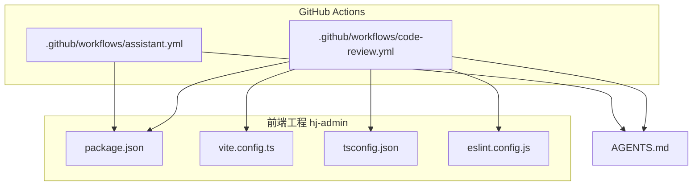
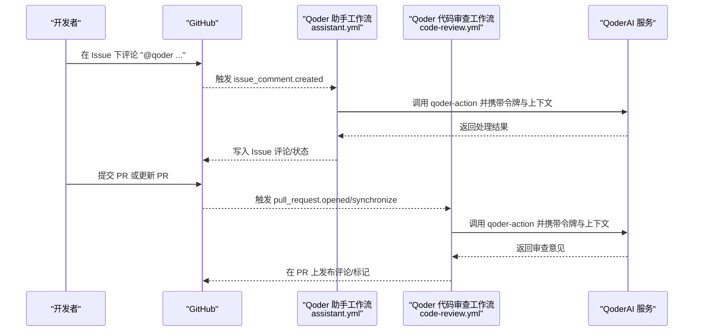
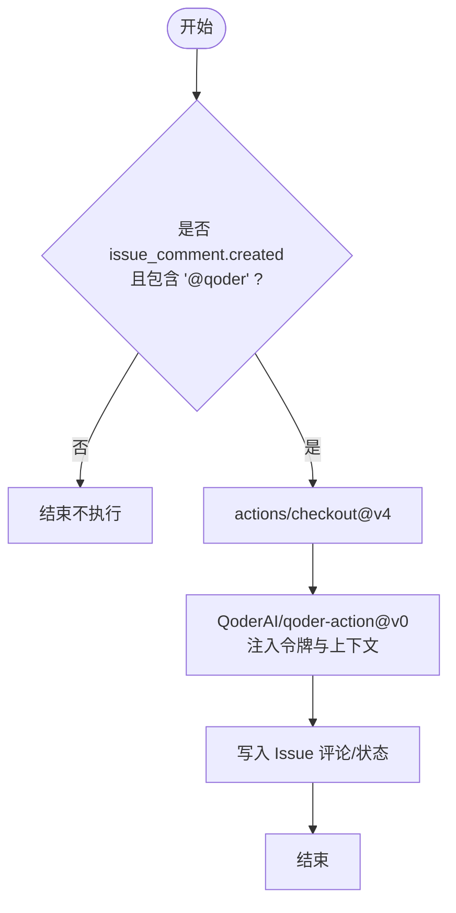
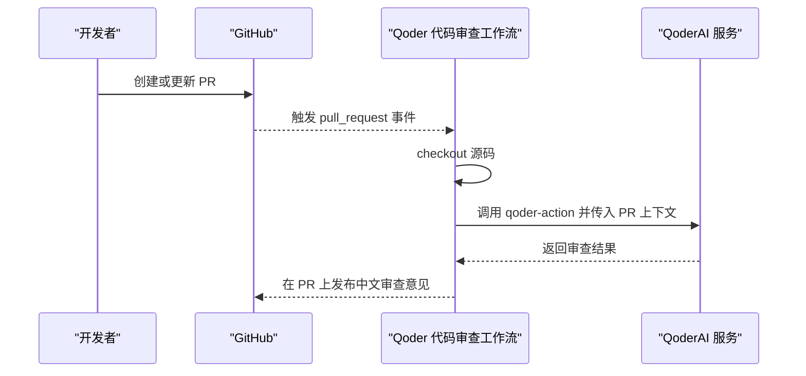
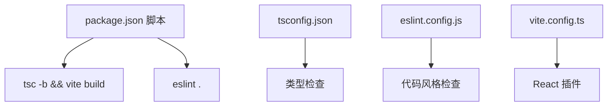
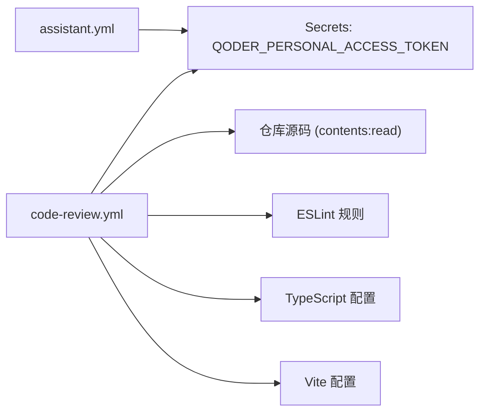

# CI/CD工作流配置

<cite>
**本文引用的文件**
- [assistant.yml](file://.github/workflows/assistant.yml)
- [code-review.yml](file://.github/workflows/code-review.yml)
- [AGENTS.md](file://AGENTS.md)
- [package.json](file://hj-admin/package.json)
- [vite.config.ts](file://hj-admin/vite.config.ts)
- [tsconfig.json](file://hj-admin/tsconfig.json)
- [eslint.config.js](file://hj-admin/eslint.config.js)
</cite>

## 目录
1. [简介](#简介)
2. [项目结构](#项目结构)
3. [核心组件](#核心组件)
4. [架构总览](#架构总览)
5. [详细组件分析](#详细组件分析)
6. [依赖关系分析](#依赖关系分析)
7. [性能与效率考量](#性能与效率考量)
8. [故障排查指南](#故障排查指南)
9. [结论](#结论)
10. [附录](#附录)

## 简介
本仓库为“氢界大数据平台 — 运营管理后台”的前端工程，采用 Vite + React + Ant Design 技术栈。CI/CD 基于 GitHub Actions 实现，主要包含两个自动化流程：
- Qoder 助手：在 Issue 评论中通过 @qoder 触发 AI 辅助问答与任务处理
- Qoder 代码审查：在 Pull Request 打开或同步时自动进行代码审查并输出中文评审意见

此外，工程内还包含构建、类型检查与 ESLint 校验脚本，便于本地与 CI 环境保持一致的开发体验。

## 项目结构
与 CI/CD 直接相关的目录与文件如下：
- .github/workflows：GitHub Actions 工作流定义
- hj-admin：前端工程根目录，包含构建、类型检查与 Lint 配置
- AGENTS.md：项目说明与审查重点（可作为 AI 行为参考）

图表来源
- [assistant.yml:1-30](file://.github/workflows/assistant.yml#L1-L30)
- [code-review.yml:1-27](file://.github/workflows/code-review.yml#L1-L27)
- [package.json:1-35](file://hj-admin/package.json#L1-L35)
- [vite.config.ts:1-8](file://hj-admin/vite.config.ts#L1-L8)
- [tsconfig.json:1-8](file://hj-admin/tsconfig.json#L1-L8)
- [eslint.config.js:1-23](file://hj-admin/eslint.config.js#L1-L23)
- [AGENTS.md:1-71](file://AGENTS.md#L1-L71)

章节来源
- [assistant.yml:1-30](file://.github/workflows/assistant.yml#L1-L30)
- [code-review.yml:1-27](file://.github/workflows/code-review.yml#L1-L27)
- [package.json:1-35](file://hj-admin/package.json#L1-L35)
- [vite.config.ts:1-8](file://hj-admin/vite.config.ts#L1-L8)
- [tsconfig.json:1-8](file://hj-admin/tsconfig.json#L1-L8)
- [eslint.config.js:1-23](file://hj-admin/eslint.config.js#L1-L23)
- [AGENTS.md:1-71](file://AGENTS.md#L1-L71)

## 核心组件
- Qoder 助手工作流（assistant.yml）
  - 触发条件：Issue 评论创建事件
  - 运行环境：ubuntu-latest
  - 权限：id-token write、contents read、issues write、pull-requests write
  - 步骤：检出仓库 → 调用 QoderAI/qoder-action@v0 → 传入个人访问令牌与提示词（包含仓库、Issue 编号与评论内容）
- Qoder 代码审查工作流（code-review.yml）
  - 触发条件：Pull Request 的 opened/synchronize 事件
  - 运行环境：ubuntu-latest
  - 权限：id-token write、contents read、pull-requests write
  - 步骤：检出仓库 → 调用 QoderAI/qoder-action@v0 → 传入令牌与提示词（包含仓库、PR 编号与输出语言为中文）

章节来源
- [assistant.yml:1-30](file://.github/workflows/assistant.yml#L1-L30)
- [code-review.yml:1-27](file://.github/workflows/code-review.yml#L1-L27)

## 架构总览
下图展示了两个工作流的触发点、执行环境与外部服务交互关系。

图表来源
- [assistant.yml:1-30](file://.github/workflows/assistant.yml#L1-L30)
- [code-review.yml:1-27](file://.github/workflows/code-review.yml#L1-L27)

## 详细组件分析

### Qoder 助手工作流（assistant.yml）
- 触发机制
  - 监听 issue_comment.created 事件，仅当评论内容包含 “@qoder” 时执行
- 执行环境
  - ubuntu-latest
- 权限模型
  - id-token: write（用于 OIDC 令牌签发等）
  - contents: read（读取仓库内容）
  - issues: write（写入 Issue 相关数据）
  - pull-requests: write（必要时可写 PR 信息）
- 关键步骤
  - 使用 actions/checkout@v4 拉取源码
  - 使用 QoderAI/qoder-action@v0 执行助手指令，注入令牌与上下文变量（仓库名、Issue 号、评论内容）

图表来源
- [assistant.yml:1-30](file://.github/workflows/assistant.yml#L1-L30)

章节来源
- [assistant.yml:1-30](file://.github/workflows/assistant.yml#L1-L30)

### Qoder 代码审查工作流（code-review.yml）
- 触发机制
  - 监听 pull_request.opened 与 synchronize 事件
- 执行环境
  - ubuntu-latest
- 权限模型
  - id-token: write
  - contents: read
  - pull-requests: write
- 关键步骤
  - 使用 actions/checkout@v4 拉取源码
  - 使用 QoderAI/qoder-action@v0 执行 /review-pr，指定输出语言为中文

图表来源
- [code-review.yml:1-27](file://.github/workflows/code-review.yml#L1-L27)

章节来源
- [code-review.yml:1-27](file://.github/workflows/code-review.yml#L1-L27)

### 工程构建与质量门禁（本地与 CI 一致）
- 构建与预览
  - dev/build/lint/preview 脚本由 package.json 提供
- 类型检查
  - tsconfig.json 聚合 app/node 子配置，确保类型一致性
- 代码风格
  - eslint.config.js 启用 JS/TS/React Hooks/Refresh 规则集，忽略 dist 目录
- 构建工具
  - vite.config.ts 启用 React 插件

图表来源
- [package.json:1-35](file://hj-admin/package.json#L1-L35)
- [tsconfig.json:1-8](file://hj-admin/tsconfig.json#L1-L8)
- [eslint.config.js:1-23](file://hj-admin/eslint.config.js#L1-23)
- [vite.config.ts:1-8](file://hj-admin/vite.config.ts#L1-8)

章节来源
- [package.json:1-35](file://hj-admin/package.json#L1-35)
- [tsconfig.json:1-8](file://hj-admin/tsconfig.json#L1-8)
- [eslint.config.js:1-23](file://hj-admin/eslint.config.js#L1-23)
- [vite.config.ts:1-8](file://hj-admin/vite.config.ts#L1-8)

### 与项目规范与审查重点的衔接
- AGENTS.md 明确了编码规范与审查重点，可作为 AI 助手与审查行为的参考依据
- 建议将审查关注点（如参数化查询、权限检查、敏感信息保护、Schema 类型完整性、域结构约束）纳入 qoder-action 的 prompt 或团队约定中，以增强一致性

章节来源
- [AGENTS.md:1-71](file://AGENTS.md#L1-L71)

## 依赖关系分析
- 外部依赖
  - GitHub Actions 运行时（ubuntu-latest）
  - QoderAI 服务（通过 qoder-action@v0 调用）
- 内部依赖
  - assistant.yml 与 code-review.yml 均依赖仓库源码（contents: read）
  - code-review.yml 与工程质量脚本（ESLint、TypeScript、Vite）共同保障代码质量基线
- 权限依赖
  - 需要配置 QODER_PERSONAL_ACCESS_TOKEN 作为 GitHub Secrets 供工作流使用

图表来源
- [assistant.yml:1-30](file://.github/workflows/assistant.yml#L1-L30)
- [code-review.yml:1-27](file://.github/workflows/code-review.yml#L1-L27)
- [eslint.config.js:1-23](file://hj-admin/eslint.config.js#L1-23)
- [tsconfig.json:1-8](file://hj-admin/tsconfig.json#L1-8)
- [vite.config.ts:1-8](file://hj-admin/vite.config.ts#L1-8)

章节来源
- [assistant.yml:1-30](file://.github/workflows/assistant.yml#L1-L30)
- [code-review.yml:1-27](file://.github/workflows/code-review.yml#L1-L27)
- [eslint.config.js:1-23](file://hj-admin/eslint.config.js#L1-23)
- [tsconfig.json:1-8](file://hj-admin/tsconfig.json#L1-8)
- [vite.config.ts:1-8](file://hj-admin/vite.config.ts#L1-8)

## 性能与效率考量
- 并行与缓存
  - 当前工作流未显式缓存 node_modules 与构建产物；建议在后续版本引入缓存策略以减少安装与构建时间
- 最小权限原则
  - 已声明必要的 permissions；可根据实际输出范围进一步收敛权限
- 触发粒度
  - 代码审查在每次 PR 同步都会触发，若变更频繁可考虑按路径过滤或按需触发，以降低资源消耗

[本节为通用指导，无需引用具体文件]

## 故障排查指南
- 未触发工作流
  - 确认事件类型与条件匹配（例如 assistant.yml 需评论内容包含 “@qoder”）
- 鉴权失败
  - 检查 Secrets 是否配置了 QODER_PERSONAL_ACCESS_TOKEN，且名称完全一致
- 权限不足
  - 检查工作流 permissions 是否包含所需读写范围（issues/pull-requests/contents/id-token）
- 审查结果异常
  - 核对 qoder-action 的 prompt 参数是否正确传递了 REPO、PR_NUMBER 与 OUTPUT_LANGUAGE
- 构建/Lint 不一致
  - 本地执行 npm run lint 与 npm run build，确保与 CI 环境一致

章节来源
- [assistant.yml:1-30](file://.github/workflows/assistant.yml#L1-L30)
- [code-review.yml:1-27](file://.github/workflows/code-review.yml#L1-L27)
- [package.json:1-35](file://hj-admin/package.json#L1-35)

## 结论
本项目通过 GitHub Actions 实现了轻量而高效的 AI 辅助与代码审查流水线：
- 助手工作流支持在 Issue 中以自然语言驱动协作
- 代码审查工作流在 PR 生命周期内持续提供中文评审反馈
- 结合工程的 TypeScript、ESLint 与 Vite 配置，形成一致的本地与 CI 开发体验

建议后续逐步引入缓存、路径过滤与更细粒度的权限控制，以提升稳定性与效率。

[本节为总结性内容，无需引用具体文件]

## 附录
- 环境变量与密钥
  - QODER_PERSONAL_ACCESS_TOKEN：在 GitHub Secrets 中配置，供 qoder-action 使用
- 常用命令（本地对齐 CI）
  - 开发：npm run dev
  - 构建：npm run build
  - 校验：npm run lint
  - 预览：npm run preview

章节来源
- [package.json:1-35](file://hj-admin/package.json#L1-35)