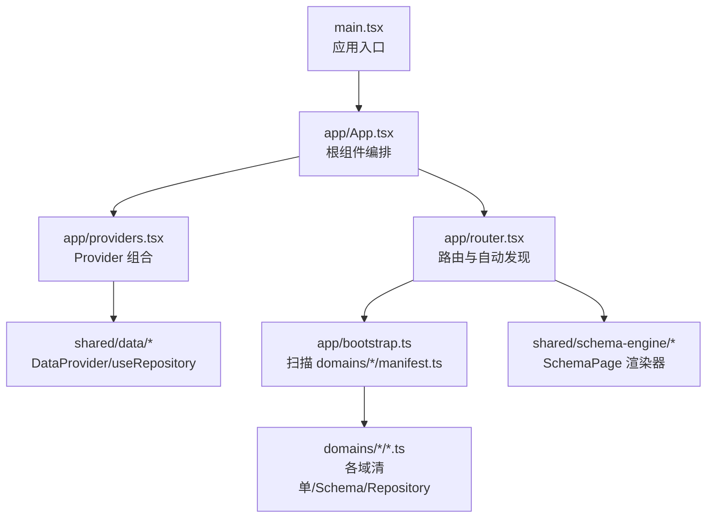
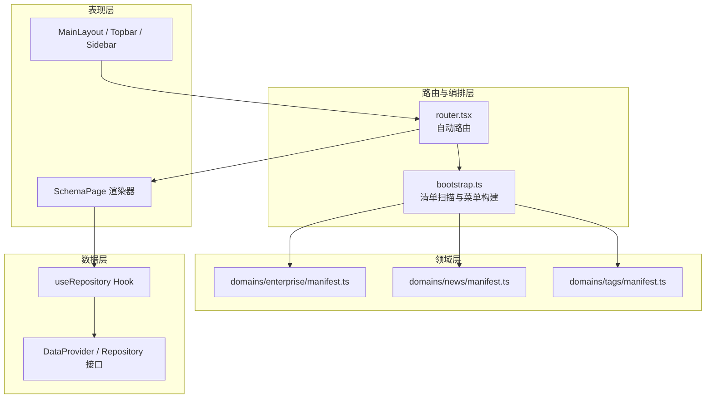
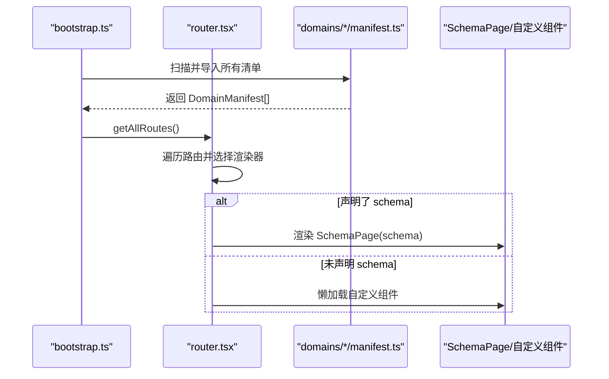
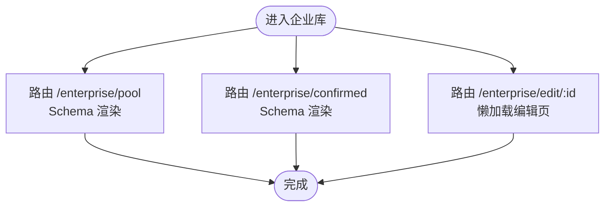
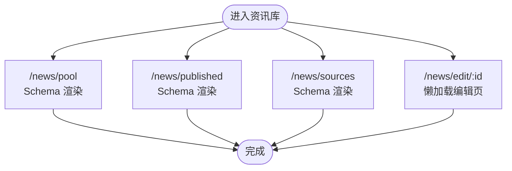
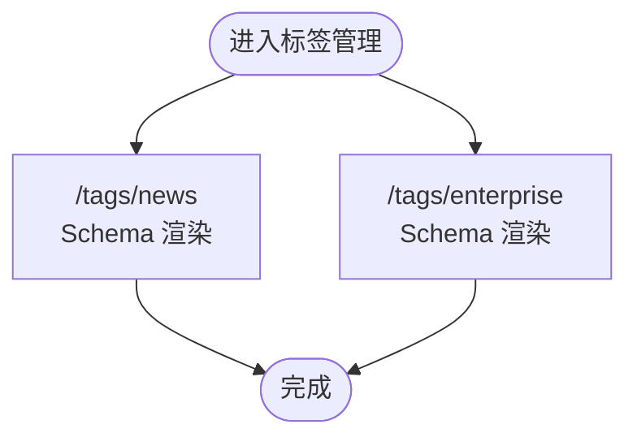
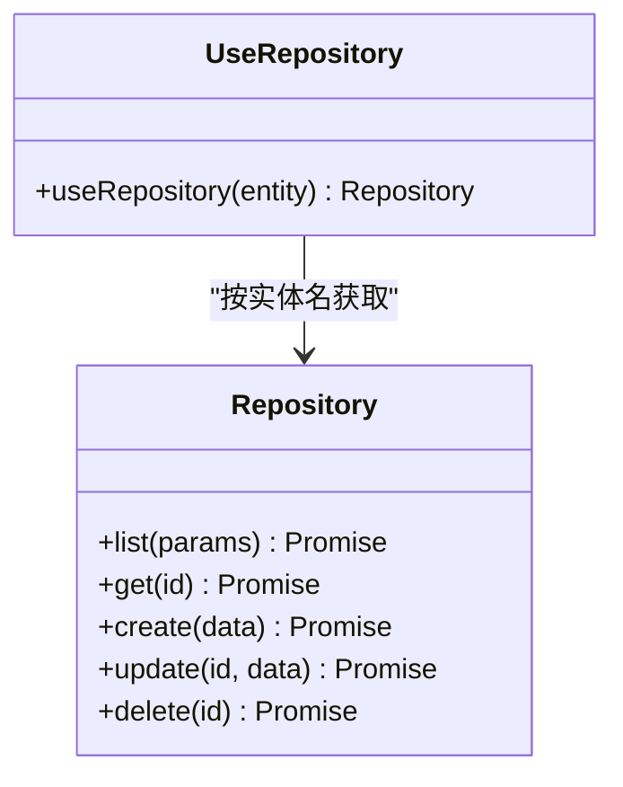
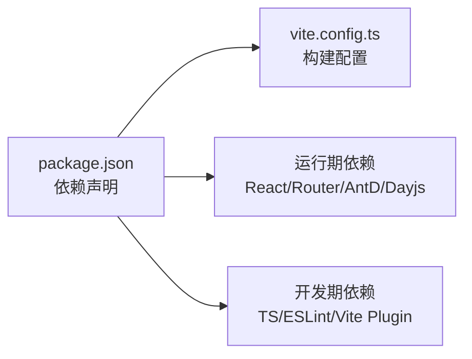

# 项目概述

<cite>
**本文引用的文件**
- [package.json](file://hj-admin/package.json)
- [vite.config.ts](file://hj-admin/vite.config.ts)
- [main.tsx](file://hj-admin/src/main.tsx)
- [App.tsx](file://hj-admin/src/app/App.tsx)
- [providers.tsx](file://hj-admin/src/app/providers.tsx)
- [router.tsx](file://hj-admin/src/app/router.tsx)
- [bootstrap.ts](file://hj-admin/src/app/bootstrap.ts)
- [manifest.ts（企业库）](file://hj-admin/src/domains/enterprise/manifest.ts)
- [manifest.ts（资讯库）](file://hj-admin/src/domains/news/manifest.ts)
- [manifest.ts（标签管理）](file://hj-admin/src/domains/tags/manifest.ts)
- [useRepository.ts](file://hj-admin/src/shared/data/useRepository.ts)
</cite>

## 目录
1. [简介](#简介)
2. [项目结构](#项目结构)
3. [核心组件](#核心组件)
4. [架构总览](#架构总览)
5. [详细组件分析](#详细组件分析)
6. [依赖分析](#依赖分析)
7. [性能考虑](#性能考虑)
8. [故障排查指南](#故障排查指南)
9. [结论](#结论)
10. [附录：快速开始](#附录快速开始)

## 简介
本项目是“氢能产业数据管理平台”的运营管理后台，采用 React 19 + TypeScript 构建，基于 Vite 提供高效的开发与构建体验。系统以 Schema 驱动为核心开发模式，通过声明式的数据与界面描述，自动生成列表、筛选、分页、编辑等通用能力；同时支持企业库、资讯库、标签管理等业务域，具备可扩展的领域组织方式与自动路由发现机制。整体设计遵循领域驱动思想与 Repository 模式，将页面表现、领域清单、数据访问层解耦，便于持续演进与团队协作。

## 项目结构
- 应用入口与编排
  - 应用根节点在 main.tsx 中挂载，使用 StrictMode 启动，并渲染 App 根组件。
  - App 根组件负责组合全局 Provider 链与路由容器，不包含业务逻辑。
  - providers.tsx 集中组合全局上下文（如数据仓库上下文），供全应用共享。
- 路由与自动发现
  - router.tsx 根据 bootstrap.ts 扫描到的所有域清单动态生成路由表，并对带 schema 的路由统一交由 SchemaPage 渲染，无 schema 的路由则懒加载自定义页面。
  - bootstrap.ts 利用 Vite 的 import.meta.glob 在构建时自动发现 domains/*/manifest.ts，实现新增域即自动注册路由与菜单的能力。
- 领域与清单
  - 每个业务域位于 src/domains/<domain>/ 下，包含 manifest.ts（域清单）、schema.ts（Schema 定义）、repository.ts（数据访问）、mock.ts（模拟数据）、index.ts（导出）以及可选 pages 子目录。
  - 当前已实现的域包括：企业库、资讯库、标签管理。
- 共享能力
  - shared/data 提供数据上下文与 useRepository Hook，用于在任意组件中获取对应实体的 Repository 实例。
  - shared/schema-engine 提供 Schema 驱动的页面渲染引擎与类型定义。

图表来源
- [main.tsx:1-11](file://hj-admin/src/main.tsx#L1-L11)
- [App.tsx:1-21](file://hj-admin/src/app/App.tsx#L1-L21)
- [providers.tsx:1-14](file://hj-admin/src/app/providers.tsx#L1-L14)
- [router.tsx:1-58](file://hj-admin/src/app/router.tsx#L1-L58)
- [bootstrap.ts:1-104](file://hj-admin/src/app/bootstrap.ts#L1-L104)

章节来源
- [main.tsx:1-11](file://hj-admin/src/main.tsx#L1-L11)
- [App.tsx:1-21](file://hj-admin/src/app/App.tsx#L1-L21)
- [providers.tsx:1-14](file://hj-admin/src/app/providers.tsx#L1-L14)
- [router.tsx:1-58](file://hj-admin/src/app/router.tsx#L1-L58)
- [bootstrap.ts:1-104](file://hj-admin/src/app/bootstrap.ts#L1-L104)

## 核心组件
- 应用根组件与 Provider 链
  - App 根组件仅做编排：包裹 BrowserRouter、AppProviders 与路由容器。
  - AppProviders 集中注入全局上下文（例如数据仓库上下文），使子树可消费。
- 自动路由与 Schema 渲染
  - router.tsx 从 bootstrap.ts 汇总所有域清单，为每个路由选择渲染策略：
    - 若声明了 schema，则使用 SchemaPage 自动渲染。
    - 否则懒加载自定义组件。
  - 未匹配的路由重定向到仪表盘。
- 域清单与自动发现
  - bootstrap.ts 通过 import.meta.glob 扫描所有域的 manifest.ts，提取 routes 并排序，同时构建菜单树。
  - 新增域只需在 domains 下创建 manifest.ts，即可自动出现在路由与菜单中。
- 数据访问抽象
  - useRepository Hook 允许任意组件按实体名获取 Repository 实例，缺失时返回空操作 fallback，避免运行时崩溃。

章节来源
- [App.tsx:1-21](file://hj-admin/src/app/App.tsx#L1-L21)
- [providers.tsx:1-14](file://hj-admin/src/app/providers.tsx#L1-L14)
- [router.tsx:1-58](file://hj-admin/src/app/router.tsx#L1-L58)
- [bootstrap.ts:1-104](file://hj-admin/src/app/bootstrap.ts#L1-L104)
- [useRepository.ts:1-24](file://hj-admin/src/shared/data/useRepository.ts#L1-L24)

## 架构总览
本系统采用“领域清单 + Schema 驱动 + Repository 抽象”的分层架构：
- 表现层：React 组件与布局（MainLayout、Topbar、Sidebar 等）。
- 路由与编排层：自动发现与路由分发，SchemaPage 统一渲染。
- 领域层：各业务域（企业库、资讯库、标签管理）通过 manifest.ts 声明路由、菜单、图标、分组与顺序。
- 数据层：Repository 接口抽象，具体实现可为 HTTP 或 Mock，通过 DataProvider 注入。

图表来源
- [router.tsx:1-58](file://hj-admin/src/app/router.tsx#L1-L58)
- [bootstrap.ts:1-104](file://hj-admin/src/app/bootstrap.ts#L1-L104)
- [manifest.ts（企业库）:1-20](file://hj-admin/src/domains/enterprise/manifest.ts#L1-L20)
- [manifest.ts（资讯库）:1-42](file://hj-admin/src/domains/news/manifest.ts#L1-L42)
- [manifest.ts（标签管理）:1-21](file://hj-admin/src/domains/tags/manifest.ts#L1-L21)
- [useRepository.ts:1-24](file://hj-admin/src/shared/data/useRepository.ts#L1-L24)

## 详细组件分析

### 自动路由与清单发现
- 功能要点
  - 构建期扫描 domains/*/manifest.ts，合并为 allManifests。
  - getAllRoutes 聚合所有 routes，供 router.tsx 渲染。
  - buildMenuTree 按 menuGroup 分组，结合硬编码的禁用项，生成最终菜单树。
- 关键流程
  - 启动时执行 import.meta.glob 扫描 → 解析默认导出的 DomainManifest → 排序 → 聚合路由与菜单。
  - router.tsx 遍历路由，按是否声明 schema 决定渲染路径。

图表来源
- [bootstrap.ts:1-104](file://hj-admin/src/app/bootstrap.ts#L1-L104)
- [router.tsx:1-58](file://hj-admin/src/app/router.tsx#L1-L58)

章节来源
- [bootstrap.ts:1-104](file://hj-admin/src/app/bootstrap.ts#L1-L104)
- [router.tsx:1-58](file://hj-admin/src/app/router.tsx#L1-L58)

### 领域清单示例：企业库
- 清单职责
  - 声明域标识、名称、图标、菜单分组、顺序、是否可折叠与红点提示。
  - 定义路由集合：列表页（待处理池、已确认企业）与编辑页（隐藏于菜单）。
- 扩展方式
  - 新增路由仅需在 routes 数组追加对象，指定 path、label，以及 schema 或 component。
  - 如需启用新菜单项，确保 hideInMenu 为 false 或未设置。

图表来源
- [manifest.ts（企业库）:1-20](file://hj-admin/src/domains/enterprise/manifest.ts#L1-L20)

章节来源
- [manifest.ts（企业库）:1-20](file://hj-admin/src/domains/enterprise/manifest.ts#L1-L20)

### 领域清单示例：资讯库
- 清单职责
  - 声明内容管理分组下的多个页面：资讯池、已发布资讯、数据源管理，以及隐藏的编辑页。
  - 引入 repository 以触发 mock 数据注册（当使用本地模拟数据时）。
- 扩展方式
  - 新增页面同样通过 routes 配置，优先使用 schema 驱动，复杂页面再使用自定义组件。

图表来源
- [manifest.ts（资讯库）:1-42](file://hj-admin/src/domains/news/manifest.ts#L1-L42)

章节来源
- [manifest.ts（资讯库）:1-42](file://hj-admin/src/domains/news/manifest.ts#L1-L42)

### 领域清单示例：标签管理
- 清单职责
  - 声明标签管理分组下的资讯标签与企业标签两个页面。
  - 注册 mock 数据，以便在无后端时进行联调演示。
- 扩展方式
  - 新增标签维度页面时，复用现有 schema 与 mock 模式，保持风格一致。

图表来源
- [manifest.ts（标签管理）:1-21](file://hj-admin/src/domains/tags/manifest.ts#L1-L21)

章节来源
- [manifest.ts（标签管理）:1-21](file://hj-admin/src/domains/tags/manifest.ts#L1-L21)

### 数据访问抽象：useRepository
- 设计要点
  - 通过 useContext 获取全局注册的 Repository 映射，按实体名取用。
  - 若未找到对应实体，返回空操作的 fallback，避免运行时崩溃，并在控制台输出告警。
- 使用建议
  - 在 Schema 或自定义组件中通过 useRepository(entity) 获取数据访问能力。
  - 生产环境需确保每个实体都已在 DataProvider 中正确注册。

图表来源
- [useRepository.ts:1-24](file://hj-admin/src/shared/data/useRepository.ts#L1-L24)

章节来源
- [useRepository.ts:1-24](file://hj-admin/src/shared/data/useRepository.ts#L1-L24)

## 依赖分析
- 运行期依赖
  - React 19、react-dom 19：UI 框架与渲染。
  - react-router-dom 7：前端路由。
  - antd 6、@ant-design/icons 6：UI 组件与图标。
  - dayjs：日期时间处理。
- 构建期依赖
  - vite 8：构建与开发服务器。
  - @vitejs/plugin-react 6：React 插件。
  - typescript 6：类型检查与编译。
  - eslint 系列：代码规范与校验。
- 构建配置
  - vite.config.ts 启用 React 插件，其他扩展可按需添加。

图表来源
- [package.json:1-35](file://hj-admin/package.json#L1-L35)
- [vite.config.ts:1-8](file://hj-admin/vite.config.ts#L1-L8)

章节来源
- [package.json:1-35](file://hj-admin/package.json#L1-L35)
- [vite.config.ts:1-8](file://hj-admin/vite.config.ts#L1-L8)

## 性能考虑
- 构建与开发体验
  - 使用 Vite 作为构建工具，获得更快的冷启动与热更新。
  - 按需引入 Ant Design 组件，减少包体体积。
- 路由与资源加载
  - 对非 Schema 页面采用懒加载，降低首屏压力。
  - 对大型页面或重型组件建议使用 Suspense 与占位符提升用户体验。
- 数据请求优化
  - 在 Repository 层实现缓存与去抖策略，避免重复请求。
  - 列表页合理设置分页与查询参数，减少不必要的数据传输。

## 故障排查指南
- 路由未生效
  - 检查对应域的 manifest.ts 是否正确导出，并确保路径与 label 配置无误。
  - 确认 bootstrap.ts 能扫描到该 manifest（路径与命名符合约定）。
- 页面空白或报错
  - 若使用了 Schema 但未注册对应实体，useRepository 会返回空操作并打印告警，请检查 DataProvider 中的实体注册。
  - 若使用自定义组件，确认懒加载路径正确且组件存在。
- 菜单不显示
  - 检查 manifest 中的 menuGroup、order、hideInMenu 等字段是否符合预期。
  - 确认 buildMenuTree 的分组顺序与硬编码禁用项是否影响显示。

章节来源
- [bootstrap.ts:1-104](file://hj-admin/src/app/bootstrap.ts#L1-L104)
- [router.tsx:1-58](file://hj-admin/src/app/router.tsx#L1-L58)
- [useRepository.ts:1-24](file://hj-admin/src/shared/data/useRepository.ts#L1-L24)

## 结论
本项目以“领域清单 + Schema 驱动 + Repository 抽象”为核心，实现了高内聚、低耦合的管理后台架构。通过自动发现与自动路由，新增业务域的成本极低；通过统一的 Schema 渲染与数据访问抽象，提升了页面的一致性与可维护性。配合 Vite 与 Ant Design，项目在开发效率与用户体验方面均具备良好基础，适合在氢能产业数据管理的持续演进中不断扩展。

## 附录：快速开始
- 环境要求
  - Node.js 18+（推荐）
  - npm 或 pnpm/yarn
- 安装与运行
  - 进入 hj-admin 目录
  - 安装依赖：npm install
  - 启动开发服务：npm run dev
  - 构建产物：npm run build
  - 预览构建结果：npm run preview
- 基本使用
  - 新增业务域
    - 在 src/domains 下新建目录，创建 manifest.ts，声明 name、label、icon、menuGroup、order、routes 等。
    - 如需 Schema 渲染，创建 schema.ts 并在 manifest 中引用。
    - 如需自定义页面，创建 pages 目录与组件，并在 manifest 中以 component 形式懒加载。
  - 数据访问
    - 在 DataProvider 中注册实体对应的 Repository。
    - 在页面或 Schema 中使用 useRepository(entity) 获取数据能力。
  - 菜单与路由
    - 修改 manifest 中的 routes 与 hideInMenu 控制菜单可见性。
    - 使用 order 控制菜单分组内的排序。

章节来源
- [package.json:1-35](file://hj-admin/package.json#L1-L35)
- [vite.config.ts:1-8](file://hj-admin/vite.config.ts#L1-L8)
- [bootstrap.ts:1-104](file://hj-admin/src/app/bootstrap.ts#L1-L104)
- [router.tsx:1-58](file://hj-admin/src/app/router.tsx#L1-L58)
- [useRepository.ts:1-24](file://hj-admin/src/shared/data/useRepository.ts#L1-L24)